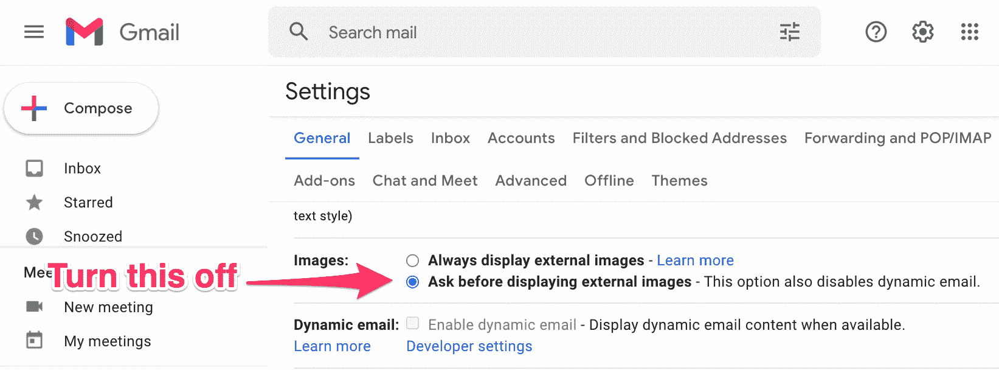
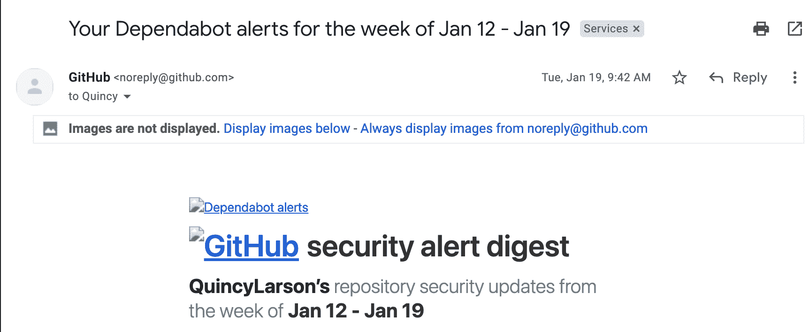
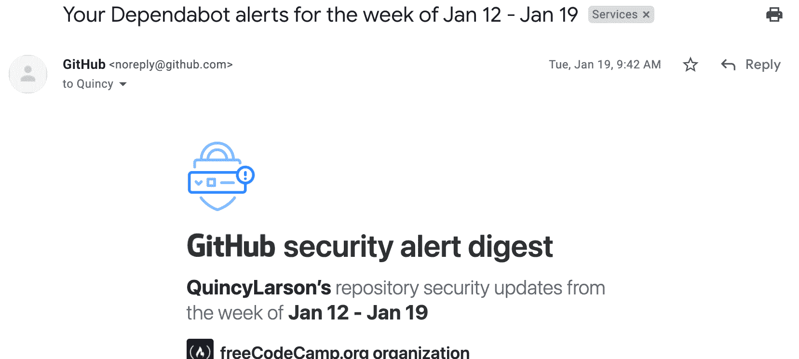

# 如何在 Gmail 中停止邮件跟踪–默认情况下禁用图像

> 原文：<https://www.freecodecamp.org/news/stop-email-tracking-pixel-disable-images-gmail/>

您知道营销人员(甚至黑客)可以使用图像来跟踪您的电子邮件收件箱吗？

下面是所谓的**跟踪像素**的工作原理:

1.  有人创建了一个图像并将其托管在他们的服务器上。往往是一个你根本看不到的透明的 1x1“跟踪像素”。
2.  他们会给你发一封包含那张图片的电子邮件。
3.  当你打开他们的电子邮件时，他们的图像会自动加载。它会向他们的服务器发回大量信息。这包括您的 IP 地址，他们可以用它来识别您的身份，并找出您在世界上的位置。

听起来很吓人，对吧？然而这是非常普遍的。

作为一个每周有 400 万收件人的周报的负责人，我拒绝使用跟踪像素。(我以纯文本格式发送电子邮件。)

但是像我这样的人是少数。大多数公司确实使用跟踪像素。大多数电子邮件营销工具让营销人员很容易在电子邮件群发中包含跟踪像素。

你很幸运。有一种简单的方法可以阻止这些跟踪像素并保护您的隐私。你所要做的就是默认关闭收件箱中的图片。

(不要担心，您仍然可以点击一个按钮来加载您从信任的朋友和家人那里收到的图像。)

## 如何默认关闭 Gmail 中的所有图片

Gmail 的设置中有一个选项可以默认关闭图片。您可以通过使用 gmail 中设置的[直接链接来访问。](https://mail.google.com/mail/u/0/#settings/general)

Select the "Ask before displaying external images" radio button and click the save settings button below.

如果您的电子邮件中包含图片，将会显示如下:

An email with external images disabled

如果您点击“显示下面的图像”链接，这是电子邮件之后的样子，其图像显示:

The same image with external images re-enabled

给你。你再也不用担心打开电子邮件，提醒发件人你的 IP 地址和其他敏感信息。

这也阻止了那些恼人的“邮件跟踪”服务，营销人员使用这些服务来查看你是否打开了他们的电子邮件，这样他们就可以知道什么时候再给你发邮件。

这是重要的一步，你可以在一分钟内收回你的部分在线隐私。

希望这篇文章有所帮助。我们 freeCodeCamp.org 全体人员祝你在外平安。