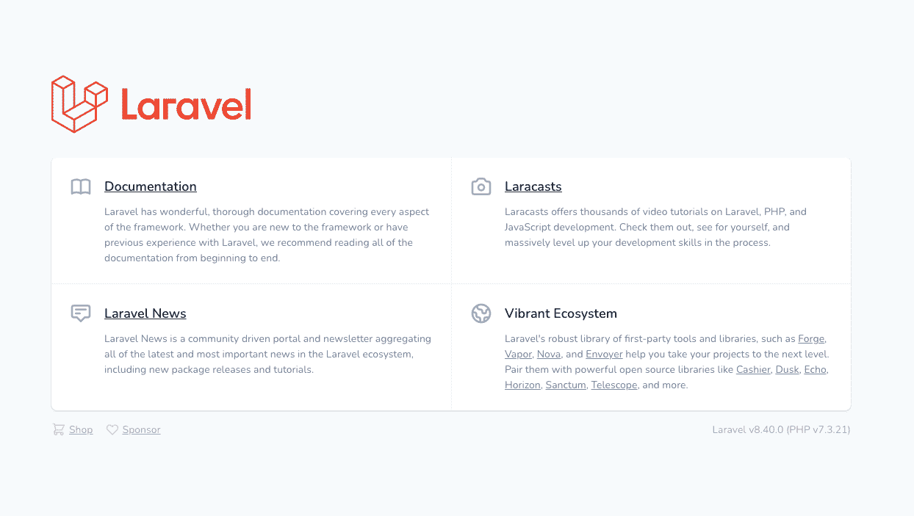
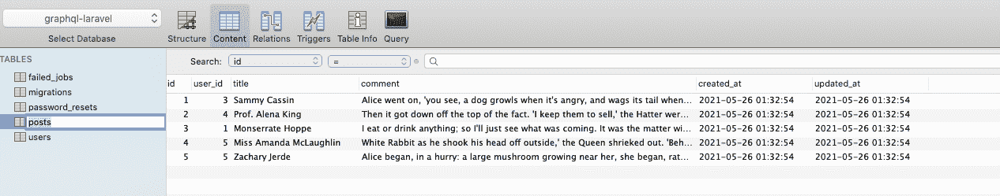
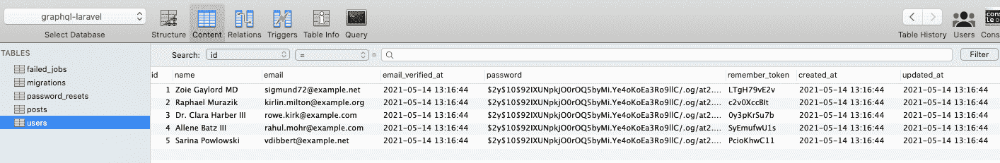
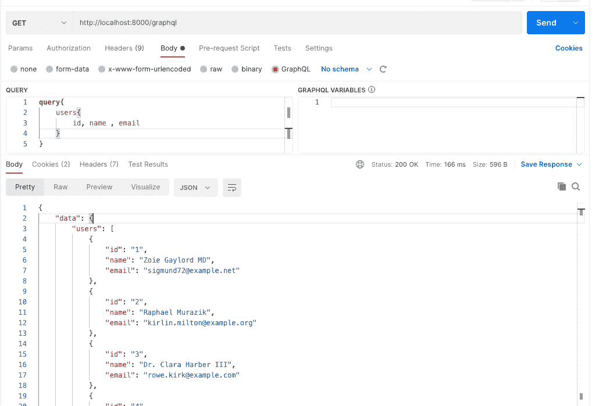
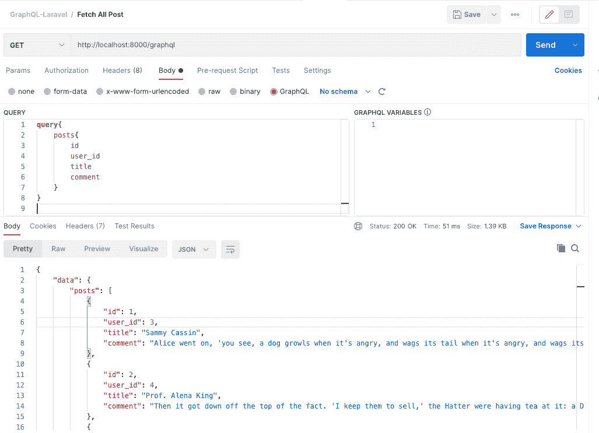
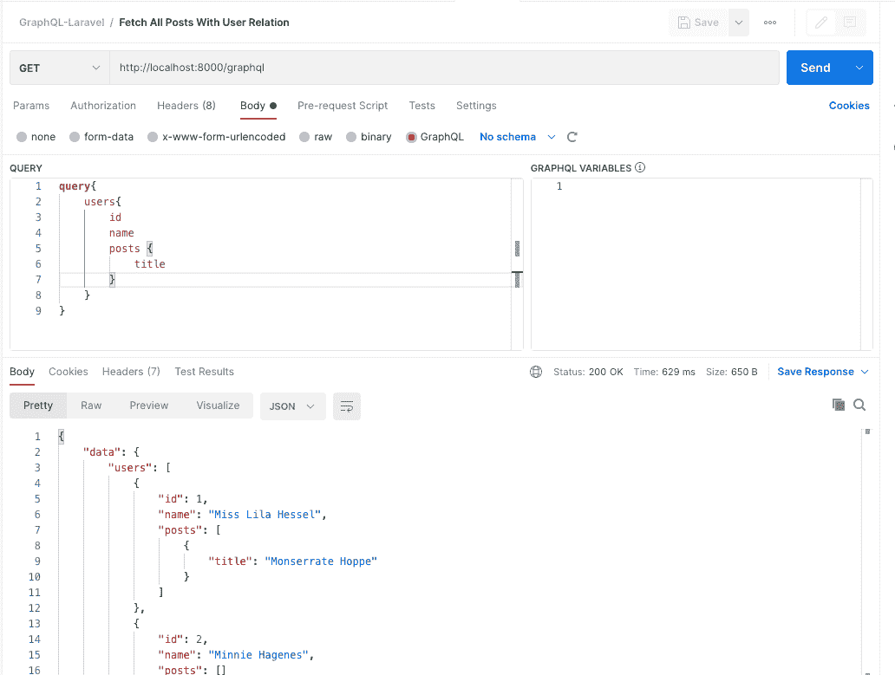
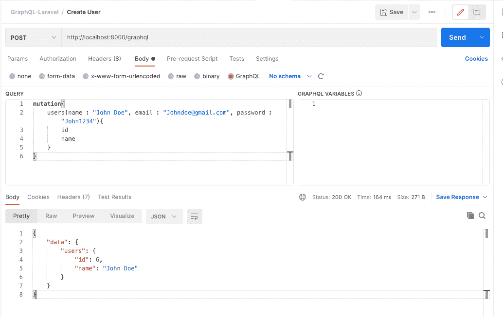

# 如何用 Laravel GraphQL 搭建一个 GraphQL 服务器并用 Postman 测试

> 原文：<https://www.freecodecamp.org/news/build-graphql-server-with-laravel/>

GraphQL 是一种用于 API 的查询语言。它通过提供查询对象的便捷方式简化了请求服务器的过程。

例如，如果您正在使用 REST API，并且您需要一个图书列表，那么您可能会点击所有图书的`GET /books/list`端点。然后，如果您需要一本书的 ID，您可以点击`GET /book?id={id}`，这意味着您将向服务器发出多个请求。

但是 GraphQL 做了一种叫做声明性数据获取的事情，在这种情况下，您可以请求您想要的东西，并在单个请求中获得一个可预测的结果。

很棒吧？让我们看看它是如何工作的。

### 我们将会学到什么？

在本文中，您将通过使用 [Laravel GraphQL 包](https://github.com/rebing/graphql-laravel)构建一个执行以下操作的服务器来学习 GraphQL 的基础知识:

1.  注册用户
2.  获取所有用户
3.  通过 ID 获取用户
4.  获取所有帖子
5.  获取具有用户关系的所有帖子
6.  最后，作为奖励，您还将学习如何使用超级棒的 Postman 工具来运行您的查询并获得实时响应

## 先决条件

以下是本教程需要的一些东西:

1.  本地服务器( [XAMPP](https://www.apachefriends.org/download.html) 或 [WAMP](https://www.wampserver.com/en/download-wampserver-64bits/)
2.  一个代码编辑器([崇高文本](https://www.sublimetext.com/3)， [VS](https://atom.io/) ，[代码](https://code.visualstudio.com/download)，或者[原子](https://atom.io/)
3.  版本控制系统( [Git](https://git-scm.com/downloads) )
4.  依赖性管理器([编写器](https://getcomposer.org/download/))
5.  [幼虫图形 SQL 包](https://github.com/rebing/graphql-laravel)

## GraphQL Basics(图形 SQL 基础)

在开始之前，让我们回顾一些 GraphQL 的基础知识。

### 什么是 GraphQL 模式？

GraphQL 模式描述了与其相关的查询、变异和类型:

```
type User {
    id: ID !
    name : String !
    email : String !
    age : Int
    hobbies: [String]
    created_at : DateTime 
    updated_at : DateTime
}
```

在上面的代码中，诸如`id`、`name`和`email`等列名上的感叹号意味着它们是必填字段。

您还可以定义各种数据类型，如`Int`、`String`等。你也可以包含列表类型，并定义它应该包含的数据类型，就像使用`hobbies`一样。

### 什么是 GraphQL 查询？

GraphQL 方便了与对象上的数据进行交互。您使用方法询问对象上的特定字段，然后获得预期的结果:

```
{
  user {
    name
  }
}
```

GraphQL User Query

```
{
  "data": {
    "user": {
      "name": "John doe"
    }
  }
}
```

Expected Result

### 什么是 GraphQL 解析器？

每次从 GraphQL 服务器请求数据时，它都会得到`resolved`。

解析器包含诸如`object`、`args`、`context`和`info`之类的参数。在构建这个项目时，您将看到解析器是如何工作的。

## 如何开始使用 GraphQL

### 装置

通过在终端中运行以下命令来设置 Laravel 环境:

```
composer create-project laravel/laravel graphql-laravel
```

如果没有安装 composer，可以从[这里](https://getcomposer.org/)获取。

安装开源 [graphql-laravel 服务器](https://github.com/rebing/graphql-laravel)包:

```
composer require rebing/graphql-laravel
```

安装完成后，发布`config/graphql.php`:

```
php artisan vendor:publish --provider="Rebing\GraphQL\GraphQLServiceProvider"
```

并使用`php artisan serve`启动开发服务器:



The Laravel homepage

### 如何创建迁移、控制器和资源

#### 邮政

在本节中，您将创建用户和帖子之间的关系。

为此，您需要创建模型来定义实体之间的关系，创建迁移，并定义数据库模式。

```
php artisan make:model Post -mcr
```

在`app/Models/User`中，在用户和帖子之间创建一个`hasMany`关系:

```
public function posts()
{
	return $this->hasMany(Post::class);
}
```

在`app/models/Post`中，定义一个将用户映射到帖子的关系:

```
public function user()
{
	return $this->belongsTo(User::class);
}
```

### 如何创建迁移

在本节中，您将创建迁移。

Laravel 已经提供了默认的用户迁移。您现在需要做的就是为帖子添加一个迁移:

```
php artisan make:migration create_post_table
```

这将创建一个带有`database/migrations`方向的迁移文件。在迁移文件中，定义模式:

```
Schema::create('posts', function (Blueprint $table) {
            $table->id();
             $table->integer('user_id')->unsigned();
            $table->string('title');
            $table->text('comment');
            $table->timestamps();
        });
```

post migration 

接下来，修改现有的`.env`来命名数据库并建立连接:

```
DB_CONNECTION=mysql
DB_HOST=127.0.0.1
DB_PORT=3306
DB_DATABASE=graphql-laravel
DB_USERNAME=root
DB_PASSWORD= 
```

env.php

运行 migrate 命令创建`User`和`Post`表:

```
 php artisan migrate
```

您可以使用 Laravel 工厂为`User`和`Post`表生成随机记录。

因为 Laravel 附带了一个默认的`User`工厂，所以您可以使用它并专注于创建一个`Post`工厂。

### 如何创建邮件工厂

```
php artisan make:factory PostFactory
```

一旦在`database > factories`目录中创建了`PostFactory`，您就必须在`definition method`中定义您需要的列名和伪造者:

```
use Illuminate\Support\Str;

public function definition()
    {
        return [
            'user_id' => rand(1,5),
            'title' => $this->faker->name(),
            'comment' => $this->faker->realText(180)
        ];
    }
```

### 如何制作数据库播种机

在 seeder 类中，为`User`和`Post`工厂创建一个执行实例。

这将创建五个用户和五个帖子，并带有相应的`user_id`:

```
public function run()
    {
        \App\Models\User::factory(5)->create();

        \App\Models\Post::factory(5)->create();
    }
```

然后运行 artisan seeder 命令:

```
php artisan db:seed
```

在终端中运行该命令后，检查数据库表(`User`和`Post`):



Post table



User table

### 如何创建用户查询

在撰写本文时，Laravel GraphQL 包还不支持通过终端为查询创建支架。

因此将以下内容添加到`app > GraphQL > Type > UserType.php`:

```
<?php

namespace App\GraphQL\Type;

use App\Models\User;
use GraphQL\Type\Definition\Type;
use Rebing\GraphQL\Support\Type as GraphQLType;

class UserType extends GraphQLType
{
    protected $attributes = [
        'name'          => 'User',
        'description'   => 'A user',
        'model'         => User::class,
    ];

    public function fields(): array
    {
        return [
            'id' => [
                'type' => Type::nonNull(Type::int()),
                'description' => 'The id of the user',
            ],
            'name' => [
                'type' => Type::nonNull(Type::string()),
                'description' => 'The name of user',
            ],
            'email' => [
                'type' => Type::nonNull(Type::string()),
                'description' => 'The email of user'
            ],
        ];
    }
} 
```

UserType.php

在上面的代码片段中，您将需要的名称空间添加到`User`模型中。您还包括一个描述模型的`protected $attributes array`。

您还添加了一个返回数组的公共函数`field`。

在这个函数中，您将模式定义为包含您在用户表`(id, name, email)`中指定的列。

`Type::nonNull(Type::string())`是表示必填字段和字符串数据类型的感叹号。

### 如何向配置中添加类型

将`UserType`添加到您之前创建的配置文件中:`app > config > graphql.php`:

```
'types' => [
        App\GraphQL\Type\UserType::class
    ],
```

### 如何定义用户查询

接下来，您需要定义一个返回`UserType`或列表的查询。您还需要指定将在 resolve 方法中使用的参数:

```
<?php

namespace App\GraphQL\Type;

use GraphQL;
use App\Models\User;
use GraphQL\Type\Definition\Type;
use Rebing\GraphQL\Support\Type as GraphQLType;

class UserType extends GraphQLType
{
    protected $attributes = [
        'name'          => 'User',
        'description'   => 'A user',
        'model'         => User::class,
    ];

    public function type(): Type
    {
        return Type::nonNull(Type::listOf(Type::nonNull(GraphQL::type('User'))));
    }

    public function args(): array
    {
        return [
            'id' => [
                'type' => Type::nonNull(Type::int()),
                'description' => 'The id of the user',
            ],
            'name' => [
                'type' => Type::nonNull(Type::string()),
                'description' => 'The name of user',
            ],
            'email' => [
                'type' => Type::nonNull(Type::string()),
                'description' => 'The email of user',
            ]
        ];
    }

    public function resolve($root, $args)
    {        
        if (isset($args['id'])) {
            return User::whereId($args['id'])->get();
        }

        if (isset($args['name'])) {
            return User::whereName($args['name'])->get();
        }

        if (isset($args['email'])) {
            return User::whereEmail($args['email'])->get();
        }

        return User::all();
    }
} 
```

在上面的代码片段中，您使用了包和`App\Models\User`一起提供的所需名称空间。

您还从 Laravel 包中扩展了`GraphQLType`，并将`attributes`定义为一个受保护的数组。

`args`方法从`User`模型返回一个 ID、名称和电子邮件。

resolve 方法用于从数据库中检索数据。如果有`args`，那么`if`块将被执行并帮助您根据用户请求进行过滤。

否则，检索来自`User`模型的所有数据。

### 如何向配置中添加查询

将以下查询添加到`app > config > graphql.php`配置文件中:

```
'schemas' => [
        'default' => [
            'query' => [
                App\GraphQL\Query\UsersQuery::class,
            ],
            'mutation' => [
                // ExampleMutation::class,
            ],
            'types' => [
                // ExampleType::class,
            ],
            'middleware' => [],
            'method' => ['get', 'post'],
        ],
    ],
```

graphql.php

您现在应该能够从这个端点查询数据:[http://localhost:8000/graph QL](http://localhost:8000/graphql)。

如果你好奇的话，`/graphql`是这条路线的前缀。

### 如何查询获取所有用户

对于此查询:

```
query {
    users {
        id, name , email
    }
} 
```

Query Fetch all Users

下面是 Postman 的预期输出:



Fetch all Users

### 如何创建与用户的帖子关系

现在你需要定义一个`PostType`。

这种方法遵循您之前为`UserType`定义的内容。

导航至`app > Type > PostType.php`并添加以下内容:

```
<?php

namespace App\GraphQL\Type;

use GraphQL;
use App\Models\Post;
use GraphQL\Type\Definition\Type;
use Rebing\GraphQL\Support\Type as GraphQLType;

class PostType extends GraphQLType
{
    protected $attributes = [
        'name'          => 'Post',
        'description'   => 'A post',
        'model'         => Post::class,
    ];

    public function args(): array
    {
        return [
            'id' => [
                'type' => Type::nonNull(Type::int()),
                'description' => 'The id of the post',
            ],
            'title' => [
                'type' => Type::nonNull(Type::string()),
                'description' => 'The title of post',
            ],
        ];
    }
} 
```

PostType.php

`Post`遵循为`User`定义的规范。这里您还使用了查询的名称空间，并且还使用了`Post`模型。

使用上面的代码，您扩展了对`PostQuery`类的查询，并将`$attributes`数组设置为受保护。还有一个`fields`函数，它返回一个包含 ID、标题和评论的数组。

最后，在`args`函数中有一个`type`,它显示了它们的各种数据类型`int`或`string`,并带有一个描述，告诉你它们做了什么。

### 如何创建 PostsQuery

将以下内容添加到`app > GraphQL > Query > PostsQuery.php`:

```
<?php 

namespace App\GraphQL\Query;

use Closure;
use App\Models\Post;
use Rebing\GraphQL\Support\Facades\GraphQL;
use GraphQL\Type\Definition\ResolveInfo;
use GraphQL\Type\Definition\Type;
use Rebing\GraphQL\Support\Query;

class PostsQuery extends Query
{
    protected $attributes = [
        'name' => 'posts',
    ];

    public function type(): Type
    {
        return Type::nonNull(Type::listOf(Type::nonNull(GraphQL::type('Post'))));
    }

    public function args(): array
    {
        return [
            'id' => [
                'name' => 'id', 
                'type' => Type::int(),
            ],
            'title' => [
                'name' => 'title', 
                'type' => Type::string(),
            ]
        ];
    }

    public function resolve($root, $args)
    {        
        if (isset($args['id'])) {
            return Post::whereId($args['id'])->get();
        }

        if (isset($args['title'])) {
            return Post::whereTitle($args['title'])->get();
        }

        return Post::all();
    }
} 
```

postQuery.php

在上面的代码中，您使用 resolve 方法从数据库中检索数据，就像我前面提到的那样。

如果有`args`，那么`if`块将被执行并帮助您根据用户请求进行过滤。否则，将返回来自`Post`模型的所有数据。

### 如何向配置中添加 PostsQuery 和 PostType

```
'schemas' => [
        'default' => [
            'query' => [
                App\GraphQL\Query\UsersQuery::class,
                App\GraphQL\Query\PostsQuery::class
            ],
            'mutation' => [
                // ExampleMutation::class,
            ],
            'types' => [
                // ExampleType::class,
            ],
            'middleware' => [],
            'method' => ['get', 'post'],
        ],
    ],
```

Add PostsQuery to config

```
'types' => [
        App\GraphQL\Type\UserType::class,
        App\GraphQL\Type\PostType::class
    ],
```

Add PostType to config

现在，您可以使用以下查询来获取所有帖子:

```
query{
    posts{
        id
        user_id
        title
        comment
    }
}
```



Image of Fetch all post

您还可以使用以下查询获取具有帖子关系的用户:

```
query{
    users{
        id 
        name
        posts {
            title
        }
    }
}
```



Image to fetch users with post relationship

### 如何创造一个突变

现在，您将设置一个变异来创建一个用户。这种变化将有助于涉及修改服务器状态的操作。

在您的例子中，您将通过创建一个用户来改变服务器的状态。

在 app 目录下创建一个突变文件夹，`app > Mutation > CreateUserMutation.php`。

然后将以下代码添加到`CreateUserMutation.php`:

```
<?php

namespace App\GraphQL\Mutation;

use Closure;
use App\Models\User;
use GraphQL;
use GraphQL\Type\Definition\Type;
use GraphQL\Type\Definition\ResolveInfo;
use Rebing\GraphQL\Support\Mutation;

class CreateUserMutation extends Mutation
{
    protected $attributes = [
        'name' => 'users'
    ];

    public function type(): Type
    {
        return Type::nonNull(GraphQL::type('User'));
    }

    public function args(): array
    {
        return [
            'name' => ['
                name' => 'name', 
                'type' => Type::nonNull(Type::string()),
            ],
            'email' => ['
                name' => 'email', 
                'type' => Type::nonNull(Type::string()),
            ],
            'password' => [
                'name' => 'password', 
                'type' => Type::nonNull(Type::string()),
            ]
        ];
    }

    public function resolve($root, $args, $context, ResolveInfo $resolveInfo, Closure $getSelectFields)
    {
        return User::firstOrCreate(
            [   'email' => $args['email']],
            [   'name' => $args['name'],
                'password' => bcrypt($args['password'])
            ]);
    }
} 
```

Create User Mutation

`resolve`方法帮助应用程序的用户注册并创建他们的记录。`resolve`接受`args`作为参数，然后使用`firstOrCreate`方法确保所有注册的用户都有一个惟一的标识符，在本例中是他们的电子邮件地址。

在配置中，您还需要包含您刚刚创建的变异:

```
'schemas' => [
        'default' => [
            'query' => [
                App\GraphQL\Query\UsersQuery::class,
                App\GraphQL\Query\PostsQuery::class
            ],
            'mutation' => [
                App\GraphQL\Mutation\CreateUserMutation::class,
            ],
            'types' => [],
            'middleware' => [],
            'method' => ['get', 'post'],
        ],
    ],
```

下面是创建用户的方法:

```
mutation{
    users(name : "John Doe", email : "Johndoe@gmail.com", password : "John1234"){
        id
        name
    }
}
```



Image of user creation

## 结论

恭喜你。您已经使用 Laravel 成功构建了一个 GraphQL 服务器，并使用 Postman 运行查询以获得响应。既然您已经了解了 GraphQL 的基础知识，我希望您在以后的项目中使用它。

本教程中的所有代码都可以在 [GitHub](https://github.com/LarrySul/GraphQL-Laravel) 上获得，其中也包括 Postman 集合。

### 资源

*   [图形 SQL 网站](https://graphql.org/)
*   [Laravel 图表 QL](https://github.com/rebing/graphql-laravel)
*   [如何在 Postman 上使用 GraphQL】](https://www.apollographql.com/blog/tooling/graphql-ide/how-to-use-graphql-with-postman/)