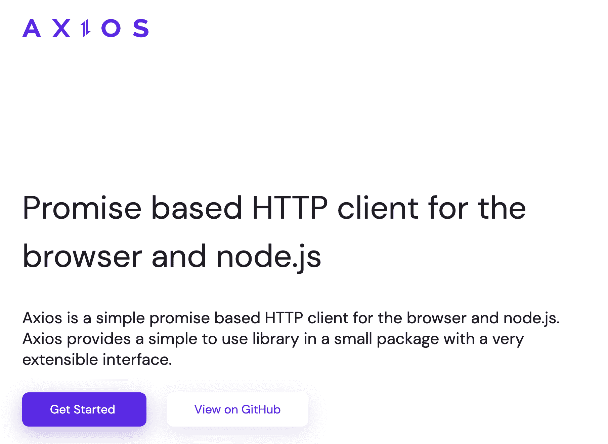
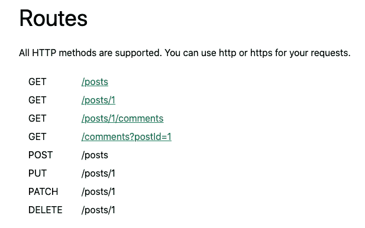
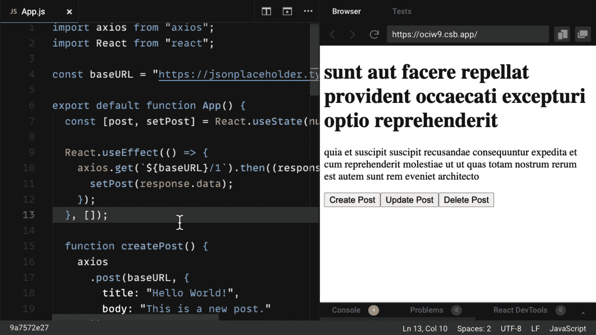

# 如何使用 Axios 和 React:权威指南(2021)

> 原文：<https://www.freecodecamp.org/news/how-to-use-axios-with-react/>

在本指南中，您将看到如何使用 Axios.js 和 React，并使用大量 React 挂钩的真实示例。

您将看到为什么应该使用 Axios 作为数据获取库，如何用 React 设置它，以及用它执行各种类型的 HTTP 请求。

然后，我们将讨论更高级的特性，比如创建一个 Axios 实例以实现可重用性，为了简单起见将 async-await 与 Axios 一起使用，以及如何将 Axios 用作自定义挂钩。

让我们开始吧！

### 想要自己的副本吗？‬ 📄

****[点击此处下载 PDF 格式的备忘单](https://reedbarger.com/resources/react-axios-2021)**** (耗时 5 秒)。

它包括所有的基本信息，作为一个方便的 PDF 指南。

## 目录

*   [什么是 Axios？](#what-is-axios)
*   [为什么在 React 中使用 Axios？](#why-use-axios-in-react)
*   [如何使用 React 设置 Axios】](#how-to-set-up-axios-with-react)
*   [如何发出获取请求(检索数据)](#how-to-make-a-get-request)
*   [如何提出发布请求(创建数据)](#how-to-make-a-post-request)
*   [如何提出上传请求(更新数据)](#how-to-make-a-put-request)
*   [如何提出删除请求(删除数据)](#how-to-make-a-delete-request)
*   [如何处理 Axios 的错误](#how-to-handle-errors-with-axios)
*   [如何创建 Axios 实例](#how-to-create-an-axios-instance)
*   [如何在 Axios 中使用 Async-Await 语法](#how-to-use-the-async-await-syntax-with-axios)
*   [如何创建自定义`useAxios`钩子](#how-to-create-a-custom-useaxios-hook)

## Axios 是什么？

Axios 是一个 HTTP 客户端库，允许您向给定的端点发出请求:



例如，这可能是一个外部 API 或您自己的后端 Node.js 服务器。

通过发出请求，您期望您的 API 根据您发出的请求执行操作。

例如，如果您发出一个 GET 请求，您希望得到显示在应用程序中的数据。

## 为什么在 React 中使用 Axios

有许多不同的库可以用来发出这些请求，那么为什么要选择 Axios 呢？

以下是您应该使用 Axios 作为客户端来发出 HTTP 请求的五个理由:

1.  它有很好的缺省值来处理 JSON 数据。与 Fetch API 等替代方法不同，您通常不需要设置头文件。或者执行乏味的任务，比如将请求体转换成 JSON 字符串。
2.  Axios 具有匹配任何 HTTP 方法的函数名。要执行 GET 请求，可以使用`.get()`方法。
3.  Axios 用更少的代码做更多的事情。与 Fetch API 不同，您只需要一个`.then()`回调来访问您请求的 JSON 数据。
4.  Axios 有更好的错误处理。Axios 会为您抛出 400 和 500 范围错误。与 Fetch API 不同，在 Fetch API 中，您必须自己检查状态代码并抛出错误。
5.  Axios 既可以在服务器上使用，也可以在客户端上使用。如果您正在编写 Node.js 应用程序，请注意 Axios 也可以在独立于浏览器的环境中使用。

## 如何使用 React 设置 Axios

使用 Axios 和 React 是一个非常简单的过程。你需要三样东西:

1.  现有的 React 项目
2.  使用 npm/yarn 安装 Axios
3.  用于发出请求的 API 端点

创建新的 React 应用程序的最快方法是转到 [react.new](https://react.new) 。

如果您有一个现有的 React 项目，您只需要安装带有 npm(或任何其他包管理器)的 Axios:

```
npm install axios
```

在本指南中，您将使用 JSON 占位符 API 来获取和更改帖子数据。

以下是您可以向其发出请求的所有不同路由的列表，以及每个路由的相应 HTTP 方法:



下面是您将使用 Axios 和 API 端点执行的所有操作的快速示例——检索、创建、更新和删除帖子:



## 如何发出 GET 请求

要获取或检索数据，请发出 GET 请求。

首先，您将请求发布单独的帖子。如果您查看端点，您会看到来自`/posts`端点的第一个帖子:

```
import axios from "axios";
import React from "react";

const baseURL = "https://jsonplaceholder.typicode.com/posts/1";

export default function App() {
  const [post, setPost] = React.useState(null);

  React.useEffect(() => {
    axios.get(baseURL).then((response) => {
      setPost(response.data);
    });
  }, []);

  if (!post) return null;

  return (
    <div>
      <h1>{post.title}</h1>
      <p>{post.body}</p>
    </div>
  );
}
```

要在组件挂载时执行这个请求，可以使用`useEffect`钩子。这包括导入 Axios，使用`.get()`方法向您的端点发出 GET 请求，并使用`.then()`回调获取所有响应数据。

响应作为对象返回。数据(在本例中是一个具有`id`、`title`和`body`属性的帖子)被放入一个名为`post`的状态中，该状态显示在组件中。

注意，您总是可以在响应中从`.data`属性中找到请求的数据。

## 如何提出发布请求

要创建新数据，请发出 POST 请求。

根据 API，这需要在`/posts`端点上执行。如果你看下面的代码，你会看到有一个创建文章的按钮:

```
import axios from "axios";
import React from "react";

const baseURL = "https://jsonplaceholder.typicode.com/posts";

export default function App() {
  const [post, setPost] = React.useState(null);

  React.useEffect(() => {
    axios.get(`${baseURL}/1`).then((response) => {
      setPost(response.data);
    });
  }, []);

  function createPost() {
    axios
      .post(baseURL, {
        title: "Hello World!",
        body: "This is a new post."
      })
      .then((response) => {
        setPost(response.data);
      });
  }

  if (!post) return "No post!"

  return (
    <div>
      <h1>{post.title}</h1>
      <p>{post.body}</p>
      <button onClick={createPost}>Create Post</button>
    </div>
  );
}
```

当你点击按钮时，它调用`createPost`函数。

要使用 Axios 发出 POST 请求，可以使用`.post()`方法。作为第二个参数，您包括一个对象属性，该属性指定您希望新的帖子是什么。

再次使用一个`.then()`回调来取回响应数据，并用您请求的新帖子替换您得到的第一个帖子。

这非常类似于`.get()`方法，但是您想要创建的新资源是作为 API 端点之后的第二个参数提供的。

## 如何提出卖出请求

要更新给定的资源，请发出一个 PUT 请求。

在这种情况下，您将更新第一篇文章。

为此，您将再次创建一个按钮。但是这一次，按钮将调用一个函数来更新帖子:

```
import axios from "axios";
import React from "react";

const baseURL = "https://jsonplaceholder.typicode.com/posts";

export default function App() {
  const [post, setPost] = React.useState(null);

  React.useEffect(() => {
    axios.get(`${baseURL}/1`).then((response) => {
      setPost(response.data);
    });
  }, []);

  function updatePost() {
    axios
      .put(`${baseURL}/1`, {
        title: "Hello World!",
        body: "This is an updated post."
      })
      .then((response) => {
        setPost(response.data);
      });
  }

  if (!post) return "No post!"

  return (
    <div>
      <h1>{post.title}</h1>
      <p>{post.body}</p>
      <button onClick={updatePost}>Update Post</button>
    </div>
  );
}
```

在上面的代码中，您使用了来自 Axios 的 PUT 方法。和 POST 方法一样，您可以在更新的资源中包含您想要的属性。

同样，使用`.then()`回调，用返回的数据更新 JSX。

## 如何提出删除请求

最后，要删除资源，请使用 delete 方法。

例如，我们将删除第一篇文章。

注意，执行这个请求不需要第二个参数:

```
import axios from "axios";
import React from "react";

const baseURL = "https://jsonplaceholder.typicode.com/posts";

export default function App() {
  const [post, setPost] = React.useState(null);

  React.useEffect(() => {
    axios.get(`${baseURL}/1`).then((response) => {
      setPost(response.data);
    });
  }, []);

  function deletePost() {
    axios
      .delete(`${baseURL}/1`)
      .then(() => {
        alert("Post deleted!");
        setPost(null)
      });
  }

  if (!post) return "No post!"

  return (
    <div>
      <h1>{post.title}</h1>
      <p>{post.body}</p>
      <button onClick={deletePost}>Delete Post</button>
    </div>
  );
}
```

在大多数情况下，您不需要从`.delete()`方法返回的数据。

但是在上面的代码中，仍然使用了`.then()`回调来确保您的请求被成功解析。

在上面的代码中，当一篇文章被删除后，用户会被提醒该文章已被成功删除。然后，通过将其设置为初始值`null`，post 数据被清除出该状态。

此外，一旦帖子被删除，警告消息后会立即显示文本“No post”。

## 如何处理 Axios 的错误

用 Axios 处理错误怎么样？

如果发出请求时出错了怎么办？例如，您可能会传递错误的数据，向错误的端点发出请求，或者出现网络错误。

为了模拟一个错误，您将向一个不存在的 API 端点发送一个请求:`/posts/asdf`。

该请求将返回一个`404`状态代码:

```
import axios from "axios";
import React from "react";

const baseURL = "https://jsonplaceholder.typicode.com/posts";

export default function App() {
  const [post, setPost] = React.useState(null);
  const [error, setError] = React.useState(null);

  React.useEffect(() => {
    // invalid url will trigger an 404 error
    axios.get(`${baseURL}/asdf`).then((response) => {
      setPost(response.data);
    }).catch(error => {
      setError(error);
    });
  }, []);

  if (error) return `Error: ${error.message}`;
  if (!post) return "No post!"

  return (
    <div>
      <h1>{post.title}</h1>
      <p>{post.body}</p>
    </div>
  );
}
```

在这种情况下，Axios 将抛出一个错误并运行`.catch()`回调函数，而不是执行`.then()`回调。

在这个函数中，我们获取错误数据，并将其置于状态中，以提醒用户注意错误。因此，如果我们有一个错误，我们将显示错误消息。

在这个函数中，错误数据被放入状态，并用于警告用户有关错误。因此，如果出现错误，就会显示一条错误消息。

当您运行此代码时，您将看到文本“错误:请求失败，状态代码为 404”。

## 如何创建 Axios 实例

如果您看一下前面的例子，您会看到有一个`baseURL`作为 Axios 执行这些请求的端点的一部分。

然而，为每个请求编写那个`baseURL`有点乏味。你就不能让 Axios 记住你正在使用的`baseURL`吗，因为它总是包含一个相似的端点？

事实上，你可以。如果您用`.create()`方法创建一个实例，Axios 会记住那个`baseURL`，加上您可能想要为每个请求指定的其他值，包括头:

```
import axios from "axios";
import React from "react";

const client = axios.create({
  baseURL: "https://jsonplaceholder.typicode.com/posts" 
});

export default function App() {
  const [post, setPost] = React.useState(null);

  React.useEffect(() => {
    client.get("/1").then((response) => {
      setPost(response.data);
    });
  }, []);

  function deletePost() {
    client
      .delete("/1")
      .then(() => {
        alert("Post deleted!");
        setPost(null)
      });
  }

  if (!post) return "No post!"

  return (
    <div>
      <h1>{post.title}</h1>
      <p>{post.body}</p>
      <button onClick={deletePost}>Delete Post</button>
    </div>
  );
}
```

上面 config 对象中的一个属性是`baseURL`，您将端点传递给它。

`.create()`函数返回一个新创建的实例，在本例中称为`client`。

那么在将来，你可以像以前一样使用所有相同的方法，但你不必再将`baseURL`作为第一个参数。你只需要参考你想要的具体路线，比如`/`、`/1`等等。

## 如何在 Axios 中使用 Async-Await 语法

在 JavaScript(包括 React 应用程序)中使用 promises 的一大好处是 async-await 语法。

Async-await 允许你不用`then`和`catch`回调函数就能写出更简洁的代码。另外，使用 async-await 的代码看起来更像同步代码，也更容易理解。

但是如何在 Axios 中使用 async-await 语法呢？

在下面的例子中，获取了帖子，但仍然有一个按钮可以删除该帖子:

```
import axios from "axios";
import React from "react";

const client = axios.create({
  baseURL: "https://jsonplaceholder.typicode.com/posts" 
});

export default function App() {
  const [post, setPost] = React.useState(null);

  React.useEffect(() => {
    async function getPost() {
      const response = await client.get("/1");
      setPost(response.data);
    }
    getPost();
  }, []);

  async function deletePost() {
    await client.delete("/1");
    alert("Post deleted!");
    setPost(null);
  }

  if (!post) return "No post!"

  return (
    <div>
      <h1>{post.title}</h1>
      <p>{post.body}</p>
      <button onClick={deletePost}>Delete Post</button>
    </div>
  );
}
```

然而在`useEffect`中，有一个`async`函数叫做`getPost`。

使其成为`async`允许您使用`await` keword 来解析 GET 请求，并在下一行设置数据状态，而无需`.then()`回调。

请注意，`getPost`函数在创建后会立即被调用。

此外，`deletePost`函数现在是`async`，这是使用`await`关键字解析它返回的承诺的一个要求(每个 Axios 方法都返回一个要解析的承诺)。

在删除请求中使用了关键字`await`之后，用户被警告帖子已被删除，帖子被设置为`null`。

如您所见，async-await 清理了大量代码，您可以非常轻松地将其用于 Axios。

## 如何创建自定义`useAxios`钩子

Async-await 是简化代码的好方法，但是你可以更进一步。

当组件挂载时，您可以使用 Axios 创建自己的定制钩子来执行与可重用函数相同的操作，而不是使用`useEffect`来获取数据。

虽然您可以自己定制这个钩子，但是有一个非常好的库可以为您提供一个名为 use-axios-client 的定制钩子。

首先，安装软件包:

```
npm install use-axios-client
```

要使用钩子本身，从组件顶部的 use-axios-client 导入`useAxios`。

因为不再需要`useEffect`，所以可以删除 React 导入:

```
import { useAxios } from "use-axios-client";

export default function App() {
  const { data, error, loading } = useAxios({
    url: "https://jsonplaceholder.typicode.com/posts/1"
  });

  if (loading || !data) return "Loading...";
  if (error) return "Error!";

  return (
    <div>
      <h1>{data.title}</h1>
      <p>{data.body}</p>
    </div>
  ) 
}
```

现在，您可以调用 app 组件顶部的`useAxios`，传入您想要向其发出请求的 URL，钩子返回一个对象，其中包含处理不同状态所需的所有值:`loading`、`error`和已解析的`data`。

在执行这个请求的过程中，值`loading`将为真。如果有错误，您需要显示错误状态。否则，如果您有返回的数据，可以在 UI 中显示它。

像这样的定制钩子的好处是它真的减少了代码并简化了整体。

如果你想用 Axios 获取更简单的数据，试试像这样的定制`useAxios`钩子。

## 下一步是什么？

恭喜你！您现在知道如何使用最强大的 HTTP 客户端库之一来支持您的 React 应用程序。

我希望你能从这本指南中获益匪浅。

请记住，您可以下载本指南的 PDF 格式备忘单，以备将来参考。

## 想要更多吗？加入 React 训练营

**[React 训练营](http://bit.ly/join-react-bootcamp)** 将你应该知道的关于学习 React 的一切打包成一个全面的包，包括视频、备忘单，外加特殊奖励。

获得内幕信息**100 名开发人员**已经成为 React pro，找到他们梦想的工作，掌控他们的未来:

[](http://bit.ly/join-react-bootcamp) 
*打开时点击此处通知*