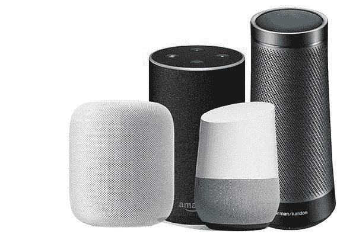

# AI vs ML——人工智能和机器学习有什么区别？

> 原文：<https://www.freecodecamp.org/news/ai-vs-ml-whats-the-difference/>

人工智能和机器学习是目前两个流行且经常被炒作的术语。人们经常互换使用它们来描述智能软件或系统。

但即使 AI 和 ML 都是基于统计学和数学，它们也不是一回事。

在本文中，您将通过一些实际例子来了解 AI 和 ML 之间的区别，以帮助澄清任何混淆。

## 什么是 AI，或者说人工智能？

人工智能或 AI 是计算机或机器模仿或模仿人类智能行为并执行类似人类任务的能力。

人工智能执行需要人类智能的任务，如思考、推理、从经验中学习，最重要的是，做出自己的决定。

> **“AI 是制造智能机器的科学与工程。”—约翰·麦卡锡*T3*

人工智能可以出色地执行任务，但它们尚未达到在真正的情感层面上与人互动的能力。

为了了解更多关于人工智能的知识，让我们看看一些人工智能的例子。

### 机器人学

工业机器人是人工智能的一个很好的例子。工业机器人有能力监控自己的精度和性能，并在需要维护时进行感应或检测，以避免昂贵的停机时间。它还可以在新的或未知的环境中工作。

### 个人助理

人工智能的另一个例子是个人助理工具，这是人与人工智能交互的小工具。最受欢迎的个人助理是谷歌的 Google Home、苹果的 Siri、亚马逊的 Alexa 和微软的 Cortana。

这些个人助理使用户能够查找信息、预订酒店、在日历中添加事件、回答问题、安排会议、发送消息或电子邮件等等。

要阅读更多真实世界中人工智能的例子，[阅读这篇文章](https://builtin.com/artificial-intelligence/examples-ai-in-industry)。

如果你想获得 Azure AI 基础的认证，你也可以查看这个完整的课程。

## 什么是 ML，或者说机器学习？

机器学习(Machine learning，简称 ML)是人工智能的子集，它能够自动从数据中学习，而无需显式编程或领域专业知识的帮助。

**ML 中的学习**是指机器基于数据进行学习的能力，以及一个 ML 算法训练一个模型，评估其性能或准确性，然后进行预测的能力。

例如，你可以用随机森林和决策树等有监督的机器学习算法来训练一个系统。

> **“*M*机器学习是一个研究领域，它赋予计算机学习的能力，而无需显式编程。”——亚瑟·塞缪尔**

ML 的目的是使机器能够利用数据进行自我学习，并最终做出准确的预测。

为了了解更多信息，我们来看一些机器学习的例子。

### 产品推荐

大多数电子商务网站都有机器学习工具，根据历史数据提供不同产品的推荐。

例如，如果你在亚马逊上搜索了机器学习书籍，然后你购买了其中一本，如果你在一定时间后再次回来，亚马逊的主页会向你显示与机器学习相关的书籍列表。

它还会根据你喜欢的、添加到你的购物车中的内容以及其他相关行为提出建议。

### 垃圾邮件和恶意软件过滤

垃圾邮件已经成为互联网用户的一个大问题。如今，大多数电子邮件服务提供商使用机器学习工具来自动学习和识别垃圾邮件和钓鱼邮件。

例如，Gmail 和 Yahoo mail 垃圾邮件过滤器不仅仅使用预先存在的规则来检查垃圾邮件。他们在继续进行垃圾邮件过滤操作时，会根据自己的经验生成新的规则。

## AI 和 ML 的区别

总而言之，AI 解决需要人类智能的任务，而 ML 是人工智能的子集，通过从数据中学习并做出预测来解决特定任务。

这意味着所有的机器学习都是 AI，但并不是所有的 AI 都是机器学习。

恭喜👏👏，你已经做到这篇文章的结尾了！

如果你学到了新的东西或者喜欢阅读这篇文章，请分享给其他人看。在那之前，下期帖子再见！

你也可以在 Twitter 上找到我 [@Davis_McDavid](https://twitter.com/Davis_McDavid?ref=hackernoon.com) 。

而且你可以在这里阅读更多类似这样的文章[。](https://hackernoon.com/u/davisdavid?ref=hackernoon.com)