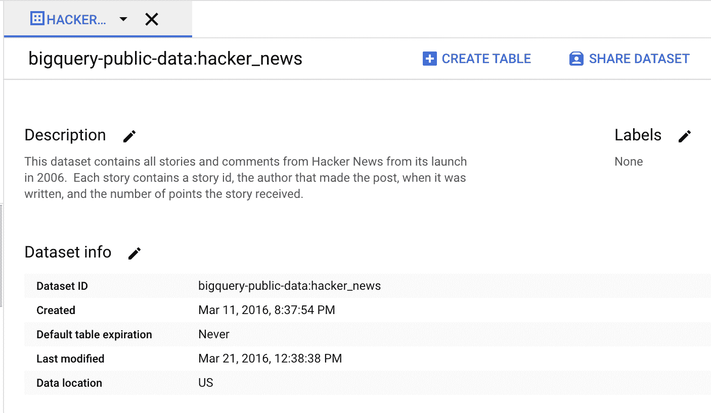
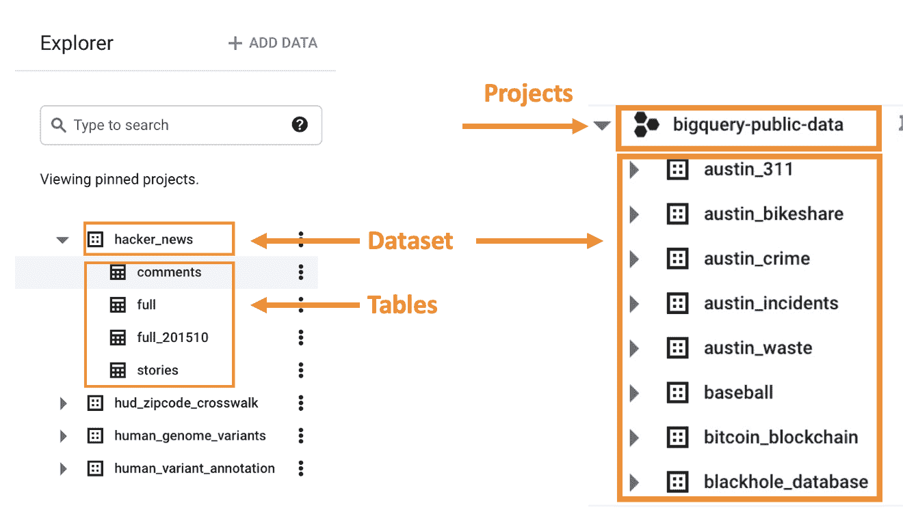
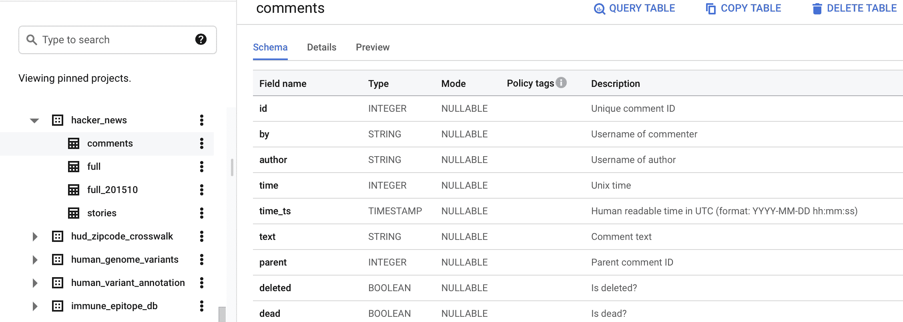
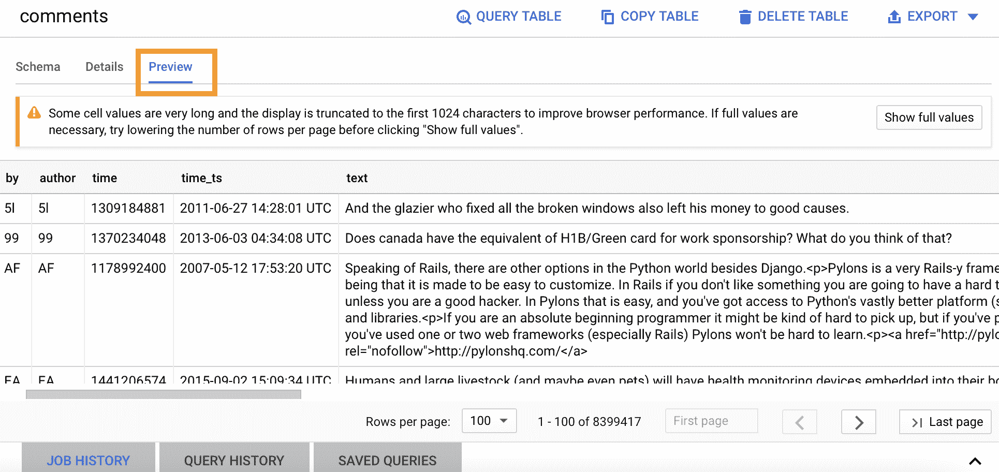
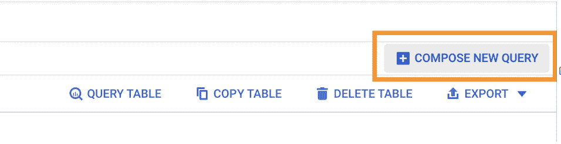
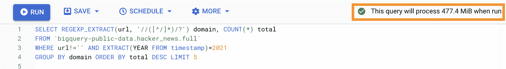
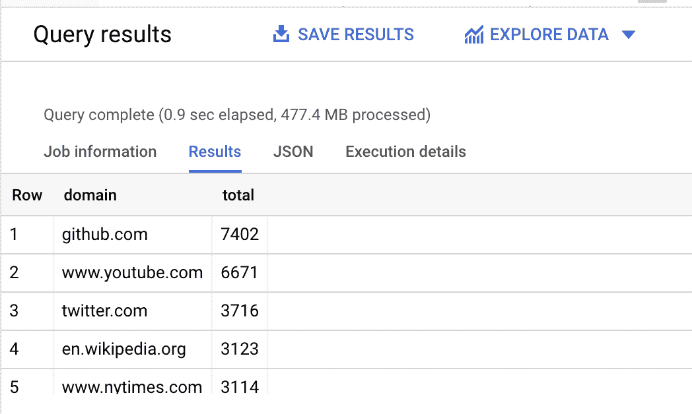

# Google BigQuery 初学者指南——如何分析大型数据集

> 原文：<https://www.freecodecamp.org/news/google-bigquery-beginners-guide/>

将数据存储在 CSV 文件或 Excel 电子表格中的日子已经一去不复返了。如果您想在几秒钟内快速分析数百万个数据行，BigQuery 是最佳选择。

在这本入门指南中，我们将了解 BigQuery 以及如何使用它来查询和分析数据。

## 什么是 BigQuery？

BigQuery 是许多公司使用的企业数据仓库，这些公司需要一个完全托管的基于云的解决方案来处理其海量数据集。

BigQuery 的无服务器架构允许您快速执行标准 SQL 查询，并在几秒钟内分析数百万个数据行。然后，您可以将数据存储在 Google 云存储的文件和存储桶中，或者存储在 BigQuery 存储中。

BigQuery 还与其他 GCP 产品进行了出色的集成，如 Data Flow 和 Data Studio，这使其成为数据分析任务的绝佳选择。

## 开始之前:

我们将在谷歌提供的公共数据集中查询表，以便使用谷歌云平台试用 BigQuery。因此，本指南假设:

*   您可以访问[谷歌云平台](https://cloud.google.com/free/?gclid=CjwKCAjw55-HBhAHEiwARMCsziVtllCq8mRIWlXVVztmn6HkzAlkuajtZeYMInLQmykNGfbEjz2tfRoCFs0QAvD_BwE&gclsrc=aw.ds)。
*   您已经创建了一个[谷歌云项目](https://cloud.google.com/bigquery/docs/quickstarts/quickstart-web-ui#before-you-begin)。
*   谷歌沙盒环境已经启动并运行。

## 如何访问公共数据集

公共数据集通过[谷歌云公共数据集计划](https://cloud.google.com/public-datasets)向公众开放。我们将使用一个黑客新闻数据集，它包含了从 2006 年发布到现在的所有故事和评论。让我们开始吧。

导航到[黑客新闻数据集](https://console.cloud.google.com/marketplace/product/y-combinator/hacker-news)并点击查看数据集按钮。它会带你到谷歌云平台登录屏幕。登录该帐户，它将打开包含数据集的 BigQuery 编辑器窗口。



## BigQuery 接口是如何组织的

BigQuery 是一个具有 4 个级别的层次结构:

*   项目:存储数据的顶级容器
*   数据集:在项目中，数据集允许您组织数据并保存一个或多个数据表
*   表:在数据集内，表保存实际数据。
*   作业:对数据执行的任务，如运行查询、加载数据和导出数据。



**注意:**请注意，在使用表格时，您还会注意到:

*   表格是按天划分的，这意味着您需要使用通配符或*来获取更大的日期范围。
*   还有一个“日内”表，会给你过去 24 小时的数据。

## 如何检查表模式

单击表名。这将允许您查看表中有哪些列，以及对表执行各种操作的一些按钮。



## 如何预览数据

使用预览按钮获取表中某些行的样本。[不要在 BigQuery](https://cloud.google.com/bigquery/docs/best-practices-costs#avoid_select_) 中做一个`SELECT *`:



## 如何查询大数据

SQL 语句用于执行各种数据库任务，如查询数据、创建表和更新数据库。

### 基本查询

基本查询包含以下组件:

*   `SELECT`(必选):标识要包含在查询中的列
*   `FROM`(必选):包含 SELECT 语句中的列的表
*   `WHERE`:过滤记录的条件
*   `ORDER BY`:用于对结果集进行升序或降序排序。
*   `GROUP BY`:如何聚合结果集中的数据

## 如何在 BigQuery 中编写查询

对于我们的第一个查询，让我们找出 2021 年迄今为止黑客新闻中共享的前 5 个域是什么(查询于 2021 年 7 月 9 日执行)。

点击**撰写新查询**按钮。这将打开编辑器选项卡。



如下所示编写您的第一个查询:

```
SELECT REGEXP_EXTRACT(url, '//([^/]*)/?') domain, COUNT(*) total
FROM `bigquery-public-data.hacker_news.full`
WHERE url!='' AND EXTRACT(YEAR FROM timestamp)=2021
GROUP BY domain ORDER BY total DESC LIMIT 5
```

您会注意到 BigQuery 会在您构建代码时调试您的代码。如果查询有效，则查询将处理的数据量旁边会出现一个复选标记。这有助于您确定运行查询的成本。

如果查询无效，则会出现一个感叹号和一条错误消息。



要运行此查询，请单击“运行”按钮。几秒钟后，您应该会看到查询返回的结果:



如果想要 JSON 格式的结果，可以点击 **JSON** 选项卡。您还可以在“执行细节”一栏中找到有趣的细节。

## **如何使用通配符表查询多个表**

通配符表使您能够使用简洁的 SQL 语句查询多个表。通配符表表示与通配符表达式匹配的所有表的联合:

`FROM `tablename.stories_*``

### _TABLE_SUFFIX 伪列

带有通配符表的查询支持在`WHERE`子句中的`_TABLE_SUFFIX`伪列。要限制查询，使其只扫描一组指定的表，请在带有常量表达式条件的`WHERE`子句中使用`_TABLE_SUFFIX`伪列。

使用`_TABLE_SUFFIX`可以大大减少扫描的字节数，这有助于降低运行查询的成本。

### 如何通过提供日期范围来获取数据

```
WHERE _TABLE_SUFFIX BETWEEN
    FORMAT_DATE(‘%Y%m%d’,DATE_SUB(CURRENT_DATE(), INTERVAL 36 MONTH))
    AND
    FORMAT_DATE(‘%Y%m%d’,DATE_SUB(CURRENT_DATE(), INTERVAL 1 DAY)) 
```

### 如何使用 UNNEST 展平日期

要将一个`ARRAY`转换成一组行，也称为“展平”，请使用 [](https://cloud.google.com/bigquery/docs/reference/standard-sql/query-syntax#unnest_operator) ``[UNNEST](https://cloud.google.com/bigquery/docs/reference/standard-sql/query-syntax#unnest_operator)`运算符。`UNNEST`接受一个`ARRAY`并返回一个表，表中的每个元素在`ARRAY`中都有一行:`

```
`SELECT * FROM UNNEST (['Ambreen', 'Abdul', 'Adam', 'David']) AS names;` 
```

``

## `如何保存和共享查询`

`您可以保存您的查询供以后使用。有 3 种类型的已保存查询:`

*   `**私有:**私有保存的查询仅对创建它们的用户可见。`
*   `**项目级:**项目级保存的查询对预定义的 BigQuery IAM 角色中具有所需的[权限](https://cloud.google.com/bigquery/docs/saving-sharing-queries#permissions)的成员可见。`
*   `**公共:**公共保存的查询对任何具有该查询链接的人可见。`

## `摘要`

`BigQuery 比我们在这个简单教程中探索的要复杂得多。您还可以将 Firebase Analytics 数据导出到 BigQuery，这将允许您针对您的分析数据运行复杂的即席查询。`

`通过 BigQuery ML，您可以使用标准的 SQL 查询来创建和执行机器学习模型。`

`如果您感到兴奋，并想了解更多关于 BigQuery 的知识，请查看下面的链接。`

## `资源:`

*   `[BigQuery 食谱](https://support.google.com/analytics/answer/4419694?hl=en#zippy=%2Cin-this-article)`
*   `[使用 _TABLE_SUFFIX 过滤选定的表格](https://cloud.google.com/bigquery/docs/querying-wildcard-tables#filtering_selected_tables_using_table_suffix)`
*   `[BigQuery 提示:UNNEST 函数](https://firebase.googleblog.com/2017/03/bigquery-tip-unnest-function.html)`
*   `[BigQuery UNNEST:如何在 BigQuery 中使用嵌套数据](https://towardsdatascience.com/bigquery-unnest-how-to-work-with-nested-data-in-bigquery-f27006a64c3)`