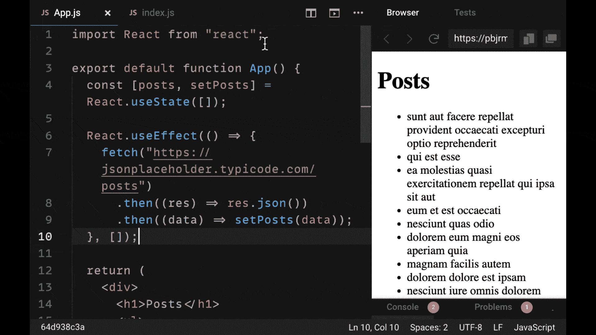
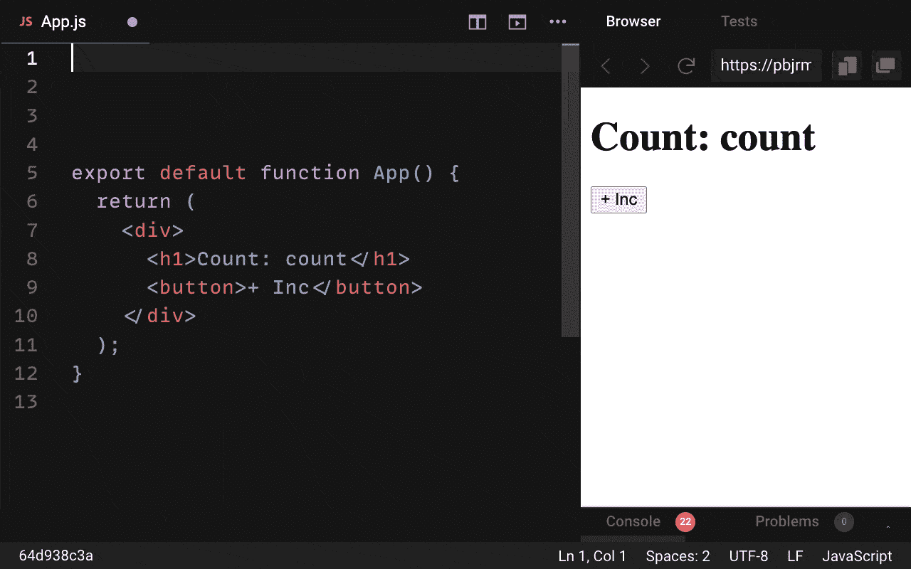
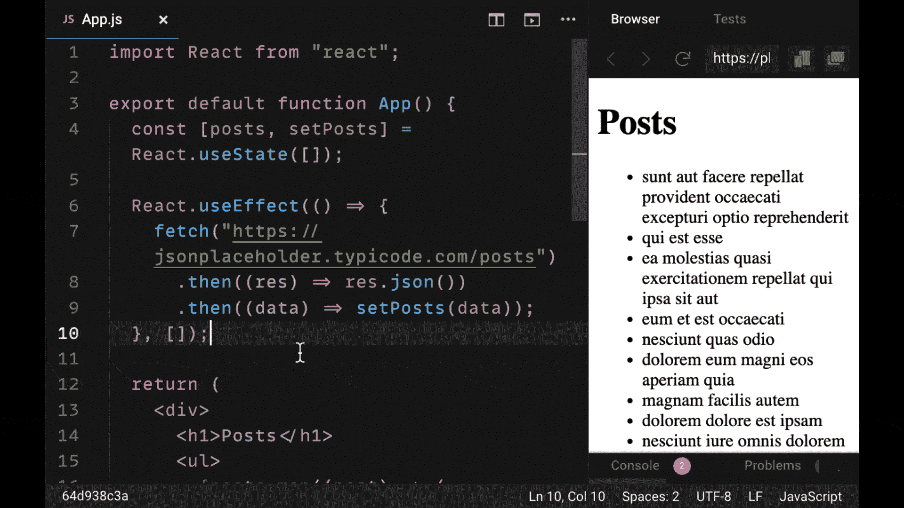
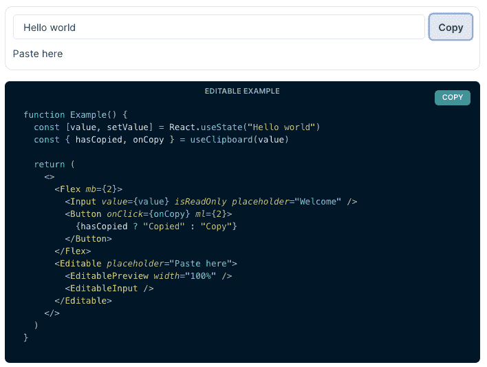

# 2021 年每个项目都应该使用的 5 个 React 库

> 原文：<https://www.freecodecamp.org/news/5-react-libraries-every-project-needs/>

有上百个很棒的 React 库可供选择，但是您的 React 项目最需要哪些库呢？

在本文中，我们将分解您的 React 项目所需的五个库。

它们中的每一个都将涵盖你需要的几乎每一个主要工具，此外，我们还将涵盖 2021 年及以后的最佳选择。

让我们开始吧！

> 想要成为 6 位数 React 开发人员的终极指南吗？查看 [**反应训练营**](https://reactbootcamp.com) 。

## 1.更快的创建-反应-应用程序

如果你想创建一个 React 项目，你可能会使用像 Create-React-App 这样的工具。

虽然 Create-React-App 仍然是一个令人惊叹的工具，并允许您通过运行一个命令来创建 React 项目，但它有一个新的竞争对手，您应该知道它叫做 **Vite** 。

Create-React-App 使用 Webpack 来构建我们的 React 开发代码。但是已经出现了在速度上与 Webpack 竞争的构建工具。

Vite 就是这样一个构建工具，它使用一个更快的捆绑器，称为 esbuild。简而言之，它利用了浏览器的本地 es 模块来获得更快的开发体验。

Vite 快了多少？自己看！

下面是开始一个 Vite 项目(右)和一个 Create-React-App 项目(左)的快速比较。

 <https://reedbarger.nyc3.digitaloceanspaces.com/vite-react.mp4>

 Sorry, your browser doesn't support embedded videos.

在开发中运行 React 时，Vite 比 Create-React-App 快很多倍。

如果你有时对创建-反应-应用程序需要多长时间启动感到烦恼，一定要看看 Vite。

最重要的是，我强烈推荐工具 **Create-Next-App** 。

这允许我们非常快速地创建下一个 JS 项目。是的，Next.js 是一个框架，但它是一个 React 框架，需要的依赖性非常少。事实上，它只需要依赖 React、React DOM 和 Next。

创建下一个 React 项目时，请务必查看 **Vite** 和 **Create Next App** 。

## 2.(更好的)数据提取库

对于任何 React 应用程序，我们都必须管理一些服务器状态。

这意味着我们从外部服务器(如 API)获取数据，并将这些数据引入我们的应用程序，然后将这些数据与应用程序组件的本地状态相结合。

许多 React 开发人员，不管他们的技术水平如何，都很难弄清楚如何用本地状态管理服务器状态。大多数开发人员求助于像 Redux 这样的库作为解决方案。

在过去的一年中，出现了几个库，使得在 React 组件中管理服务器状态变得非常容易。这些是**反应查询**和 **SWR** 。

他们通过给我们一些非常有用的自定义钩子来帮助我们获取数据。但最重要的是，它们有自己的内部缓存。

这种内置缓存允许我们非常容易地将外部数据与我们的应用程序集成。我们将每个查询分配给一个自定义键。要读取或更新我们获取的任何数据，我们只需要引用那个键！

下面是一个如何使用 React Query 的简单示例。我们从一个 API 获取 post 数据，我们将它的值赋给自定义键“posts”。



除了改进我们的状态管理之外，获取数据也变得更加容易。它们包括许多很棒的工具，允许我们做诸如重新提取查询、创建分页查询、无限查询等等。

简而言之，如果您在 React 应用程序中跨多个组件获取数据，一定要使用这些较新的数据获取库之一。

如果你正在寻找最深入和复杂的数据获取库，使用 **React Query** 。 **SWR** 也是一个很好的选择，尽管工具列表稍微少一些。

## 3.一个非常简单的状态管理库

说到管理全局应用状态，Redux 一直是首选。

它帮助 React 开发人员将状态值分离成一个共享对象值，可以在应用程序的任何组件中读取和更新该值。

然而，Redux 带有一些概念上的包袱。为了正确设置 Redux 并管理我们的状态，我们必须理解并编写单独的动作、reducers 和选择器。

Redux 有一些新的竞争对手，他们试图毫不费力地给我们提供该库的几乎所有好处。这些是图书馆**祖斯坦德**和**乔泰**。

它们非常相似，它们的强大之处在于它们都是用钩子优先的方法来处理状态的。这意味着一旦你创建了你的商店，你可以通过调用它作为一个钩子来读取它的任何值。

下面是一个简单的例子，展示了如何创建并使用 Zustand 商店作为挂钩来创建一个简单的计数器应用程序。



Zustand 和 Jotai 使状态管理变得更简单，因为您不需要将存储分为动作、减少器和选择器。

如果您想要更新状态，请在您的存储中编写一个函数来执行此操作，并在您的组件中使用它。如果你想选择你的状态的一部分，使用你的存储作为钩子并获取你想要的状态对象的属性。就这么简单！

另外，您不需要任何额外的库来执行异步操作(不像 Redux，需要 Redux Thunk 或 Redux Saga)。

最后，您不需要用上下文提供者包装整个组件树，所以除了创建您的存储并在您的组件中使用它之外，基本上不需要任何设置。

*简而言之，如果你在理解 Redux 方面有困难，或者想要在你的州管理方面有更多的自由，请查看 **Zustand** 或 **Jotai** 。*

## 4.强大的组件库

React 旨在创建令人印象深刻的用户界面。因此，我们需要库来帮助我们实现这个目标。

有大量的组件库为我们提供定制的、设计良好的、开箱即用的组件。然而，面对如此多的选择，你会选择哪一个呢？

如果你希望能够构建看起来很棒并且功能相同的应用程序，你可以查看大量维护良好的库，如**蚂蚁设计**、**材质 UI** 和**查克拉 UI** 。

所有这些库都有大量的组件，甚至还有专用的图标库。但是可以说，它们最重要的是它们有一个直观的语法，允许我们更容易地构建有吸引力的组件。

下面是一个用 Ant 设计构建简单 UI 的快速示例。



大多数开发人员选择组件库是因为它们的外观和特性，但是最好的库也包括额外的工具，使我们的应用程序具有功能性。

这里有一个来自 Chakra UI 的自定义钩子(`useClipboard`)，它允许我们将文本复制到用户的剪贴板上。



我之所以选择这些，是因为我不仅觉得它们在视觉上很吸引人，而且它们有大量的组件，几乎适合你所有的用例。

最糟糕的事情是，当你有一个组件库的时候，一旦你在构建你的应用的中途意识到它没有你需要的所有工具。

*为你的下一个项目检查组件库**蚂蚁设计**、**材质 UI** 或**查克拉 UI** 。或者使用 CSS-in-JS 库，如 **Emotion** 或 **Styled Components** ，如果您对手工编写样式感兴趣的话。*

## 5.一个基于钩子的表单库

您构建的每个 React 应用程序可能都有一个表单。*不用说，*建筑形态是一种痛苦！

不仅要创建表单本身，还要添加一些棘手的东西，比如输入验证和错误处理。

2021 年你可以使用的最好的表单库是 **React Hook Form** 和 **Formik** 。

在内置钩子的帮助下，它们使得构建可重用的功能表单变得非常容易。甚至是具有复杂条件的表单，如相互依赖或需要异步验证的字段。

值得注意的是，Formik 已经发生了变化，我们不再需要使用它以前使用的传统渲染道具模式。

有了蚁族，你可以使用 Formik 包中的一个名为`useFormik`的定制钩子，它允许我们在同名定制钩子的帮助下构建表单。

这里有一个用`useFormik`做的基本表单。

```
 import React from 'react';
 import { useFormik } from 'formik';

 const SignupForm = () => {
   const formik = useFormik({
     initialValues: {
       username: '',
       email: '',
     },
     onSubmit: values => {
       alert(JSON.stringify(values, null, 2));
     },
   });
   return (
     <form onSubmit={formik.handleSubmit}>
       <label htmlFor="name">Username</label>
       <input
         id="username"
         name="username"
         type="text"
         onChange={formik.handleChange}
         value={formik.values.username}
       />
       <label htmlFor="email">Email Address</label>
       <input
         id="email"
         name="email"
         type="email"
         onChange={formik.handleChange}
         value={formik.values.email}
       />
       <button type="submit">Submit</button>
     </form>
   );
 }; 
```

值得注意的是，在这些库之上，您可能需要的唯一东西是一个验证库。

Formik 和 React Hook Form 都旨在非常容易地与验证库(如库 Yup)集成。如何做到这一点在他们的文档中非常简单。

## 想要更多吗？加入 React 训练营

**[React 训练营](http://bit.ly/join-react-bootcamp)** 将你应该知道的关于学习 React 的一切打包成一个全面的包，包括视频、备忘单，外加特殊奖励。

获得内幕信息**100 名开发人员**已经成为 React pro，找到他们梦想的工作，掌控他们的未来:

[](http://bit.ly/join-react-bootcamp) 
*打开时点击此处通知*