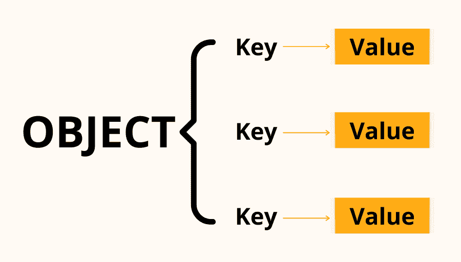
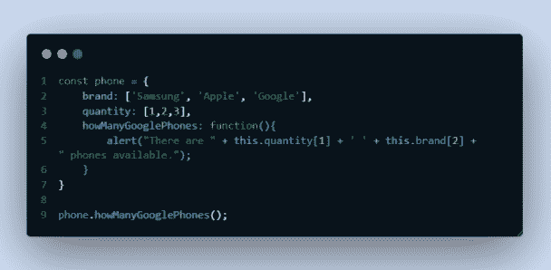
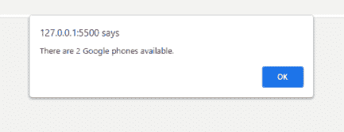

# 什么是 JavaScript 对象？解释了键值对和点符号

> 原文：<https://www.freecodecamp.org/news/what-is-a-javascript-object/>

对象是 JavaScript 中最有价值的东西之一。您可以使用它们将您的程序提升到下一个级别。

一个**对象**是一组数据——或键值对——由变量和函数组成，您可以使用点符号来访问它们。

现在这是一堆对你来说可能毫无意义的词，所以让我们把它们分解开来。

## JavaScript 中的键值对是什么？

解释一个键值对的最简单的方法是你有两个链接在一起的条目。一个是“键”，一个是“值”。一个对象内部可以有几个键值对。



现在我们已经了解了什么是键值对，我们可以更深入地研究对象。

## JavaScript 中的对象是什么？

这是 JavaScript 中的一个对象:

```
const phone = {
	brand: ['Samsung', 'Apple', 'Google'],
	quantity: [1,2,3],
	howManyGooglePhones: function(){
		alert("There are " + this.quantity[1] + ' ' + this.brand[2] + " phones available.");
	}
}

phone.howManyGooglePhones();
```



我们创建并命名我们的对象——在本例中，我们将其命名为`phone`。我们还将所有内容都放在大括号{ }中。使用冒号`:`将每个键与值分开。

在上面的代码中，我们有两个数组和一个函数。注意每个键值对是如何以逗号`,`结尾的——这非常重要，也是必需的。

## JavaScript 中的点记法是什么？

点符号是我们可以调用键值对(称为属性)并提取信息地方。

如果我想要三星这个品牌，我可以做 **`phone.brand[0]`** ，它会给我三星。我们使用对象名(在这个例子中是`phone`)，使用一个点，然后继续写属性名。

我们的功能设置为显示每个品牌的手机数量。在上面的函数中，我们用它来显示我们有多少谷歌手机库存。

**`this.quantity[1]`** 正在访问“数量”属性，并在[1]位置寻找该值。 **`this.brand[2]`** 正在访问我们想要显示的品牌属性，在本例中是 Google。

你能快速计算出数量为 3 时我们将如何访问苹果吗？在这种情况下会是什么样子呢？

因为我们想从这个对象中访问这些值。对于这个例子，当程序加载时，警报创建一个弹出窗口来显示这个信息。

既然我们的对象已经完成，我们想调用对象中的函数并显示它。由于我们不再在对象中，**我们将不会像在对象内部那样使用`this`** 。

**取而代之的是**我们将用名字和点符号来称呼这个对象。我们的对象名是 **`phone`** 那么我们就用它的函数名吧:

**T2`phone.howManyGooglePhones();`**

调用该函数将创建弹出窗口:



您成功地创建了一个名为函数的对象，它位于从属性中访问两个不同值的对象中。干得好！

如果你喜欢我的博客文章，你会喜欢我的社交媒体文章。在 Twitter @DThompsonDev 上关注我