# 如何学习机器学习——学习机器学习的技巧和资源

> 原文：<https://www.freecodecamp.org/news/how-to-learn-machine-learning-practical-tips-and-resources/>

现在很多人都想学习机器学习。但是大多数 ML 老师提出的令人生畏的自下而上的课程足以让许多新人望而却步。

在本教程中，我将课程颠倒过来，并概述我认为最快速和最简单的方法来牢固掌握 ML。

### 目录

我在这里建议的课程是一个循环的多步骤过程，如下所示:

*   **[第 0 步:沉浸在机器学习领域](#step-0-immerse-yourself-in-the-machine-learning-field)**
*   **[第一步:研究一个看起来像你最后阶段的项目](#step-1-study-one-project-that-looks-like-your-endgame)**
*   **[第二步:学习编程语言](#step-2-learn-the-programming-language)**
*   **[第三步:从上到下学习库](#step-3-learn-the-libraries-from-top-to-bottom)**
*   **[第四步:用最多一个月的时间做一个你热爱的项目](#step-4-do-one-project-you-re-passionate-about-in-max-one-month)**
*   **[第五步:找出你知识中的一个缺口，并了解它](#step-5-identify-one-gap-in-your-knowledge-and-learn-about-it)**
*   **[第六步:重复步骤 0 至 5](#step-6-repeat-steps-0-to-5)**

这是一个循环学习计划，因为第 6 步实际上是转到第 0 步！

作为免责声明，这个课程可能对你来说很陌生。但是当我在麦吉尔大学给本科生教授机器学习时，我已经测试过它了。

我尝试了这个课程的许多迭代，从理论上优越的自下而上的方法开始。但是从经验来看，这种务实的自上而下的方法是最好的结果。

我得到的一个常见的批评是，不从统计学或线性代数等基础知识开始的人对机器学习的理解会很差，他们在建模时不知道自己在做什么。

理论上，是的，这是真的，这就是为什么我开始用自下而上的方法教 ML。实际上，情况从来不是这样。

实际上最终发生的是，因为学生知道如何做高层次的建模，他们更倾向于自己钻研低层次的东西，因为他们看到了这会给他们的高层次技能带来直接的好处。

如果他们从底层开始，他们能够为自己设定的环境就不会存在——我相信这是大多数教师失去学生的地方。

话虽如此，让我们开始实际的学习计划吧！🚀🚀🚀

## 步骤 0:沉浸在机器学习领域

学习任何东西的第一步是花些时间去理解事情的结局和你的兴趣所在。

这将有两个主要好处:

*   知道场地的大小会让你知道你没有错过什么，所以它会增加你的注意力。
*   如果你知道你正在漫步的风景是什么样子，在你的心理模型中画出一条道路会更容易。

Imagine that you are a sheep in a pasture. It's important that you know where the boundaries are and where the grass taste better : Photo by [ARANYA KAR](https://unsplash.com/@aranya00?utm_source=ghost&utm_medium=referral&utm_campaign=api-credit) / [Unsplash](https://unsplash.com/?utm_source=ghost&utm_medium=referral&utm_campaign=api-credit)

为了让自己完全沉浸在这个领域并完善自己的学习计划，你应该按顺序回答以下三个问题:

*   你能用机器学习做什么？
*   你想用机器学习做什么？
*   你是如何做这件事的？

这些问题将让你进入非常具体和易于学习的领域，同时也让你看到更大的图景。

让我们更详细地看一下这些问题。

### 你能用机器学习做什么？

这个问题非常广泛，并且会逐月变化。这门课程的伟大之处在于，在每一个步骤中，你都会花一些时间去了解在这个领域中什么是可能的。

这将允许你完善你的机器学习的心智模型。因此，如果你没有 100%准确地了解第一遍可能发生的情况，这没什么大不了的。大致了解总比没有好。

Think of this question as climbing a foggy mountain and taking note of the landscape down below: Photo by [Lucas Clara](https://unsplash.com/@lux17?utm_source=ghost&utm_medium=referral&utm_campaign=api-credit) / [Unsplash](https://unsplash.com/?utm_source=ghost&utm_medium=referral&utm_campaign=api-credit)

这里有一个简单的概述，从技术到实际应用，你可以用机器学习做什么。

#### 技术机器学习主题

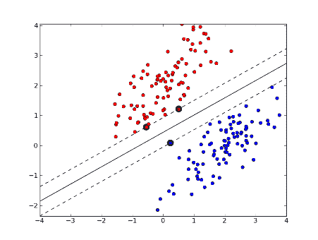

Classification task using SVM

*   **监督学习:**这种类型的学习包括向模型提供输入和带标签的输出来训练它。一旦训练完成，你应该在技术上能够给它一个输入，它就会产生正确的输出。
*   **无监督学习:**这种学习涉及输入，没有输出。您要求模型理解数据中的模式。
*   **强化学习:**这个 ML 设置包括一个代理、一个环境、代理可以做的动作和奖励。这看起来有点像你如何用食物训练一只狗。
*   **在线学习:**这种类型的学习既可以有人监督，也可以无人监督。其特殊性在于，随着数据流的到来，模型可以“在线”更新。
*   **迁移学习:**这种类型的学习是将已经训练好的模型作为不同学习任务的起点。这大大加快了第二个任务的学习速度。
*   **集成学习:**这种 ML 技术包括将多个训练好的预测器放在一起(一个接一个地或通过对输出进行投票)，并使用这个预测器的集成作为最终的预测器。

机器学习有许多不同的风格，但这是一个很好的起点。

#### 常见的机器学习模型

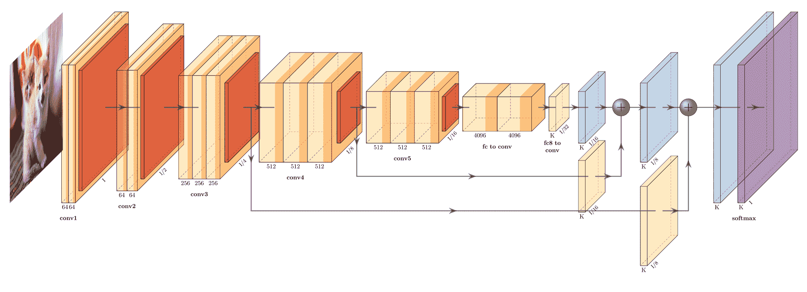

[One of the most complicated types of model called a Deep Neural Network](https://github.com/ashishpatel26/Tools-to-Design-or-Visualize-Architecture-of-Neural-Network).

*   **线性回归:**这是一个很好的公式，实际上对很多问题都很有效。这应该是大多数分析的出发点。
*   **逻辑回归:**这是一种对一个类别或多个类别的概率进行建模的模型。尽管它的名字里有回归，但它是一个分类模型。
*   **决策树:**决策树模型创建了一个“决策”或公式树，当遵循该树时，将导致期望的输出。这些类型的模型非常重要，因为一旦经过训练，它们很容易理解和检查。
*   **支持向量机(SVM):** 把这个模型想象成构造一个平面，用最大宽度将两个类分开。比这要复杂一点，但是想象一条有粗细的线，你在中途。
*   **朴素贝叶斯:**这些类型的分类器使用贝叶斯定理，该定理假设所有特征彼此独立。然而，这种情况很少发生，这就是为什么它被称为天真。即使假设不成立，它在实践中的效果也令人惊讶。
*   **k-最近邻:**这种类型的分类器不需要训练，它只需记住数据集中的所有元素。然后，它会根据输入与数据集中其他点的距离给出一个输出。
*   **K-Means:** 这种无监督模型将在给定多个聚类的情况下，计算出哪些点属于哪个聚类。它将通过反复修改每个集群的质心来做到这一点，直到它收敛到某个稳定的点。
*   **随机森林:**这是一种集成技术，使用了许多非常简单的决策树分类器。模型的输出是由大多数决策树输出的类。
*   **降维算法:**降维算法种类繁多，主成分分析就是其中之一。所有这些算法的要点是，它们可以创建从具有大量维度(特征)的数据集到具有较少维度的表示的映射。当它映射到 2 或 3 维时，它允许我们在 2D 或 3D 中可视化高维数据集。
*   **XGBoost:** 这个模型是一个正则化的梯度增强模型。简而言之，它让弱学习者串行设置，而不是并行设置(像随机森林)。这是一个非常好的模型，通常是机器学习竞赛中的顶级选手。
*   **深度神经网络:**这几类模型都是自己的一整个领域。基本上，无论是串联还是并联，它们都是弱预测器。这些模型能够构建数据的分层表示，从而产生很好的结果。因为他们的高容量，他们在训练上是出了名的挑剔(至少可以这么说)。这些模型有很多可能的架构，比如 CNN 和 Transformers。

现在有很多机器学习模型。但值得庆幸的是，你不需要知道所有这些知识就能精通机器学习。

实际上，如果你知道**线性回归**、 **SVM** 、 **XGBoost** 和某种形式的**深度神经网络**，你就可以解决大多数问题。但是学习模型如何学习给你更多的思维灵活性，让你以不同的方式思考问题。

#### 机器学习的常见应用

这是一个每月都会发生巨大变化的领域。基本上，在你收集数据的任何领域，你都可以将 ML 加入其中。

[Type of ML application called image segmentation](https://www.analyticsvidhya.com/blog/2019/04/introduction-image-segmentation-techniques-python/) (useful for self-driven cars).

这里的要点是，ML 应用的广度和深度正在不断扩展。所以，如果你认为你对什么是可能的只有肤浅的理解，不要太烦恼。

*   **计算机视觉:**机器学习(尤其是深度学习)目前在图像和识别物体方面非常擅长。您还可以进行生成型分析，其中神经网络能够使用特定的架构技巧(例如 GAN 或神经风格转移)生成图像。
*   自然语言处理(NLP): 这包括相当多的子主题，如:回答问题、翻译、文档分类或文本生成。
*   **医学诊断:**当你在处理医学图像时，使用计算机视觉技术来分析它们是很常见的。但是医学诊断也可以包括非基于图像的读数，如血液样本中某种激素的浓度。
*   生物信息学:这是一个非常广泛的领域，与许多其他技术重叠。一般来说，生物信息学使用机器学习技术来处理生物数据及其分析。在这里，你可以将蛋白质折叠视为生物信息学中严重依赖机器学习的一种任务。
*   异常值检测:在许多领域中，识别某样东西何时属于某个类别的一部分，或者它何时远离大部分数据而一定是异常值是一项非常重要的工作。
*   **天气预报:**任何真正与一段时间内的海量数据点有关的事情都将是应用机器学习的良好候选对象。天气预报是一种随时都有大量可用数据的问题。

这个清单还可以继续列一段时间。这里的要点是为可能发生的事情做一个好的规划，这样你会在下一阶段的学习旅程中感到踏实。

### 你想用机器学习做什么？

这个问题是最重要的一个。你将无法在机器学习(或任何其他领域)中有意义地做每一件事。你必须非常有选择性地选择什么是你认为能很好利用时间的，什么不是。

做出这个选择的一个方法是按照降序排列你的兴趣。

Take a good old pen and paper and rank these learning topics 👺: Photo by [Adolfo Félix](https://unsplash.com/@adolfofelix?utm_source=ghost&utm_medium=referral&utm_campaign=api-credit) / [Unsplash](https://unsplash.com/?utm_source=ghost&utm_medium=referral&utm_campaign=api-credit)

然后选择你最感兴趣的东西，把它钉在你能看到的地方。在你的排名改变之前，这是你将学到的东西，而不是别的。

记住，你绝对可以改变你的兴趣。如果你对一个特定的话题非常感兴趣，但是在了解更多之后，它不再那么有趣了，那么放弃这个话题，开始另一个话题也是可以的。这就是你做第一步计划的全部原因。

在这里，如果有很多你感兴趣的主题，我强烈建议你在一个周期内只选择一个。所有学科都以某种方式相互联系。深入一个话题会让你看到这些联系。肤浅地从一个话题跳到另一个话题不会。

如果我现在在我的第 100 次学习课程中学习新的东西，我会深入到**图形神经网络**和它们在**供应链管理**中的应用。

### 你是如何做到这一点的？

既然你知道你感兴趣的是什么，以及它在总体环境中的位置，那么花些时间去了解人们是如何做的。

What are they using, what is their setup? Photo by [Israel Andrade](https://unsplash.com/@israelandrxde?utm_source=ghost&utm_medium=referral&utm_campaign=api-credit) / [Unsplash](https://unsplash.com/?utm_source=ghost&utm_medium=referral&utm_campaign=api-credit)

花时间了解你将花几周(或更长时间)学习什么是非常重要的。能够获得背景知识，为你将要学习的知识打下基础，并且知道你不需要知道的知识，将会节省你大量的时间和精力。

这也会帮助你理解你并不真正需要把精力放在什么地方。例如，如果你发现大多数人在日常工作中不使用 HTML、CSS 和 JavaScript，就不要关注这些技术。

就人们在 ML 中使用的东西而言，根据应用程序的不同，有各种各样的编程语言和工具。你有 C++，Java，Lua，Swift，JavaScript，Python，R，Julia，MATLAB，Rust 的工具...这样的例子不胜枚举。

但是从业者的密度非常集中在 Python 和它的包生态系统周围。Python 是一种相对容易掌握的编程语言，拥有蓬勃发展的生态系统。这意味着想要构建机器学习工具的人更有可能使用 Python 接口开发这些工具。

实际的工具通常不是用纯 Python 开发的，因为这种语言非常慢。但是因为他们有一个 Python 的直接接口，用户不会知道它实际上是一个用 Python 包装的 C++库。

如果你没有得到最后一部分，没关系。请记住，学习 Python+Python 中的库是非常安全的。

#### 用于机器学习的工具

为 ML 学习的工具的通常嫌疑如下:

*   [**Python**](https://www.python.org/) 用于高级编程
*   [**熊猫**](https://pandas.pydata.org/) 用于数据集操作
*   [**Numpy**](https://numpy.org/) 用于 CPU 上的数值计算
*   [**Scikit-learn**](https://scikit-learn.org/stable/) 用于非深度学习的机器学习模型
*   [**Tensorflow**](https://www.tensorflow.org/) 或 [**Pytorch**](https://pytorch.org/) 为深度学习机器学习模型
*   更高级别的包装器深度学习库，如 [**Keras**](https://keras.io/) 和 [**fast.ai**](https://www.fast.ai/)
*   为你的项目工作的基础知识
*   **[**Jupyter 笔记本**](https://jupyter.org/) 或 [**Google Colab**](https://www.google.com/url?sa=t&rct=j&q=&esrc=s&source=web&cd=&cad=rja&uact=8&ved=2ahUKEwjxoMiDw7jxAhWVK80KHUXiCTYQFjAAegQIBxAD&url=https%3A%2F%2Fresearch.google.com%2Fcolaboratory%2F&usg=AOvVaw38J01zt_Dlb6pQ1fe6FGrI) 进行代码实验**

**你可以使用更多的工具，比如更多的工具！注意它们，但是不要过分强调你不了解最新的库。上面提到的技术对于大多数项目来说已经足够好了。**

**但是有一些库你可能需要添加到你的书库中，因为它们是专门针对你的研究领域的。**

**在我的案例中，研究**图形神经网络**和它们在**供应链管理**中的应用，看起来所有这些包都没问题。尽管如此，Pytorch 中还有更多专门的包，如 [Pytorch geometri](https://github.com/rusty1s/pytorch_geometric) c 库，它们将加速我的图形神经网络开发。**

**所以我的筹码应该是这样的:**

****python+panda+pyzer+几何+go+cola****

**我知道这个堆栈很适合我的用例，因为我研究了人们如何在特定的子领域进行开发，这就是他们正在使用的。**

## **第一步:研究一个看起来像你的最终目标的项目**

**既然你已经确切地知道你想做什么，并且对如何做这件具体的事情有了一个大致的想法，那么是时候变得更具体了。**

**深入了解如何做某事的最好方法是观看真正的专家作品。你可以把这看作是一个异步的学徒期。**

**

You and your mentor figuring out what all the blinking lights are for: Photo by [ThisisEngineering RAEng](https://unsplash.com/@thisisengineering?utm_source=ghost&utm_medium=referral&utm_campaign=api-credit) / [Unsplash](https://unsplash.com/?utm_source=ghost&utm_medium=referral&utm_campaign=api-credit)** 

**与任何理论相比，能够看到你行动的最终结果会给你更多的背景来为你的学习打下基础。**

**因此，要做到这一点，最好的方法是跳上 GitHub 或 Kaggle，查看公共项目。回顾其中的一些，直到你找到一个能引起你共鸣的。**

**这可能是一个完整的库，一个简单的分析，或者一个生产就绪的人工智能。不管是什么，找到几个，然后选择一个你最感兴趣的项目。**

**一旦你有了这个项目，一定要花些时间浏览文档、代码库的结构和代码。你可能会迷路。尤其是如果你不太懂怎么编码的话。但这是学习新东西时的积极感受！**

**记下你看到的重复模式、你理解的有趣部分或你并不真正理解的主题。将这个项目加入书签，当你沿着你的学习之路前进时，再回到这个项目。**

**GitHub 上的这个列表是开始寻找的好地方。然而，只要在 [Kaggle](https://www.kaggle.com/) 或 GitHub 上搜索与你对机器学习感兴趣的关键词就可以了。**

**对于我的具体学习计划，一个很好的简单项目是托马斯·基普夫的这个项目。这是足够简单的，我可以走过它，了解每个部分发生了什么，同时学习结构的基础知识。**

## **第二步:学习编程语言**

**现在你已经非常清楚你需要去哪里，你需要学习什么，是时候理解代码了。**

**代码很可能是基于 Python 的，但是根据你想学的内容和你收藏的项目，你可能会选择 Julia、C++、Java 或其他语言。**

**无论是哪种语言，你都应该花些时间学习基础知识，以便理解如何拼凑脚本。**

**为了发挥作用，学习足够的 Python 是一个非常好的课程，比如 freeCodeCamp 的科学计算与 Python 课程(T1)或 T2 的非常短的 Python 课程(T3)。**

**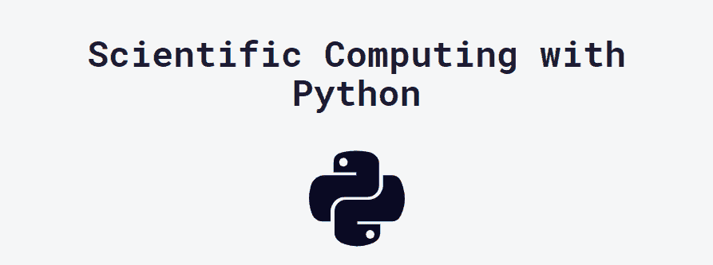

Highly recommend this one from freeCodeCamp!** 

**你不需要 100%理解语言是如何工作的。每次通过本课程，花一点时间完善你所选择的编程语言的知识，这样学习将是迭代的。**

**就我的学习计划而言，freeCodeCamp 课程可以达到目的。**

## **步骤 3:从上到下学习库**

**我经常在机器学习课程中看到的一件事是，他们在学习了 ML 的基础知识后，开始从头实现一些算法。**

**虽然我相信这本身是一个很好的项目，但我不认为这应该是你学习机器学习道路上早期的主要焦点。**

**主要原因是几乎没有人从零开始实现算法，除了开发人员正在使用的软件包。即使这样，他们也经常依赖线性代数专家制作的其他软件包来完成许多低级工作。**

**所有这些都表明，尽管深刻理解兜帽下的事情是如何运作的是一个积极的方面，但我不认为这应该是一个早期目标。**

**在这一点上，我强烈建议学习你所选择的编程语言的最高水平的库，这将使你得到最终的结果。学习如何充分利用这个超高层次的包来制作一些有用的东西。**

**你肯定不明白为什么有些东西在这一点上有效或者无效，但是这没什么大不了的。**

**重要的是能够使用专家们日常使用的工具。一旦你理解了高级库在做什么，你就应该继续学习低一点的。**

**但是，请确保您不要太深入地学习这个库(如果您在阅读 Fortran 时处于 [LAPACK](http://www.netlib.org/lapack/) 的水平，那么您已经走得太远了！！).**

**对于我的项目，我需要学习的主要库是 Pytorch 或其更高级别的包装器，所以 fast.ai 的实用课程可以解决这个问题。**

## **第四步:最多一个月做一个你热爱的项目**

**现在到了最需要学习的实际部分。在这一点上，你应该有最起码的知识来把一个没有多大用处的项目拼凑起来。**

**注意——如果你完全有信心进入你正在计划的项目，那么你在第 0 步到第 3 步的进展还不够快。**

**想一想你感兴趣的领域中你真正想要创造和发展的东西。不过，不要对这个项目太投入，因为它最多需要 1 周到 1 个月的时间来完成。**

**在你的日历中加入通知日期。有一个有时间限制的项目既有动力又有足够的压力让你完成它。**

**这里的想法是在一个小项目上进行足够的努力，以了解你的主要知识差距在哪里，并体验一个真正的机器学习开发者所经历的事情。**

**通过不受课程或书本束缚的自由形式，你将能够完成一个 ML 项目的实际部分，这些部分是很难的:**

*   **计划、确定范围并跟踪您的 ML 项目的进展**
*   **在线阅读关于库的文档**
*   **阅读 StackOverflow，GitHub threads，一个随机工程师的博客帖子和关于那个 bug 的神秘帮助论坛👺。**
*   **以次优的方式构建您的项目，并随着时间的推移对其进行改进。**
*   **调试过拟合、欠拟合和泛化问题。**

**要挑选一个你感兴趣的项目，我建议做以下三个小练习:**

*   **深入思考你目前对什么感兴趣**
*   **查看项目想法列表**
*   **看一看开放数据集**

**通过混合做这三件事，你将能够形成更多关于什么是可能的背景。你也可以混合搭配你的兴趣，做一些真正属于你自己的东西。**

**Github 上的这个[列表应该是一个很好的地方来获得一些关于要做的迷你项目的灵感。然后你可以将它与](https://github.com/ashishpatel26/500-AI-Machine-learning-Deep-learning-Computer-vision-NLP-Projects-with-code)[谷歌数据集搜索引擎](https://datasetsearch.research.google.com/)结合起来，以便找到一些与你的项目相匹配的数据。**

**⚠️不要低估数据的重要性。⚠️
即使你有非常好的想法，如果没有可用的数据，也会严重阻碍你的进步。**

**出于我的兴趣，我发现了这个关于一家[矿业公司的全球供应链](https://figshare.com/articles/dataset/Mining_Company_s_Global_Supply_Chain_Logistics_Data_for_a_Medium_Size_Excavator_Extended_Dataset/2749120/1)的整洁数据集，其中有足够的数据来从中做出一些东西。我的项目是将数据建模为图形，并使用图形神经网络来推断挖掘机的销售价格，这是该数据集的中心主题。**

## **第五步:找出你知识中的一个缺口，并了解它**

**在这一点上，你已经花了一些时间来精心设计你的项目，你实际上对你已经取得的进展印象深刻。不过，这可能与你的想法相去甚远，而且你在前进的道路上已经遇到了无数的问题。**

**现在，你意识到你实际上知道的是多么少，你的知识中有一些部分确实需要修补。**

**

You rejoicing in your newfound ignorance! Congrats 👏 : Photo by [Daniel Joshua](https://unsplash.com/@daniel_joshua_?utm_source=ghost&utm_medium=referral&utm_campaign=api-credit) / [Unsplash](https://unsplash.com/?utm_source=ghost&utm_medium=referral&utm_campaign=api-credit)** 

**这太棒了！列出你在这个过程中看到的所有差距，并按照你估计的优先顺序排列。这可能对你来说很难，因为在这一点上一切看起来都很重要。但是做一个有意识地决定下一步学什么的练习几乎和学习本身一样有价值。**

**现在奇怪的部分来了:从你的清单中排除一切，只学习最重要的知识。**

**我说的消除，是认真的。删除第一条以外的所有内容。当你在这个循环中再做一遍时，你对下一步要学什么的估计将会是错误的，你将会错过你不知道的其他更重要的知识。**

**现在你只剩下一项需要学习，给自己 1 天到 1 周的时间来学习这个特定的主题。这可能看起来很短，但你真正想要的是在知识上有足够的深度，以便在下一轮学习中发挥作用。**

**

Study that one little bit of knowledge very hard for a short period of time: Photo by [Green Chameleon](https://unsplash.com/@craftedbygc?utm_source=ghost&utm_medium=referral&utm_campaign=api-credit) / [Unsplash](https://unsplash.com/?utm_source=ghost&utm_medium=referral&utm_campaign=api-credit)** 

**实际上，可能发生的情况是，当你深入这个主题时，你会注意到它是如何与其他重要的主题联系在一起的(比如概率、统计，甚至是被上帝抛弃的线性代数)。**

**仔细看看这些链接，如果你喜欢就跟随它们，并强化你的机器学习心智模型，以便使它更加准确。**

## **第六步:重复第 0 步到第 5 步**

**你第一次通过这条管道最多也就一般。但是你将会在很短的时间内学到比自下而上的方法更多的东西。**

**通过这种方法，您将获得的价值会随着管道的每一次通过而迅速增加。每一轮都会更容易，你会对场地有更清晰的了解。**

**这种方法是基于我在我的[初创公司](https://axya.co/en/)成功应用的精益方法。对你正在优化的主题进行多次迭代是达到目标的最快方法。**

**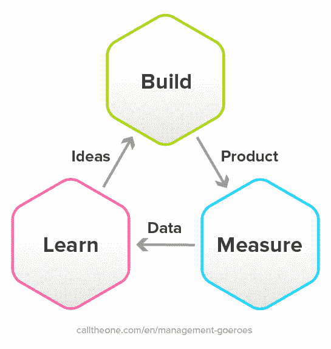

Three step lean cycle, image taken from [here](https://www.calltheone.com/en/consultants/build-measure-learn-cycle-lean-startup).** 

**在一年内，你可能能够通过这条管道堆叠 12 个通道，这意味着 12 个机器学习项目和对该领域的实际理解。**

**这种方法会让你们两个都非常容易被雇佣，并且会给你提升自己所需要的工具，完全靠你自己。**

**另外，对于已经熟悉机器学习的人来说，**这是梯度下降**。通过在你的无知的成本平面上做一些小的步骤，你实际上是在“学习机器学习”问题上做梯度下降。**

**你甚至在做梯度下降的变体，它在成本平面上向前看，能够慢下来(在一个项目或学习概念上花更多的时间)或加快速度(当主题与你的理解不相关时跳过)。简单地说，这就是[内斯特罗夫加速梯度](https://youtu.be/6FrBXv9OcqE)😄(lol 抱歉那个位)！**

**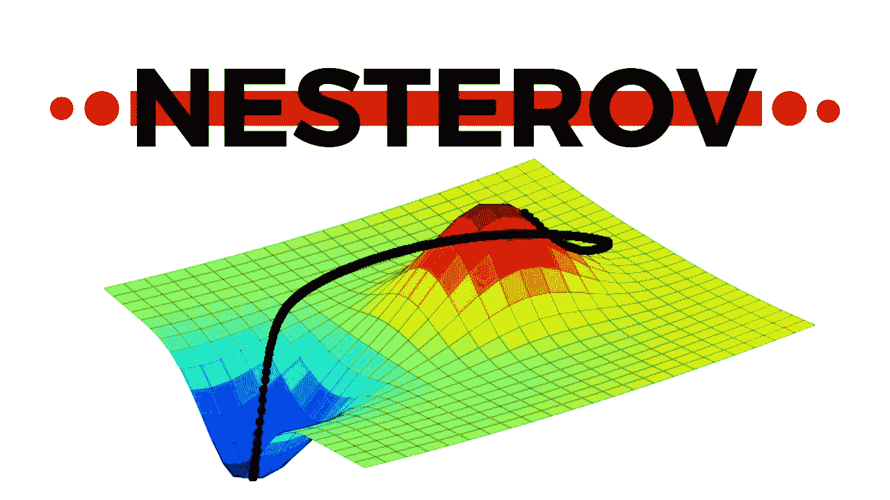

This is you in your cost plane of machine learning ignorance going waaaaaay down.** 

## **总结和结论**

**总之，您应该:**

1.  **弄清楚 ML 字段是什么样子的，并在脑海中画出它的地图。**
2.  **找到一个你想做的很酷的项目并研究它。**
3.  **学习所需的编程语言。**
4.  **学习足够多的库，以便能够做一些有用的事情。**
5.  **做一个项目【1 周，1 个月】。**
6.  **了解一件你认为自己知识差距很大的事情。**
7.  **并重申！**

**我希望这是有用的，如果你对这个过程有强烈的意见，不要犹豫，通过 LinkedIn 联系我。此外，如果你想了解更多关于特定机器学习主题的信息，可以看看我的 [Youtube 频道](https://www.youtube.com/channel/UCts-XMcexTiPSR8QbyRGFxA)。**

**祝你过得愉快👋**

# **有用的机器学习资源**

**在这一部分，我将分享我推荐给想要开始学习的人的一系列学习资源。这不是一个详尽的列表，但对于想要获得机器学习的良好第一心理模型的人来说，这将是一个很好的起点。**

## **机器学习书籍**

### **统计学习的要素。**

**机器学习界的经典，强烈推荐花时间反复看这本书。**

**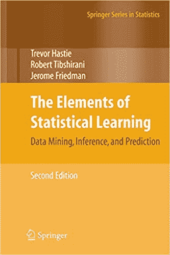

Great introductory book!** 

### **人工智能，现代方法(第三版)**

**这将让你对人工智能的更广泛领域有一个很好的概述，这不一定包括机器学习。**

**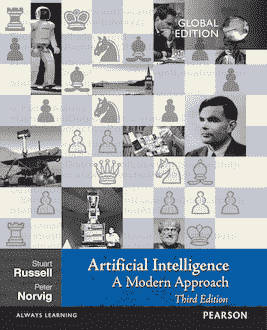

This book ties the whole AI/ML/DL field together quite nicely** 

### **深度学习的书**

**深度学习领域的大经典，如果你有一些线性代数的背景(开头有一本入门书)，这是一本令人惊讶的非常平易近人的书。**

**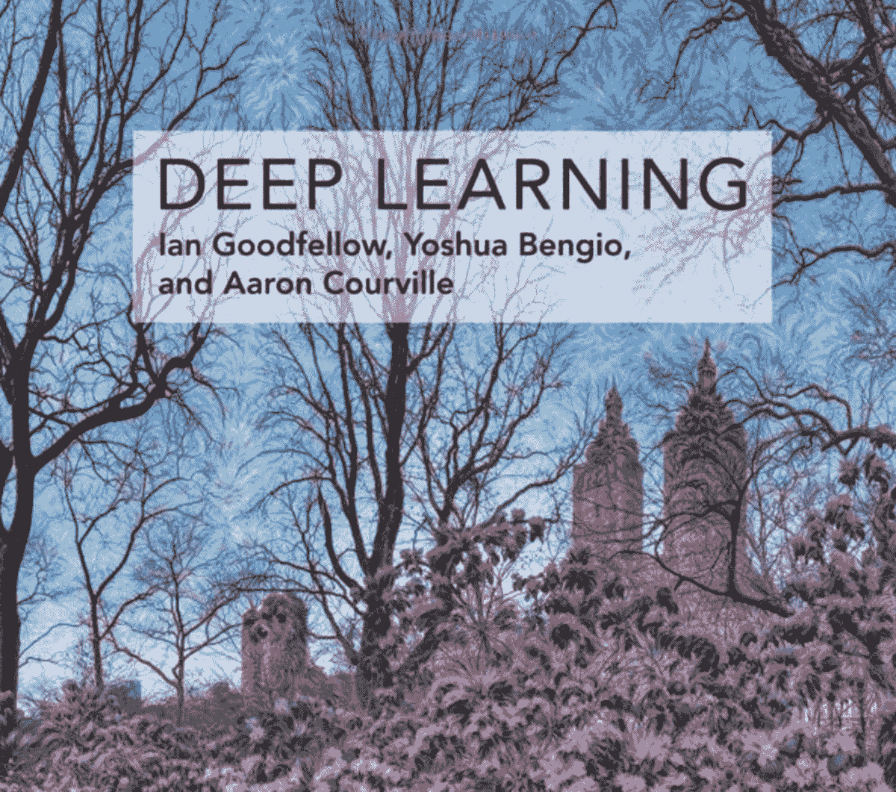

The cover is very neat as it was generated by a Deep Neural Network** 

### **Python 数据科学手册:处理数据的基本工具**

**非常棒的书，可以提升你在熊猫和熊猫方面的数据科学技能。这将使您的代码更加紧凑、高效和易读。**

**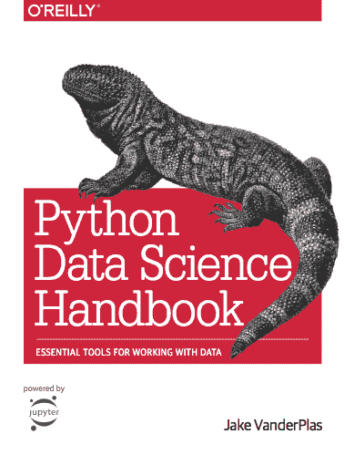

Keep it close to your desk and do the exercises** 

### **使用 Scikit-Learn、Keras 和 TensorFlow 进行机器实践学习:构建智能系统的概念、工具和技术**

**如果你有一本书要看，那就是这本书。非常彻底，动手能力强。**

**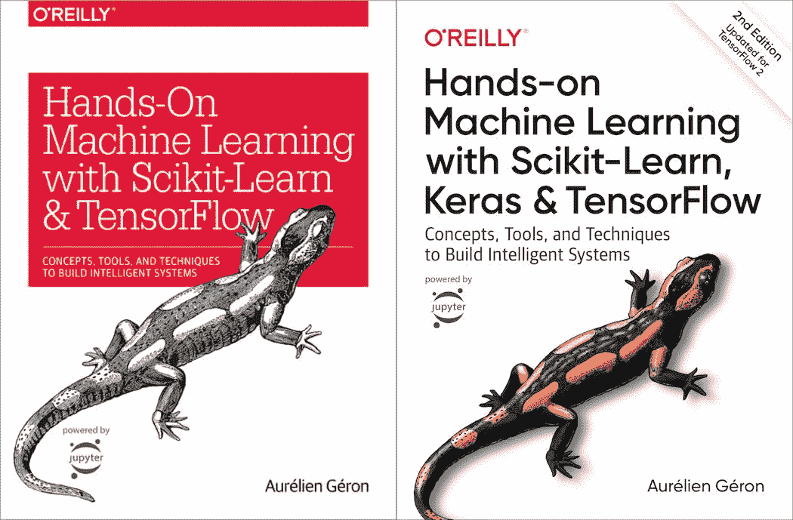

Take either the HD lizard or the grayscale one, both are very solid!** 

### **使用 Pytorch 进行深度学习**

**我喜欢这本书，因为你可以从 Pytorch 的作者那里直接了解他们的哲学(里面有一些我很乐意看到的简洁的神经科学例子)。**

**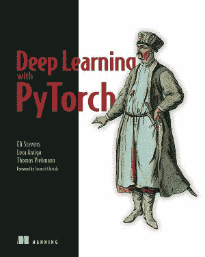

The visuals for this one are very well done, especially the tensors part.** 

## **机器学习博客**

### **机器学习掌握**

**如果你最终在谷歌上搜索了一个项目的很多东西(像任何人一样)，你会反复出现在这篇博文中。**

**它写得很好，这个人能够从 ML 相关主题的网站中获得的 SEO 是非常惊人的。**

### **分析 Vidhya**

**你最有可能在谷歌搜索上找到的第二个博客是这个， [analyticsvidhya](https://www.analyticsvidhya.com) 。它可能看起来比前一个更垃圾，但仍然有很多很好的内容。**

### **蒸馏**

**非常简洁视觉丰富的*期刊*机器学习主题:[distilt . pub](https://distill.pub/)**

**看起来他们要休息一年，因为整个团队都筋疲力尽了，但是仍然有高质量的 ML 内容。**

## **机器学习社区**

### **r/机器学习**

**[伟大的社区](https://www.reddit.com/r/MachineLearning/)获取机器学习的最新发展和/或获取 ML 社区的最新动态。**

**它分享高质量的内容，通过在那里潜伏一段时间，你会了解到该领域其他人的想法。**

**它也能产生很好的学习瑰宝，比如[这个](https://www.reddit.com/r/MachineLearning/comments/5z8110/d_a_super_harsh_guide_to_machine_learning/):**

**

This is very blunt, but still relevant.** 

### **r/learn 机器学习**

**这是一个[优秀的社区，供新人](https://www.reddit.com/r/learnmachinelearning/)提问，发布你的项目，或者从其他人的工作中获得一些灵感。**

## **机器学习事件**

### **蒙特利尔人工智能和神经科学会议**

**我在这里有偏见，因为这是一个加入了我的两个兴趣的会议:神经科学和机器学习: [2020 链接](https://www.main2020.org/) & [Youtube 视频](https://www.youtube.com/channel/UCddp3o-ctW8rmYtfdDfVUkA)**

**此外，由于它是在蒙特利尔举办的，而我就住在附近，我通常可以去那里看看计算神经科学的最新进展。**

### **神经信息处理系统会议**

**这个是关于神经网络的[神话机器学习会议](https://nips.cc/)。**

**近年来，它变得过于拥挤，以至于它的实用性受到了质疑。尽管如此，如果你不能参加，检查被接受的研究人员的工作是一个好主意。**

**还有很多其他的,为了看到真正前沿的研究，不时参加会议是个好主意。这可能有点让人不知所措，但这是一次很好的学习经历。**

## **在线机器学习课程**

### **快速人工智能**

**如果我有一门在线课程可以推荐的话，那就是 FastAI 的这门课。**

**它实际上体现了我在这篇博文中提到的务实、直接行动的方法+老师非常有趣。**

### **吴恩达·ML(当然)**

**如果我有第二个建议，我会选择吴恩达的机器学习课程。**

### **freeCodeCamp 的机器学习和数据分析 YouTube 课程**

**freeCodeCamp 在他们的 YouTube 频道上有一堆很棒的机器学习和数据分析课程，比如:**

*   **[用于生物信息学的 Python](https://www.freecodecamp.org/news/python-for-bioinformatics-use-machine-learning-and-data-analysis-for-drug-discovery/)**
*   **[Python 和 scikit-学习速成班](https://www.freecodecamp.org/news/learn-scikit-learn/)**
*   **[潜入深度学习](https://www.freecodecamp.org/news/learn-deep-learning-from-the-president-of-kaggle/)**
*   **[如何用 Python、Pandas、NumPy 分析数据](https://www.freecodecamp.org/news/how-to-analyze-data-with-python-pandas/)**
*   **[用 PyTorch 进行深度学习](https://www.freecodecamp.org/news/free-deep-learning-with-pytorch-live-course/)**
*   **当然，还有查克博士为大家带来的[Python](https://www.freecodecamp.org/news/python-for-everybody/)**

**还有更多的信息来源于此——只需前往 freeCodeCamp 的 YouTube 频道，搜索您想要学习的内容。**