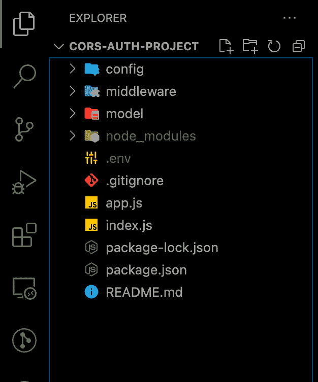
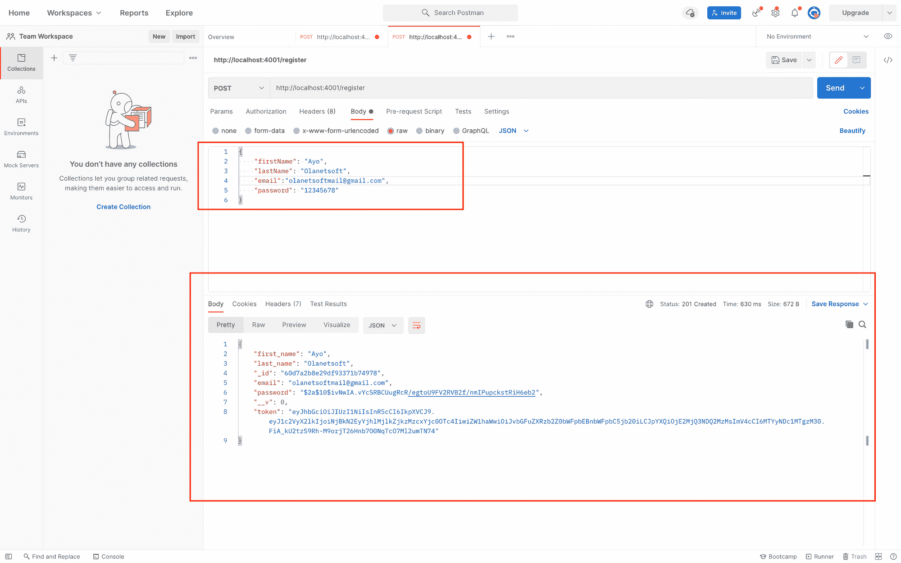
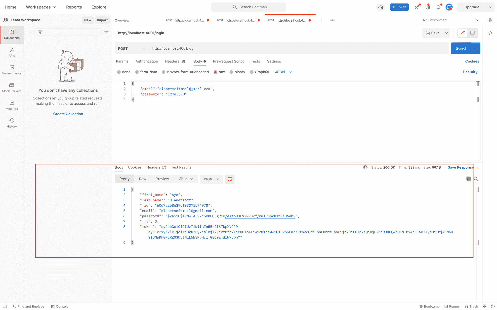
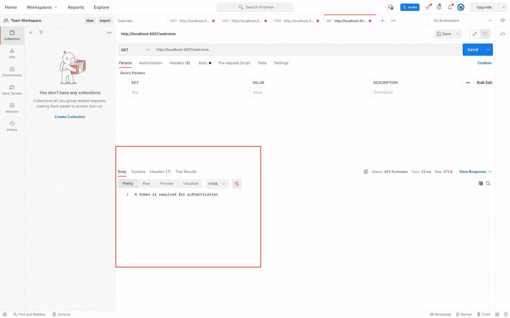
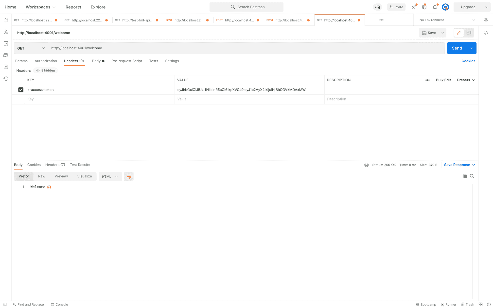

# 如何在 Node.js 应用程序中验证用户和实现 CORS

> 原文：<https://www.freecodecamp.org/news/how-to-authenticate-users-and-implement-cors-in-nodejs-applications/>

在本教程中，您将了解如何在 Node.js 中验证用户和保护端点。您还将了解如何在 Node 中实现跨源资源共享(CORS)。所以让我们开始吧。

### 先决条件

您需要遵循本教程的以下内容:

*   对 JavaScript 的实用理解。
*   很好的理解 Node.js。
*   MongoDB 或您选择的其他数据库的工作知识。
*   [Postman](https://www.postman.com/) 以及对其工作原理的基本了解。

在我们进入文章的主要部分之前，让我们定义一些术语，这样我们就在同一页上了。

## 什么是认证？

身份验证和授权似乎是一回事。但是进入一所房子(认证)和一旦你在那里你能做什么(授权)是有很大区别的。

身份验证是通过获取凭据并使用这些凭据验证用户身份来确认用户身份的过程。如果证书有效，授权过程开始。

您可能已经熟悉了身份验证过程，因为我们每天都要经历这个过程——无论是在工作中(登录到您的计算机)还是在家里(密码或登录到网站)。事实上，大多数连接到互联网的“东西”都需要你提供凭据来证明你的身份。

## 什么是授权？

授权是通过验证经过身份验证的用户是否具有系统访问权限来授予他们访问资源的权限的过程。它还允许您通过向经过身份验证的用户授予或拒绝特定的许可证来限制访问权限。

在系统验证您的身份后，将进行授权，为您提供对信息、文件、数据库、财务、位置等资源的完全访问权限。

这种批准会影响您访问系统的能力和范围。

## 什么是跨源资源共享(CORS)？

> [CORS](https://developer.mozilla.org/en-US/docs/Web/HTTP/CORS) 是一个基于 HTTP 头的系统，它允许服务器指定任何其他来源(域、方案或端口),浏览器可以从这些来源加载自己以外的资源。

CORS 还使用了一种系统，在该系统中，浏览器向托管跨源帮助的服务器发送“预检”请求，以确保它将允许实际的请求。

我们将使用 JSON web token 标准来表示双方之间的声明

## 什么是 JSON Web 令牌(JWT)？

> JSON Web 令牌(JWT)是由 RFC 7519 定义的开放行业标准，用于表示双方之间的声明。 [jwt.io](https://jwt.io/introduction)

例如，您可以使用 [jwt.io](https://jwt.io) 来解码、验证和创建 jwt。

JWT 定义了一种简洁的、自包含的双方交换信息的方式，称为 JSON 对象。您可以查看和信任此信息，因为它是经过签名的。

jwt 可以用一个秘密(使用 HMAC 算法)或来自 RSA 或 ECDSA 的公钥/私钥对进行签名。我们稍后会看到一些如何使用它们的例子。

让我们开始吧。

## 如何在 Node.js 开发中使用令牌进行身份验证

要开始，首先我们需要设置我们的项目。

导航到计算机上您选择的目录，并在终端中打开它以启动 Visual Studio 代码。

然后执行:

```
code. 
```

> **注意**:如果你的电脑上没有安装 Visual Studio 代码，`code .`就无法工作。在尝试这个命令之前，请确保您已经安装了它。

### 如何创建目录并使用`npm`进行设置

通过键入以下命令创建一个目录并初始化`npm`:

*   在 Windows power shell 中:

```
mkdir cors-auth-project

cd cors-auth-project

npm init -y 
```

*   在 Linux 中:

```
mkdir cors-auth-project

cd cors-auth-project

npm init -y 
```

### 如何创建文件和目录

在上一步中，我们用命令`npm init -y`初始化了 npm，这会自动创建一个 package.json 文件。

我们将使用下面的命令创建`model`、`middleware`和`config`目录及其文件，例如`user.js`、`auth.js`、`database.js`。

```
mkdir model middleware config

touch config/database.js middleware/auth.js model/user.js 
```

我们现在可以用这个命令在项目的根目录中创建`index.js`和`app.js`文件:

```
touch app.js index.js 
```

这将为我们提供如下所示的文件夹结构:



### 如何安装依赖项

我们将安装几个依赖项，如`mongoose`、`jsonwebtoken`、`express`、`dotenv`、`bcryptjs`、`cors`和开发依赖项，如`nodemon`，以便在我们自动进行更改时重启服务器。

因为我将在这个项目中使用 MongoDB，所以我们将安装 Mongoose，并根据我们数据库中的信息检查用户凭证。因此，整个认证过程并不局限于我们将在本教程中使用的数据库。

```
npm install  cors mongoose express jsonwebtoken dotenv bcryptjs 

npm install nodemon -D 
```

### 如何创建 Node.js 服务器并连接数据库

现在，将下面的代码片段依次添加到您的`app.js`、`index.js`、`database.js`和`.env`文件中，以建立我们的 Node.js 服务器并连接我们的数据库。

在我们的`database.js.`:

`config/database.js`:

```
const mongoose = require("mongoose");

const { MONGO_URI } = process.env;

exports.connect = () => {
  // Connecting to the database
  mongoose
    .connect(MONGO_URI, {
      useNewUrlParser: true,
      useUnifiedTopology: true,
      useCreateIndex: true,
      useFindAndModify: false,
    })
    .then(() => {
      console.log("Successfully connected to database");
    })
    .catch((error) => {
      console.log("database connection failed. exiting now...");
      console.error(error);
      process.exit(1);
    });
}; 
```

在我们的`app.js`:

`auth-cors-project/app.js`

```
require("dotenv").config();
require("./config/database").connect();
const express = require("express");

const app = express();

app.use(express.json());

// Logic goes here

module.exports = app; 
```

在我们的`index.js`:

`auth-cors-project/index.js`

```
const http = require("http");
const app = require("./app");
const server = http.createServer(app);

const { API_PORT } = process.env;
const port = process.env.PORT || API_PORT;

// server listening 
server.listen(port, () => {
  console.log(`Server running on port ${port}`);
}); 
```

如您所见，我们的文件需要各种环境变量。如果还没有，在运行应用程序之前，创建一个新的`.env`文件并添加变量。

在我们的`.env.`:

```
API_PORT=4001

MONGO_URI= // Your database URI 
```

编辑我们的`package.json`中的脚本对象，使其看起来像下面这样，以启动我们的服务器。

```
"scripts": {
    "start": "node index.js",
    "dev": "nodemon index.js",
    "test": "echo \"Error: no test specified\" && exit 1"
  } 
```

我们成功地将上面的片段插入到文件`app.js`、`index.js`和`database.js`中。因此，我们首先在`index.js`中创建 Node.js 服务器，然后导入已经配置了路由的`app.js`文件。

然后，在 database.js 中，我们使用 Mongoose 建立了一个数据库连接。

`npm run dev`是启动我们应用程序的命令。

只要它们没有崩溃，服务器和数据库都应该启动并运行。

### 如何创建用户模型和路线

首次注册后，我们将为用户详细信息建立模式。然后，当登录时，我们将根据记住的凭据检查它们。

在模型文件夹中，将以下代码片段添加到`user.js`:

`model/user.js`

```
const mongoose = require("mongoose");

const userSchema = new mongoose.Schema({
  first_name: { type: String, default: null },
  last_name: { type: String, default: null },
  email: { type: String, unique: true },
  password: { type: String },
  token: { type: String },
});

module.exports = mongoose.model("user", userSchema); 
```

现在让我们分别为`register`和`login`创建路线。

在根目录下的`app.js`中，添加以下用于注册和登录的代码片段。

`app.js`

```
// importing user context
const User = require("./model/user");

// Register
app.post("/register", (req, res) => {
// our register logic goes here...
});

// Login
app.post("/login", (req, res) => {
// our login logic goes here
}); 
```

### 如何实现注册和登录功能

我们将在应用程序中实现这两条路线。在将凭证存储到我们的数据库之前，我们将使用 JWT 对它们进行签名，并使用`bycrypt`对它们进行加密。

我们将:

*   从`/register`路线获取用户输入。
*   验证用户的输入。
*   检查用户是否已经创建。
*   通过加密来保护用户的密码。
*   在我们的数据库中创建一个用户帐户。
*   最后，构造一个经过签名的 JWT 令牌。

修改我们之前创建的`/register`路由结构，如下所示:

`app.js`

```
// ...

app.post("/register", async (req, res) => {

  // Our register logic starts here
   try {
    // Get user input
    const { firstName, lastName, email, password } = req.body;

    // Validate user input
    if (!(email && password && firstName && lastName)) {
      res.status(400).send("All input is required");
    }

    // check if user already exist
    // Validate if user exist in our database
    const oldUser = await User.findOne({ email });

    if (oldUser) {
      return res.status(409).send("User Already Exist. Please Login");
    }

    //Encrypt user password
    encryptedUserPassword = await bcrypt.hash(password, 10);

    // Create user in our database
    const user = await User.create({
      first_name: firstName,
      last_name: lastName,
      email: email.toLowerCase(), // sanitize
      password: encryptedUserPassword,
    });

    // Create token
    const token = jwt.sign(
      { user_id: user._id, email },
      process.env.TOKEN_KEY,
      {
        expiresIn: "5h",
      }
    );
    // save user token
    user.token = token;

    // return new user
    res.status(201).json(user);
  } catch (err) {
    console.log(err);
  }
  // Our register logic ends here
});

// ... 
```

> **注意:**用一个`TOKEN_KEY`更新你的`.env`文件，它可以是一个随机的字符串。

使用 Postman 测试端点，在成功注册后，我们将得到如下所示的响应。



我们将:

*   获取用户对`/login`路线的输入。
*   验证用户的输入。
*   检查用户是否是真实的。
*   将用户的密码与我们之前保存在数据库中的密码进行比较。
*   最后，构造一个经过签名的 JWT 令牌。

让我们之前定义的`/login`路由结构看起来像这样:

```
// ...

app.post("/login", async (req, res) => {

  // Our login logic starts here
   try {
    // Get user input
    const { email, password } = req.body;

    // Validate user input
    if (!(email && password)) {
      res.status(400).send("All input is required");
    }
    // Validate if user exist in our database
    const user = await User.findOne({ email });

    if (user && (await bcrypt.compare(password, user.password))) {
      // Create token
      const token = jwt.sign(
        { user_id: user._id, email },
        process.env.TOKEN_KEY,
        {
          expiresIn: "5h",
        }
      );

      // save user token
      user.token = token;

      // user
      return res.status(200).json(user);
    }
    return res.status(400).send("Invalid Credentials");

  // Our login logic ends here
});

// ... 
```

使用 Postman 进行测试，在成功登录后，我们将得到如下所示的响应。



### 如何创建用于身份验证的中间件

我们现在可以成功创建和登录用户了。现在，我们将建立一个在报头中需要用户令牌的路由，这将是我们之前创建的 JWT 令牌。

在`auth.js`中添加以下代码片段:

`middleware/auth.js`

```
const jwt = require("jsonwebtoken");

const config = process.env;

const verifyToken = (req, res, next) => {
  const token =
    req.body.token || req.query.token || req.headers["x-access-token"];

  if (!token) {
    return res.status(403).send("A token is required for authentication");
  }
  try {
    const decoded = jwt.verify(token, config.TOKEN_KEY);
    req.user = decoded;
  } catch (err) {
    return res.status(401).send("Invalid Token");
  }
  return next();
};

module.exports = verifyToken; 
```

为了测试中间件，创建`/welcome`路由，并使用以下代码编辑 app.js:

`app.js`

```
const auth = require("./middleware/auth");

app.post("/welcome", auth, (req, res) => {
  res.status(200).send("Welcome to FreeCodeCamp 🙌");
}); 
```

当我们尝试访问我们刚刚构建的/welcome 路由，而没有在头中发送带有 x-access-token 密钥的令牌时，我们得到以下响应:



我们现在可以通过在头中添加一个带有密钥 x-access-token 的令牌来重新测试。

这是您将得到的回应:



## 如何实现跨产地资源共享(CORS)

[CORS](https://www.npmjs.com/package/cors) 是一个 Node.js 包，它提供了一个连接/快速中间件。用于启用带有各种参数的 CORS。

1.  它易于使用(启用所有 CORS 请求)

将下面的代码片段添加到`app.js`允许我们将 CORS 添加到我们的应用程序中，并启用所有 CORS 请求。

```
// ...

const cors = require("cors") //Newly added
const app = express();

app.use(cors()) // Newly added

app.use(express.json({ limit: "50mb" }));

// ... 
```

2.  您可以为单条路由启用 CORS

以`/welcome`路线为例，您可以通过在`app.js.`中添加以下代码片段来激活应用程序中单个路线的 CORS:

```
app.get('/welcome', cors(), auth, (req, res) => {
  res.status(200).send("Welcome to FreeCodeCamp 🙌 ");
}); 
```

3.  如何配置 CORS

我们可以通过添加参数来配置 CORS 包中的选项，如下所示:

```
// ...

const corsOptions = {
  origin: 'http://example.com',
  optionsSuccessStatus: 200 // for some legacy browsers
}

app.get('/welcome', cors(corsOptions), auth, (req, res) => {
  res.status(200).send("Welcome to FreeCodeCamp 🙌 ");
});

// ... 
```

你可以查看 [NPM CORS 包](https://www.npmjs.com/package/cors)阅读更多关于跨原产地资源共享。

你可以[点击这里](https://github.com/Olanetsoft/auth-cors-demo)查看 GitHub 上的完整代码。

## 结论

在本文中，我们学习了 JWT、认证、授权和 CORS。我们还学习了如何在 Node.js 中创建一个使用 JWT 令牌进行身份验证的 API。

感谢您的阅读！