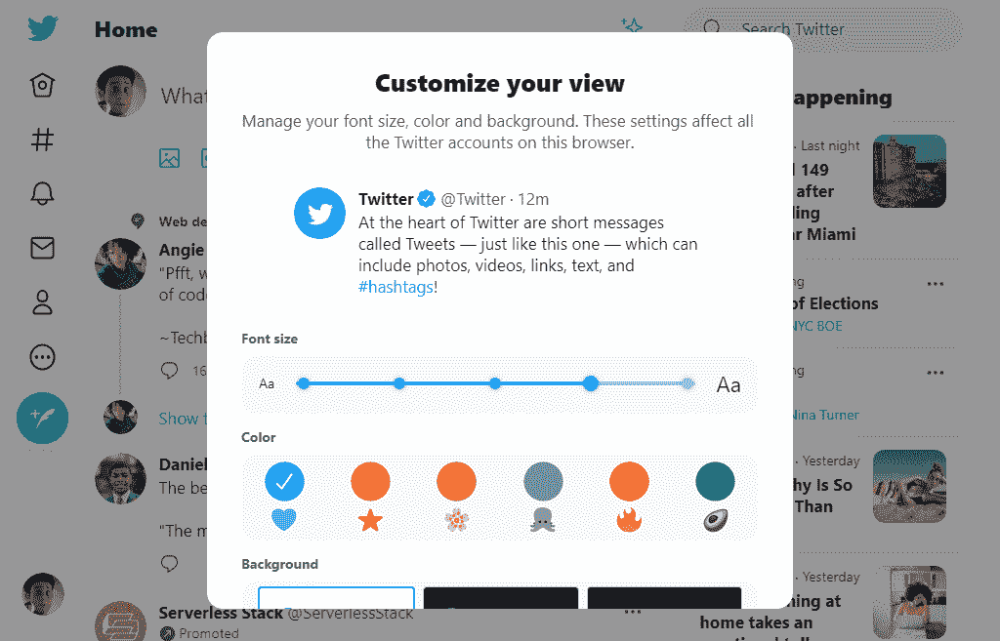
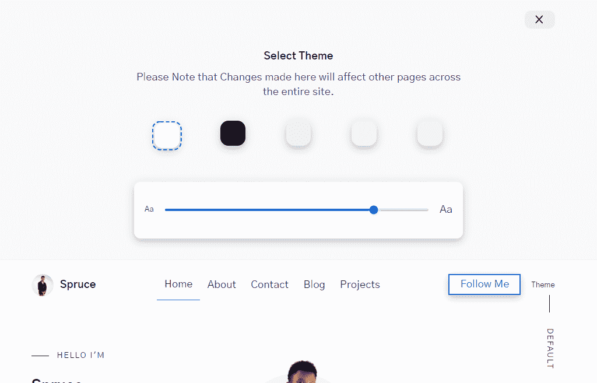

# 什么是网站主题化？如何使用 CSS 自定义属性和 Gatsby.js 自定义您的站点

> 原文：<https://www.freecodecamp.org/news/website-theming-with-css-custom-properties-and-gatsbyjs/>

在这篇文章中，我将向你展示如何为你的网站设置主题，这样用户就可以根据自己的喜好定制某些元素。

我们将讨论网站主题，主题是如何工作的，我们将以一个演示来结束，这样你就可以看到它的作用了。让我们开始吧。

## 目录:

*   什么是网站主题？
    什么是主题化？
*   为什么你应该关心主题化？
    “这是他们的屏幕、机器和软件”
    主题化增加可读性
    所有酷猫都在用——在野外主题化
*   [如何使用主题属性](#How-to-Use-Theme-Properties)
    什么是主题属性？
    什么是 CSS 自定义属性？
    如何在 Gatsby.js 中设置主题属性
    如何存储主题属性
    如何将主题属性转化为 CSS 自定义属性
*   [如何使用主题切换器组件](#How-to-Use-the-Theme-Switcher-Component)
    标记
    如何设置状态
    如何更新状态
    如何将状态持久化到`LocalStorage`
*   [结论](#conclusion)

## 这篇文章是写给谁的？

本文面向已经对 CSS、React 和 Gatsby 有基本了解的开发人员，他们希望学习如何创建一个支持用户主题的 Gatsby 或 React 应用程序。

到本文结束时，您应该理解主题化是如何工作的，以及如何在您的 Gatsby 站点上实现主题化。

## 什么是主题？

为了理解什么是网站主题化，我们先来看看什么是**网站主题**以及什么构成了一个主题。

网站环境中的主题是网站的整体外观、感觉和风格。主题可能包括:

*   字体
*   字体大小
*   配色方案
*   布局
*   美学

主题控制着网站的设计。它决定了你的网站从表面看起来是什么样子，是你的网站对你的用户有直接影响的部分。

一个主题也是一个网站所穿的一套风格。

## 什么是主题化？

主题对于网站就像衣服对于我们的身体一样。想象一下，穿着同样的衣服去参加会议、婚礼和农场，听起来很滑稽，对吗？当然，如果你有选择的话，你可能不会这么做。

在每一个场合，你都应该穿合适类型或风格的衣服。这就是网站主题化——它允许我们的用户选择我们网站的外观和感觉，有一套基于不同场合的风格。

主题化只是让用户能够定制我们的网站和应用程序。你也可以把主题化看作是用户根据自己的选择对我们的网站或应用程序进行的一系列定制。

当用户能够告诉你的网站他们喜欢看什么时，主题化就发生了，例如:

*   点按按钮以将网站的背景更改为红色或黑色
*   增加或减少网站/应用程序的字体大小
*   单击按钮删除与用户无关的内容。

给你一个建议:让或要求你的用户从零开始决定你的网站主题是一个坏主意。你或你的团队应该为用户提供一个可访问的和可用的默认主题，因为在大多数情况下，许多用户永远不会在你的网站上定制“他们的视图”,不管它有多简单。|

## 为什么你应该关心网站主题？

除了让用户知道你关心他们的个人喜好，还有其他原因让你的用户为你的网站设计主题。其中一些包括:

### “这是他们的屏幕、机器和软件”

这是引用自 Jakob Nielsen 2002 年的文章:[让用户控制字体大小](https://www.nngroup.com/articles/let-users-control-font-size/)。

事实上，你的网站运行在用户的屏幕、机器和软件上(也可能耗尽他们的电池),这足以让他们在你的网站上定制他们的体验。

### 主题化提高了网站的可读性

引用 D. Bnonn 的文章: [16 像素字体大小:用于正文。任何不足都是代价高昂的错误](https://www.smashingmagazine.com/2011/10/16-pixels-body-copy-anything-less-costly-mistake/)

> 事实:大多数网络用户讨厌“正常”的字体大小。

考虑到这一点，主题化可以帮助读者选择最适合他们眼睛的字体大小。

哦，这是同一篇文章中的另一段引文。

> 读者数量=收入。

### 所有酷猫都在使用它——在野外主题化

许多开发者已经使用主题化的想法来创建他们网站的黑暗模式版本。其他人进一步发展了这种想法，允许用户根据个人喜好改变字体大小、颜色和背景。

下面是 Twitter web 应用程序中这种定制的一个例子:



Twitter customize theme UI

仍然没有动力吗？如果你还需要更多的证据来证明主题化是一个好主意，[这里有一个使用主题化为用户提供黑暗和光明模式的网站、应用和软件的完整列表。](https://darkmodelist.com/)

## 如何使用主题属性

现在你知道了什么是主题化，并且已经看到了在他们的网站和应用程序中使用主题化的站点，让我们学习什么是主题属性。

### 什么是主题属性？

主题属性是构成主题的一组 CSS 自定义属性。记住“一个主题是一个网站所采用的一套风格”——所以主题属性是构成一个网站所采用的风格的所有属性。例如:

```
[data-theme="default"] {
  --font-size: 20px;
  --background: red;
} 
```

在上面的例子中，`[data-theme="default"]`是我们的主题，而里面所有的 CSS 自定义属性都是主题属性。你明白了，对吧？

这里有一个提示:你的主题属性不必仅仅是 CSS 自定义属性。它们也可以是您想要应用于特定主题的任何有效的 CSS 属性。

在我们继续之前，让我们首先了解什么是 CSS 自定义属性

### 什么是 CSS 自定义属性(也称为 CSS 变量)？

CSS 自定义属性是保存可以在整个站点或文档中重用的值的实体。

出于本教程的考虑，我们不打算深入讨论 CSS 自定义属性。您可以[在这里](https://www.freecodecamp.org/news/css-customs-properties-cheatsheet-c86778541f7d/)阅读更多关于自定义属性的信息。

还有很多很棒的教程介绍 CSS 自定义属性以及如何使用它们进行主题化，所以我们将把理论留给其他文章。

关于如何使用 CSS 自定义属性进行主题化的策略指南，请看这篇很棒的文章:[CSS 自定义属性策略指南](https://www.smashingmagazine.com/2018/05/css-custom-properties-strategy-guide/)。

虽然我们没有深入讨论 CSS 自定义属性，但我想指出 CSS 自定义属性非常适合网站主题化的几个原因:

*   它们是可重用的——你可以在你的 CSS 中使用它们
*   它们降低了代码的复杂性，因为您不再需要创建不同的样式表来实现主题化的网站
*   它们在运行时可用，这意味着您可以通过 JavaScript 在浏览器中更新它们的值，并立即得到结果。

## 如何在 Gatsby.js 中设置主题属性

当然，你可以像其他 CSS 属性一样直接在 CSS 文件中硬编码主题属性。但是当你想对你的主题做一些改变的时候，必须向上滚动几行 CSS 代码，这听起来很乏味，对吗？

在他的文章[“颜色主题切换器”](https://mxb.dev/blog/color-theme-switcher/)中，Max bck 建议在一个中心位置定义我们的主题。

有一个中心位置(文件),你可以很容易地访问和管理你的主题，这听起来是一个有趣的想法。这就是盖茨比生来就该做的事。

引用盖茨比文件:

> " Gatsby.js 的一个核心特性是它能够从任何地方加载数据."

这意味着您可以从一个 JSON 文件中获取数据，该文件将在构建时可用。当您导入这些数据时，您可以使用`Array.map`方法迭代它，并在 React 组件中呈现它。

### 如何存储主题属性

在 Gatsby 项目文件夹中，创建一个名为 content 的目录(如果它还不存在的话)。然后添加一个名为`themes.json`的新文件，内容如下:

```
[
  {
    "id": "default",
    "colors": {
      "primary-color": "#0250bb",
      "text": "#20123a",
      "text-alt": "#42425a",
      "border": "#ededf0",
      "background": "#ffffff",
      "background-alt": "#f9f9fa",
      "color-scheme": "light"
    }
  },
  {
    "id": "dark",
    "colors": {
      "primary-color": "#7f5af0",
      "text": "#fffffe",
      "text-alt": "#94a1b2",
      "border": "#010101",
      "background": "#16161a",
      "background-alt": "#242629",
      "color-scheme": "dark"
    }
  },
  {
    "id": "warm",
    "colors": {
      "primary-color": "#ff8e3c",
      "text": "#0d0d0d",
      "text-alt": "#2a2a2a",
      "background": "#eff0f3",
      "background-alt": "#fff",
      "border": "rgba(0,0,0,.1)",
      "color-scheme": "light"
    }
  },
// Add other themes here
] 
```

每个主题都有一个`id`、一组主题属性和一个 CSS `color-scheme`属性。

这里有一个提示——我们使用 CSS `color-scheme`属性来告诉我们的网页应该使用哪种配色方案(亮/暗)。为了更好地理解`color-scheme`，请参考本[配色](https://developer.mozilla.org/en-US/docs/Web/CSS/color-scheme)指南。

### 如何将主题属性转换为 CSS 自定义属性

现在，存储在我们的`content/themes.json`文件中的颜色主题只是原始的**数据**。它们需要被转换成 CSS 自定义属性，然后才能真正做任何有意义的事情。

> **数据**是事实的集合，比如数字、**词汇**、测量、观察或者仅仅是对事物的描述。

我们需要动态生成 CSS 自定义属性，并将其作为内嵌`<style>`添加到所有网站页面的`<head>`中。

对于本教程，您需要安装两个重要的插件:react-helmet，react 的文档头管理器，以及 gatsby-plugin-react-helmet，以允许服务器呈现使用 React Helmet 添加的数据。

使用以下命令安装这些插件:

```
npm installl gatsby-plugin-react-helmet react-helmet 
```

要使用这些插件，您需要将它添加到 gatsby-config.js 文件中的插件数组中，该文件位于项目目录的根目录下:

```
plugins: [gatsby-plugin-react-helmet] 
```

由于您将在所有页面上使用 React helmet，因此在您的`Layout.js`文件中使用它是有意义的。在您的`layout.js`文件中添加以下代码:

```
import React from "react"
import { Helmet } from "react-helmet"
import themes from "../../content/themes.json"
// other imports

export default function Layout({ children }) {
  function colors(theme) {
    return `
          --primary-color: ${theme.colors["primary-color"]};
          --text: ${theme.colors["text"]};
          --text-alt: ${theme.colors["text-alt"]};
          --background: ${theme.colors["background"]};
          --background-alt: ${theme.colors["background-alt"]};
          --border: ${theme.colors["border"]};
          --shadow: ${theme.colors["shadow"]};
          color-scheme: ${theme.colors["color-scheme"]};
    `
  }

  return (
    <>
      <Helmet>
        // other head meta tags

        <style type="text/css">{`
    ${themes
      .map(theme => {
        if (theme.id === "default") {
          return `
          :root {
            ${colors(theme)}
          }
        `
        } else if (theme.id === "dark") {
          return `
          @media (prefers-color-scheme: dark) {
            ${colors(theme)}
          }
        `
        }
      })
      .join("")}
    ${themes
      .map(theme => {
        return `
        [data-theme="${theme.id}"] {
          ${colors(theme)}
        }
      `
      })
      .join("")}
  `}
        </style>
      </Helmet>
      <Header />
      <main id="main">{children}</main>
      <Footer />
    </>
  )
} 
```

让我们把它分解一下。

首先，主题和 react-头盔分别从`content/themes.json`和 React 导入:

```
import React from "react"
import { Helmet } from "react-helmet"
import themes from "../../content/themes.json"
// other imports

export default function Layout({ children }) {
  return (

  )
} 
```

它创建了一个将我们的主题转换为 CSS 自定义属性的函数:

```
function colors(theme) {
    return `
          --primary-color: ${theme.colors["primary-color"]};
          --text: ${theme.colors["text"]};
          --text-alt: ${theme.colors["text-alt"]};
          --background: ${theme.colors["background"]};
          --background-alt: ${theme.colors["background-alt"]};
          --border: ${theme.colors["border"]};
          --shadow: ${theme.colors["shadow"]};
          color-scheme: ${theme.colors["color-scheme"]};
    `
  } 
```

在我们的`<Helmet>`中，我们在文档头添加了一个`<style>`标签。

这里有一个提示——如果你需要给文档头添加一个样式，你必须把这个样式呈现为一个花括号内的字符串。

在第一个`Array.map`方法中，我们检查是否有一个主题的`id`等于`default`。如果有，我们在`:root{}`中将它设置为我们的默认配色方案。我们还检查是否有一个主题的`id`等于`dark`。如果有，我们在用户的`prefers-color-scheme`暗的时候用:

```
${themes
      .map(theme => {
        if (theme.id === "default") {
          return `
          :root {
            ${colors(theme)}
          }
        `
        } else if (theme.id === "dark") {
          return `
          @media (prefers-color-scheme: dark) {
            ${colors(theme)}
          }
        `
        }
      })
      .join("")} 
```

在最后一个`Array.map`方法中，我们迭代主题，每个主题都有一个`[data-theme=""]`属性选择器:

```
 ${themes
      .map(theme => {
        return `
        [data-theme="${theme.id}"] {
          ${colors(theme)}
        }
      `
      })
      .join("")} 
```

现在，如果你检查你的站点的头部，你应该看到你的`content/themes.json`文件中所有的主题属性都很好地生成为 CSS 自定义属性。事实上，如果你通过开发工具将属性`data-theme="name of your theme"`添加到你的`html`标签中，你的主题应该可以很好地工作。

## 如何使用主题切换器组件

嗯，我们不能让用户随时通过开发工具手动编辑我们的网站，他们想在我们的网站上使用不同的主题。所以在本教程中剩下的就是创建一个用户界面，这样用户可以很容易地**主题化**我们的网站。

### 加价

在组件目录中创建一个名为`themes.js`的新文件，并添加以下代码:

```
import React from "react"
import themes from "../../content/theme.json"

const Theme = () => {

  return (
    <div className="theme">
      <div className="theme-close text-right">
        <button>x</button>
      </div>
      <div className="theme-wrapper__inner">
        <div className="theme-header text-center">
          <strong className="theme-title">Select Theme</strong>
          <p>
            Please Note that Changes made here will affect other pages across
            the entire site.
          </p>
        </div>
        <div className="theme-content">
          <ul className="schemes">
            {theme.map(data => {
              return (
                <li className="scheme">
                  <button
                    className="scheme-btn js-scheme-btn"
                    aria-label={`${data.id}`}
                    name="scheme"
                    value={`${data.id}`}
                    style={{ backgroundColor: `${data.colors["background"]}` }}
                  ></button>
                </li>
              )
            })}
          </ul>
        </div>
        <div className="theme-content">
          <div className="theme-range">
            <label htmlFor="font" title={state.font}>
              <span className="text-xsmall">Aa</span>
              <input
                type="range"
                name="font"
                min="10"
                max="20"
                step="2"
                className="theme-range__slider"
              />
              <span className="text-large">Aa</span>
            </label>
          </div>
        </div>
      </div>
    </div>
  )
}
export default Theme 
```

让我们稍微分解一下这段代码，这样我们就知道发生了什么。

首先，我们从 content/themes.js 导入我们的主题，并用一个`Array.map`方法迭代它。对于每个主题，我创建了一个按钮，其背景色等于它的`background-color`，值等于它的`id`。

```
<ul className="schemes">
            {theme.map(data => {
              return (
                <li className="scheme">
                  <button
                    className="scheme-btn js-scheme-btn"
                    aria-label={`${data.id}`}
                    name="scheme"
                    value={`${data.id}`}
                    style={{ backgroundColor: `${data.colors["background"]}` }}
                  ></button>
                </li>
              )
            })}
</ul> 
```

为了改变文本的字体大小，我还添加了一个类型为`range`的`input`字段，其`min`值为`10px`，而`max`值为`20px`。

```
<input
  type="range"
  name="font"
  min="10"
  max="20"
  step="2"
  className="theme-range__slider"
  /> 
```

添加了一些 CSS(我们不会在本教程中介绍)后，我们现在有了一个如下图所示的用户界面:



iamspruce.dev customize theme UI

### 如何建立国家

我们将从从 React 导入`useState()`钩子开始:

```
import React, { useState} from "react"

const Theme = () => {

  return (
  )
} 
```

我们使用 React [惰性初始化](https://reactjs.org/docs/hooks-reference.html#lazy-initial-state)，它让我们传递一个函数给`useState()`，我们将在初始渲染中使用这个函数。

引用 React 文档:

> 如果初始状态是高开销计算的结果，您可以提供一个函数，该函数将仅在初始呈现时执行

```
import React, { useState} from "react"
import themes from "../../content/theme.json"

const Theme = () => {
 const [state, setState] = useState(() => {
     const localVal =
       typeof window !== "undefined" && window.localStorage.getItem("theme")
     let obj = {
       font: 15,
       scheme: "default",
     }
     return localVal !== null ? JSON.parse(localVal) : obj
   })
  return (

  )
}

export default Theme 
```

在我们的例子中，我们用它来检查`localStorage()`中的值。如果该值存在，将使用该值作为初始值。否则，将使用默认的`obj`。

我们检查窗口对象是否存在`(typeof window !== “undefined”)`,因为在构建时窗口对象不存在。如果您运行`gatsby build`而不检查 windows 对象是否存在，您将得到如下所示的错误:

`WebpackError: ReferenceError: localStorage is not defined`

### 如何更新状态

下一步是让`onClick`和`onChange` eventListener 更新我们的状态。为此，我们将创建一个函数:

```
import React, { useState} from "react"
import themes from "../../content/theme.json"

const Theme = () => {
 const [state, setState] = useState(() => {
     const localVal =
       typeof window !== "undefined" && window.localStorage.getItem("theme")
     let obj = {
       font: 15,
       scheme: "default",
     }
     return localVal !== null ? JSON.parse(localVal) : obj
   })
// the update function
  const update = e => {
    const { name, value } = e.target
    setState(prevState => ({
      ...prevState,
      [name]: value,
    }))
  }

  return (

  )
} 
```

我们传入一个对象作为我们的`useState`的初始值，因为我们可以用一个`useState`钩子更新多个状态。我们现在需要在我们的 UI 上设置更新功能:

```
...
{theme.map(data => {
  return (
    <li className="scheme">
       <button
       onClick={update} // set the update function to an Onclick event 
       className="scheme-btn js-scheme-btn"
       aria-label={`${data.id}`}
       name="scheme"
       value={`${data.id}`}
       style={{ backgroundColor: `${data.colors["background"]}` }}
       ></button>
    </li>
   )
})}

<input
  type="range"
  name="font"
  min="10"
  max="20"
  step="2"
  className="theme-range__slider"
  onChange={update} // set the update function to an Onchange event
  value={state.font}
/> 
```

### 如何在本地存储中保存我们的更改

最后一步是确保无论何时状态值改变，我们都用来自我们状态的当前值更新`localStorage`和我们的网站。为此，我们将使用`useEffect`钩子，它让我们**在 React 更新 DOM 后运行一些代码。**

```
import React, { useState} from "react"
import themes from "../../content/theme.json"

const Theme = () => {
 const [state, setState] = useState(() => {
     const localVal =
       typeof window !== "undefined" && window.localStorage.getItem("theme")
     let obj = {
       font: 15,
       scheme: "default",
     }
     return localVal !== null ? JSON.parse(localVal) : obj
   })

  const update = e => {
    const { name, value } = e.target
    setState(prevState => ({
      ...prevState,
      [name]: value,
    }))
  }

// persisting state to localStorage
  useEffect(() => {
    window.localStorage.setItem("theme", JSON.stringify(state))
    let root = document.documentElement
    root.setAttribute("data-theme", state.scheme)
    root.style.setProperty("--font-size", `${state.font}px`)
  }, [state])

  return (

  )
} 
```

恭喜你！如果你做到了这一步，你现在已经有了一个完整的用户主题化的网站。我们的 **switch 主题 UI** 的整体设计现在看起来是这样的:

[https://www.youtube.com/embed/cMboQU-qwyE?feature=oembed](https://www.youtube.com/embed/cMboQU-qwyE?feature=oembed)

如需现场预览，请访问:

[HomepageFrontend Web developer from Nigeria, with an eye for great designSpruceSpruce](https://www.iamspruce.dev/)

## 结论

你可以用**主题化**做的事情真的没有限制。虽然本教程使用了 Gatsby.js，但是您可以很容易地将这些概念应用到其他基于 React 的静态站点生成器中。

如果你觉得这个教程有用，请在 Twitter 上关注我。

编码快乐！