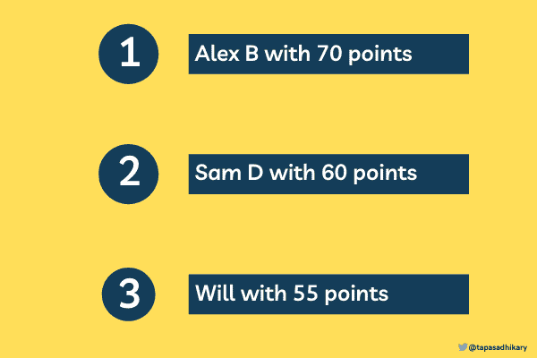
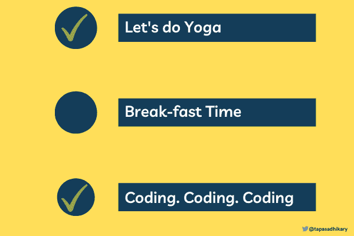
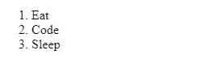
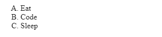
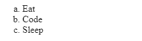
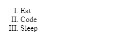
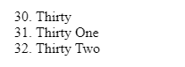

# HTML 列表——如何使用项目符号、有序列表和无序列表

> 原文：<https://www.freecodecamp.org/news/html-list-how-to-use-bullet-points-ordered-and-unordered-lists/>

作为 web 开发人员，在 web 页面上列出项目是一项常见的任务。你可能需要列出购物车里的物品、学生的分数顺序、叫声最大的狗等等。

所以你需要知道用 HTML 列出项目的不同方法。虽然你可能认为这是一件小事，但它很重要。这是 web 开发中 HTML 最常用的特性之一。

在本文中，您将了解 HTML 列表元素、它们的属性、样式，以及如何实际使用它们来创建整洁的列表。希望对你有帮助。

# 如何用 HTML 制作列表

在 HTML 中，我们可以以有序或无序的方式列出项目。

有序列表使用数字或某种符号来表示一系列项目。

例如，有序列表可以从数字 1 开始，一直到数字 2、3、4 等等。您的有序列表也可以从字母 A 开始，经过 B、C、D 等等。

这是一个有序列表的例子，上面有学生的名字和分数。



Ordered list of students

另一方面，我们有无序列表，比如 TODO 列表。在这里，我对编码充满热情，以至于没有吃早餐🤓。



Unordered TODO list

还有一种叫做`description list`的列表，我们将在下面学习。

现在让我们更详细地了解一下如何在 HTML 中创建每种类型的列表。

# 如何用 HTML 制作有序列表

在 HTML 中，我们可以使用`<ol>`标签创建一个有序列表。标签中的`ol`代表一个**o**ordered**l**ist。在每个有序列表元素`<ol>`和`<ol />`中，我们必须定义列表项。我们可以使用`<li>`标签来定义列表项。

以下是有序列表的完整 HTML 结构:

```
<ol>
  <li>Eat</li>
  <li>Code</li>
  <li>Sleep</li>
</ol>
```

上述有序列表的输出是:



因此，我们有一个元素列表，从 1 开始，依次增加到 2 和 3。试试这个代码笔，看看你是否可以用`ol-li`来改变和试验。

[https://codepen.io/atapas/embed/preview/gOWpbMK?default-tabs=html%2Cresult&height=300&host=https%3A%2F%2Fcodepen.io&slug-hash=gOWpbMK](https://codepen.io/atapas/embed/preview/gOWpbMK?default-tabs=html%2Cresult&height=300&host=https%3A%2F%2Fcodepen.io&slug-hash=gOWpbMK)

ordered list of items

### HTML 中有序列表的类型

如果你不想用数字来排列你的列表呢？相反，您希望使用字母排序，如 A、B、C 或 A、B、C。您可以通过指定`<ol>`标记的`type`属性的值来完成这些操作。

您可以通过将`A`作为类型值来使用 A、B、C 字母对列表进行排序。

```
<ol type="A">
  <li>Eat</li>
  <li>Code</li>
  <li>Sleep</li>
</ol>
```

输出如下所示:



类似地，您可以使用小写字母`a`作为类型值来列出 a、b、c 等元素。

```
<ol type="a">
  <li>Eat</li>
  <li>Code</li>
  <li>Sleep</li>
</ol>
```

以下是输出结果:



如果您想要使用罗马数字，请将值`I`用于罗马数字的有序列表:

```
<ol type="I">
  <li>Eat</li>
  <li>Code</li>
  <li>Sleep</li>
</ol>
```

输出如下所示:



查看下面的代码笔，尝试其他类型:

[https://codepen.io/atapas/embed/preview/LYyVEbL?default-tabs=html%2Cresult&height=300&host=https%3A%2F%2Fcodepen.io&slug-hash=LYyVEbL](https://codepen.io/atapas/embed/preview/LYyVEbL?default-tabs=html%2Cresult&height=300&host=https%3A%2F%2Fcodepen.io&slug-hash=LYyVEbL)

Ordered List Types

## 如何在 HTML 列表中使用 Start 属性

`<ol>`元素有一个有趣的属性叫做`start`。您可以为 start 属性指定一个值，从特定的数字开始排序列表。

假设您想以数字`30`而不是`1`开始列表。您可以将数字`30`指定为`start`属性的值，如下所示:

```
<ol start="30">
  <li>Thirty</li>
  <li>Thirty One</li>
  <li>Thirty Two</li>
</ol>
```

输出如下所示:



使用此代码笔，您可以随意使用`start`属性:

[https://codepen.io/atapas/embed/preview/VwbLYzQ?default-tabs=html%2Cresult&height=300&host=https%3A%2F%2Fcodepen.io&slug-hash=VwbLYzQ](https://codepen.io/atapas/embed/preview/VwbLYzQ?default-tabs=html%2Cresult&height=300&host=https%3A%2F%2Fcodepen.io&slug-hash=VwbLYzQ)

start attribute

顺便说一下，我最近在 Twitter 上分享了同样的技巧。你也可以在那里找到一些有趣的讨论:

> 💡您知道吗，您可以在 HTML 有序列表(ol)中使用“start”属性从一个特定的数字开始。
> 
> 默认情况下，有序列表从 1 开始。
> 
> 的输出如下例所示，
> 
> 30。吃
> 31。代码
> 32。睡眠[# 100 daysofcode](https://twitter.com/hashtag/100DaysOfCode?src=hash&ref_src=twsrc%5Etfw)[# dev community](https://twitter.com/hashtag/DEVCommunity?src=hash&ref_src=twsrc%5Etfw)[# html](https://twitter.com/hashtag/html?src=hash&ref_src=twsrc%5Etfw)[# CSS](https://twitter.com/hashtag/CSS?src=hash&ref_src=twsrc%5Etfw)[pic.twitter.com/sqB49wuK5L](https://t.co/sqB49wuK5L)
> 
> — Tapas Adhikary (@tapasadhikary) [July 1, 2021](https://twitter.com/tapasadhikary/status/1410508936344588289?ref_src=twsrc%5Etfw)