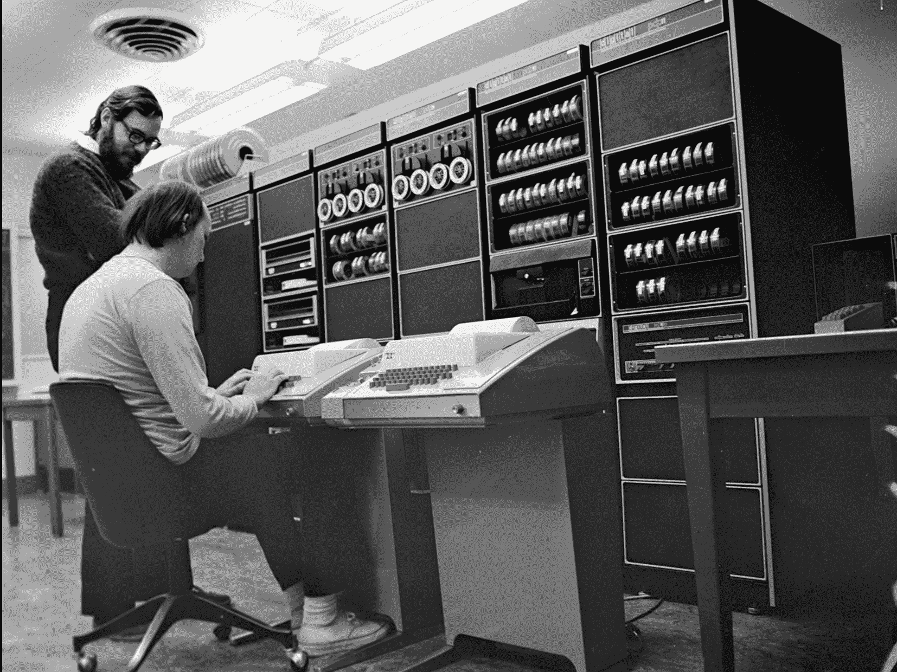
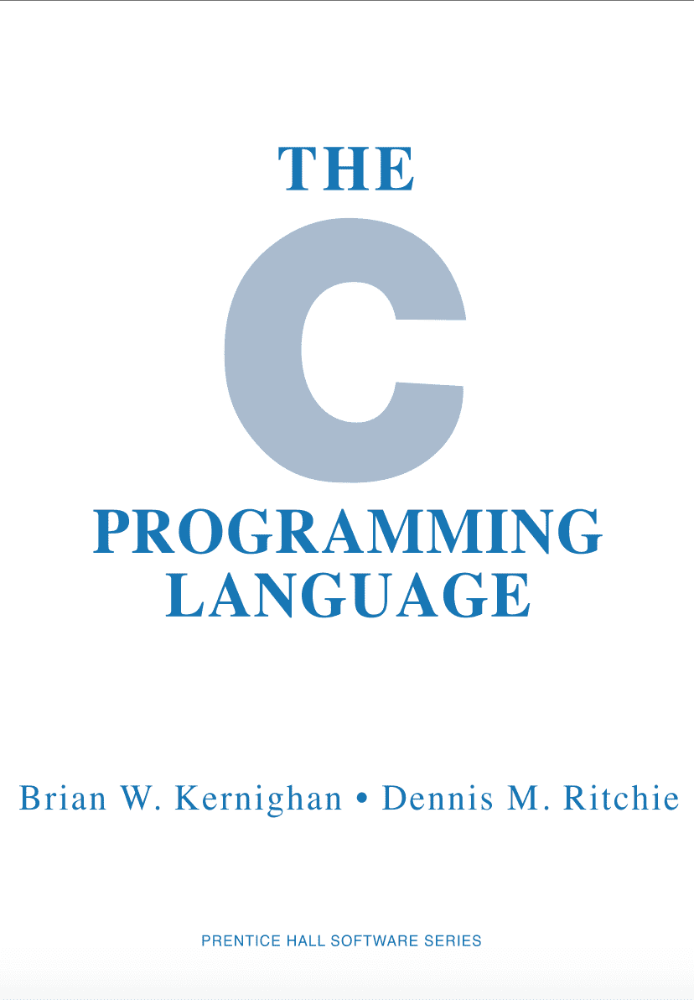
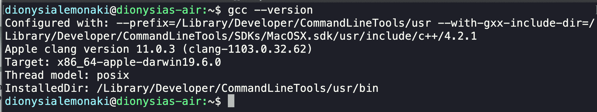
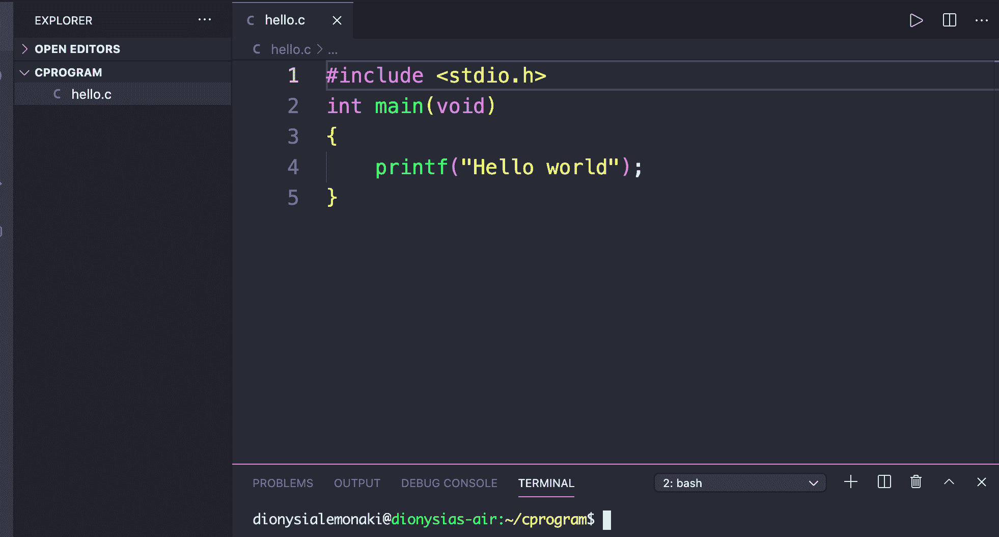
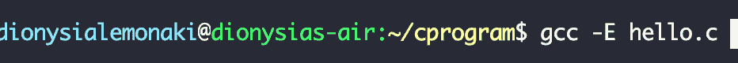
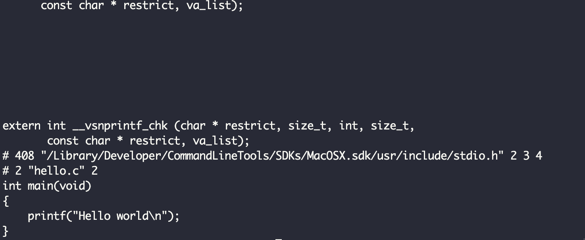
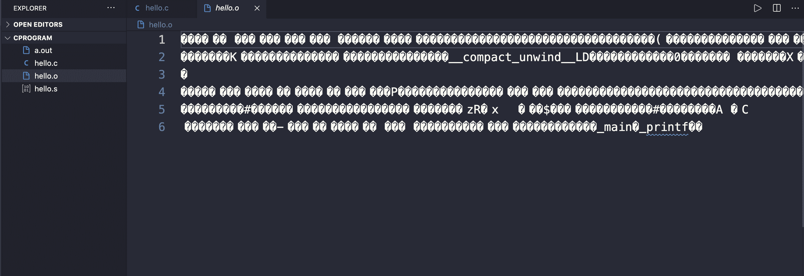
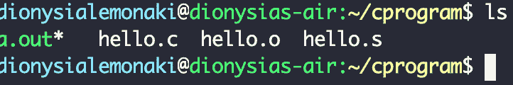
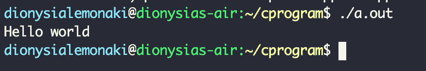
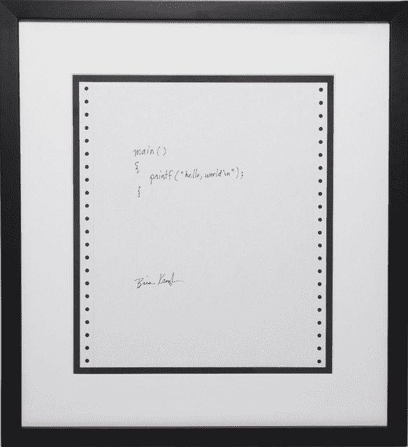

# C 编程语言是什么？初学者教程

> 原文：<https://www.freecodecamp.org/news/what-is-the-c-programming-language-beginner-tutorial/>

本教程将给你一个 C 编程语言的基本概念的概述。

我们将回顾这种语言的历史，为什么以及在哪里使用它，编译过程，以及在大多数流行的编程语言中常见的一些非常基本的编程概念。

这不是一个完整的语言指南，而是作为一个绝对的编程初学者，给你一个重要的 C 语言概念和思想的高层次理解。

每种语言都有自己的语法和特定的做事方式，但是这里涵盖的概念是通用的，适用于所有编程语言。

理解事物是如何工作的以及这些通用的概念可以让你在你的编码之旅中走得更远。从长远来看，这使得学习新技术变得更加容易。

本教程从课程 [CS50:计算机科学导论](https://www.freecodecamp.org/news/introduction-to-computer-science/)的前几周所涵盖的材料中获得了大量灵感，我强烈推荐给任何想要深入研究计算机科学和编程的人，无论他们的经验水平如何。

# 目录

1.  [C 起源背后的历史-概述](#history)
2.  [语言特点及为什么要考虑学习 C 语言](#characteristics)
3.  [C 用在哪里？](#use)
4.  [编译过程:写-编译-运行](#compile)
5.  [你好世界](#helloworld)
    1.  [头文件](#headerfiles)
    2.  [主程序](#main)
    3.  [评论](#comments)
    4.  [输出或打印到控制台](#print)
6.  [变量和赋值](#variables)
    1.  [分配](#assignment)
    2.  [声明 vs 初始化变量](#declaration)
    3.  [命名变量的几个规则](#rules)
    4.  [变量的范围](#scope)
7.  [数据类型](#datatypes)
    1.  [格式代码](#formatcodes)
8.  [操作员](#operators)
    1.  [算术运算符](#aoperators)
    2.  [赋值运算符](#asoperator)
    3.  [逻辑运算符](#logic)
    4.  [比较运算符](#compare)
9.  [功能](#functions)
    1.  [函数参数](#farguments)
    2.  [功能输出](#foutputs)
    3.  [定义方法](#defining)
    4.  [调用函数](#calling)
10.  [布尔表达式](#boolean)
11.  [条件语句](#conditions)
12.  [循环](#loops)
    1。[While loops](#whileloops)2
    。 [Do-While 循环](#dowhile)
13.  [额外阅读](#resources)

## C 编程语言的历史

C 编程语言的历史与 Unix 操作系统的发展史紧密相连。

如果我们回过头来理解是什么导致了改变计算世界的操作系统的发展，我们就会看到导致 c 语言发展的步骤。

简单地说，C 源于最初寻找并最终创建一种应用于 Unix 操作系统的语言的需要。

### MAC 和 MULTICS 项目

这一切都始于 1965 年，当时麻省理工学院完成了 MAC 实验项目，这是同类系统中的第一个。这是多元文化时代的开始。它使用了一种叫做 CTSS 的东西，或者兼容的分时系统。

这在当时是一个关键的创新。到目前为止，我们还处于早期的大型机时代，庞大、强大且极其昂贵的计算机曾经占据了整个房间。

为了完成任务，程序员会手写代码。然后，他们在一副用手写程序编码的纸带卡上打孔。

他们通过将写有程序的纸张交给操作员来完成这项工作，操作员使用一台按键打孔机在卡片上打孔，并在卡片上显示数据和指令。

然后，他们把穿孔卡片送到与主机相连的穿孔卡片阅读器上。然后，它将卡片孔中的序列转换成数字信息。使用这种方法完成简单的任务需要很长时间，而且一次只能有一个人使用每台机器。

分时度假的想法改变了一切。它没有使用卡片，而是将多个控制台(当时是称为电传打字机的机械终端)连接到一台主计算机上。这允许许多人同时使用同一台计算机。

遍布麻省理工学院校园的 100 多台打字机终端可以连接到一台大型主机上。该系统同时支持多达 30 个远程用户，每个用户使用其中一个终端。

主计算机的操作系统执行多项任务，围绕着那些想通过连接的终端执行计算任务的人，给每个人几秒钟的时间。

它提供了看似连续的服务，看起来像是同时加载和运行许多程序。但实际上，它只是很快地浏览了每个用户的程序。这给人一种错觉，以为一个人拥有整台电脑。

这个系统被证明是非常高效、有效和多产的，从长远来看节省了时间和金钱，因为那些计算机非常昂贵。

一些可能需要几天才能完成的事情现在只需要很少的时间。这开始让更多的人能够接触到计算。

随着 CTSS 的成功，麻省理工学院决定是时候建立这个系统并采取下一步行动了。下一步将是创建一个更先进的分时系统。

但是他们设想了一个比这更有雄心的努力:他们想建立一个系统，作为程序员的计算工具，能够支持数百个用户同时访问大型机。并且它们之间可以共享数据和资源。

这将需要更多的资源，因此他们与通用电气和贝尔实验室联手。

这个新项目被命名为 MULTICS，代表“多路复用信息和计算服务”,在通用电气公司的主机之一 GE 635 上实现。

这个团队在 MULTICS 上工作了很多年。但是在 1969 年，贝尔实验室放弃了这个项目，因为它耗时太长，费用太高。

### 贝尔实验室:创新中心

贝尔实验室退出 MULTICS 项目让一些员工感到沮丧，并在寻找替代方案。

在开发 MULTICS 时，该团队创造了一个无与伦比的计算环境。他们习惯于使用分时系统工作，并且已经看到了它们的有效性。这些程序员对操作系统有着丰富的知识，来自那个项目的创新让他们想要扩展更多。

主要由 Ken Thompson 和 Dennis Ritchie 领导的团队希望使用公共计算并创建一个他们可以共享的文件系统。它将具有他们喜欢的来自 MULTICS 的创新特性，但他们将以一种简单、更小、更便宜的方式实现它。

他们分享了他们的想法，并开始迭代。


[Ken Thompson and Dennis Ritchie, Image source from Wikipedia](https://en.wikipedia.org/wiki/File:Ken_Thompson_and_Dennis_Ritchie--1973.jpg)

贝尔实验室营造了一个开放和支持的环境，允许创造性的表达和创新的想法开花结果。这是一项繁重的研究，他们鼓励独立思考解决问题，以帮助他们改进最初的解决方案。

通过大量的讨论和实验，他们取得了最大的突破，书写了历史。

当肯·汤普森还在创作多角色时，他已经创作了一款名为《太空旅行》的游戏。他最初是在 GE 635 上的 MULTICS 上写的，但当贝尔实验室退出时，他将 gamae 改编为 Fortran 程序，以便在 GE 635 上运行的 GECOS 操作系统上运行。

这个游戏有很多问题——它在 GECOS 上不如在 MULTICS 上运行得好，他需要一个不同的、更便宜的机器来运行它。

Ken Thompson 在申请资金创建一个不同的操作系统时面临拒绝，因为贝尔实验室已经退出了这样的项目。但他最终找到了一台旧的、很少使用的 DEC PDP-7 小型机，他可以试用一下——这是唯一可用的系统。


[A DEC PDP-7, Image source from Wikipedia](https://en.wikipedia.org/wiki/File:Pdp7-oslo-2005.jpeg)

他开始在那个简单的系统上编写他的游戏，但是受到电脑上软件的限制。因此，当他在工作时，他最终实现了他的团队一直在设想的文件系统的基本框架。

他从分层文件系统、命令行解释器和其他实用程序开始。不到一个月，他就用汇编器、编辑器和外壳创建了一个操作系统。它们是更小、更简单的多卡特征。这个操作系统是 Unix 的第一个版本。

### 使用汇编语言的 Unix 的早期

在项目开始时，Ken Thompson 无法在 DEC PDP-7 计算机上编程。DEC PDP-7 程序必须在功能更强大的 GE 635 主机上编译和翻译，然后输出结果通过纸带物理传输到 PDP-7。

DEC PDP-7 的内存非常小，只有 8KB。为了应对这种限制，文件系统、Unix 内核的第一个版本以及项目中几乎所有的东西都用汇编语言编写。利用汇编语言，汤普森可以直接操作和控制那台计算机的每一部分内存。

汇编语言是一种低级编程语言，它使用符号代码，接近于机器的本地语言二进制。代码中的指令和语言中的每条语句都与特定于计算机体系结构的机器指令紧密对应。

它依赖于机器并且特定于机器，这意味着一组指令在不同的机器上有非常不同的结果。用汇编语言编写的程序是为特定类型的处理器编写的——所以用汇编语言编写的程序不能在各种处理器上运行。

当时用汇编语言编写操作系统是很常见的。当他们第一次开始在 Unix 上工作时，他们并没有考虑到可移植性。

他们不关心操作系统是否在不同的机器系统和架构上工作。这是后来才有的想法。他们最关心的是软件的效率。

在开发 MULTICS 时，他们使用了高级编程语言，比如开始时的 PL/I 和后来的 BCPL。程序员已经习惯于使用高级语言来编写操作系统类的软件、实用程序和工具，因为它们提供了优势(它们相对容易使用和理解)。

当使用更高级的编程语言时，在计算机的体系结构和各种模糊的细节之间有一个抽象。这意味着它在机器的层次之上，没有对硬件内存的直接操作。

高级语言更容易阅读、学习、理解和维护，这使得它们在团队工作时更容易选择。与汇编的符号格式相比，命令具有类似英语的语法，术语和指令看起来更加熟悉和人性化。

使用高级语言也意味着编写更少的代码来实现某些目标，而汇编程序非常长。

Thompson 从一开始就想为 Unix 使用更高级的语言，但是受到 DEC PDP-7 的限制。

随着项目的进展，越来越多的人开始从事这项工作，使用汇编并不理想。Thompson 认为 Unix 需要一种高级系统编程语言。

1970 年，他们设法为更大更强的 DEC PDP-11 获得了资金，该设备具有更大的内存。

有了一种可以取代汇编的快速、结构化、更高效的高级编程语言，每个人都可以理解代码，编译器可以在不同的机器上使用。

他们开始探索不同的语言来编写可以用来实现 Unix 的系统软件。

### 从 B 到 C:对新语言的需求

目标是创建实用程序——增加功能的程序——在 Unix 上运行。Thompson 最初试图创建一个 FORTRAN 编译器，但后来转向了他以前使用过的语言，BCPL (Basic 组合编程语言)。

BCPL 是由马丁·理查兹在 20 世纪 60 年代末设计和开发的。它的主要目的是编写编译器和系统软件。

这种语言速度慢且有许多限制，所以当 Thompson 在 1970 年 12 月 PDP-7 上的 Unix 项目中开始使用它时，他进行了调整和修改，并最终编写了自己的语言，称为 b。

b 具有 BCPL 的许多特征，但它是一种较小的语言，语法不那么冗长，风格也更简单。然而，它仍然很慢，功能不够强大，不能支持 Unix 实用程序，也不能利用 PDP-11 的强大功能。

Dennis Ritchie 决定改进之前的两种语言——BCPL 和 b——他吸取了两种语言的特点并添加了额外的概念。他创造了一种更强大的语言——C——就像汇编语言一样强大和高效。这种新语言克服了它的前辈的局限性，可以有效地利用机器的力量。

于是 1972 年 C 诞生了，第一个 C 编译器在 DEC PDP-11 机器上第一次编写实现。



[The famous picture of Thompson and Ritchie working on a PDP-11, Image source Wikipedia](https://en.wikipedia.org/wiki/Ken_Thompson#/media/File:Ken_Thompson_(sitting)_and_Dennis_Ritchie_at_PDP-11_(2876612463).jpg)

### C 编程语言

1973 年，Dennis Ritchie 使用 C 编程语言重写了 Unix 源代码和大多数 Unix 程序和应用程序。这使得它成为操作系统的标准实现语言。

他用 C 重新实现了 Unix 内核，几乎所有的操作系统(超过 90%)都是用这种高级语言编写的。它混合了高级可读性特性和低级功能，是编写操作系统的最佳选择。

到了 20 世纪 70 年代末，C 语言开始流行起来，这种语言开始得到更广泛的支持和使用。在那之前，C 仍然只适用于 Unix 系统，编译器在贝尔实验室之外是不可用的。

这种受欢迎程度的提高不仅来自于 C 给机器带来的力量，也来自于程序员。这也有助于 Unix 操作系统以更快的速度获得同样的普及。

Unix 之所以脱颖而出，是因为它具有可移植性，并且能够在各种不同的机器、系统和环境上运行。

c 语言使这种可移植性成为可能，而且由于它是 Unix 系统的语言，它变得越来越有名——所以越来越多的程序员想尝试它。

1978 年，Brian Kernighan 和 Dennis Ritchie 合著并出版了《C 编程语言》一书的第一版，在编程界也称为《K&R》。多年来，这本书一直是 C 语言描述、定义和参考的首选。



[Front page cover of the book,image source Wikipedia](https://en.wikipedia.org/wiki/C_(programming_language)#History)

在 20 世纪 80 年代，随着不同编译器的出现和商业化，C 语言的受欢迎程度直线上升。许多没有参与 C 设计的团体和组织开始为每一种操作系统和计算机体系结构制作编译器。c 语言现在可以在所有平台上使用。

当这些组织创建了他们自己的编译器时，他们开始改变语言的特性以适应编译器被编写的每个平台。

有各种版本的 C 语言，它们之间有细微的差别。在编写编译器时，这些小组根据《C 编程语言》一书的第一版，对语言的某些方面提出了自己的解释。

然而，随着所有的迭代和调整，这本书不再描述语言的本来面目，语言的变化开始引发问题。

这个世界需要一个通用的 C 语言版本，一个语言标准。

### C 标准

为了确保这种语言有一个标准的、独立于机器的定义，ANSI(美国国家标准协会)在 1983 年成立了一个委员会。这个委员会被命名为 X3J11 委员会，他们的任务是为 c 提供一个清晰、全面的定义和标准化。

几年后，在 1989 年，委员会的工作完成并正式成立。他们定义了这种语言的商业标准。这个版本的语言被称为“ANSI C”或 C89。

全世界都在使用 c 语言，所以一年后的 1990 年，该标准被国际标准化组织 ISO 批准并采用。第一个版本 C90 被称为 ISO/IEC 9899:1990。

从那以后，对该语言进行了多次修改。

该标准的第二个版本 C99 于 1999 年发布，称为 ISO/IEC 9899:1999，引入了新的语言附加功能。第三个版本 C11 于 2011 年发布。最新的版本是第四版 C17，被称为 ISO/IEC 9899:2018。

### C 的延续

c 为许多不同编程语言的创造开辟了道路。我们今天使用和喜爱的许多现代高级编程语言都是基于 c 的。

许多在 C 语言之后创建的语言都想解决 C 语言无法解决的问题，或者克服一些限制 C 语言的问题。例如，C 语言最受欢迎的子语言是其面向对象的扩展 c++——但是 Go、Java 和 JavaScript 也受到了 C 语言的启发。

## C 语言的特点以及为什么要考虑学习 C 语言

c 语言是一种古老的语言，但即使过了这么多年，它仍然流行至今。

它的流行要归功于 Unix 的兴起和成功，但是现在它已经不仅仅是 Unix 的“本地”语言了。它现在为世界上大多数(如果不是全部)服务器和系统提供动力。

编程语言是我们用来解决大规模影响我们的特定计算问题的工具。

创建网页和 web 应用程序不需要懂 C。但是，当您想要编写操作系统、控制其他程序的程序或用于内核开发的编程实用程序时，或者当您想要编写嵌入式设备或任何系统应用程序时，它就非常方便了。c 擅长所有这些任务。所以我们来看一些学习 c 的理由。

### 它帮助你了解你的计算机是如何工作的

尽管 C 是一种通用编程语言，但它主要用于与低级机器功能交互。除了学习语言背后的实际原因，了解 C 可以帮助你理解计算机实际上是如何工作的，在引擎盖下发生了什么，以及程序实际上是如何在机器上运行和执行的。

由于 C 被认为是其他编程语言的基础，如果你能学习这种语言中使用的概念，那么以后理解其他语言也就容易多了。

编写 C 代码让我们了解机器中隐藏的进程。它可以让我们更接近计算机的底层硬件，而不会弄乱汇编语言。它还让我们能够处理大量的低级任务，同时保持像高级语言一样的可读性。

### c 语言快速高效

同时，我们不会失去汇编提供的功能、效率和对代码执行方式的底层控制。

请记住，每个设备硬件中的每个处理器都有自己的汇编代码，对于该处理器来说是唯一的。它与任何其他设备上的任何其他处理器都不兼容。

使用 C 语言给我们提供了一个更快、更容易、总体上更简单的方法来与最低层的计算机进行交互。事实上，它混合了高级和低级功能。它帮助我们完成工作，没有冗长难懂的汇编代码带来的麻烦。

所以，C 语言是你能接触到的最接近计算机底层硬件的语言，当你使用和实现系统软件时，它是汇编语言(编写操作系统的旧标准)的绝佳替代品。

### c 语言功能强大且灵活

这种与硬件的紧密接近意味着 C 代码是显式和精确编写的。它给你一个清晰的图片和你的代码如何与计算机交互的心理模型。

c 并没有隐藏机器操作的复杂性。它为您提供了强大的功能和灵活性，比如手动分配、操作和直接写入内存的能力。

程序员做很多繁重的工作，语言让你以一种高效的方式管理和构造内存，让机器提供高性能、优化和速度。c 让程序员做需要做的事情。

### c 是可移植的，高性能的，独立于机器的

c 语言还具有高度的可移植性和机器独立性。尽管它离机器很近，并且可以访问它的底层功能，但是它对这些部分有足够的抽象，使得代码的可移植性成为可能。

因为汇编指令是机器专用的，所以程序是不可移植的。在一台机器上编写的程序必须重写才能在另一台机器上运行。这对于每一个计算机架构来说都很难维护。

c 语言是通用的，用它编写的程序可以在许多平台、架构和各种机器上编译和运行，而不会损失任何性能。这使得 C 成为创建性能非常重要的系统和程序的最佳选择。

### c 激发了许多其他编程语言的诞生

今天常用的许多语言，如 Python、Ruby、PHP 和 Java，都受到了 C 的启发。这些现代语言依靠 C 来工作和提高效率。而且，它们的库、编译器和解释器都是用 c 语言构建的。

这些语言隐藏了程序实际上是如何工作的大部分细节。使用这些语言，你不必处理内存分配和比特和字节，因为有更多的抽象层次。对于与内存交互容易出错的高级应用程序，您不需要这种粒度控制。

但是，当您实现操作系统或嵌入式设备的一部分时，了解这些底层细节和直接处理可以帮助您编写更简洁的代码。

### c 是一种相当简洁的语言

尽管 C 语言对初学者来说可能相当晦涩难懂，但它实际上是一种相当小而紧凑的语言，只有最少的关键字、语法和内置函数。因此，在探索该语言的工作原理时，您可以学习和使用该语言的所有特性。

即使您对学习如何编写操作系统或系统应用程序不感兴趣，了解 C 基础知识以及它如何与计算机交互也会为您提供计算机科学概念和原理的良好基础。

此外，理解内存如何工作和布局是一个基本的编程概念。因此，在更深的层次上理解计算机的行为和正在发生的过程真的可以帮助你学习和使用任何其他语言。

## C 用在哪里？

数十亿人在日常生活中使用的设备、产品和工具中有大量的 C 代码。从世界上的超级计算机到最小的设备，这种代码驱动着一切。

c 代码使各种嵌入式系统和智能设备都能工作。一些例子是家用电器，如冰箱、电视、咖啡机、DVD 播放器和数码相机。

你的健身追踪器和智能手表？你车上的 GPS 跟踪系统，甚至交通灯控制器？您猜对了——C。在工业、医疗、机器人和汽车行业中，有许多运行 C 代码的嵌入式系统的例子。

另一个广泛使用 C 的领域是操作系统和内核开发。除了 Unix 之外，其他主要和流行的操作系统在某种程度上都是用 c 语言编写的。

微软的 Windows 内核大部分是用 C 语言编写的，Linux 内核也是如此。大多数超级计算机由 Linux 驱动，大多数互联网服务器也是如此。这意味着 C 驱动了互联网的很大一部分。

Linux 也支持 Android 设备，所以 C 代码不仅让超级计算机和个人电脑工作，智能手机也是如此。甚至 OSX 在某种程度上也是用 C 语言编写的，这使得 Mac 电脑也能在 C 语言上运行。

c 语言在开发桌面应用程序和 GUI(图形用户界面)方面也很流行。我们用于视频、照片编辑和图形设计的大多数应用程序(如 Photoshop、Adobe illustrator 和 Adobe Premiere)都是用 C 或其后继者 C++编写的。

各种语言的编译器、解释器和汇编器都是用 C 设计和构建的——事实上，这些是这种语言最常见的用法。

许多浏览器及其扩展都是用 C 语言构建的，比如谷歌 Chromium 和谷歌文件系统。开发人员也经常在数据库设计中使用 C 语言(MySql 和 Oracle 是用 C 语言构建的两个最流行的数据库系统)，它为许多计算机游戏中的高级图形提供了动力。

从这个概述中，我们可以看到 C 和它的派生物 C++运行着互联网和整个世界的很大一部分。我们日常生活中使用的很多设备和技术都是用 c 语言编写的或者依赖于 c 语言。

## c 编译过程:写-编译-运行

### 什么是 C 语言中的程序？

用 C 语言编写的计算机程序是计算机执行的人类可读的有序指令集。它旨在为特定的计算问题提供解决方案，并告诉计算机使用它需要遵循的一系列指令来执行某项任务。

基本上所有的程序都是存储在你的计算机硬盘上的纯文本文件，它们使用一种特殊的语法，这种语法是由你正在使用的编程语言定义的。

每种语言都有自己的规则，规定你可以写什么，什么被认为是有效的，什么是无效的。

一个程序有关键字，关键字是保留的特定单词，是语言的一部分。它还有字符串和数字等文字数据。它有遵循语言规则的词，这些词是我们定义并引入到语言中的，而语言中并不存在这些词(比如变量或方法)。

### 什么是编译器？

程序是由我们写的，也是为我们而写的。它们应该被人类理解。

当我们以人类可读的形式编写程序时，我们可以理解它们——但计算机可能不能。计算机不直接理解编程语言，只理解二进制。所以程序需要被翻译成另一种形式，这样计算机才能真正理解我们程序的指令。

高级语言的程序既可以编译也可以解释。他们分别使用称为编译器和解释器的特殊软件。

### 编译器和解释器有什么区别？

编译器和解释器都是程序，但它们要复杂得多，它们充当翻译器。他们用人类可读的形式编写一个程序，然后把它变成计算机可以理解的东西。它们使得在不同的计算机系统上运行和执行程序成为可能。

编译后的程序首先被转换成机器可读的形式，这意味着它们在运行前被翻译成机器代码。机器代码是一种数字语言——由 0 和 1 的序列组成的二进制指令。

这种编译产生可执行程序，即包含 CPU(中央处理器)能够直接读取、理解和执行的机器语言代码的文件。

在这之后，程序可以运行，计算机做程序告诉它做的事情。编译后的程序与底层硬件有更强的对应性，可以更容易地操作计算机的 CPU 和内存。

另一方面，解释程序不直接由机器执行，也不需要翻译成机器语言程序。相反，他们使用一个解释器，在运行时自动地、直接地逐行翻译和执行代码中的每个语句和指令。

c 是一种编译程序语言。这意味着它使用编译器来分析用 C 编写的源代码，然后将它转换成计算机硬件可以直接执行的二进制文件。这将因每台特定机器而异。

### 如何使用 GCC 编译器的例子

Unix 和类 Unix 系统已经内置并安装了 C 编译器。这意味着 Linux 和 MacOS 内置了一个流行的编译器，称为 GCC 编译器(或 GNU 编译器集合)。

在本节的其余部分，我们将看到使用这个编译器的例子，我已经将这些例子建立在 Unix 或类 Unix 系统上。因此，如果你有一个 Windows 系统，确保为 Linux 启用 [Windows 子系统。](https://www.microsoft.com/en-us/p/ubuntu/9nblggh4msv6?activetab=pivot:overviewtab)

首先，确保您已经安装了 GCC 编译器。你可以打开你的终端，在提示符下输入`gcc --version`来检查，通常在`$`字符之后。

如果你正在使用 MacOS 并且还没有安装命令行开发工具，你会弹出一个对话框要求你安装它们——所以如果你看到了，继续安装吧。

一旦你安装了这些，打开一个新的终端会话并重新输入`gcc --version`命令。如果您已经安装了命令行工具，您应该会得到下面的输出:



但是，术语编译本身是一种抽象和简化，因为实际上在幕后有许多步骤。这些是发生在我们编写、编译、然后运行 C 程序之间的更好的底层细节。大多数甚至是自动发生的，我们甚至都没有意识到。

### 如何写 C 源代码

为了开发 C 程序，我们首先需要某种类型的文本编辑器。文本编辑器是一个程序，我们可以用它在文本文件中编写代码(称为源代码)。

为此，您可以使用命令行文本编辑器，如 nano 或 Vim，如果您对它们感到满意的话。

您也可以使用 IDE(集成开发环境)，或者具有类似 IDE 功能的文本编辑器(集成终端，无需离开编辑器就能在一个地方编写、调试、运行和执行我们的程序，等等)。

具有这些功能的一个编辑器是 Visual Studio 代码，它使用了 [C/C++扩展](https://marketplace.visualstudio.com/items?itemName=ms-vscode.cpptools)。在本教程的其余部分，我们将使用 VSCode。

回到您的终端，继续输入下面的命令来创建一个文件，我们的 C 代码将在这个文件中运行。

```
`cd` # Takes us to our home directory,if not there already
`mkdir cprogram` # Creates a directory named cprogram 
`cd cprogram` #navigates us into the cprogram directory we just created
`touch hello.c` #creates a file named hello
`code .` #opens VSCODE  in the current directory 
```

所以我们刚刚创建了一个纯文本文件，`hello.c`。这个文件将有用 C 语言写的代码，这意味着它将是一个 C 程序。这由约定的文件扩展名`.c`表示。

在里面我们可以写任何我们喜欢的 C 程序，从一个非常基础的开始，比如一个输出“hello world”到屏幕上的程序。



为了查看我们的代码做了什么，我们必须运行我们刚刚编写的程序。但是，在运行它之前，我们必须首先通过在终端中键入一些命令来编译它。

我们可以继续在我们的计算机上使用命令行，或者我们可以在 VSCode 中使用集成终端(通过在一个新的终端窗口打开的同时按住`control ~`键)。

到目前为止，我们可以在左侧面板上看到，在我们的`cprogram`目录中只有一个文件`hello.c`，它包含我们的 C 代码。

术语“编译我们的 C 代码”不是一步到位的。它还包括一些自动发生在我们身上的更小的动作。

提醒一下，当我们提到编译时，我们通常是指编译器将我们的源代码作为输入(我们用 C 编写的代码，它具有类似英语的语法)，并将其翻译成机器代码语句作为输出。

这个机器代码直接对应于我们的源代码指令，但它是以 CPU 可以理解的方式编写的，因此它可以执行指令并执行它们。

### C 源代码如何转换成二进制代码

这是总的想法，但是中间有 4 个更小的步骤。当我们编译代码时，我们实际上是在预处理、编译、组装和链接代码。

当我们在终端键入命令`gcc hello.c`时，这些步骤就开始了，这分别是编译器和源代码文件的名称。

如果我们愿意，我们可以通过键入更具体的命令来替换和定制该命令，如`gcc -o hello hello.c`，其中:

*   `-o`代表“输出该文件”
*   `hello`是我们自己为将要创建的我们想要输出的可执行程序文件指定的名称，以及
*   `hello.c`是一个文件，`gcc`编译器将把它作为输入(这是我们的源代码所在的文件，我们想要编译它)。

#### C 中的预处理

编译器中的另一个程序完成了第一步——预处理器。预处理器可以做很多事情——例如，它可以充当“查找和替换工具”,扫描我们的源代码，寻找特殊语句，搜索以`#`开头的行。

像`#include`一样，以`#`开头的行被称为预处理器指令。任何以`#`开头的行都向预处理器表明它必须做些什么。特别是，它告诉我们应该用其他东西自动替换那一行。我们看不到这个过程，但它正在幕后发生。

例如，当预处理器在我们之前的`hello world`程序中找到第`#include <stdio.h>`行时，`#include`直接告诉预处理器，通过复制和粘贴，将头文件(一个外部库，`stdio.h`)中的所有代码包含在我们自己的源代码中该语句的位置。所以它用`stdio.h`文件的实际内容替换了`#include <stdio.h>`行。

在`<stdio.h>`库中有函数原型和定义或提示。这样，所有的函数都被定义了，这样计算机在编译时就能识别它们，我们也能在程序中使用它们。

例如，函数`printf();`被定义为`<stdio.h>`内部的`int printf(const char *format,…);`。同样的步骤也适用于其他头文件，即扩展名为`.h`的文件。

在预处理步骤中，我们代码中的注释也被删除，宏被扩展并替换为它们的值。一个*宏*是一段已经被命名的代码。

在这个阶段，如果我们的代码中没有错误，终端中应该没有输出，这是一个好现象。

我们看不到输出，但是已经创建了一个扩展名为`.i`的新文件，它仍然是 C 源代码。这个文件包含预处理的输出，所以它被称为预处理源代码。在这种情况下，生成了一个新文件`hello.i`，但是它在我们的编辑器中不可见。

如果我们运行命令`gcc -E hello.c`:



我们将能够看到该文件的所有内容(这是一个很大的文件),其结尾如下所示:



如果代码的正确性有任何错误，或者我们没有遵循语言的语义，我们将会看到一些错误，编译将会结束。我们必须纠正错误，从头开始这个过程。

#### 用 C 编译

在产生预处理 C 源代码的预处理步骤之后，接下来我们必须编译代码。这包括将仍然是源代码的代码转换成另一种中间形式。这一步我们使用编译器。

回顾一下，编译器是一种程序，它将源代码作为输入，并将其翻译成更接近计算机母语的语言。

当我们提到编译时，我们既可以指将源代码翻译成目标代码(机器码)的整个过程，也可以指整个编译过程中的一个特定步骤。

我们现在讨论的步骤是编译时将预处理过的 C 源代码程序的每一条语句转换成一种对计算机更友好的语言。这种语言更接近于计算机可以直接理解的二进制。

这种中间语言是汇编代码，一种低级编程语言，用于控制 CPU，操纵它执行特定的任务，并接近计算机的内存。还记得历史部分的汇编代码吗？

每个 CPU——计算机的大脑——都有自己的一套指令。汇编代码使用与 CPU 执行的指令和低级操作直接相关的特定语句和命令。

所以在编译过程的这一步，文件`hello.i`中预处理过的 C 源代码中的每一条语句都被编译器翻译成低级别的汇编语言中的等价语句。

该操作的输出创建了一个以`.s`结尾的文件(因此`hello.s`在幕后)，其中包含汇编指令。

通过键入命令`gcc -S hello.c`，我们可以查看编译器创建的`hello.s`文件的内容和有些难以理解的汇编命令(但是当我们单独键入`gcc hello.c`时，我们看不到这些内容和命令)。

如果我们仔细观察，我们会发现在我们的 C 源代码中使用了几个熟悉的关键字和语句，如`main`和`printf`:


#### 用 C 汇编

汇编是指将包含汇编代码语句的`hello.s`文件作为输入，在另一个在编译过程中自动执行的程序的帮助下，将其汇编成机器代码指令。这意味着它将输出实际的 0 和 1，或二进制格式语句。

这一步也是在幕后进行的，它产生源代码中的指令被翻译成的最终语言。现在计算机终于可以理解那些指令了。

我们在 C 源代码中编写的每个命令都被转换成汇编语言语句，并最终转换成等价的二进制指令。这一切都是随着命令`gcc`发生的。咻！

我们写的代码现在被称为目标代码，特定计算机的 CPU 可以理解。这种语言我们人类无法理解。

人们过去用机器语言编码，但这是一个非常乏味的过程。任何非机器代码符号(即任何不是 0 和 1 的符号)都很难理解。直接用这种语言编码是非常容易出错的。

在这个阶段，创建了另一个扩展名为`.o`的文件(针对对象)——所以在我们的例子中，它将是`hello.o`。

我们可以通过命令`gcc -c hello.c`看到包含机器级指令的目标文件的实际内容。如果我们这样做，我们将看到`hello.o`的非人类可读内容:



#### C 语言中的链接

在上面的图片中，你可能已经注意到了我们目录中的一个`a.out`文件。

这是默认的步骤和文件，当我们键入编译器命令和我们的文件名时，在我们的例子中是`gcc hello.c`。

如果我们使用前面提到的命令`gcc -o hello hello.c`，我们会看到一个定制的名为`hello`的可执行程序来代替`a.out`。

`a.out`代表*总成输出*。如果我们在终端中键入`ls`来*列出*我们目录中的文件，我们会看到`a.out`甚至看起来与其他文件都不一样:



链接是编译过程的最后阶段，最终的二进制文件`hello.o`与我们项目中的所有其他目标代码相链接。

因此，如果有其他包含 C 源代码的文件(比如我们的程序中包含的实现已经处理和编译过的 C 库的文件，或者我们编写的另一个名为`hello.c`之外的`filename.c`的文件)，这时目标文件`filename.o`将与`hello.o`和其他目标代码结合，将它们链接在一起。

这与代表我们程序的组合机器码`a.out`或`hello`形成了一个大的可执行文件。

因为我们最终完成了编译，所以程序处于最终形式。现在我们可以通过键入`./a.out`在我们的机器上执行和运行该文件。这意味着“运行当前目录中的 a.out 文件”，因为`./`代表我们所在的文件夹。然后我们在终端中看到程序的输出:



每当我们对源代码文件进行更改时，我们都必须从头开始重复编译过程，以便在再次运行代码时看到更改。

## 如何用 C 编写 Hello World

一个程序是非常简单的，但是它是一个传统，当你第一次开始学习如何用一种新的编程语言编码时，它也是一个测试信息。

如果您成功执行了“Hello World”程序，这将让您知道您的系统配置正确。



'Hello world' devised by Brian Kernighan from Artsy's Algorythm Auction based on a 1974 Bell Laboratories internal memorandum, "Programming in C: A Tutorial," which contains the first known version. It was reprinted in the popular 1978 book, The C Programming Language. [Image and description source from Wikipedia](https://en.wikipedia.org/wiki/File:Hello_World_Brian_Kernighan_1978.jpg)

“hello world”程序包含该语言的基本语法，我们可以将其分解为更小的部分:

```
#include<stdio.h>

int main(void)
{
    // print hello world to the screen
	printf("Hello world\n");
} 
```

### C 中的头文件

头文件是外部库。这意味着它们是由一些开发人员编写的供其他开发人员使用的一组代码。

它们提供了 C 语言核心中没有的特性。通过将头文件添加到我们的代码中，我们反过来获得了可以在程序中使用的额外功能。

像`include <stdio.h>`这样的头文件以扩展名`.h`结尾。特别是，像`stdio.h`这样的头文件已经内置在编译器中。

行`include <stdio.h>`是`stdio.h`库文件中预写函数的指令，它告诉计算机访问并把它们包含在我们的程序中。

`stdio.h`为我们提供了功能`standard input and standard output`，这意味着我们将能够从用户那里获得输入和输出。因此，我们可以使用像`printf`这样的输入/输出函数。

如果你不在代码的顶部包含`stdio.h`文件，计算机就不会理解`printf`函数是什么。

### C 中的主程序

代码如下:

```
int main(void)
{
} 
```

这是 C 程序的主要启动函数。花括号(`{}`)是包装所有应该在我们程序中的代码的主体。

这一行充当所有 C 程序的样板和起点。它让计算机知道在执行我们的程序时从哪里开始读取代码。

### C 中的注释

无论我们在`//`之后写什么，都不会影响我们的代码如何运行，计算机在编译和执行时也不会考虑它。

这两行表示您正在添加注释，这些注释是对我们未来的自己和同事的注释。注释可以帮助我们记住并提醒其他人某一行代码是做什么的，或者我们当初为什么要写这段代码。它还提醒我们，当我们在第二天甚至几个月后再回头看这段代码时，这段代码的目的到底是什么。

### 在 C 中输出或打印到控制台

将短语“Hello world”打印到控制台。当我们想说些什么并想在屏幕上看到输出时，我们使用`printf`。我们想要输出的字符需要用双引号`""`和括号`()`括起来。

`/n`是一个转义字符，这意味着它创建一个新行，并告诉光标在看到它时移动到下一行。

`;`表示句子的结束和那一行代码的结束。

## C 语言中的变量

下面是我们如何在 C 中定义变量:

> 在程序运行期间可以取多个值的数据项。

用最简单的话来说，你可以把变量想象成一个命名的盒子。作为存储场所和位置的盒子，用于存放内容可能不同的不同信息。

每个盒子都有一个唯一的名称，就像放在外面的标签一样，是一个唯一的标识符，信息/内容在里面。内容是变量的值。

变量保存并指向一个值，指向一些有用的数据。它们充当文字数据的引用或抽象。这些数据存储在计算机的内存中，并占用一定的空间。它存在于那里，所以我们可以在以后检索它，并在需要时在我们的程序中使用它。

顾名思义，变量所指向的内容可以有所不同。在程序的生命周期中，随着信息的变化，它们可以采用不同的值。

### C 语言中的变量赋值

给变量命名的过程叫做赋值。您将右边的特定值设置为左边的特定变量名。你可以使用`=`或*赋值操作符*来完成这项工作。

正如我提到的，您可以更改变量的值，因此您可以分配和重新分配变量。重新赋值时，新值指向变量名。所以这个值可以是一个新值，但是变量名保持不变。

### 如何在 C 语言中声明 vs 初始化一个变量

与许多其他现代编程语言不同，C 编程语言是一种强静态类型的语言。

在静态类型语言中，您需要显式声明您的变量是某种数据类型。这样，编译器在编译时就知道变量是否能够执行它被设置和请求执行的操作。

在**动态类型的**语言中，变量可以在不同的数据类型之间变化，而不需要显式定义该数据类型。

因此，当在 C 语言中声明一个新变量时，您需要定义和指定它是什么类型，以及它的值包含什么类型的数据。

变量的类型就是它所保存的值的类型。这让程序和后来的编译器知道它存储的是哪种信息。

要声明一个变量，您需要**指定数据类型，并给变量**命名。一个可选步骤是设置初始值。不要忘记结束语句的分号！

```
#include <stdio.h>

int main(void)
{
  int n = 27;
  // int is the data type
  // n is the name 
  // n is capable of holding integer values
  // positive/negative whole numbers or 0
  // = is the assignment operator
  // 27 is the value
} 
```

初始化和声明一个变量有什么区别？

总而言之:

```
int n; // declaration, create a variable called n capable of holding integer values
int n = 27; // initialisation, creating a variable called n and assigning a value, storing a number in that variable 
```

`int n;`正在声明一个变量。声明意味着我们为变量定义一个名字并指定它的类型。

我们不一定需要为变量指定一个值。这就足够了，因为声明一个变量告诉计算机我们希望一个变量存在，我们需要在内存中为它分配一些空间。该值可以并且将在以后被存储。

当我们稍后给变量赋值时，就不需要再指定数据类型了。我们也可以一次声明多个变量。

```
int name, age; 
```

如果我们声明了一个变量并立刻给它赋值，这叫做初始化变量。

`int n = 27;`正在初始化变量。它指的是指定一个初始值，我们可以在以后更改它。

如果新值是相同的数据类型，我们不需要包括数据类型，只需要包括新值。如果数据类型不同，我们将得到一个错误。

```
#include<stdio.h>

int main(void)
{
  int age = 27;
  age = 37;
  // the new value of age is 37
} 
```

### C 语言中命名变量的规则

*   变量名必须*以字母或下划线*开头，例如`age`和`_age`是有效的。
*   变量名可以包含字母(大写或小写)、数字或下划线。
*   除了下划线，不能有其他特殊符号。
*   变量名*区分大小写*，例如`age`不同于`Age`。

### C 语言中变量的作用域

变量的作用域指的是可以从哪里引用和访问变量。它本质上是变量存在和有效的地方，以及它对程序其余部分的可见性。

#### 局部范围

如果一个变量在一组括号内声明，比如一个特定的函数，那将是它的作用域，我们不能访问它，也不能在程序的其余部分在括号外使用它。程序的其他部分不会知道它的存在。

因此，这样声明变量并不是一个好主意，因为它们的范围和用途非常有限，这可能会导致错误。这个范围叫做`local`范围。

#### 全球范围

如果变量在函数的之外声明*，那么它们就有`global`的作用域。具有全局作用域意味着它们在整个程序中都是可见的，并且可以从任何地方访问。*

但是请记住，很难跟踪他们。此外，我们在过程中对它们所做的任何更改都会令人困惑，因为它们可能发生在程序的任何部分和位置。

## C 语言中的数据类型

数据类型指定了在我们的 C 程序中我们可以用什么形式来表示和存储信息。它们让我们知道该信息将如何被使用，以及可以对其执行什么操作。

数据类型也决定了我们的变量可以保存什么类型的数据，因为 C 中的每个变量都需要声明它代表什么数据类型。

语言内置了 6 种数据类型。但是您可以在不同的类型之间转换，这使得它不是强类型的。

每种数据类型需要不同的内存分配，并且每种数据类型可以有不同的范围来存储值。

在类型名前面添加关键字会修改和更改类型。这些关键字可以是*无符号*或*有符号*。

无符号关键字意味着类型只能是正的，不能是负的，所以数字的范围从 0 开始。有符号的关键字让你可以将一个数字变成负数或正数。

让我们更详细地看看这些数据类型。

### C #中的 char 数据类型

C 中最基本的数据类型是`char`。你可以用它来存储单个字符，比如 ASCII 图表中的字母，比如‘a’、‘Z’或’！".(注意我在单个字符周围使用了单引号——在这种情况下不能使用双引号。)

`char`还允许您存储范围从[-128 到 127]的数字，并且在这两种情况下都使用 1 个字节的内存。

一个**无符号字符**可以接受从[0-255]的数字范围

### C #中的 int 数据类型

`int`是一个整数，可以保存正值、负值或 0，但没有小数。

它是一个达到一定位数的值。当你声明一个`int`时，计算机会为它分配 4 个字节的内存。更具体地说，它至少使用 2 个字节，但通常是 4 个字节。4 字节内存意味着它分配 32 位(因为 1 字节= 8 位)。所以一个 int 有 2 个 32 个 T2 可能值——超过 40 亿个可能的整数。

范围为 a -2 ^(31) 至 2 ^(31) -1，具体为[-2147483648]至 2147483647]。

*   一个**无符号整数**仍然具有与整数相同的大小(4 字节),但是不包括可能值范围内的负数。所以范围是从 0 到 2 ^(32) -1，更确切地说是[0 到 4，294，969，295]
*   一个**短整型**比一个整型有更小的值，分配 2 字节的内存。它允许[-32，768 到 32，767]范围内的数字
*   一个**无符号短整型**再次使用 2 个字节的内存，并且有一个从[0 到 65，535]的数字范围
*   一个 **long int** 是为了当我们需要使用一个更大的数字。它在*最少使用* 4 个字节的内存，但通常是 8 个字节，取值范围从[-2，147，483，648 到 2，147，483，647]
*   一个**无符号长整型**至少有 4 个字节的内存，范围从[0 到 4，294，967，295]
*   一个 **long long int** 是一个有更多位的整数，与 int 和 long int 相比，它能够计数到更大的数。它们使用 8 字节而不是 4 字节，因此使用 64 位。这允许范围从-2 ^(63) 到 2 ^(63) -1，因此数字从[-9，223，372，036，854，775，808 到 9，223，372，036，854，775，807]
*   一个**无符号 long long** 使用 8 个字节，数字范围从[0 到 18，446，744，073，709，551，615]

### C #中的浮点数据类型

Floats 是一个浮点值，它是一个带小数的数字(也称为实数)，具有单精度。它分配 4 字节的内存。

### C 语言中的双精度数据类型

double 是浮点值，它的值比 float 的值大。与浮点型相比，它可以容纳更多的内存(8 个字节),并且是双精度的。

*   与浮点型和双精度型相比， **long double** 是最大的尺寸，至少可以容纳 10 个字节的内存，但甚至可以容纳 12 或 16 个字节。

最后， **void type** 本质上意味着 *nothing* 或者没有值。

### 用 C 语言格式化代码

格式代码或*格式说明符*用于 c 语言中的输入和输出。

这是一种告诉编译器它接受什么类型的数据作为变量的输入，以及当使用`printf()`函数时它产生什么类型的数据作为输出的方法。`printf()`中的`f`代表*格式的*。

它们充当格式代码占位符并替代变量。当标准输出的值(即我们想要打印的内容)未知时，它们让编译器提前知道它们是什么类型。

我们使用的语法是`% format specifier for data type`:

```
#include<stdio.h>
int main(void)
{
	int age = 27;
	printf("My age is %i/n", age)
	// prints 27
// age is the variable we want to use 
// %i is the format specifier,a placeholder for an integer value
// we separate each argument with a comma
// in the output %i  is replaced with the value of age
} 
```

我们前面讨论的每种数据类型都有不同的格式说明符。以下是其中的一些:

| 格式指定符 | 数据类型 |
| --- | --- |
| `%c` | 茶 |
| `%c` | 无符号字符 |
| `%i`或`&d` | （同 Internationalorganizations）国际组织 |
| `%u` | 无符号整数 |
| `%hi`或`%hd` | 短整型 |
| `%hu` | 无符号短整型 |
| `%li`或 `%ld` | 长整型 |
| `%lu` | 无符号长整型 |
| `%lli`或 `%lld` | 长整型 |
| `%llu` | 无符号长整型 |
| `%f` | 漂浮物 |
| `%lf` | 两倍 |
| `%Lf` | 长双份 |

## C 语言中的运算符

### C 语言中的算术运算符

算术运算符是对数字执行数学函数的数学运算符。运算可以包括加法、减法、乘法和除法。

最常用的运算符有:

*   `+`用于添加
*   `-`为减法
*   `*`用于乘法运算
*   `/`为分部
*   `%`用于模除法(计算除法的余数)

### C 语言中的赋值运算符

赋值运算符`=`，给变量赋值。它将一个值“放”入变量中。

换句话说，它将`=`右侧的值设置为`=`左侧变量的值。

有特定的赋值操作符可以通过修改值来更新变量。

在 C 语言中，我们有各种方法来更新变量的值。例如，如果我们想用`1`增加变量，有三种可能的方法。

首先值得一提的是，递增意味着获取变量的现有值，无论右边的值是什么，然后给它加上`1`。然后，新值被存储回变量并自动更新。

最简单的递增或更新方式是使用一个名为`x`的变量，其初始值为`5`，因此:

`x=5`。

为了给变量`x`加上`1`，我们做`x = x + 1`，意思是`x = 5 + 1`。

`x`的新值现在是`6`、`x=6`。

这个操作有一个简写，使用一个特殊的增加变量的语法。

我们可以不写`x = x +1`而是写`x += 1`。

一个更短的方法是使用增量操作符，看起来像`variable_name ++`，所以在我们的例子中是`x++`。

同样的道理也适用于减少，即将变量减少 1。

有三种方法可以做到这一点:

分别为`x = x-1`、`x -= 1`、`x --`(使用减量运算符)。

这些是在 c 中通过`1`增加和减少变量的方法。我们能够通过获取变量的值并将其与任何其他数字相加、相减、相乘和相除来更新变量，并将该操作的结果设置为新值。那些操作将分别是`+=`、`-=`、`*=`和`/=`。

所以`x = x * 5`或者简写`x *= 5`会取变量`x`的值，然后乘以`5`，再存储回`x`。

### C 语言中的逻辑运算符

在 c 语言中，我们使用逻辑运算符来做决定。运算的结果可以是真或假。

有逻辑`AND`运算符，`&&`。`&&`左右两边的操作数都需要为真，条件才会为真。

还有逻辑`OR`运算符，`||`。*条件为真时，`||`左右两边的操作数至少有一个*或两个都为真。

最后，还有逻辑上的`NOT`。这将反转操作数的值。如果操作数为真，那么`NOT`操作符使条件为假，反之亦然。

### C 语言中的比较运算符

比较运算符有:

*   大于`>`
*   大于或等于`>=`
*   小于`<`
*   小于或等于`=<`

还有一个等式比较运算符`==`。不要把这个和赋值操作符`=`混淆。

我们使用`==`来比较两个值，并测试它们是否相等。这个操作符问了一个问题“这两个相等吗？”，而`=`给变量赋值。

当使用等式比较运算符并提出上述问题时，总会有一个返回值，它可以是`true`或`false`，否则在计算机编程的上下文中将 knokn 称为`Boolean value`。

最后，还有一个不等式操作符`!=`，我们用它来测试两个值是否不相等。

## C 语言中的函数

功能是动词，也就是小动作。他们做了一些事情。他们执行特定的任务。

它们封装了一种行为，这种行为是要反复使用的。函数的目的是在某个地方只写一次行为，这样你就可以在需要的时候，在整个程序的不同时间和不同地方重用它。这使得你的代码更简单，更有条理。

函数的存在是为了执行一个任务，服务于一个特定的目的，并被重用。他们可以接受输入并产生输出。

### C 语言中的函数参数

函数接受的输入称为参数。一个函数可以有一个或多个参数。

C 编程语言中一个常见的函数是`printf();`。这会将一些内容打印到屏幕上。这是一个用来表达某事的功能。

括号`()`是函数的输入，参数放在这里——也就是我们实际想要说的话并打印到屏幕上。括号中的内容会被打印出来。

在`printf("Hello world!");`中，`Hello world!`是`printf`功能的输入。这里，我们*调用*一个叫做`printf`的函数，我们给它一个字符串参数。字面意思是，打印“你好，世界！”对着屏幕。

### C 中的函数输出

有两种类型的函数输出:

首先，输出可以是视觉上的东西，一个即时的视觉效果，一些快速打印到屏幕上的东西。

效果出来后，你就不能再做什么了。与`printf("Hello world!");`的情况一样，输出是字符串“Hello world！”打印到屏幕上，就这样。您不能以其他方式使用该字符串，因为`printf`没有返回值。

这些类型的函数被称为*副作用*，这意味着它们具有直接可观察到的效果，而不返回值。

同样，像`printf`这样的函数是一个*函数调用*，并且在`stdio`库中被定义为`int printf(const char *format,...);`。

第二，输出可以重用，并且有返回值。返回值是传递回给程序员并存储在变量中以备后用的值。

在这种情况下，不会立即产生效果——屏幕上不会显示任何内容。输出被返回给我们，作为信息存储并保存在一个变量中。

## 如何在 C 中定义一个方法

在定义函数时，第一行，减速行，需要有三样东西。

1.  **返回类型**

这是使用的第一个关键字，函数如何开始表示返回值。

例如，在类似于`void say_something(void)`的函数中，第一个 void 意味着函数没有返回值。

在另一个不同函数的例子中，`int main(void)`，我们指定并定义了它的返回数据类型，在这个例子中是一个`int`。该函数的输出将是一个`int`数据类型，并将返回到调用该函数的地方。

2.  **功能名称**

名称可以是我们想要的任何东西，尽管最好的做法是根据方法的用途来命名方法。

3.  **无或一个或多个参数**

这些是函数的输入，以及这些输入的数据类型。

在`void say_something(void)`中，括号内的`void`是参数的关键字，也是‘nothing’的占位符。这意味着它不接受任何输入。在这种情况下，这个自变量也被称为*参数。*

参数本质上是在函数中声明的变量，像关键字`void`一样在括号内。它们充当占位符来访问函数输入数据，即参数。

参数是指传递给方法的值。这意味着当我们稍后调用函数时，我们将实际值传递给它，即函数的参数。

## 如何在 C 中调用函数

我们可以调用这样一个函数:

```
void say_hi(void)
{
	printf("hello");
} 
```

通过写函数名，后跟括号中的任何参数和类似于`say_hi();`的分号。`say_hi`函数没有输入，也没有返回值。当被调用时，它只在屏幕上打印“hello”。

另一个功能是:

```
int square(int n)
{
	return n * n
} 
```

以与上一个示例相同的方式调用。在这种情况下，`square`函数接受一个输入并有一个返回值(两者都是`int`)。它接受的输入是名为`n`的参数，当函数被调用时，它返回一个`int`。

单词`return`指定将返回什么，输入`n`乘以自身。

例如，当函数被调用`square(3);`，`n`作为一个变量指向传递给函数的参数，就像`3`。就好像我们设置了`n = 3`。返回的值是`9`。

函数是可以重复使用的，所以我们可以随时使用它来计算一个数的平方:

```
#include <stdio.h>

  int square(int x)
  {
    return x * x;
  }

  int main(void)
  {
   printf("%i\n", square(2));
   printf("%i\n", square(4));
   printf("%i\n", square(8));
 } 
```

## 如何在 C 语言中使用布尔表达式

布尔表达式是一种计算结果为 true 或 false 这两个值之一的表达式。它们以数学家、哲学家和逻辑学家乔治·布尔的名字命名。


[George Boole](https://commons.wikimedia.org/wiki/File:George_Boole_color.jpg) Image Source Wikimedia

我们使用布尔表达式来比较两个值，它们在控制流中特别有用。

每个非零值都是`true`，`0`是`false`。

我们可以通过使用不同的逻辑运算符来组合布尔表达式，如本文前面提到的`&&` (and)、`||` (or)和`!` (not)。

值和运算符的不同组合导致不同的输出结果，这些结果可以用一个*真值表*来表示，这是一个数学表，用于表示逻辑方程，其结果为`1`或`0`或它们的等价`true`或`false`。

使用`&&` (and)运算符比较两个布尔值时，两个值都必须等于 true，组合表达式才会为 true。

例如，如果有人问我们“你想要比萨饼*和沙拉*？，表达式为真的唯一方式是我们既要*又要*一份披萨和一份沙拉(所以我们的答案是*对两者都要*)。如果其中一个答案不正确，那么整个表达式就是错误的。

**真值表为& &**

| 价值 A | 价值 B | 结果 |
| --- | --- | --- |
| 真实的 | 错误的 | 错误的 |
| 错误的 | 真实的 | 错误的 |
| 错误的 | 错误的 | 错误的 |
| 真实的 | 真实的 | 真实的 |

与`&&`不同，`||`操作符让我们在一个*或*两个值都为真时采取行动。所以这个操作符不是排他的，其中一个比较必须为真，表达式才能计算为真，或者两个都为真。

这对于计算来说是非常独特的，因为在我们之前使用的示例问题中，我们将 if 改为*或*，陈述“你想要披萨*还是*沙拉？”并不意味着你两者都想要。你想要其中一个，不一定两个都要。

**真值表为||**

| 价值 A | 价值 B | 结果 |
| --- | --- | --- |
| 真实的 | 错误的 | 真实的 |
| 错误的 | 真实的 | 真实的 |
| 错误的 | 错误的 | 错误的 |
| 真实的 | 真实的 | 真实的 |

最后，`!`(非)运算符用于否定，意思是将`true`变为`false`，将`false`变为`true`。

```
!true is false
!false is true 
```

## 如何在 C 语言中使用条件语句

条件语句根据发生的比较结果采取特定的操作。如果特定条件为真，做一件事；如果特定条件为假，可能做另一件事，这种行为称为*控制流*。

根据结果或特定的用户输入，程序的某些部分可能不会运行。根据程序生命周期中出现的不同岔路，用户可以选择不同的路径。

带有条件语句的程序主要使用`if`块。if 模块使用只能为真或假的`boolean expressions`，它们根据这些结果值做出决定。我们用花括号、`{}`和后面代码的独立来表示`if`块语句。

```
#include <stdio.h>
int main(void)
{
int x = 2;
int y = 3;

if (x < y)

// x < y is a boolean expression,it can only be true or false.
// If whatever is in the parentheses is true 
//-in this case is x is actually less than y-
//run the code that follows
{
	printf("x is less than y"); 

// Because x < y is true that statement will be printed
}

} 
```

一个语句本身并没有多大帮助，尤其是当程序变得越来越大的时候。所以在这种情况下，`if`语句伴随着`else`语句。

这些意味着'`if`这个条件为真做下面的，而`else`做这个'。`else`关键字是当`if`条件为假时的解决方案，因此不会运行。

```
int main(void)
{ 
int  x = 1;
int  y = 2;

if ( x > y)
{
  printf("x is larger than y");
}

else 

{  
  printf("x is less than y");
// Because  x > y is false ,
// this block of code will be executed
// resulting in printing the statement of the else branch
}

} 
```

如果我们希望在不止两个选项之间做出选择，并且希望在陈述和行动上有更大的多样性，那么我们可以引入一个`else if`条件。

这意味着‘如果这个条件为真，就这样做。如果不是，就改做这件事。不过，如果以上都不成立，最后还是这么做吧。

```
#include <stdio.h>
int main(void)
{
  int x = 2;
  int y = 2;

  if(x < y)
   // if this condition is true run this block
  {
    printf("x is less than y");
  }
 else if(x > y)
  / / if the above statement was true run this block instead
 { 
    printf("x is greater than y");
 } 
 else  
   // if this block of code runs 
   //it runs because x < y was false 
  //and so was x > y 
  //so it means x == y
 {
    printf("x is equal to y");
 }
} 
```

## 如何在 C 语言中使用循环

循环是一个孤立的行为或一组特定的指令，重复一定的次数，直到满足某个条件。同样的动作，同样的代码，一遍又一遍地重复着。

### C 语言中的 While 循环

在运行任何代码之前，while 循环必须检查一个条件。如果满足，则运行代码。如果没有，代码不采取任何行动。因此，如果不满足某个条件，就不能保证代码至少运行一次。

有不同类型的 while 循环。其中之一是无限循环。

```
#include <stdio.h> 
int main(void)
{

	while(true)
	{
		printf("Hello world");
	}
} 
```

`while`关键字与一个必需的布尔表达式一起使用，在本例中为`true`(它始终保持为`true`)。

打印完花括号内的代码行后，它会不断检查是否应该再次运行代码。由于答案总是`yes`(因为它需要检查的条件每次都是真的)，它一次又一次地运行代码。

在这个例子中，停止程序并从无限循环中逃脱的唯一方法是在终端中运行`Ctrl + C`。

如果条件是`false`，它永远不会运行花括号内的代码。

另一个循环是将某件事重复一定次数的循环。

```
#include <stdio.h>
int main(void)
{
	int i = 0;

	while(i < 10)
	{
	//while i is less than 10 run this code
		printf("Hello world");
	// and then increment
		i++
	//check the condition everytime
  //once the code in the curly braces is run, check if i is still less than 10.
  // If so run code + increment again and check again
	//loop will eventually end when i reaches 10
	}
} 
```

### Do-while 循环

```
#include <stdio.h>

int main(void)
 {
   int i = 10;
   do {
      printf("the value of i: %i\n", i);
      i++;
   }
  while( i < 20 );
} 
```

与`while`循环相比，`do- while`循环保证至少运行*一次*并且至少执行花括号内的代码一次。

它首先做一些事情，然后检查一个条件。当我们想重复某件事至少一次，但次数未知时，这很有用。

在我们的示例中，代码将至少运行一次，语句将至少打印一次。接下来，该值递增。然后它检查该值是否小于 20，如果是，它再次运行代码。一旦每次增加的值不再小于 20，它将停止运行代码。

## 继续学习的资源 C

这标志着 C 编程语言入门的结束！干得漂亮，坚持到了最后。

我希望这能让你了解语言的“为什么”和“如何”，以及开始用 c 编写 basic 程序所需要知道的基础知识。

如果你想更深入，构建一些项目，用 C 解决问题，试试《计算机科学导论》CS50 吧。

如果你喜欢通过读书来学习，我推荐以下几本书:

*   [C 编程绝对初学者指南](https://www.goodreads.com/book/show/18889338-c-programming-absolute-beginner-s-guide)
*   [C 语言编程](https://www.goodreads.com/book/show/26436.Programming_in_C)

如果你喜欢通过观看视频和编程来学习，可以看看 freeCodeCamp 的 YouTube 频道上的初学者视频。

感谢阅读和快乐编码！