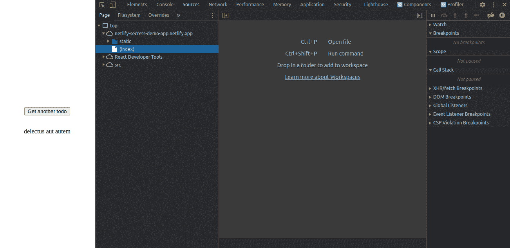
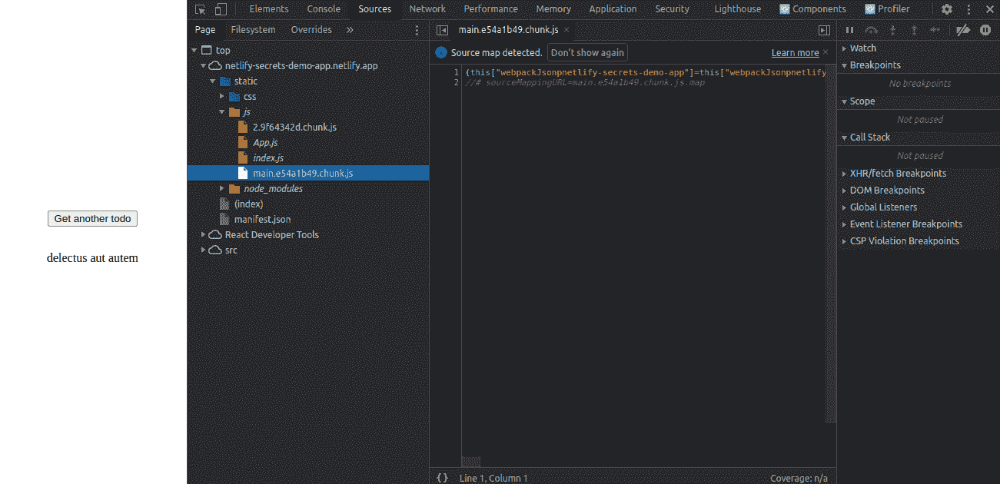
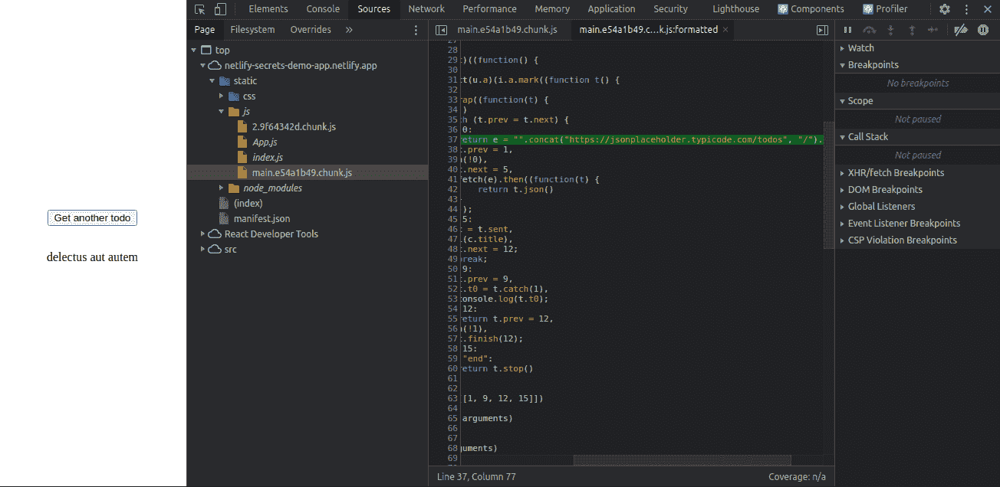
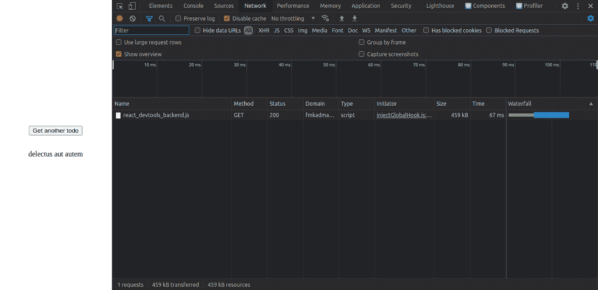
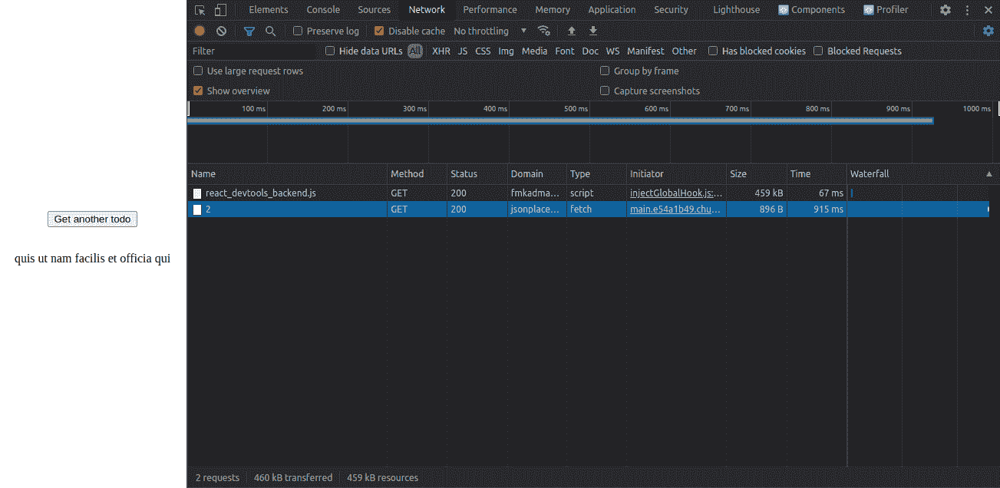
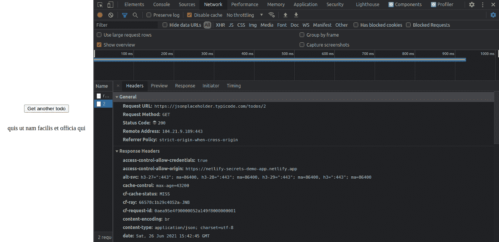

# 如何在 React 应用程序中使用 Netlify 函数安全地访问秘密 API 密钥

> 原文：<https://www.freecodecamp.org/news/how-to-access-secret-api-keys-using-netlify-functions-in-a-react-app/>

在本文中，您将了解如何在 React 应用程序中使用 Netlify 函数安全地访问秘密 API 密钥。

Netlify 提供了丰富的特性，可以帮助你轻松地部署使用框架构建的单页面应用程序，如 [React](https://reactjs.org/) 、 [Vue](https://v3.vuejs.org/) 和 [Angular](https://angular.io/) 等等。这消除了编码和维护服务器端代码的负担。

在某些情况下，前端应用程序需要与外部第三方 API 进行通信。一些第三方 API 需要秘密的 API 密钥来访问。

让我们想象一个场景，你想在你的前端应用程序中包含天气警报。因此，你注册了[开放天气地图](https://openweathermap.org/api) API 的付费计划，该计划需要一个秘密的 API 密钥才能访问。

在这种情况下，您需要小心确保不要在前端暴露秘密的 API 密钥。

Netlify 在其 web 用户界面上提供了可以用来隐藏 API 键的功能。但是如果从前端代码访问存储 API 密钥的环境变量，则可以从客户端访问 API 密钥。

## 你将从这篇文章中学到什么

在本文中，您将在 Netlify UI 上隐藏秘密 API 密钥，并在 react 应用程序中使用 Netlify 函数安全地访问它，React 应用程序是使用 [create-react-app(CRA)](https://create-react-app.dev/) 创建的。使用 Netlify 函数可以确保 API 密钥不会暴露在客户端。

对于其他框架来说，这个过程应该是相似的，尽管在本文中我们使用的是 [React](https://reactjs.org/) 。

在本文结束时，您将能够做到以下几点:

*   向 React 应用程序添加网络功能
*   使用 Netlify 函数安全地访问秘密 API 密钥
*   使用 [netlify-cli](https://docs.netlify.com/cli/get-started/) 工具测试您的 netlify 函数

## 先决条件

下面列出了本文的一些先决条件。值得指出的是，即使你不一一核对，你仍然可以跟上。

如果你有不明白的地方，可以谷歌一下，或者在 [freeCodeCamp 论坛](https://forum.freecodecamp.org/)上发表问题。我们很乐意帮忙。

*   至少对 [JavaScript](https://developer.mozilla.org/en-US/docs/Web/JavaScript) 、 [React](https://reactjs.org/) 框架，以及 [Git](https://git-scm.com/) 这样的版本控制系统有一个基本的了解。
*   在您的机器上安装[节点](https://nodejs.org/en/)。如果您没有安装它，您可以从[节点下载页面](https://nodejs.org/en/download/)为您的系统下载它。
*   在你的机器上安装 [Git](https://git-scm.com/) 。如果你没有安装，你可以从 [Git 下载页面](https://git-scm.com/downloads)安装。
*   安装一个类似于 [VS code](https://code.visualstudio.com/) 或 [Atom](https://atom.io/) 的文本编辑器。
*   有一个净账户。如果你没有，你可以用你的电子邮件地址免费注册[。](https://app.netlify.com/signup)
*   对 Netlify 的[持续部署](https://docs.netlify.com/site-deploys/create-deploys/#deploy-with-git)特性有一个基本的了解。您将使用它将 React 应用程序部署到来自 [GitHub](https://github.com/) 的 Netlify。
*   拥有一个 [GitHub](https://github.com/) 账户，因为我们将使用 Netlify 的[连续部署](https://docs.netlify.com/site-deploys/create-deploys/#deploy-with-git)功能。如果你没有账户，你可以用你的邮箱地址[注册](https://github.com/)。

## 如何在使用`create-react-app`创建的 React 应用程序中使用环境变量

在本节中，您将学习如何在使用 [`CRA`](https://create-react-app.dev/) 创建的 React 应用程序中使用环境变量。如果您已经熟悉如何做到这一点，那么您可以跳到下一节。

使用 [CRA](https://create-react-app.dev/) 创建的 React 应用程序经过配置，因此您可以在`.env`文件中创建自定义环境变量，然后使用`process.env`在您的代码库中访问它们。

要使用此功能，您可以遵循以下步骤。这些步骤假设你已经使用 [CRA](https://create-react-app.dev/) 创建了一个 React 应用。

### 步骤 1 -在项目目录的根目录下创建一个`.env`文件

首先在项目目录的根目录下创建一个`.env`文件。然后，您可以在`.env`文件中添加您的环境变量，使它们看起来像下面这样。

```
REACT_APP_FIRST_SECRET=12345678
REACT_APP_SECOND_SECRET=123456789 
```

在上面的`.env`文件中，环境变量是`REACT_APP_FIRST_SECRET`和`REACT_APP_SECOND_SECRET`。它们对应的值在右边。在对 [CRA](https://create-react-app.dev/) 使用环境变量时，您需要注意一些事情:

*   环境变量应该总是以`REACT_APP`开头，然后是变量名，这样它才能工作。例如，您可以将包含 API 键的变量命名为`REACT_APP_API_KEY`。
*   `=`前后不应有空格。

### 步骤 2 -使用`process.env`访问应用程序中的环境变量

然后，您可以使用`process.env.REACT_APP_FIRST_SECRET`和`proces.env.REACT_APP_SECOND_SECRET`在 React 应用程序中访问这些环境变量。这些变量在构建时被添加到您的代码库中，因此如果您在`localhost`上运行应用程序，您应该重启开发服务器以使更改生效。

像这样访问环境变量可以防止您将您的秘密 API 密钥推送到远程 Git 托管服务，如 [GitHub](https://github.com/) 。

[CRA](https://create-react-app.dev/) 默认添加`.gitignore`文件。您只需要将`.env`文件添加到其中，这样当您提交更改时，Git 将忽略您的`.env`文件。

您刚刚学到的关于环境变量的知识将在开发中保护您的秘密。

但是，如果您在生产中做同样的事情，因为环境变量是在构建时添加到您的代码库中的，会发生什么呢？下一节将回答这个问题。

## 从使用`creat-react-app`创建的 React 应用程序访问环境变量会暴露您的 API 键

是的，确实如此。不幸的是，一些绝对的初学者不这么认为。包括我刚开始的时候。但是即使是 [create-react-app 文档](https://create-react-app.dev/)也指出:

> 环境变量被嵌入到构建中，这意味着任何人都可以通过检查应用程序的文件来查看它们-[create-react-app documentation](https://create-react-app.dev/)

为了说明这一点，我构建了一个简单的演示应用程序,并将其部署到 Netlify。这是一个简单的 React 应用程序，使用 [CRA](https://create-react-app.dev/) 创建。如果你有兴趣，你可以分叉[项目库](https://github.com/nibble0101/netlify-secrets-demo-app)并在你的账户下部署 app 到 Netlify。

在这个应用程序中，我从 [JSON placeholder API](https://jsonplaceholder.typicode.com/todos) 中获取一个占位符 todo 项，然后显示给用户。

JSON 占位符 API 不需要 API 键来访问。但是在这个例子中，我使用基本 URL 作为我不想暴露的“秘密”。

大多数基于 web 的 API 要求在授权用户时将 API 键作为查询参数传递。在部署应用程序时，我已经在 Netlify 的 web 界面上将`REACT_APP_TODO_BASE_URL`的值设置为`https://jsonplaceholder.typicode.com/todos`。

有两种方法可以从前端访问我隐藏在环境变量中的值:

1.  通过检查应用程序的代码库
2.  通过检查 [Chrome DevTools](https://developer.chrome.com/docs/devtools/) 中的网络选项卡

### 如何检查应用程序的代码库

要检查应用程序的代码库，请执行以下步骤:

1.  导航到已部署的[演示应用](https://netlify-secrets-demo-app.netlify.app/)。
2.  打开浏览器开发工具。您可以通过按下 Chrome 上的组合键`CTRL + SHIFT + I`或右键单击然后选择 Chrome 中的 Inspect 选项来打开它们。点击`Sources`选项卡。如果`Sources`标签被激活，这就是我在 Chrome 中看到的样子。不过在其他浏览器中可能会有所不同。
    
3.  在`Sources`选项卡中，您应该会看到`Page`选项卡下的`top`文件夹。然后沿着路径`top/netlify-secrets-demo-app.netlify.app/static/js/main.e54a1b49.chunk.js`从`top`文件夹导航到`main.e54a1b49.chunk.js`。`main.e54a1b49.chunk.js`是一个不可读的单行小型文件。
    
4.  点击面板左下方的`{}`符号，以易读的格式打印代码。
5.  我们隐藏在环境变量中的秘密就在代码库中的第 37 行，如下图所示。
    

### 如何检查[开发工具](https://developer.chrome.com/docs/devtools/)中的网络选项卡

1.  导航到已部署的[演示应用](https://netlify-secrets-demo-app.netlify.app/)
2.  打开浏览器开发工具，然后打开网络选项卡。chrome 中的网络选项卡应该如下图所示。在其他浏览器中可能会有所不同。
    
3.  点击浏览器中的`Get another todo`按钮。您应该能够在打开的面板中看到另一行，表明已经发出了另一个请求。我的如下图所示。
    
4.  单击最后一行。将打开另一个面板，显示请求和响应标题。我们的“秘密”又一次暴露了。
    

从上面可以看出，您的 API 密匙可能在已经提交给 [GitHub](https://github.com/) 的代码库中不可见，但是在客户端仍然可以访问。现在你知道如果你的钥匙是付费计划会发生什么了。

为了使您的密钥保密，您需要使用 [Netlify 函数](https://www.netlify.com/products/functions/)来访问您的环境变量。

在下一节中，您将学习如何使用 Netlify 函数安全地访问环境变量。您将通过向 React 应用程序添加 Netlify 函数，然后将其部署到 Netlify 来实现这一点。

## 如何使用网络函数安全地访问环境变量

在本节中，您将派生一个使用 [CRA](https://create-react-app.dev/) 创建的简单 React 应用程序，然后向其添加一个 Netlify 函数。然后，您将使用您的函数来访问环境变量，而不是从您的前端代码访问它。

这将确保您不会暴露您的秘密 API 密钥，如上一节所述。然后，您将使用 Netlify 的[连续部署](https://docs.netlify.com/site-deploys/create-deploys/#deploy-with-git)功能将应用程序部署到 Netlify。

### 什么是网络函数？

这是一个可以用来执行服务器端代码的函数，而不必部署自己的服务器。

根据[文档](https://docs.netlify.com/functions/overview/)，如果你使用 Netlify 函数，你就间接使用了 AWS 的无服务器 Lambda 函数，这些函数用于运行按需的服务器端代码，而不必运行专用的服务器。

以下是您可能需要使用 Netlify 函数的一些原因。

*   从 API 获取实时数据
*   返回动态图像
*   发送自动电子邮件

要开始使用 Netlify 函数，在项目目录的根目录下创建一个文件夹，并将其命名为`netlify`。

在 Netlify 文件夹中，您必须创建另一个名为`functions`的文件夹。在`functions`文件夹中，您可以创建一个包含执行您的代码的函数的文件。因此，包含您的函数的文件的路径应该是`netlify/functions`。

这是 Netlify 查找函数的默认位置。如果您想要更改您的函数在`netlify`文件夹中的目录，那么您需要将该信息添加到项目目录根目录下的`netlify.toml`配置文件中，以便 Netlify 知道在哪里可以找到它们。

使用`netlify.toml`超出了本文的范围。我们将使用默认配置。

下面是一个 Netlify 函数的样子。假设我已经在`netlify/functions`中创建了一个`todo.js`文件，并在其中添加了下面的代码。

```
const axios = require("axios");

exports.handler = async function (event, context) {
  //Securely access environment variables here
}; 
```

您会注意到该函数有两个参数，`event`和`context`。如果函数需要一个依赖项，请确保将它添加到项目的`package.json`文件中。

在这种情况下，我添加了`axios`作为依赖项。每当我们点击`netlify/functions/todo`端点时，这个函数就会被执行。

触发 Netlify 函数还有其他方法，但是对于本文，让我们集中讨论最简单的用例。

从前端传来的数据可以在`event`参数中访问。在函数体中，您可以做任何您想做的事情，包括安全地访问您的 API 密钥和将数据发送回前端。

这就是你开始使用 Netlify 函数所需要知道的。如果你想更深入地研究，探索你还能用它们做什么，看看[文档](https://docs.netlify.com/functions/overview/)。

现在你已经理解了 [Netlify 函数](https://docs.netlify.com/functions/overview/)的基础，按照下面的步骤学习如何在代码库中实现它们。

您将派生出这个演示应用程序，然后为其添加 Netlify 函数。这是一个使用 [CRA](https://create-react-app.dev/) 创建的简单 React 项目。

### 步骤 1 -如何将项目放在你自己的 GitHub 账户下

在这一步，你将把[演示应用](https://github.com/nibble0101/netlify-secrets-demo-app)放在你自己的 GitHub 账户下。有必要将项目放在您的帐户下，以便您能够将它部署到 Netlify。

如果您对分叉项目不感兴趣，但是希望在您的项目中实现 Netlify 函数，那么跳到步骤 6。

如果您不知道如何派生 GitHub 存储库，您可以遵循 GitHub 文档的[how fork a repo](https://docs.github.com/en/get-started/quickstart/fork-a-repo)一节中描述的步骤。

### 步骤 2 -如何将项目克隆到您的本地机器上

在这一步中，您将通过运行下面的命令将项目克隆到您的本地机器上(假设您在您的 accoun 下创建了项目)。不要忘记用你的 GitHub 用户名替换`GITHUB_USER_NAME`。

```
git clone git@github.com:GITHUB_USER_NAME/netlify-secrets-demo-app.git 
```

或者

```
git clone https://github.com/GITHUB_USER_NANE/netlify-secrets-demo-app.git 
```

在成功地将项目克隆到您的机器上之后，您应该能够在项目被克隆的目录中看到包含您的项目的`netlify-secrets-demo-app`文件夹。

您可以导航到项目目录，并在您喜欢的文本编辑器中打开它。

在下一步中，您将安装依赖项。

### 步骤 3 -如何安装依赖项

在此步骤中，您将通过在终端上运行以下命令来安装依赖项。

```
npm install 
```

上述命令将安装您需要的依赖项。安装过程可能需要几分钟，因此您需要耐心等待。

在下一步中，您将创建一个`.env`文件并向其中添加环境变量。

### 步骤 4 -如何创建一个`.env`文件

在本步骤中，您将通过在终端上运行以下命令，在项目目录的根目录下创建一个`.env`文件:

```
touch .env 
```

您应该能够看到在项目目录的根目录下创建的`.env`文件。复制并粘贴`example.env`文件的内容到其中。

因为我们将使用 Netlify 函数来访问环境变量，所以不需要像本文开头所描述的那样在变量名前加上前缀`REACT_APP`。将`REACT_APP_TODO_BASE_URL`环境变量更改为`TODO_BASE_URL`，并将其值设置为`https://jsonplaceholder.typicode.com/todos`。

在下一步中，您将向您的应用程序添加 Netlify 函数。

### 步骤 5 -如何将网络功能添加到您的应用程序中

在此步骤中，您将向应用程序添加一个 Netlify 函数，并使用它来安全地访问您的环境变量。

正如我上面提到的，默认情况下，Netlify 将在`functions`目录中寻找您的函数，该目录必须位于`netlify`文件夹中。

如果您将函数保存在`netlify`文件夹中的不同目录中，那么您需要在项目目录根目录下的`netlify.toml`配置文件中提供附加信息。这将确保 Netlify 知道在哪里定位您的函数。但是在本文中，我们将使用 Netlify 默认配置。

在项目目录的根目录下创建一个文件夹，并将其命名为`netlify`。在`netlify`文件夹中创建另一个文件夹，命名为`functions`。在`functions`文件夹中，创建`todo.js`文件。

将以下代码复制并粘贴到`todo.js`文件中:

```
const axios = require("axios");

exports.handler = async function (event, context) {
  console.log(event);
  console.log(context);
  try {
    const { id } = event.queryStringParameters;
    const response = await axios.get(`${process.env.TODO_BASE_URL}/${id}`);
    return {
      statusCode: 200,
      body: JSON.stringify({ title: response.data.title }),
    };
  } catch (err) {
    return {
      statusCode: 404,
      body: err.toString(),
    };
  }
}; 
```

我们将从前端发送数据，作为查询字符串中参数`id`的值。它可以在`event`对象的`queryStringParameters`属性中访问。

你也可以`console.log`一下`event`和`context`参数，看看它们的属性是什么。

我们安全地访问环境变量，并使用`axios`来获取我们的 todo。如果成功，我们将返回一个响应对象，其`statusCode`为 200，响应对象的主体中包含数据。如果有一个错误，我们返回一个 404 的`statusCode`,这个错误被发送回响应对象的主体中。

您在上面添加的函数将通过`/.netlify/functions/todo`端点向您的前端代码公开。每当您点击`/.netlify/functions/todo`端点时，它就会被执行。现在让我们从前端执行这个函数。

导航到`src`文件夹中的`App.js`组件。在第 15 行的`useEffect`钩子中，我们没有访问前端的`process.env.`，而是向我们在上一步中声明的 Netlify 函数公开的端点发出了一个`GET`请求。

因此，将第 15 行从:

```
const url = `${process.env.REACT_APP_TODO_BASE_URL}/${todoId}`; 
```

收件人:

```
const url = `/.netlify/functions/todo?id=${todoId}`; 
```

您的`App.js`组件现在应该看起来像这样:

```
import { useEffect, useState } from "react";
import "./App.css";

function App() {
  const [todoId, setTodoId] = useState(1);
  const [todo, setTodo] = useState("");
  const [loading, setLoading] = useState(false);

  function getNewTodo() {
    setTodoId((todoId) => (todoId === 20 ? 1 : todoId + 1));
  }

  useEffect(() => {
    async function fetchTodo() {
      const url = `/.netlify/functions/todo?id=${todoId}`;
      try {
        setLoading(true);
        const todo = await fetch(url).then((res) => res.json());
        setTodo(todo.title);
      } catch (err) {
        console.log(err);
      } finally {
        setLoading(false);
      }
    }
    fetchTodo();
  }, [todoId]);

  return (
    <div className="App">
      <p>
        <button onClick={getNewTodo}> Get another todo </button>
      </p>
      <p>{loading ? "Loading..." : todo}</p>
    </div>
  );
}

export default App; 
```

在上面的代码中，我们将`todo`和`todoId`存储在 state 中。请注意，我们对`useEffect`钩子中的`/.netlify/functions/todo`端点发出的`GET`请求。我们将传递`todoId`作为查询参数`id`的值。

发出获取请求后，我们的`todo.js`函数将被调用。如上所述，在`todo.js`内部，我们将访问环境变量并获取函数返回的 todo，供前端代码使用。这使我们的环境变量保持安全，因为它不能从前端访问。前端只消耗函数返回的内容。

在下一步中，您将测试您刚刚定义的函数是否按预期工作。

### 步骤 6 -如何测试你的网络功能

在这一步中，您将使用 [netlify-cli](https://docs.netlify.com/cli/get-started/) 来测试您定义的函数是否按预期工作。

运行下面的命令来全局安装`netlify-cli`。安装需要一些时间，请耐心等待:

```
npm install netlify-cli -g 
```

在`netlify-cli`被全局安装后，运行这个命令来测试您的功能:

```
netlify dev 
```

成功运行上述命令将在端口 8888 上启动一个本地开发服务器。当您的功能被调用时，您还会看到控制台上打印的`event`和`context`参数。

您也可以通过在另一个终端上运行下面的命令来测试该功能。在运行下面的命令之前，请确保服务器正在运行，否则会出现错误。

```
netlify functions:invoke --querystring "id=1" 
```

该命令将使用指定的查询字符串调用函数。系统将提示您在终端上进行一些选择。只需按回车键。

成功运行上述命令将获取我们的 todo，然后打印在终端上。

```
{"title":"delectus aut autem"} 
```

下一步，您将在本地机器上将项目部署到 GitHub。

### 步骤 7 -如何提交您的更改并推送到 GitHub

在这一步中，您将提交本地机器上的更改，并使用下面的命令将它们推送到 GitHub。

```
git commit -m "Add netlify functions"
git push origin master 
```

下一步，您将使用 netlify 的[continuous ce deployment](https://docs.netlify.com/site-deploys/create-deploys/#deploy-with-git)特性从 GitHub 部署应用程序。

### 步骤 8 -如何从 GitHub 将应用程序部署到 Netlify

在这一步，您将使用 Netlify 的[连续部署](https://docs.netlify.com/site-deploys/create-deploys/#deploy-with-git)特性从 GitHub 进行部署。

此步骤要求您拥有一个 Netlify 帐户。如果您还没有注册，您可以从[注册页面](https://app.netlify.com/signup)免费注册。

登录您的 Netlify 帐户，并按照文档中描述的流程将 GitHub 存储库链接到 Netlify 以进行持续部署[。在将应用程序部署到 Netlify 时，不要忘记添加环境变量`TODO_BASE_URL`并将其值设置为高级设置下的`https://jsonplaceholder.typicode.com/todos`。](https://docs.netlify.com/configure-builds/get-started/#basic-build-settings)

现在你知道了！这就是使用 Netlify 函数隐藏秘密 API 密钥的方法。我希望你喜欢读这篇文章。

## 结论

在本文中，我们学习了如何:

*   向 React 应用程序添加网络功能
*   使用 Netlify 函数安全地访问秘密 API 密钥
*   使用 [netlify-cli](https://docs.netlify.com/cli/get-started/) 工具测试您的 netlify 函数

有了 netlify 的无服务器功能，你可以发送电子邮件，像我们刚刚做的那样从 API 获取数据，等等。它为前端开发人员提供了编写后端代码的工具，而不用担心服务器维护。

您可以在文档的[函数部分探索更多关于 Netlify 函数的内容。](https://docs.netlify.com/functions/overview/)

最后，如果你对本文内容有任何疑问，欢迎在 [freeCodeCamp 论坛](https://forum.freecodecamp.org/)或在 [Twitter](https://twitter.com/MJMAWA) 上给我发消息。你也可以在[网络生活论坛](https://answers.netlify.com/)提出你的问题。

感谢阅读！