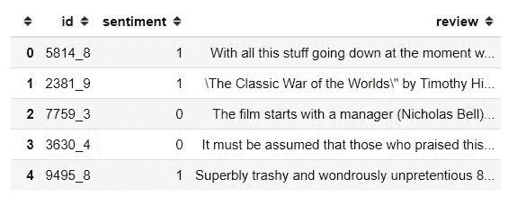
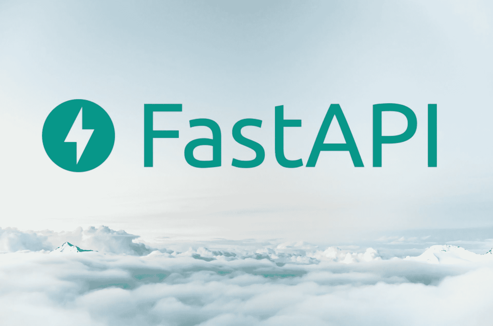
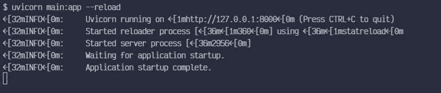
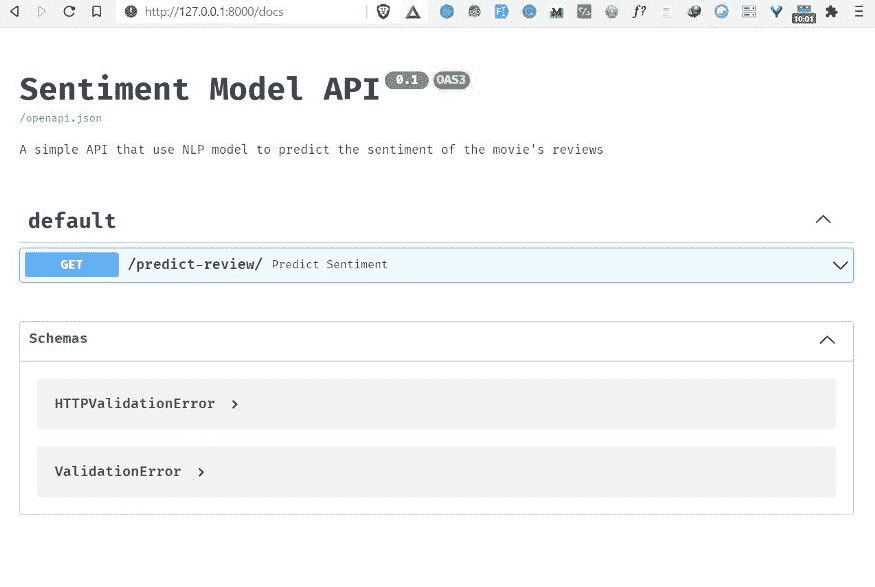
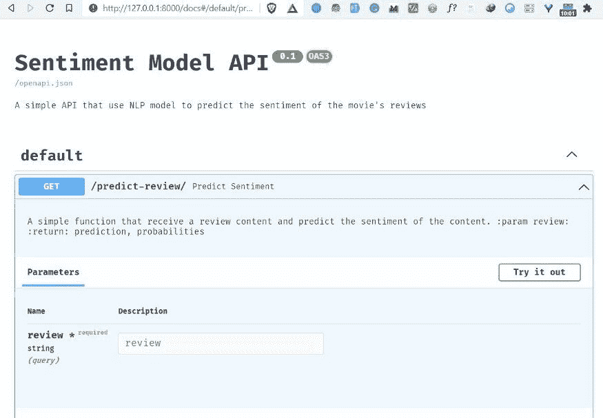
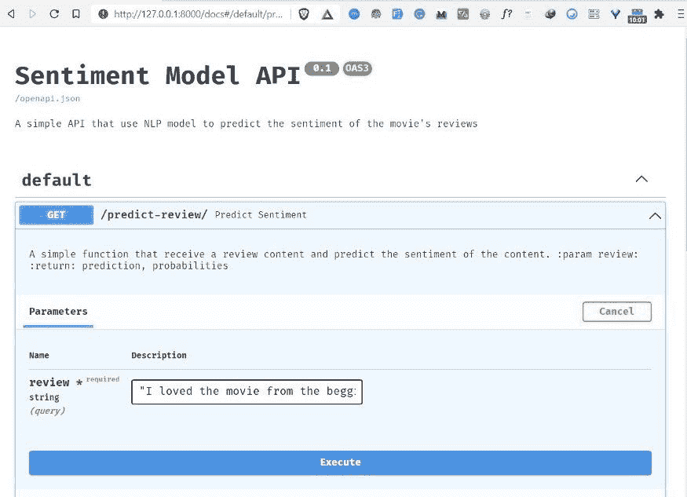
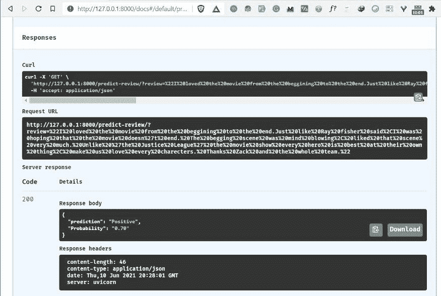

# 如何用 FastAPI 部署 NLP 模型

> 原文：<https://www.freecodecamp.org/news/how-to-deploy-an-nlp-model-with-fastapi/>

如果你从事自然语言处理，知道如何部署模型是你需要掌握的最重要的技能之一。

模型部署是将模型集成到现有生产环境中的过程。该模型将接收输入，并为特定用例的决策预测输出。

> “只有当一个模型与业务系统完全集成时，我们才能从它的预测中提取真正的价值”。——克里斯托弗·萨米乌拉

你可以通过不同的方式将你的 [NLP](https://hackernoon.com/your-guide-to-natural-language-processing-nlp-dw8g360f?ref=hackernoon.com) 模型部署到产品中，比如使用 Flask、Django、Bottle 或其他框架。但是在今天的文章中，您将学习如何使用 ****FastAPI 构建和部署您的 NLP 模型。****

在本文中，您将了解到:

*   如何建立一个将 IMDB 电影评论分类成不同情绪的 NLP 模型？
*   什么是 FastAPI，如何安装？
*   如何用 FastAPI 部署您的模型？
*   如何在任何 Python 应用程序中使用您部署的 NLP 模型。

所以让我们开始吧。🚀

## 如何建立自然语言处理模型

首先，我们需要建立我们的 NLP 模型。我们将使用 [IMDB 电影数据集](https://www.kaggle.com/c/word2vec-nlp-tutorial/data?ref=hackernoon.com)来构建一个简单的模型，该模型可以分类电影评论是正面还是负面。下面是你应该遵循的步骤。

### 导入重要的包

首先，我们需要导入一些 Python 包来加载数据，清理数据，创建机器学习模型(分类器)，并保存模型以进行部署。

```
# import important modules
import numpy as np
import pandas as pd
# sklearn modules
from sklearn.model_selection import train_test_split
from sklearn.pipeline import Pipeline
from sklearn.naive_bayes import MultinomialNB # classifier 
from sklearn.metrics import (
    accuracy_score,
    classification_report,
    plot_confusion_matrix,
)
from sklearn.feature_extraction.text import TfidfVectorizer, CountVectorizer
# text preprocessing modules
from string import punctuation 
# text preprocessing modules
from nltk.tokenize import word_tokenize
import nltk
from nltk.corpus import stopwords
from nltk.stem import WordNetLemmatizer 
import re #regular expression
# Download dependency
for dependency in (
    "brown",
    "names",
    "wordnet",
    "averaged_perceptron_tagger",
    "universal_tagset",
):
    nltk.download(dependency)

import warnings
warnings.filterwarnings("ignore")
# seeding
np.random.seed(123
```

从数据文件夹加载数据集:

```
# load data
data = pd.read_csv("../data/labeledTrainData.tsv", sep='\t')
```

然后展示数据集的一个样本:

```
# show top five rows of data
data.head()
```



我们的数据集有 3 列:

*   ****Id**** —这是评论的 Id
*   ****情绪**** —要么积极(1)，要么消极(0)
*   ****回顾**** —评论电影

接下来，让我们检查数据集的形状:

```
# check the shape of the data
data.shape
```

(25000, 3)

该数据集有 25，000 条评论。

现在我们需要检查数据集是否有任何缺失值:

```
# check missing values in data
data.isnull().sum()
```

id 0
感悟 0
回顾 0
dtype: int64

输出显示我们的数据集没有任何缺失值。

### 如何评价班级分布

我们可以使用 Pandas 包中的 ****`value_counts()`**** 方法来评估数据集的类分布。

```
# evalute news sentiment distribution
data.sentiment.value_counts()
```

1 12500
0 12500
名称:情操，数据类型:int64

在这个数据集中，我们有相同数量的正面和负面评论。

### 如何处理数据

在分析数据集之后，下一步是在创建我们的机器学习模型之前，将数据集预处理成正确的格式。

这个数据集中的评论包含了很多我们在创建机器学习模型时不需要的不必要的单词和字符。

我们将通过删除停用字词、数字和标点来清理邮件。然后我们将使用 NLTK 包中的词汇化过程将每个单词转换成它的基本形式。

****`text_cleaning()`**** 函数将处理所有必要的步骤来清理我们的数据集。

```
stop_words =  stopwords.words('english')
def text_cleaning(text, remove_stop_words=True, lemmatize_words=True):
    # Clean the text, with the option to remove stop_words and to lemmatize word
    # Clean the text
    text = re.sub(r"[^A-Za-z0-9]", " ", text)
    text = re.sub(r"\'s", " ", text)
    text =  re.sub(r'http\S+',' link ', text)
    text = re.sub(r'\b\d+(?:\.\d+)?\s+', '', text) # remove numbers

    # Remove punctuation from text
    text = ''.join([c for c in text if c not in punctuation])

    # Optionally, remove stop words
    if remove_stop_words:
        text = text.split()
        text = [w for w in text if not w in stop_words]
        text = " ".join(text)

    # Optionally, shorten words to their stems
    if lemmatize_words:
        text = text.split()
        lemmatizer = WordNetLemmatizer() 
        lemmatized_words = [lemmatizer.lemmatize(word) for word in text]
        text = " ".join(lemmatized_words)

    # Return a list of words
    return(text)
```

现在我们可以通过使用 ****text_cleaning()**** 函数来清理我们的数据集:

```
#clean the review
data["cleaned_review"] = data["review"].apply(text_cleaning)
```

然后将数据分成特征变量和目标变量，如下所示:

```
#split features and target from  data 
X = data["cleaned_review"]
y = data.sentiment.values
```

我们用于训练的特征是 ****`cleaned_review`**** 变量，目标是 ****`sentiment`**** 变量。

然后，我们将数据集分成训练和测试数据。测试规模是整个数据集的 15%。

```
# split data into train and validate
X_train, X_valid, y_train, y_valid = train_test_split(
    X,
    y,
    test_size=0.15,
    random_state=42,
    shuffle=True,
    stratify=y,
)
```

### 如何创建 NLP 模型

我们将训练多项式[朴素贝叶斯](https://www.freecodecamp.org/news/how-naive-bayes-classifiers-work/)算法来分类评论是正面还是负面。这是文本分类最常用的算法之一。

但是在训练模型之前，我们需要将我们清理过的评论转换成数值，以便模型能够理解这些数据。

在这种情况下，我们将从 scikit-learn 中使用 [****`TfidfVectorizer`**** 的方法。TfidfVectorizer 将帮助我们将一组文本文档转换为 TF-IDF 特征矩阵。](https://www.freecodecamp.org/news/how-to-extract-keywords-from-text-with-tf-idf-and-pythons-scikit-learn-b2a0f3d7e667/)

为了应用这一系列步骤(预处理和训练)，我们将使用来自 scikit-learn 的一个[管道类](https://scikit-learn.org/stable/modules/generated/sklearn.pipeline.Pipeline.html?ref=hackernoon.com)，它顺序应用一系列转换和一个最终估计器。

```
# Create a classifier in pipeline
sentiment_classifier = Pipeline(steps=[
                               ('pre_processing',TfidfVectorizer(lowercase=False)),
                                 ('naive_bayes',MultinomialNB())
                                 ])
```

然后我们像这样训练我们的分类器:

```
# train the sentiment classifier 
sentiment_classifier.fit(X_train,y_train)
```

然后，我们根据验证集创建一个预测:

```
# test model performance on valid data 
y_preds = sentiment_classifier.predict(X_valid)
```

将使用 ****`accuracy_score`**** 评估指标来评估模型的性能。我们使用 accuracy_score 是因为我们在情感变量中有相同数量的类。

```
accuracy_score(y_valid,y_preds)
```

0.8629333333333333

我们的模型的准确度在 ****86.29%**** 左右，这是很好的性能。

### 如何保存模型管线

我们可以使用 ****`joblib`**** Python 包将模型管道保存在模型的目录下。

```
#save model 
import joblib 
joblib.dump(sentiment_classifier, '../models/sentiment_model_pipeline.pkl')
```

现在我们已经构建了 NLP 模型，让我们学习如何使用 FastAPI。

## 什么是 FastAPI？

FastAPI 是一个快速的现代 Python web 框架，用于构建不同的[API](https://hackernoon.com/how-to-use-the-requests-python-library-to-make-an-api-call-and-save-it-as-a-pandas-dataframe-z43k33rm?ref=hackernoon.com)。它提供了更高的性能，更容易编码，并且提供了自动和交互式的文档。



FastAPI 建立在两个主要的 Python 库 ****— Starlette**** (用于 web 处理)和 ****Pydantic**** (用于数据处理和验证)。与 Flask 相比，FastAPI 非常快，因为它将异步函数处理程序带到了表中。

如果你想了解 FastAPI 的更多信息，我推荐你阅读 Sebastián Ramírez 的这篇文章。

在本文中，我们将尝试使用 FastAPI 的一些特性来服务于我们的 NLP 模型。

### 如何安装 FastAPI

首先，确保你安装了最新版本的 FastAPI(带 pip):

```
pip install fastapi
```

你还需要一个 ASGI 服务器用于生产，比如[uvicon](http://www.uvicorn.org/?ref=hackernoon.com)。

```
pip install uvicorn
```

## 如何用 FastAPI 部署 NLP 模型

在本节中，我们将使用 FastAPI 将我们训练过的 [NLP](https://www.freecodecamp.org/news/learn-natural-language-processing-no-experience-required/) 模型部署为 REST API。我们将把 API 的代码保存在一个名为 ****main.py**** 的 Python 文件中。这个文件将负责运行我们的 FastAPI 应用程序。

### 导入包

第一步是导入将帮助我们构建 FastAPI 应用程序和运行 NLP 模型的包。

```
# text preprocessing modules
from string import punctuation 
# text preprocessing modules
from nltk.tokenize import word_tokenize
import nltk
from nltk.corpus import stopwords
from nltk.stem import WordNetLemmatizer
import re  # regular expression
import os
from os.path import dirname, join, realpath
import joblib
import uvicorn
from fastapi import FastAPI
```

### 如何初始化 FastAPI 应用程序实例

我们可以使用以下代码来初始化 FastAPI 应用程序:

```
app = FastAPI(
    title="Sentiment Model API",
    description="A simple API that use NLP model to predict the sentiment of the movie's reviews",
    version="0.1",
)
```

如您所见，我们已经定制了 FastAPI 应用程序的配置，包括:

*   API 的标题
*   API 的描述。
*   API 的版本。

### 如何加载 NLP 模型

为了加载 NLP 模型，我们将使用 ****`joblib.load()`**** 方法并将路径添加到模型目录中。NLP 模型的名称是 ****`sentiment_model_pipeline.pkl`**** :

```
# load the sentiment model
with open(
    join(dirname(realpath(__file__)), "models/sentiment_model_pipeline.pkl"), "rb"
) as f:
    model = joblib.load(f)
```

### 如何定义一个函数来清理数据

我们将使用第 1 部分中的同一个函数 ****`text_cleaning()`**** ，它通过删除停用词、数字和标点来清除评论数据。最后，我们将通过使用 [NLTK 包](https://www.freecodecamp.org/news/natural-language-processing-tutorial-with-python-nltk/)中的词汇化过程将每个单词转换成它的基本形式。

```
def text_cleaning(text, remove_stop_words=True, lemmatize_words=True):
    # Clean the text, with the option to remove stop_words and to lemmatize word
    # Clean the text
    text = re.sub(r"[^A-Za-z0-9]", " ", text)
    text = re.sub(r"\'s", " ", text)
    text = re.sub(r"http\S+", " link ", text)
    text = re.sub(r"\b\d+(?:\.\d+)?\s+", "", text)  # remove numbers
    # Remove punctuation from text
    text = "".join([c for c in text if c not in punctuation])
    # Optionally, remove stop words
    if remove_stop_words:
        # load stopwords
        stop_words = stopwords.words("english")
        text = text.split()
        text = [w for w in text if not w in stop_words]
        text = " ".join(text)
    # Optionally, shorten words to their stems
    if lemmatize_words:
        text = text.split()
        lemmatizer = WordNetLemmatizer()
        lemmatized_words = [lemmatizer.lemmatize(word) for word in text]
        text = " ".join(lemmatized_words)
    # Return a list of words
    return text
```

### 如何创建预测端点

下一步是用 GET 请求方法添加我们的预测端点“ ****/predict-review**** ”。

```
@app.get("/predict-review")
```

> API 端点是两个系统交互时通信通道的入口点。它指的是 API 和服务器之间的通信接触点。

然后我们为这个端点定义一个预测函数。该功能的名称是 ****`predict_sentiment()`**** 带评审参数。

predict _ perspective()函数将执行以下任务:

*   收到影评。
*   使用 ****text_cleaning()**** 功能清理电影评论。
*   使用我们的 NLP 模型进行预测。
*   将预测结果保存在 ****输出**** 变量中(0 或 1)。
*   将预测的概率保存在 ****probas**** 变量中，并格式化为两位小数。
*   最后，返回预测和概率结果。

```
@app.get("/predict-review")
def predict_sentiment(review: str):
    """
    A simple function that receive a review content and predict the sentiment of the content.
    :param review:
    :return: prediction, probabilities
    """
    # clean the review
    cleaned_review = text_cleaning(review)

    # perform prediction
    prediction = model.predict([cleaned_review])
    output = int(prediction[0])
    probas = model.predict_proba([cleaned_review])
    output_probability = "{:.2f}".format(float(probas[:, output]))

    # output dictionary
    sentiments = {0: "Negative", 1: "Positive"}

    # show results
    result = {"prediction": sentiments[output], "Probability": output_probability}
    return result
```

以下是 ****main.py**** 文件中的所有代码块:

```
# text preprocessing modules
from string import punctuation
# text preprocessing modules
from nltk.tokenize import word_tokenize
import nltk
from nltk.corpus import stopwords
from nltk.stem import WordNetLemmatizer
import re  # regular expression
import os
from os.path import dirname, join, realpath
import joblib
import uvicorn
from fastapi import FastAPI 

app = FastAPI(
    title="Sentiment Model API",
    description="A simple API that use NLP model to predict the sentiment of the movie's reviews",
    version="0.1",
)

# load the sentiment model
with open(
    join(dirname(realpath(__file__)), "models/sentiment_model_pipeline.pkl"), "rb"
) as f:
    model = joblib.load(f)

# cleaning the data
def text_cleaning(text, remove_stop_words=True, lemmatize_words=True):
    # Clean the text, with the option to remove stop_words and to lemmatize word
    # Clean the text
    text = re.sub(r"[^A-Za-z0-9]", " ", text)
    text = re.sub(r"\'s", " ", text)
    text = re.sub(r"http\S+", " link ", text)
    text = re.sub(r"\b\d+(?:\.\d+)?\s+", "", text)  # remove numbers

    # Remove punctuation from text
    text = "".join([c for c in text if c not in punctuation])

    # Optionally, remove stop words
    if remove_stop_words:
        # load stopwords
        stop_words = stopwords.words("english")
        text = text.split()
        text = [w for w in text if not w in stop_words]
        text = " ".join(text)

    # Optionally, shorten words to their stems
    if lemmatize_words:
        text = text.split()
        lemmatizer = WordNetLemmatizer()
        lemmatized_words = [lemmatizer.lemmatize(word) for word in text]
        text = " ".join(lemmatized_words)

    # Return a list of words
    return text

@app.get("/predict-review")
def predict_sentiment(review: str):
    """
    A simple function that receive a review content and predict the sentiment of the content.
    :param review:
    :return: prediction, probabilities
    """
    # clean the review
    cleaned_review = text_cleaning(review)

    # perform prediction
    prediction = model.predict([cleaned_review])
    output = int(prediction[0])
    probas = model.predict_proba([cleaned_review])
    output_probability = "{:.2f}".format(float(probas[:, output]))

    # output dictionary
    sentiments = {0: "Negative", 1: "Positive"}

    # show results
    result = {"prediction": sentiments[output], "Probability": output_probability}
    return result
```

### 如何运行 API

以下命令将帮助我们运行我们创建的 FastAPI 应用程序。

```
uvicorn main:app --reload
```

下面是我们为 uvicorn 定义的运行 FastAPI 应用程序的设置。

*   ****main:**** 拥有 FastAPI app 的文件 main.py。
*   ****app:**** 在 main.py 内部用 app = FastAPI()行创建的对象。
*   ****—重新加载**** :每当我们修改代码时，使服务器自动重启。



FastAPI 提供了一个自动交互式 API 文档页面。要访问它，请在浏览器中导航至[****http://127 . 0 . 0 . 1:8000/docs****](http://127.0.0.1:8000/docs)，然后您将看到由 FastAPI 自动创建的文档页面。



文档页面显示了我们的 API 的名称、描述及其版本。它还显示了 API 中您可以与之交互的可用路线列表。

要进行预测，首先点击 ****预测-回顾**** 路线然后点击 ****按钮试走**** 。这允许您填充 review 参数并直接与 API 交互。



通过添加您选择的电影评论来填写评论栏。我补充了以下关于 2021 年上映的 ****【扎克·施奈德版正义联盟】**** 电影的影评。

> “我从头到尾都很喜欢这部电影。就像雷·费希尔说的，我希望这部电影不会结束。乞讨的场景令人兴奋，我非常喜欢那个场景。不像《正义联盟》这部电影展示了每个英雄最擅长自己的事情，让我们热爱每一个角色。谢谢扎克和整个团队。”

然后点击执行按钮进行预测，得到结果。



最后，来自 API 的结果显示，我们的 NLP 模型预测所提供的评论具有**正面情感，概率为 ****0.70**** :**

****

## **如何在任何 Python 应用程序中使用 NLP 模型**

**要在任何 Python 应用程序中使用我们的 NLP API，我们需要安装 requests Python 包。这个包将帮助我们向我们开发的 FastAPI 应用程序发送 HTTP 请求。**

**要安装请求包，请运行以下命令:**

```
`pip install requests`
```

**然后创建一个简单的 Python 文件叫做 ****`python_app.py`**** 。这个文件将负责发送我们的 HTTP 请求。**

**我们首先导入请求包:**

```
`import requests as r`
```

**补充一个关于 ****哥斯拉大战孔【2021】****电影的影评:**

```
`# add review
review = "This movie was exactly what I wanted in a Godzilla vs Kong movie. It's big loud, brash and dumb, in the best ways possible. It also has a heart in a the form of Jia (Kaylee Hottle) and a superbly expressionful Kong. The scenes of him in the hollow world are especially impactful and beautifully shot/animated. Kong really is the emotional core of the film (with Godzilla more of an indifferent force of nature), and is done so well he may even convert a few members of Team Godzilla."`
```

**然后在要传递给 HTTP 请求的关键参数中添加审查:**

```
`keys = {"review": review}`
```

**最后，我们向我们的 API 发送一个请求，对评论进行预测:**

```
`prediction = r.get("http://127.0.0.1:8000/predict-review/", params=keys)`
```

**然后我们可以看到预测结果:**

```
`results = prediction.json()

print(results["prediction"])
print(results["Probability"])`
```

**这将显示预测及其概率。结果如下:**

**正
0.54**

## **包扎**

**恭喜👏👏，你已经熬到这篇文章的结尾了。我希望您已经学到了一些新东西，现在知道如何用 FastAPI 部署您的 NLP 模型。**

**如果你想了解更多关于 FastAPI 的知识，我推荐你参加由[bitfuses](https://twitter.com/bitfumes?ref=hackernoon.com)创建的[完整 FastAPI 课程](https://www.youtube.com/watch?v=7t2alSnE2-I&ref=hackernoon.com)。**

**你可以在这里下载本文使用的[项目源代码。](https://github.com/Davisy/Deploy-NLP-Model-with-FastAPI)**

**如果你学到了新的东西或者喜欢阅读这篇文章，请分享给其他人看。在那之前，下一篇文章再见！。**

**你也可以在推特上找到我 [@Davis_McDavid](https://twitter.com/Davis_McDavid?ref=hackernoon.com)**