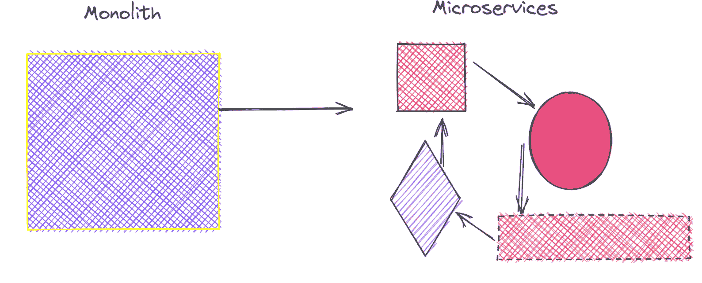
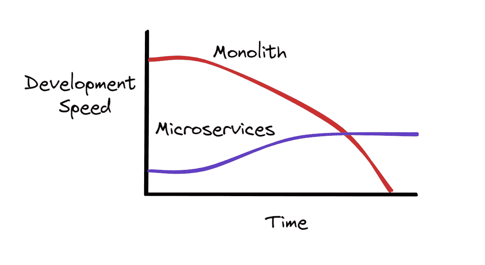
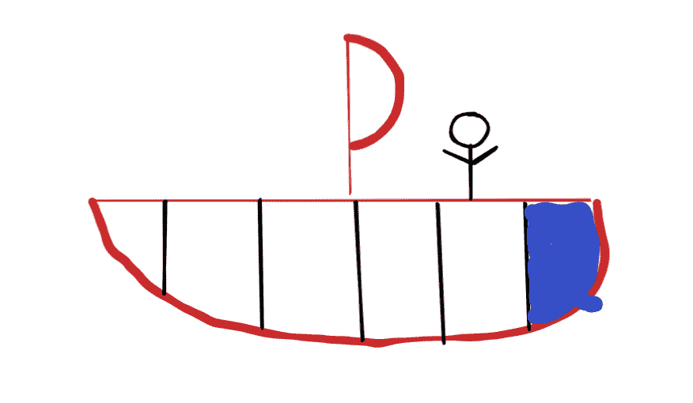
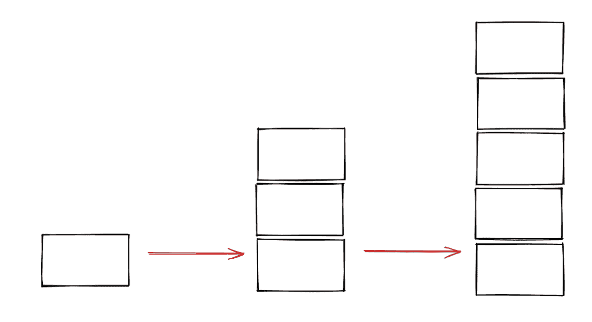

# 微服务架构——用简单的英语解释

> 原文：<https://www.freecodecamp.org/news/microservices-architecture-for-humans/>

在过去的几年里，微服务已经从一个被夸大的时髦词变成了一个软件工程师应该理解的东西。

根据 2020 年的一项奥赖利开发商调查:

*   61%的公司在去年使用了微服务
*   29%的受访者表示，他们公司至少有一半的系统是使用微服务构建的
*   74%的人说他们的团队拥有应用程序的构建/测试/部署阶段

随着微服务生态系统的成熟，这些数字只会继续增加，并使采用变得更加容易。

这并不意味着你需要成为微服务方面的专家才能得到一份工作，但至少了解基本的基本面绝对是一个加分项。

事实是，当你把它归结为基础时，微服务并不难理解。最大的问题是，大多数可用的资源都是为了打动读者而编写的，而不是真正教育他们。

另一个原因是，关于什么是微服务，甚至没有一个真正具体的定义。结果是有大量重叠的定义和术语，这导致试图了解微服务的人感到困惑。

在这篇文章中，我将拨开所有的干扰，专注于微服务的核心概念。我将使用各种真实世界的例子和隐喻来使抽象的概念和想法更容易理解。

以下是我们将要介绍的内容:

*   软件设计简史
*   独石的优点和缺点
*   微服务的优点和缺点

## 4 分钟微服务总结

如果你更喜欢微服务的快速介绍，可以先看这个视频:

[https://www.youtube.com/embed/l4tQ66mDfxU?feature=oembed](https://www.youtube.com/embed/l4tQ66mDfxU?feature=oembed)

## 如何用自己创业来类比理解微服务

假设你是一名软件工程师，决定开始做自由职业赚点钱。开始时，你有几个客户，事情进展顺利。你花了大部分时间写代码，客户很高兴。

但是随着时间的推移，随着业务的增长，你开始放慢速度。你花越来越多的时间做客户服务，回复电子邮件，为过去的客户做些小改变，以及其他对你的收入没有影响的任务。

你意识到作为一名软件工程师，你没有优化你的时间，所以你雇佣了一名专门的员工来处理客户服务。

随着您的不断发展，您会增加更多具有专业技能的员工。你雇佣了一个营销人员来专注于吸引新客户。你增加了项目经理、更多的软件工程师，最终增加了一个人力资源部门来帮助所有这些员工。

这一切都是必要的，让你的企业成长到超出你一个人的能力，但当然也有成长的烦恼。

有时，团队或部门之间存在沟通失误，当细节被遗漏时，客户会感到不安。当公司变得更大时，必须支付员工工资、团队之间的内部竞争以及许多其他问题都会产生直接成本。

这个例子在某种程度上代表了软件公司如何从整体架构转移到微服务架构。开始时由一个人做所有的工作，逐渐变成一个专业团队的集合，他们一起为公司实现一个共同的目标。

这与拥有单片技术的科技公司迁移到微服务架构的方式非常相似。虽然这些例子并不是微服务的完美一对一匹配，但一般问题是相同的:

1.  **扩展–**理想情况下，你希望能够快速雇佣新员工，并线性扩展公司的生产力。
2.  **沟通** -增加更多的员工会增加组织内协调和沟通的开销。有许多公司试图使用策略来提高效率，尤其是在这个远程工作的时代。
3.  专业化 -允许组织中的某些团队拥有自主权，以尽可能最有效的方式解决问题，而不是试图强制执行一个适用于所有情况的标准协议。某些客户可能有不同的需求，所以允许团队在处理事情时有一定的灵活性是有意义的。

## 如何从整体服务转向微服务

理解现在有助于理解过去。传统上，软件是以单一风格设计的，所有的东西都作为一个应用程序一起运行。像生活中的其他事情一样，这种应用方式也有利弊。

整体式服务器本质上并不坏——许多微服务倡导者实际上建议从整体式服务器开始，坚持使用，直到遇到问题。然后，随着时间的推移，你可以自然地将你的 monolith 分成微服务。

## 整体建筑的优势

### 最初开发时间更快

对于一个小团队，当你刚刚起步时，开发速度会非常快。

这是因为项目很小，每个人都了解整个应用程序，事情进展顺利。团队成员确切地知道一切是如何协同工作的，并且能够快速实现新的功能。

### 简单部署

因为 monoliths 是作为一个单元工作的，所以测试和记录之类的事情相当简单。与一堆独立的微服务相比，构建和部署单个整体也更容易。

## 整体建筑的缺点

尽管 monolithic 有早期的好处，但是随着公司的成长，由于他们的 monolithic 应用程序，他们经常会遇到一些组织和技术层面的问题。

### 模块的紧密耦合

大多数拥有整体应用程序的公司都试图通过用例将整体逻辑分解成功能模块，以保持事物的有序性。想想认证、评论、用户和博客帖子。

问题是，这需要极端的工程纪律来长期维持。当截止日期临近时，既定的规则往往会被抛弃。这导致在紧要关头走捷径，随着时间的推移，错综复杂的相互关联的代码积累成技术债务。

> 真实世界的例子——试图用巨石保持纪律就像坚持日常锻炼或节食一样。许多人很兴奋，并能在几周内保持饮食的纪律性，但最终生活会阻碍你，你会回到正常的生活。试图用 monoliths 实现松散耦合就像这样——在时间紧迫的时候，有太多的诱惑去偷工减料。

### 新员工入职变得困难

对于新员工来说，提高工作效率通常需要更长的时间，因为他们需要在冒险修改应用程序的任何一个部分之前，了解整体中所有相互关联的部分是如何协同工作的。

新员工说他们需要几个月的时间才能真正适应庞大的代码库，这种情况并不少见。总有一种潜在的恐惧，那就是每当你推出新代码时，它可能会毁掉整个应用程序。

> 现实世界的比较——训练某人做一个单一的任务，比如钉钉子，与训练某人在建筑工地上做每一个可能的任务。不得不教给新员工关于整个工作的一切，这增加了雇佣新员工的成本。

### 冲突的资源需求

在一个整体中，不同的模块可能有不同的硬件要求。一些任务可能是 CPU 密集型计算，其他任务可能需要大量 RAM。

但是因为整个应用程序必须在同一台服务器上运行，所以不能使用专用于某项任务的硬件类型。

> 现实世界的例子-某些类型的车辆更适合某些任务。如果你要去公路旅行，一辆省油的车是最好的选择，这样你可以节省油钱。如果你要搬进一个新公寓，最好有一辆有更多储物空间的车，这样你就不用跑那么多趟了。

### 一个小错误就能毁掉整个应用程序

因为应用程序是作为单个单元部署的，这意味着任何团队都可能意外地创建一个 bug，从而导致整个整体崩溃。

> 真实世界的例子——为了防止一次泄漏导致整艘船沉没，舱壁被用来在洪水开始时封闭部分。
> 
> 微服务的工作方式类似——每个服务都是独立于其他服务进行部署的，这可以减少一个 bug 搞垮整个应用程序的机会。

### 限制实验

当构建一个 monolith 时，你很难使用编写 monolith 的编程语言。一个简单的例子是低级编程语言和高级编程语言之间的权衡。

借助微服务架构，如果某项服务难以扩展，您可以选择用 C++或 Go 等性能更高的语言重写。

对于性能不是主要因素的其他服务，您可以通过使用 Python 或 JavaScript 之类的高级语言来提高开发速度。

一个整体架构也可能使团队看不到解决问题的替代方法。当你只有一把锤子时，一切看起来都像钉子。

> 现实世界的比较——披萨很棒，但是你可能不想在你的余生中每顿饭都吃披萨。此外，在某些情况下，烹饪和吃披萨比吃其他东西更不方便。有时候，吃点快餐或者吃点更健康的东西也不错。

### 部署可能会变得缓慢

上面列出的整体式建筑的一个优点最终会变成一个缺点。事实上，整个应用程序一起部署可能会成为大规模 monoliths 的一个问题，因为它可能会导致花很长时间来部署整个服务。这降低了团队迭代和更改应用程序的速度。

每次他们做出哪怕是很小的改变，他们都被迫等待应用程序构建和部署以进行测试。

> 真实世界的例子-你的梦想是做世界上最好的饼干。实现这一目标的最快方法是测试尽可能多批次的饼干，同时逐渐改变和改进配方，直到完美为止。现在想象你只有一个烤箱。与拥有 10 个烤箱相比，测试不同饼干食谱的速度要慢得多。

## 微服务的优势

现在你已经知道了整体架构风格的优缺点，让我们来看看微服务。

### 开发速度提高

因为您不再部署一个整体，所以团队在添加特性时能够更快地移动。团队可以有独立的发布时间表，不必担心与其他团队的协调。

只要其他微服务用来与团队服务交互的外部接口保持不变，开发团队就可以用另一种编程语言完全重写系统。

独立部署每个服务的另一个好处是，由于每个构建更小，所以构建更快。这意味着迭代时间也因为构建更快而得到了改进。

> 真实世界的例子——当你从一家餐馆购买食物时，只要食物味道好，你并不真的关心幕后是否有什么变化。也许他们有了新的烤箱或油炸锅，但只要食物味道一样，你就不用担心。作为外部消费者，唯一重要的是最终产品。

### 新员工入职速度更快

新员工可以学习一个单一的系统来启动和开始贡献。随着时间的推移，他们可以继续了解整个应用程序的更多信息，但这不是马上就必须的。

> 真实世界的例子——装配线通过分解东西来革新生产。每个员工不必知道如何从头开始创造一个完整的产品，他们只需要学习他们工作的单个部分。这减少了新员工的培训时间，并允许更好的规模。

### 容错

虽然微服务经常相互依赖来完成任务，但设计合理的微服务架构将具有内置的冗余和故障安全功能，以防止在另一个服务关闭时整个系统出现故障。

这通常包括重试请求，增加请求之间的等待时间，或者在服务不可用时返回默认的回退值。

> 真实世界的例子——如果网飞的推荐服务中断，向用户返回完整的失败消息是没有意义的。相反，网飞可以只返回一组默认的热门电影，并在后台不断重试推荐服务，直到它能够返回用户的定制推荐。

### 灵活的可扩展性

因为每个服务都是独立部署的，所以您也可以单独复制和扩展每个服务。如果是一个整体，公司将被迫扩展整个应用程序，尽管只有一个功能获得了比平常更多的流量。

借助微服务架构，公司可以专门扩展需要处理更多流量的服务，这样效率更高，并且可以节省资金，因为它减少了资源浪费。

> 现实世界的例子——让我们考虑一下亚马逊的网络星期一，会有比平时更多的订单，但大多数人可能已经选择了他们想要的东西，并放入他们的购物车。因此，尽管订单服务的流量会比平时多得多，但搜索服务和其他功能的使用率可能会保持在正常水平。

如果某项服务对于某项资源来说特别繁重，并且可以使用专门的硬件来完成这项任务，那么这一点就特别有用。

如果一项服务需要大量的 CPU 资源，但不需要太多的 RAM，公司可以通过不使用通用服务器来节省资金。使用纯整体服务器的公司别无选择，只能使用“万金油”类型的服务器进行扩展。

## 微服务的缺点

微服务远非完美。从整体服务到微服务的转变消除了一些问题，同时也产生了新的问题。

### 总体复杂性

虽然每个单独的服务更容易理解，但整个系统本身是复杂的。这种额外的复杂性导致了像 Docker 和 Kubernetes 这样的工具的出现，以尽可能多地抽象出它。

这些工具的目标是让软件工程师除了像他们通常会做的那样构建功能之外，不用担心任何事情，也不用担心它在幕后是如何工作的。

### 沟通

微服务的最大问题之一是弄清楚它们如何相互通信。

来自用户的单个外部请求可能需要几个服务协同工作来满足该请求。让我们以在线下订单为例来说明这是如何工作的:

*   用户在应用程序中下单
*   负载平衡器将请求转发给可用于处理该请求的服务
*   购物车服务给出订单中的商品列表
*   库存服务确认商品有库存
*   运输服务计算估计成本和交货时间
*   支付服务确认客户的支付是有效的
*   推荐服务使用订购的项目为客户生成未来的新推荐
*   评论服务安排一封电子邮件，要求客户留下评论

在上述任何一个阶段，单个服务失败都可能导致整个订单流程失败或用户烦恼，这将很快导致一些愤怒的客户。

对于微服务架构来说，处理所有这些服务如何交互以及处理部分故障是一个巨大的挑战。

### 处理数据

微服务面临的最大挑战之一是如何处理跨多个服务并需要更新数据的请求。

如果请求在序列中中途失败，数据在一个服务中更新，而在其他服务中没有更新，会发生什么？你不想给用户开账单，但却因为服务中断而收不到他们所付费用。

在 monolith 中，如果出现问题，可以依靠 ACID 事务回滚数据库更改。对于微服务，跨服务的分布式事务要复杂得多。

### 发展环境

大多数工具在设计时都考虑到了整体性，而微服务架构的开发通常会变得更加困难。

测试需要能够模拟与其他服务的交互，调试更加困难，因为事情不再发生在单个进程中，并且日志记录必须跨多个服务进行。

甚至一些简单的事情，比如试图跟踪为什么一个博客加载缓慢，也比你想象的要困难。

比方说，你注意到你的分析，突然网页加载到你的博客上需要 5 秒钟。使用 monolith 很容易跟踪问题，但是使用微服务架构，您需要专门的工具来跟踪外部请求，因为它们由不同的服务处理。

## 结论

希望这篇文章让你对微服务的内容和原因有一个很好的理解，并对它们如何工作有一个直观的了解，即使你并不理解所有的技术细节。

如果你有兴趣看到未来关于微服务的视频和文章，一定要[在 YouTube](https://www.youtube.com/channel/UCzYV9nBadlQdBMPP2ZuDvKA) 上订阅或者[在 Twitter](https://twitter.com/Ren_Engineer) 上关注，这样你就不会错过任何东西。