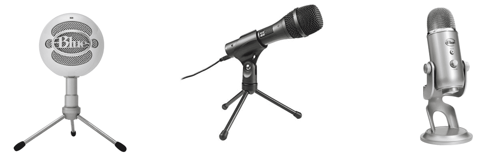
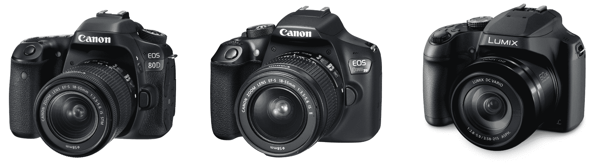
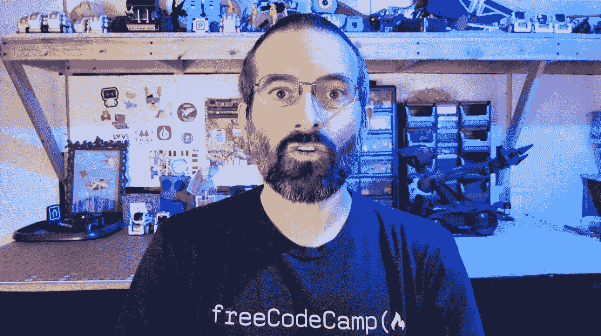

# 如何创建一门优秀的技术课程

> 原文：<https://www.freecodecamp.org/news/how-to-create-a-great-technical-course/>

在这篇文章中，你将学习如何创建一个伟大的技术视频课程。

我运营着 freeCodeCamp.org 的 YouTube 频道，我们在那里发布来自不同贡献者的技术课程。遵循本文指南的视频课程通常非常适合 freeCodeCamp 的频道。

## 如何规划 YouTube 技术课程

### 选择一个主题

为你的课程选择正确的主题是非常重要的。选择一个你认为你能教好的题目。

如果你对这个话题已经有了很多经验，这是最好的，但是以前的经验不是必需的。如果你还不太了解这个话题，你必须做大量的研究，这样你才能教好这个话题。

关于热门话题的课程几乎总是比不太热门的话题获得更多的浏览量，即使关于不太热门话题的课程更好。

确定什么主题最受欢迎并不是选择主题的唯一方法，但它会有所帮助。找出热门话题的几种方法是使用谷歌趋势，在 YouTube 上搜索，观察哪些话题在其他频道获得最多的浏览量。

在 freeCodeCamp 频道上，我们发布各种主题的课程，甚至包括许多不太受欢迎的课程。我们张贴综合课程，时间从 90 分钟到 24 小时不等。一个很适合短视频的话题，不一定很适合我们的频道。

我们在 freeCodeCamp 频道上发布的课程主要有两种类型，可能会有一些重叠:

1.  关于单一技术、编程语言或框架的综合课程。
    *举例:*
    - [学习 Python -初学者全教程](https://www.youtube.com/watch?v=rfscVS0vtbw)
    - [邮差初学者教程- API 测试](https://www.youtube.com/watch?v=VywxIQ2ZXw4)
    - [Flask 教程- Python Web 应用开发](https://www.youtube.com/watch?v=Qr4QMBUPxWo)
2.  关于开发真实项目的课程。
    *举例:*
    - [用 React、Tailwind CSS、Firebase](https://www.youtube.com/watch?v=mDgEqoQUBgk)
    - [用 JavaScript](https://www.youtube.com/watch?v=7rU_KyudGBY)
    - [电商网站用 Django 和 Vue 教程](https://www.youtube.com/watch?v=Yg5zkd9nm6w)

### 制作您的课程标题和缩略图

课程标题和缩略图非常重要。

如果您向 freeCodeCamp 频道提交课程，我们将为课程创建标题和缩略图。但是我们欢迎建议和意见。

在创建课程之前选择标题可能会有所帮助。这将有助于你聚焦课程的主题。有重点的课程让观众更容易跟上。

标题简洁、能清楚传达观众将学到什么的课程，几乎总是比标题冗长或含糊不清的课程表现更好。

标题中应该尽可能早地包含关键搜索词。如果一门课程是关于创建一个特定的项目，最好将编程语言放在项目标题之前，因为人们更容易识别和搜索编程语言。

在标题中添加像“教程”或“课程”这样的词会很有帮助，因为人们经常在搜索中包含这些词。

成功作品的例子:

*   《HTML 全教程——构建网站教程》
*   《原生安卓应用教程:WhatsApp 克隆》
*   " OpenGL 课程-用 C++创建 3D 和 2D 图形. "

不成功的标题示例:

*   “如何使用 Python (Django)构建社交媒体应用程序-设置项目”
*   “为 Android 手机创建一个 Flappy bird 游戏”
*   “数字系统”

### 确定你的受众

一定要记住你的观众。你的课程是针对初级、中级还是高级听众的？

目标受众应该在课程的标题和内容上都很明显。

### 整体课程设计

课程应该以介绍开始，清楚而简明地传达为什么课程对学习者很重要。

让观众马上知道他们为什么要看你的课程以及他们会学到什么是很重要的。

保持简介简短也很重要，这样你才能尽快进入课程的真正内容。如果你在教授观众想要的信息之前花了太长时间，你就冒着观众回头选择不同课程的风险。

介绍应该有多长没有硬性规定，但在视频的前十秒应该有课程总结。

设计课程时，你应该使用令人难忘且有创意的例子，并在适当的地方配上图表。确保课程传达了你为什么要做你正在做的事情，而不仅仅是你如何做或者在做什么。

最后，请确保在课程结束时提供一份总结，其中包括本课程的主要收获。

### 幻灯片设计

当在屏幕上设计幻灯片或文本时，要记住的主要事情是使所有的文本尽可能大。确保在文本和背景之间使用适当的对比度。如果对比度或颜色太相似，阅读起来会更困难，尤其是对于有视觉障碍的人。

如果你愿意，你可以考虑使用 freeCodeCamp 风格指南中的颜色和字体。

任何图表、图像或颜色都应该补充和加强你所谈论的内容。

为了保持观众的兴趣，确保屏幕上的内容经常变化。一般来说，你不应该在同一个幻灯片或视频上停留超过 15 秒钟。这不适用于在屏幕上键入代码的情况。

### 准备您的代码

你应该事先准备好你将在课程中用到的任何代码。当一门课程教授如何创建一个特定的项目时，尤其如此。

确保代码清晰易读。除非你有很好的理由，否则使用尽可能简单的代码，以便更容易理解。

如果它适用于您的课程，请创建初学者代码供用户下载。

明确地向用户提供所有最终代码。大多数用户下载代码最简单的方式就是在 GitHub 上。

## 如何录制 YouTube 技术课程

录音时最重要的三件事是:

1.  使用好的麦克风。
2.  如果你在屏幕上显示代码，尽可能的放大。
3.  确保视频分辨率为 1080p(绝对最小值为 720)。

如果你有糟糕的音频或微小的代码，这将导致人们立即停止观看——甚至在他们看到你视频的真正内容之前。

录制课程时需要考虑三个方面:音频、视频和屏幕截图。

### 课程音频

几乎任何 USB 麦克风都会比你电脑上的内置麦克风好。如果您负担得起，请考虑以下话筒之一:

*   [蓝色雪人麦克风](https://amzn.to/2Fa3k77)
*   [音频技术公司 AT2005USB 麦克风](https://amzn.to/2KjePgC)
*   [蓝色雪球](https://amzn.to/31vH5lO)

如果你买不起麦克风，用手机录音做一些测试。根据你使用的手机和电脑，手机上录制的音频有可能比电脑上的要好。

Microphones!

录音频的时候要响亮清晰。它应该没有削波、失真和令人分心的背景噪音。如果需要，如果背景噪音非常明显，请进行编辑或重新录制。当你说话时，试着让自己听起来迷人而自信。使用自然的语速和对话语气。避免尴尬的停顿和单词，如“嗯”或“啊”。

### 课程视频

虽然不是必须的，但在镜头前展示自己通常是好的，至少在视频的开头和结尾。

当观众可以看到谁在教他们时，这有助于他们更好地与教学联系起来。

有些人喜欢在整个教程中在屏幕上展示自己。太棒了！

就在我和你之间，我会让你知道为什么我在输入代码时不在屏幕上显示自己的秘密原因:我犯了很多错误。我做了很多编辑，让它看起来好像我知道我在做什么。如果我出现在屏幕上，会有成千上万的跳转剪辑，人们会意识到我有多频繁地编辑，以及我在编码方面有多糟糕。😜

如果你要在镜头前展示自己，最便宜的方法是使用你电脑的摄像头或手机摄像头。许多手机实际上有相当好的视频质量。

如果你想让它更上一层楼，可以考虑下面这款相机:

*   [佳能 EOS 80D DSLR](https://amzn.to/3vaYmyh)
*   [佳能 EOS Rebel T6 数码单反](https://amzn.to/2WIjv6l)
*   [松下 LUMIX DMC-FZ1000](https://amzn.to/2ROmKIk)

Cameras!

在录制任何视频之前，请仔细考虑镜头的背景是什么。确保镜头中没有会分散观众注意力的东西。

想想你的视频取景。在你说话的视频镜头中，你的头上方应该有一点空间，但不要太大。

Video frame

### **屏幕录制**

如果您使用的是 Windows，有一个快捷键可以开始录制您的屏幕。只需按 Windows 键+ Alt + R。

在 macOS 上，您可以使用电脑上已有的 Quicktime 来录制屏幕。

如果你想在播放视频的同时显示屏幕上的视频，你可以用免费的 [OBS 软件](https://obsproject.com/)来设置。

虽然我会建议只使用 OBS 直播视频。最好把你们说话的画面和视频分开录。然后你就可以在你的编辑软件里把视频组合起来了。这提供了更多的灵活性。

当您录制屏幕时，请始终确保主要内容在屏幕上占据尽可能多的空间。这可能很难相信，但几乎⅓的人在手机上观看编码教程。所有文本应该尽可能大。你需要一个非常好的理由来显示一个非全屏的窗口。

字体大小没有硬性的规定，但是要考虑到用户是否能够阅读手机屏幕上的文字。

录制教程时，使用两个屏幕会很有帮助。您可以在其中一个屏幕上录制视频，在另一个屏幕上录制脚本和完整的代码。

这里有一个秘密，一些人用它来使他们的编码教程听起来更加完美。首先，记录编码教程。然后，转录你所有的对话，并在转录中做一些小的编辑，以改善流程。

最后，重新录制您的对话，并将其添加到原始屏幕记录中。如果你不去想接下来的教程，会更容易表达和娱乐。

以下是屏幕录制的一些最终提示:

*   录制幻灯片时，将光标移出窗口。
*   确保你已经隐藏了所有不必要的杂物，比如任务栏、应用图标、通知和系统时钟。

## 如何编辑 YouTube 技术课程

你应该经常编辑你的视频，让它们更流畅，减少错误。

使用编辑来移除或减少不需要的声音，如风扇声、咳嗽声和其他会分散观众注意力的噪音。使用编辑软件或插件可以消除持续的嗡嗡声和混响。

对于非常简单的编辑，您可以使用 Mac 上的 iMovie 或 Windows 上的影音制作。但是这些程序非常有限。

两个最流行的编辑软件是 Premier Pro 和 Final Cut Pro。这两者都将能够做你需要做的一切，但它们可能很贵。

以下是其他几个免费的视频编辑选项:

*   [达芬奇解决](https://www.blackmagicdesign.com/products/davinciresolve/)
*   [开拍](https://www.openshot.org/)
*   [VideoPad](https://www.nchsoftware.com/videopad/)
*   [灯光工程](https://www.lwks.com/)

决定使用什么软件进行编辑后，观看一些教程来了解软件的基本功能。

如果可能的话，在编辑的时候避免跳切。跳跃剪切是指从连续视频中剪切出一部分，因此很明显存在剪切。

避免跳跃切割的两种常见方法是:

1.  将图像或其他视频剪辑放在剪切发生的位置，
2.  或者在剪切后放大，这样看起来好像剪切应该在那里。

## 创建技术课程的其他杂项技巧

*   让每门课程尽可能独立，尤其是初学者的课程。展示从安装软件和依赖项到完成项目的整个过程。如果人们已经知道如何做某事，他们总是可以跳过前面。
*   一门课程应该总是包含一个真实的人的声音。你不应该使用计算机生成的声音或使用没有对话的音乐。如果你的英语很差，可以考虑用你的母语制作视频，或者雇佣一个以英语为母语的人来朗读你写的画外音脚本。
*   不要在编码教程中使用背景音乐。经常会让人分心。如果人们想在看你的教程时听音乐，他们可以打开自己的音乐。
*   与黑暗模式或光明模式的使用保持一致。黑暗模式通常是观众的首选，但模式之间的切换有时会不和谐。
*   在课程中不要提及你的年龄。

## 技术课程的优秀范例

这里有几个很棒的课程，你可以从中寻找灵感。

[https://www.youtube.com/embed/41NOoEz3Tzc?feature=oembed](https://www.youtube.com/embed/41NOoEz3Tzc?feature=oembed)

[https://www.youtube.com/embed/mrHNSanmqQ4?feature=oembed](https://www.youtube.com/embed/mrHNSanmqQ4?feature=oembed)

[https://www.youtube.com/embed/4OaHB0JbJDI?feature=oembed](https://www.youtube.com/embed/4OaHB0JbJDI?feature=oembed)

[https://www.youtube.com/embed/P3qmqUZJ7l0?feature=oembed](https://www.youtube.com/embed/P3qmqUZJ7l0?feature=oembed)

## 结论

创建一个伟大的球场不仅仅需要了解技术细节，还需要实践。你创造的课程越多，你就越会创造课程。

如果你有遵循本文指导方针的课程，并想与 freeCodeCamp.org 频道分享，请发给我。我的电子邮件是 beau [at] freecodecamp [dot] org。