# 用 PHP 抓取网页——如何使用开源工具抓取网页

> 原文：<https://www.freecodecamp.org/news/web-scraping-with-php-crawl-web-pages/>

网络搜集让你从互联网上的网页中收集数据。它也被称为网络爬行或网络数据提取。

PHP 是一种广泛使用的后端脚本语言，用于创建动态网站和 web 应用程序。您可以使用普通的 PHP 代码实现一个 web scraper。

但是由于我们不想重新发明轮子，我们可以利用一些现成的开源 PHP web 抓取库来帮助我们收集数据。

在本教程中，我们将讨论各种工具和服务，你可以用 PHP 来删除一个网页。我们将讨论的工具是 Guzzle、Goutte、简单 HTML DOM 和无头浏览器 Symfony Panther。

注意:在你抓取一个网站之前，你应该仔细阅读他们的服务条款，以确保他们同意被抓取。抓取数据——即使它是公开的——可能会使网站的服务器超载。(谁知道呢——如果你礼貌地请求，他们甚至会给你一个 API 密匙，这样你就不用费劲了。😉)

## 如何设置项目

在我们开始之前，如果您想继续下去并尝试代码，这里是您的开发环境的一些先决条件:

*   确保您已经安装了最新版本的 PHP。
*   转到这个链接 [Composer](https://getcomposer.org/) 来设置一个 Composer，我们将使用它来安装 web 抓取库的各种 PHP 依赖项。
*   你选择的编辑。

完成所有这些操作后，创建一个项目目录并导航到该目录:

```
mkdir php_scraper

cd php_scraper
```

在您的终端中运行以下两个命令来初始化 **composer.json** 文件:

```
composer init — require=”php >=7.4" — no-interaction

composer update
```

让我们开始吧。

## 使用 Guzzle、XML 和 XPath 的 PHP 进行 Web 抓取

Guzzle 是一个 PHP HTTP 客户端，可以让你快速方便地发送 HTTP 请求。它有一个简单的接口来构建查询字符串。

XML 是一种标记语言，它对文档进行编码，使它们既可读又可机读。

而 [XPath](https://en.wikipedia.org/wiki/XPath) 是一种导航和选择 XML 节点的查询语言。

让我们看看如何使用这三个工具一起刮一个网站。

通过在您的终端中执行以下命令，开始通过 composer 安装 Guzzle:

```
composer require guzzlehttp/guzzle
```

一旦你安装了 Guzzle，让我们创建一个新的 PHP 文件，我们将添加代码。我们将称之为 **guzzle_requests.php** 。

在本次演示中，我们将从[本书中搜集](https://books.toscrape.com/)个网站。你应该能够按照我们在这里定义的相同步骤来抓取你选择的任何网站。

“图书刮痧”网站看起来是这样的:

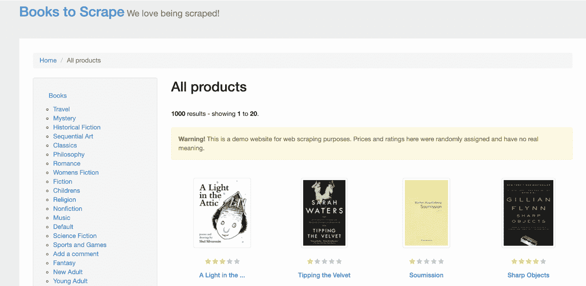

我们想提取书名并在终端上显示出来。

抓取网站的第一步是理解它的 HTML 布局。在这种情况下，您可以通过右键单击列表中第一个产品上方的页面，并选择 **Inspect** 来查看该页面的 HTML 布局。

以下是显示页面源代码片段的屏幕截图:

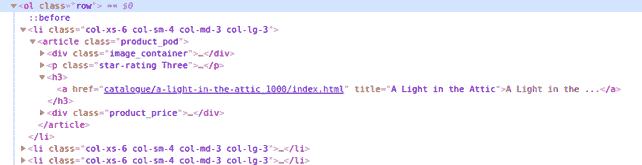

您可以看到该列表包含在 **< ol class="row" >** 元素中。下一个直接子元素是 **<李>** 元素。

我们想要的是书名。它是在 **<里面的一个>** ，依次又是在**<【H3】>**，又是在**<>**文章里面，最后是在 **<李>** 元素里面。

要初始化 Guzzle、XML 和 Xpath，请将以下代码添加到 **guzzle_requests.php** 文件中:

```
<?php
# scraping books to scrape: https://books.toscrape.com/
require 'vendor/autoload.php';
$httpClient = new \GuzzleHttp\Client();
$response = $httpClient->get('https://books.toscrape.com/');
$htmlString = (string) $response->getBody();
//add this line to suppress any warnings
libxml_use_internal_errors(true);
$doc = new DOMDocument();
$doc->loadHTML($htmlString);
$xpath = new DOMXPath($doc);
```

上面的代码片段将网页加载到一个字符串中。然后，我们使用 XML 解析该字符串，并将其分配给 **$xpath** 变量。

接下来你要做的是将 **<标签中的文本内容作为目标。将以下代码添加到文件中:**

```
$titles = $xpath->evaluate('//ol[@class="row"]//li//article//h3/a');
$extractedTitles = [];
foreach ($titles as $title) {
$extractedTitles[] = $title->textContent.PHP_EOL;
echo $title->textContent.PHP_EOL;
}
```

在上面的代码片段中， **//ol[@class="row"]** 获取整个列表。

列表中的每一项都有一个 **<和一个>** 标签，我们的目标是提取这本书的实际标题。我们只有一个包含< a >的< h3 >标签，这样更容易直接定位它。

我们使用 **foreach** 循环提取文本内容，并将它们回显到终端。

在这一步，您可以选择对提取的数据做一些事情，可能将数据赋给一个数组变量，写入文件，或者将其存储在数据库中。

通过运行下面的命令，您可以在终端上使用 PHP 执行该文件。请记住，突出显示的部分是我们如何命名文件的:

```
php guzzle_requests.php
```

这应该会显示如下内容:


进展顺利。

现在，如果我们也想知道这本书的价格呢？

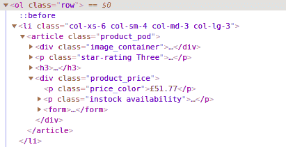

价格恰好在 **< p >** 标签内，在< div >标签内。正如你所看到的，有不止一个< p >标签和不止一个< div >标签。

为了找到正确的目标，我们将使用 CSS 类选择器，幸运的是，对于每个标签来说，它们都是唯一的。下面是获取价格标签并将其连接到标题字符串的代码片段:

```
$titles = $xpath->evaluate('//ol[@class="row"]//li//article//h3/a');
$prices = $xpath->evaluate('//ol[@class="row"]//li//article//div[@class="product_price"]//p[@class="price_color"]');
foreach ($titles as $key => $title) {
echo $title->textContent . ' @ '. $prices[$key]->textContent.PHP_EOL;
}
```

如果您在终端上执行代码，您应该会看到类似这样的内容:

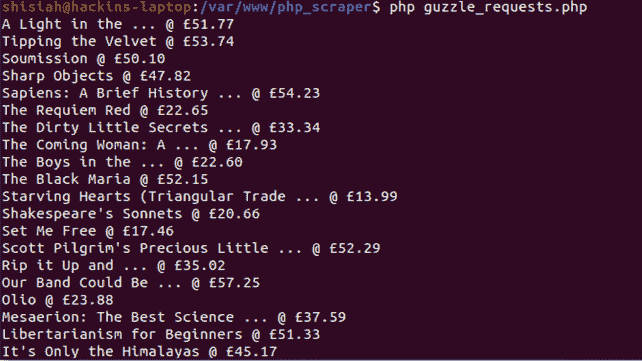

您的整个代码应该如下所示:

```
<?php
# scraping books to scrape: https://books.toscrape.com/
require 'vendor/autoload.php';
$httpClient = new \GuzzleHttp\Client();
$response = $httpClient->get('https://books.toscrape.com/');
$htmlString = (string) $response->getBody();
//add this line to suppress any warnings
libxml_use_internal_errors(true);
$doc = new DOMDocument();
$doc->loadHTML($htmlString);
$xpath = new DOMXPath($doc);
$titles = $xpath->evaluate('//ol[@class="row"]//li//article//h3/a');
$prices = $xpath->evaluate('//ol[@class="row"]//li//article//div[@class="product_price"]//p[@class="price_color"]');
foreach ($titles as $key => $title) {
echo $title->textContent . ' @ '. $prices[$key]->textContent.PHP_EOL;
}
```

当然，这是一个基本的 web scraper，你当然可以把它做得更好。我们去下一个图书馆吧。

## 用 Goutte 实现 PHP 中的网页抓取

Goutte 是另一个专为网页抓取而设计的优秀的 PHP that 客户端。它是由 [Symfony 框架](https://symfony.com/)的创建者开发的，提供了一个很好的 API 来从网站的 HTML/XML 响应中抓取数据。

下面是一些组件，它包括使网页抓取直截了当:

*   [BrowserKit 组件](https://symfony.com/doc/current/components/browser_kit.html)模拟网页浏览器的行为。
*   [CssSelector 组件](https://symfony.com/doc/current/components/css_selector.html)用于将 CSS 查询翻译成 XPath 查询。
*   [DomCrawler](https://symfony.com/doc/current/components/dom_crawler.html) 组件带来了 DOMDocument 和 XPath 的强大。
*   Symfony HTTP 客户端是 Symfony 团队的一个相当新的组件。

在终端上执行以下命令，通过 composer 安装 Goutte:

```
composer require fabpot/goutte
```

一旦你安装了 Goutte 包，为我们的代码创建一个新的 PHP 文件——让我们称它为 **goutte_requests.php** 。

在这一节中，我们将讨论我们在第一节中对 Guzzle 库做了什么。

我们将使用 Goutte 从[书籍中抓取书名来抓取](https://books.toscrape.com/)网站。然后，我们将看到如何将价格添加到一个数组变量中，并在代码中使用该变量。

在 goutte_requests.php 文件中添加以下代码:

```
<?php
# scraping books to scrape: https://books.toscrape.com/
require 'vendor/autoload.php';
$httpClient = new \Goutte\Client();
$response = $httpClient->request('GET', 'https://books.toscrape.com/');
$titles = $response->evaluate('//ol[@class="row"]//li//article//h3/a');
$prices = $response->evaluate('//ol[@class="row"]//li//article//div[@class="product_price"]//p[@class="price_color"]');
// we can store the prices into an array
$priceArray = [];
foreach ($prices as $key => $price) {
$priceArray[] = $price->textContent;
}
// we extract the titles and display to the terminal together with the prices
foreach ($titles as $key => $title) {
echo $title->textContent . ' @ '. $priceArray[$key] . PHP_EOL;
}
```

通过在终端中运行以下命令来执行代码:

```
php goutte_requests.php
```

以下是输出:

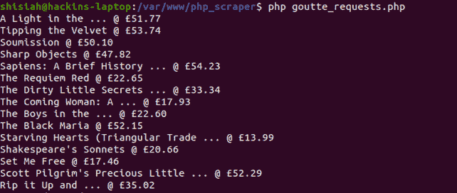

这是用 Goutte 刮网的一种方式。

让我们讨论另一种使用 Goutte 自带的 **CSS 选择器**组件的方法。CSS 选择器比前面方法中使用的 XPath 更简单。

创建另一个 PHP 文件，姑且称之为 **goutte_css_requests.php** 。将以下代码添加到文件中:

```
<?php
# scraping books to scrape: https://books.toscrape.com/
require 'vendor/autoload.php';
$httpClient = new \Goutte\Client();
$response = $httpClient->request('GET', 'https://books.toscrape.com/');
// get prices into an array
$prices = [];
$response->filter('.row li article div.product_price p.price_color')->each(function ($node) use (&$prices) {
$prices[] = $node->text();
});
// echo titles and prices
$priceIndex = 0;
$response->filter('.row li article h3 a')->each(function ($node) use ($prices, &$priceIndex) {
echo $node->text() . ' @ ' . $prices[$priceIndex] .PHP_EOL;
$priceIndex++;
});
```

正如您所看到的，使用 CSS 选择器组件会产生更清晰、更易读的代码。

你可能已经注意到我们使用了 **`&`** 操作符。这确保了我们将变量的引用带入到“**each”**循环中，而不仅仅是变量的值。如果 **`&$prices`** 在循环内被修改，循环外的实际值也被修改。

你可以通过官方 PHP 文档的参考来阅读更多关于[赋值的内容。](https://www.php.net/manual/en/language.references.whatdo.php)

通过运行以下命令，在终端中执行该文件:

```
php goutte_css_requests.php
```

您应该会看到类似于前面截图中的输出:

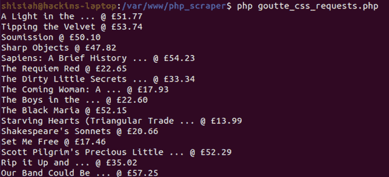

我们用 PHP 和 Goutte 开发的 web scraper 目前进展顺利。让我们再深入一点，看看我们是否可以点击一个链接并导航到不同的页面。

在我们的演示网站[Books to scrap](https://books.toscrape.com/)上，如果您点击一本书的标题，就会出现一个页面，显示该书的详细信息，例如:

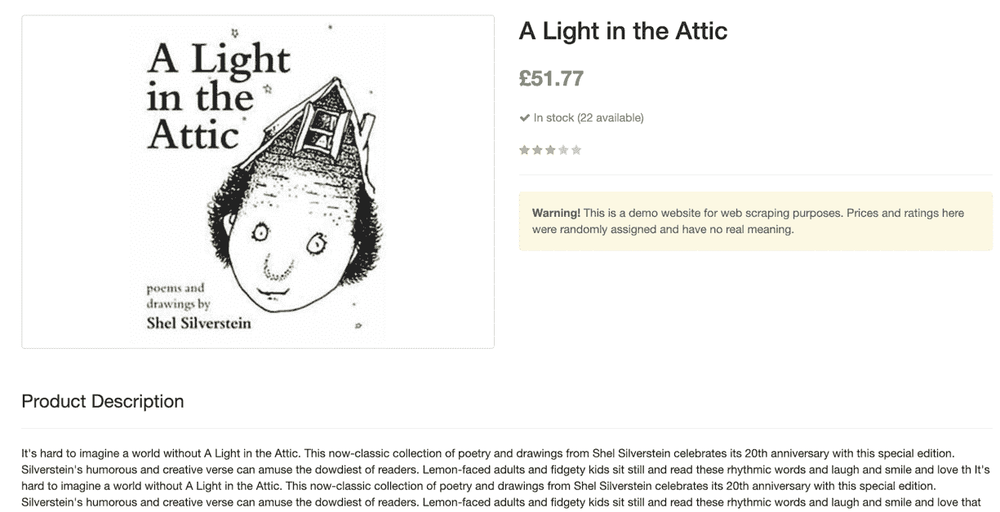

我们想知道您是否从图书列表中单击一个链接，导航到图书详细信息页面，并提取描述。检查页面以了解我们的目标:

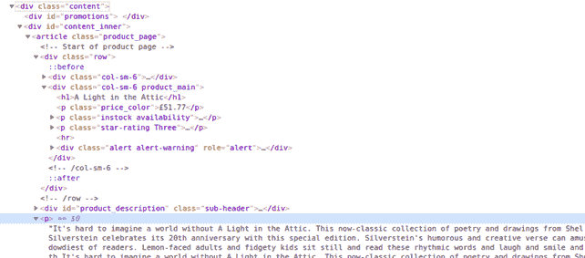

我们的目标流将来自**<div class = " content ">**元素，然后是**<div id = " content _ inner ">**，然后是只出现一次的 **< article >** 标记，最后是 **< p >** 标记。

我们有几个 **< p >** 标签——带有描述的标签是**<div class = " content ">**父标签中的第四个。由于数组从 0 开始，我们将在第三个**索引处获取节点。**

既然我们知道我们的目标是什么，让我们写代码。

首先，添加下面的 composer 包来帮助 HTML5 解析:

```
composer require masterminds/html5
```

接下来，修改 **goutte_css_requests.php** 文件，如下所示:

```
<?php
# scraping books to scrape: https://books.toscrape.com/
require 'vendor/autoload.php';
$httpClient = new \Goutte\Client();
$response = $httpClient->request('GET', 'https://books.toscrape.com/');
// get prices into an array
$prices = [];
$response->filter('.row li article div.product_price p.price_color')
->each(function ($node) use (&$prices) {
$prices[] = $node->text();
});
// echo title, price, and description
$priceIndex = 0;
$response->filter('.row li article h3 a')
->each(function ($node) use ($prices, &$priceIndex, $httpClient) {
$title = $node->text();
$price = $prices[$priceIndex];
//getting the description
$description = $httpClient->click($node->link())
->filter('.content #content_inner article p')->eq(3)->text();
// display the result
echo "{$title} @ {$price} : {$description}\n\n";
$priceIndex++;
});
```

如果您在终端中执行该文件，您应该会看到显示的标题、价格和描述:

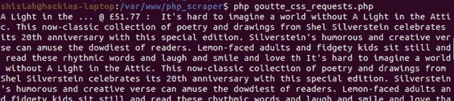

使用 Goutte **CSS 选择器**组件和点击页面的选项，你可以很容易地抓取整个网站的几个页面，并提取尽可能多的数据。

## 用简单的 HTML DOM 在 PHP 中进行网页抓取

简单的 HTML DOM 是另一个极简的 PHP 网页抓取库，你可以用它来抓取网站。让我们来讨论如何使用这个库来抓取一个网站。就像在前面的例子中，我们将刮刮网站的书籍。

在安装软件包之前，修改 composer.json 文件，并在 **`require:{}`** 块下添加以下代码行，以避免出现版本错误:

```
"minimum-stability": "dev",
"prefer-stable": true
```

现在，您可以使用以下命令安装该库:

```
composer require simplehtmldom/simplehtmldom
```

一旦安装了这个库，创建一个名为**simplehtmldom _ requests . PHP**的新 PHP 文件。

我们已经在前面的章节中讨论了我们正在抓取的网页的布局。因此，我们将直接进入代码。将以下代码添加到**simplehtmldom _ requests . PHP**文件中:

```
<?php
# scraping books to scrape: https://books.toscrape.com/
require 'vendor/autoload.php';
$httpClient = new \simplehtmldom\HtmlWeb();
$response = $httpClient->load('https://books.toscrape.com/');
// echo the title
echo $response->find('title', 0)->plaintext . PHP_EOL . PHP_EOL;
// get the prices into an array
$prices = [];
foreach ($response->find('.row li article div.product_price p.price_color') as $price) {
$prices[] = $price->plaintext;
}
// echo titles and prices
foreach ($response->find('.row li article h3 a') as $key => $title) {
echo "{$title->plaintext} @ {$prices[$key]} \n";
}
```

如果您在终端中执行代码，它应该会显示结果:

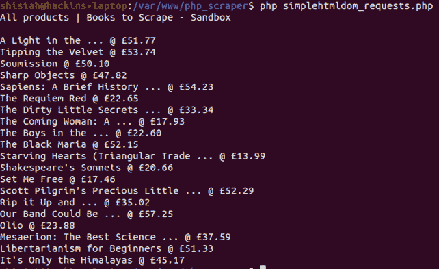

使用官方 API 文档中的[简单 HTML DOM 库，你可以找到更多抓取网页的方法。](https://simplehtmldom.sourceforge.io/manual_api.htm)

## 网页抓取在 PHP 中与一个无头浏览器(Symfony Panther)

无头浏览器是没有图形用户界面的浏览器。无头浏览器允许您使用终端在类似于 web 浏览器的环境中加载网页。这允许您编写代码来控制浏览，就像我们在前面的步骤中所做的那样。

那么为什么这是必要的呢？

在现代 web 开发中，大多数开发人员使用 JavaScript web 框架。这些框架在浏览器内部生成 HTML 代码。在其他情况下，AJAX 动态加载内容。

在前面的例子中，我们使用了静态 HTML 页面，所以输出是一致的。

在使用 JavaScript 和 AJAX 生成 HTML 的动态情况下，DOM 树的输出可能会有很大不同。这会导致我们的铲运机失灵。在现代网站中，无头浏览器的出现是为了处理这样的问题。

Symfony Panther PHP 库在无头浏览器上运行良好。您可以使用该库来抓取网站，并使用真正的浏览器运行测试。

另外，它提供了与 Goutte 库相同的方法，所以你可以用它来代替 Goutte。

与我们在本教程中讨论的以前的 web 抓取库不同，Panther 可以做以下事情:

*   在网页上执行 JavaScript 代码
*   支持远程浏览器测试
*   通过在执行一行代码之前等待其他元素加载，支持异步加载元素
*   支持火狐浏览器的所有实现
*   可以截图
*   允许在已加载页面的上下文中运行自定义 JS 代码或 XPath 查询。

我们已经做了大量的搜集工作，所以让我们尝试一些不同的东西。我们将加载一个 HTML 页面，并对页面进行截图。

使用以下命令安装 [Symfony Panther](https://github.com/symfony/panther) :

```
composer require symfony/panther
```

创建一个新的 php 文件，姑且称之为 **panther_requests.php** 。将以下代码添加到文件中:

```
<?php
# scraping books to scrape: https://books.toscrape.com/
require 'vendor/autoload.php';
$httpClient = \Symfony\Component\Panther\Client::createChromeClient();
// for a Firefox client use the line below instead
//$httpClient = \Symfony\Component\Panther\Client::createFirefoxClient();
// get response
$response = $httpClient->get('https://books.toscrape.com/');
// take screenshot and store in current directory
$response->takeScreenshot($saveAs = 'books_scrape_homepage.jpg');
// let's display some book titles
$response->getCrawler()->filter('.row li article h3 a')
->each(function ($node) {
echo $node->text() . PHP_EOL;
});
```

要让这段代码在您的系统上运行，您必须安装 Chrome 或 Firefox 的驱动程序，这取决于您在代码中使用的客户端。

幸运的是，Composer 可以自动为您做到这一点。在您的终端中执行以下命令来安装和检测驱动程序:

```
composer require - dev dbrekelmans/bdi && vendor/bin/bdi detect drivers
```

现在你可以在你的终端中执行 PHP 文件，它会截取网页的截图并存储在当前目录中。然后，它将显示网站上的标题列表。

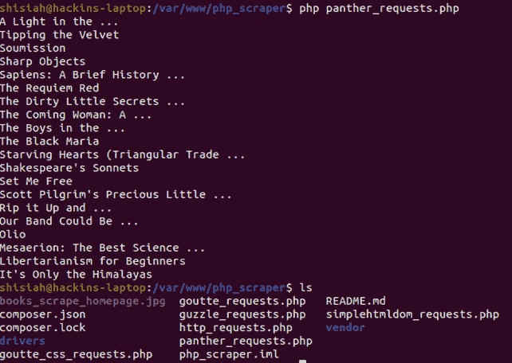

## 结论

在本教程中，我们讨论了可以用来抓取网站的各种 PHP 开源库。

如果您按照教程进行操作，您应该能够创建一个基本的 scraper 来抓取一两页。

虽然这是一篇介绍性的文章，但是我们已经介绍了可以在库中使用的大多数方法。你可以选择在这些知识的基础上创建复杂的网页抓取器，它可以抓取成千上万的网页。本教程的代码可以从这个 [GitHub 库](https://github.com/jaymoh/php_web_scraper)获得。

如果您有任何问题，请随时联系我们。

如果你感兴趣的话，你可以看看其他一些关于 Nodejs 和 Python 的文章。