# 如何在 10 分钟内制作一个视觉小说游戏——Python Ren ' py 教程

> 原文：<https://www.freecodecamp.org/news/use-python-to-create-a-visual-novel/>

你有没有想把一个故事改编成小说的想法？给那本小说增加视觉吸引力和互动性怎么样？

视觉小说可能是你正在寻找的游戏类型。本教程将帮助您在 10 分钟内完成设置，只需要最少的编码经验。我们开始吧！

## 工具介绍和设置

我们将使用基于 Python 2.7 构建的 Ren'Py 视觉小说引擎。由于 Python 本身是一种脚本语言，你将能够在 Ren'Py 中“编写”你的视觉小说项目。

> 自从 Python 3 的到来，Python 2.7 已经夕阳西下，不再积极维护。请放心——Python 2.7 拥有我们创作一部令人敬畏的视觉小说所需的所有特性。而且，Ren'Py 最新发布的 [Ren'Py SDK 7.4](https://www.renpy.org/release/7.4.0) ，提供了 Python 3 的兼容模式。开发人员还表示希望在下一个版本 Ren'Py 8.0 中完全集成 Python 3。

### 如何下载和设置 Ren'Py

你可以在 Ren'Py 的官方网站上为你的操作系统(Windows、Mac、Linux)下载最新版本的 Ren ' py。

一旦你下载并安装了 Ren'Py，你可以打开 Ren'Py 启动器，选择左边的一个启动项目(教程，问题),点击**启动项目。**

查看**教程**来感受这个引擎的全部动力，或者**问题**来看一个你可以在 10 分钟内完成的非常基础的视觉小说。

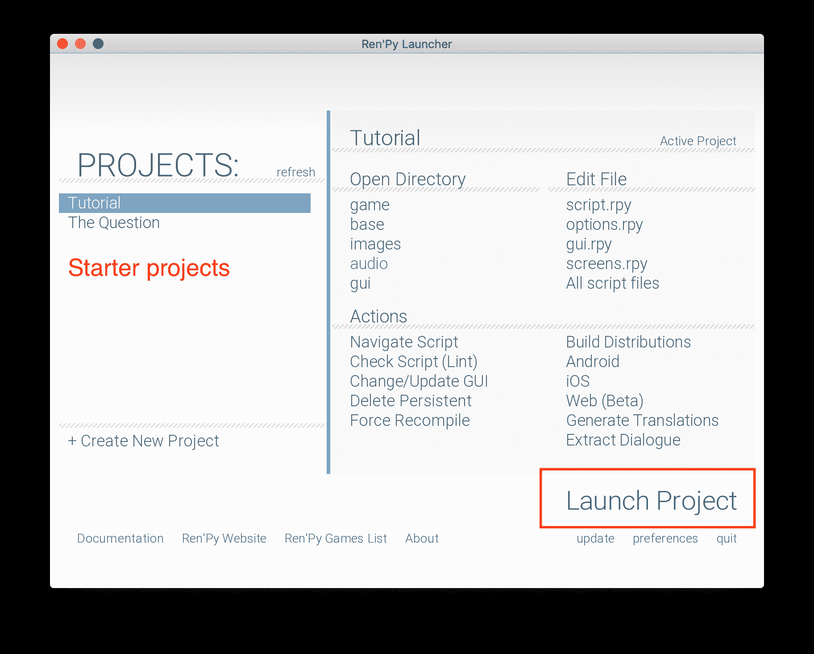

The Ren'Py Launcher

## 如何在 Ren'Py 中创建新项目

让我们创建一个新项目。我称我的旅行为森林远足🌲，以两个孩子探索森林小径的简单场景为特色。

注意你选择的分辨率:默认是 1280 x 720。当我们添加图像时，我们的背景图像也应该符合这些尺寸。

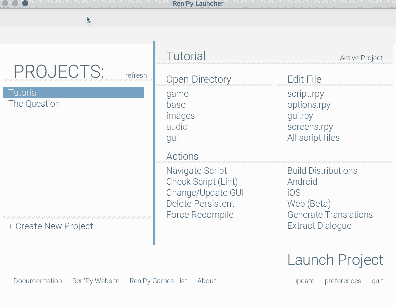

### 如何运行样板项目

启动样板项目。从主菜单中按下**开始**。在简短的两行对话之后，脚本结束了，我们回到了主菜单。

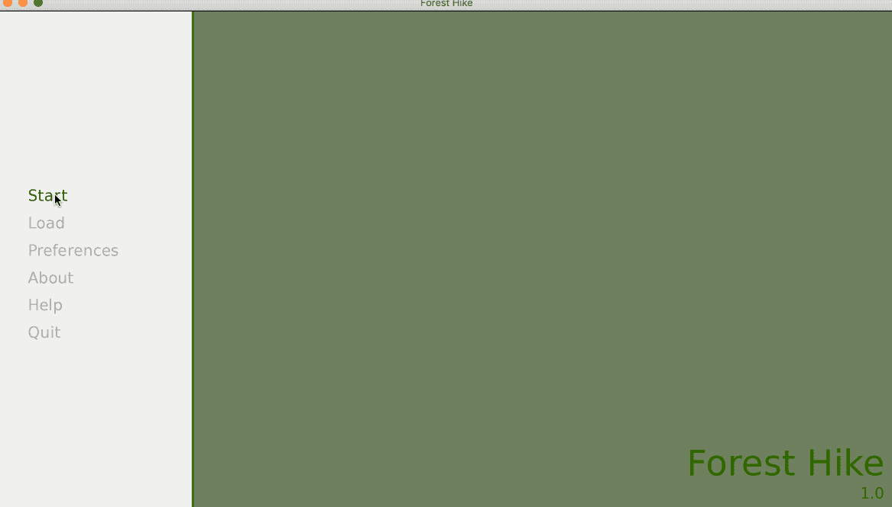

Running the boilerplate project

## 如何编写我们的项目脚本

让我们根据样板文件开始编写游戏脚本。

像 [Sublime Text](https://www.sublimetext.com/) 和 [Atom](https://atom.io/) 这样的文本编辑器都有以`.rpy`结尾的 Ren'Py 脚本的语法高亮显示。看看[这个崇高的文本包](https://packagecontrol.io/packages/Renpy%20Language)和[这个 Atom 包。](https://atom.io/packages/language-renpy)

我们看到的两行对话位于`script.rpy`。打开该文件，其内容应该如下所示。就像在 Python 中一样，以`#`开头的行是注释，不会作为 Ren'Py 脚本的一部分进行计算。下面的注释和代码是不言自明的。

```
# Declare characters used by this game
define e = Character("Eileen")

# The game starts here
label start:

    # Show a background
    scene bg room

    # This shows a character sprite
    show eileen happy

    # These display lines of dialogue.
    e "You've created a new Ren'Py game."
    e "Once you add a story, pictures, and music, you can release it to the world!"

    # This ends the game.
    return 
```

Boilerplate code

`label`用于控制流，我们将在下一节中介绍。

最后一行的`return`语句将我们带回主菜单。

### 如何声明角色和添加对话

让我们用故事中的角色声明和对话来代替样板文件。我的故事是这样的:

```
define laura = Character('Laura')
define tom = Character('Tom')

label start:

    laura "Wait up, Tom!"
    laura "Tom!"
    laura "I said wait up!"
    laura "...Tom?"
    tom "Boo!"
    laura "Yikes... not again."
    tom "Are you scared?"
    laura "Not at all."
    laura "Running off like that is dangerous, you know."
    laura "We are in the forest. We could get lost."
    tom "Okay okay mom. I won't do it again."

    return 
```


### 如何添加图像和过渡

如果你自己不是艺术家，你可以考虑在知识共享领域寻找资产。独立游戏市场 itch.io 是一个寻找资产的好地方。

我为我的项目找到了这组角色精灵。对于背景图像，我简单地将艺术滤镜应用于知识共享图片，给现实生活中的图片一种漂亮的水彩美感。

我把我所有的图片都放在了`game/images`里面。请注意，可以在图像文件名中使用空格。

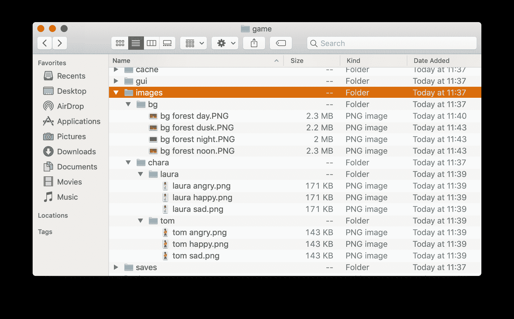

A conventional way of organizing image assets

然后我们给这些图像加上一些过渡。当看到像`with`和`at`这样的关键词时，Ren'Py 会应用转场。你可以在 Ren'Py 的 ATL(动画和过渡语言)文档中阅读更多关于过渡的内容。

```
label start:
    scene bg forest day with fade
    show laura angry
    laura "Wait up, Tom!"
    laura "Tom!"
    laura "I said wait up!"
    laura "...Tom?"
    hide laura
    scene bg forest day with vpunch
    show tom happy at right with moveinbottom
    tom "Boo!"
    show laura angry at left with moveinleft
    laura "Yikes... not again."
    tom "Are you scared?"
    laura "Not at all."
    show laura sad
    laura "Running off like that is dangerous, you know."
    laura "We are in the forest. We could get lost."
    tom "Okay okay mom. I won't do it again."

    return 
```


随着视觉效果的增加，我们的故事越来越完美了。

### 如何添加选择

一个有着不同分支和结局的游戏会让乐趣倍增。向脚本添加选择菜单很简单:

```
menu:
    "Which way should we go?"

    "Left":
        tom "Let's check out the trail on the left!"
    "Right":
        tom "Right is always the right way to go!"
```

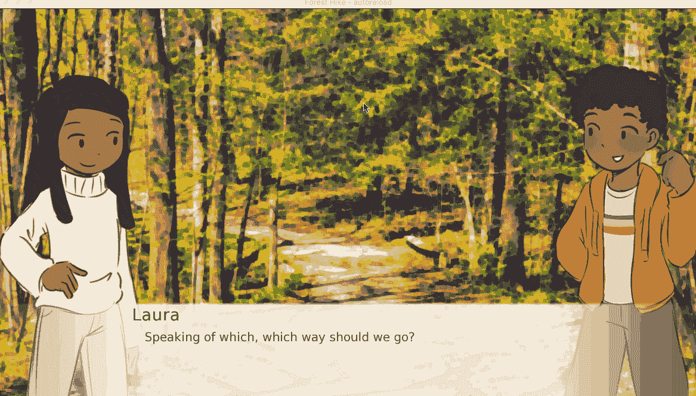

### 如何使用 Python 变量和控制流

我们可以在脚本中定义 Python 变量，并根据它们的值改变故事的流程。Python 语句以一个`$`或一个缩进的`python:`块开始。

将变量添加到我们之前的选择菜单中:

```
menu:
    "Which way should we go?"

    "Left":
        tom "Let's check out the trail on the left!"
        $ is_lost = True
    "Right":
        tom "Right is always the right way to go!"
        $ is_lost = False
scene bg forest noon with Dissolve(3.0)
scene bg forest dusk with Dissolve(3.0)
show laura sad at left with moveinleft
laura "It's getting late. Are you sure we aren't lost?"
if is_lost:
    show tom sad at right with moveinleft
    tom "I hope not, but I have a bad feeling about this."
else:
    show tom happy at right with moveinleft
    tom "We are fine. Look! There's the end of the trail."
    tom "I'm the best scout around."
```

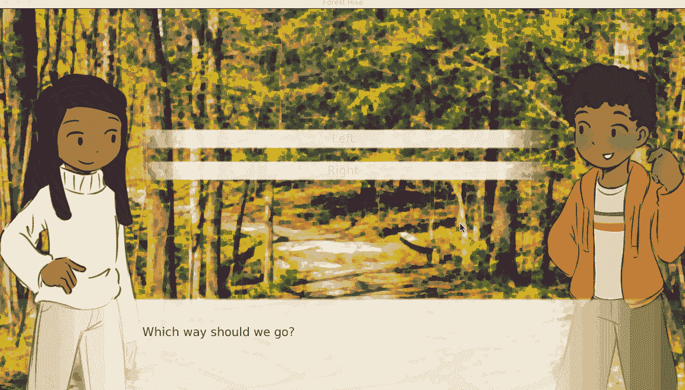

在这篇文章的最后，我提供了在 Ren'Py 中使用 Python 的手工资源。

### 如何播放音乐

根据 [Ren'Py 的音频文档](https://www.renpy.org/doc/html/audio.html)，播放音乐和音效就像下面这样简单:

```
play music "mozart.ogg"
play sound "woof.mp3"
```

### 如何保存和加载游戏

Ren'Py 为我们完成了所有繁重的工作，并有一个内置的保存和加载系统。

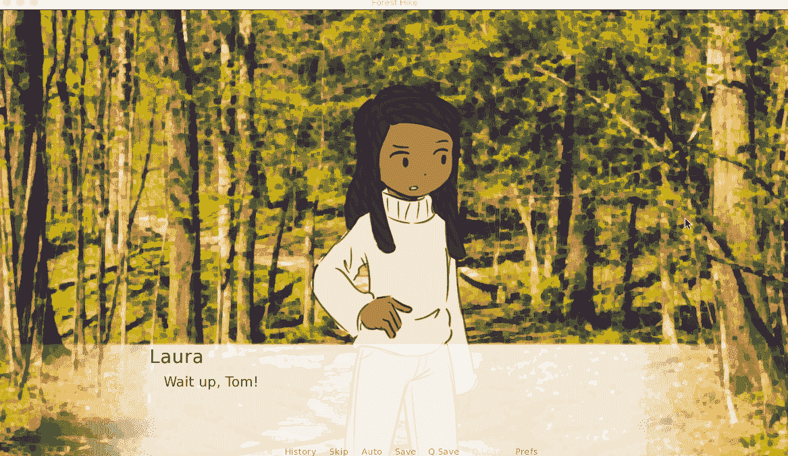

Saving the game

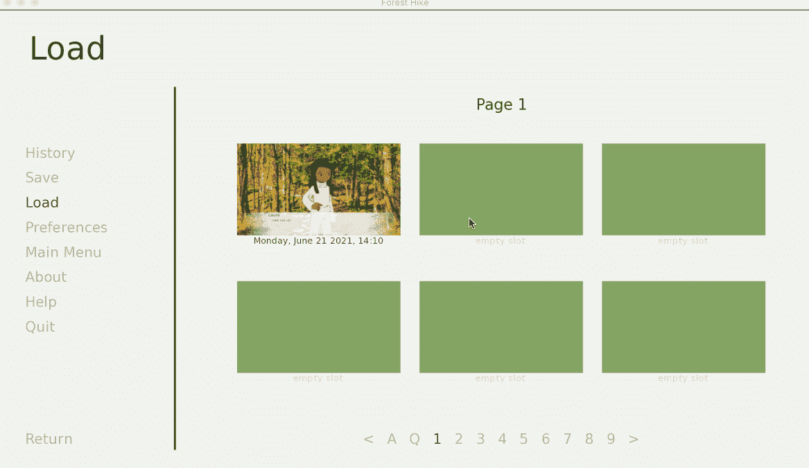

Loading the game

### 您可以进行的其他定制

目前在我们的对话中，整行文本一次显示，而不是一个字符一个字符地显示。我们可以这样改变`options.rpy`中的变量`preference.text_cps` (CPS 代表每秒字符数)。

```
default preferences.text_cps = 20
```

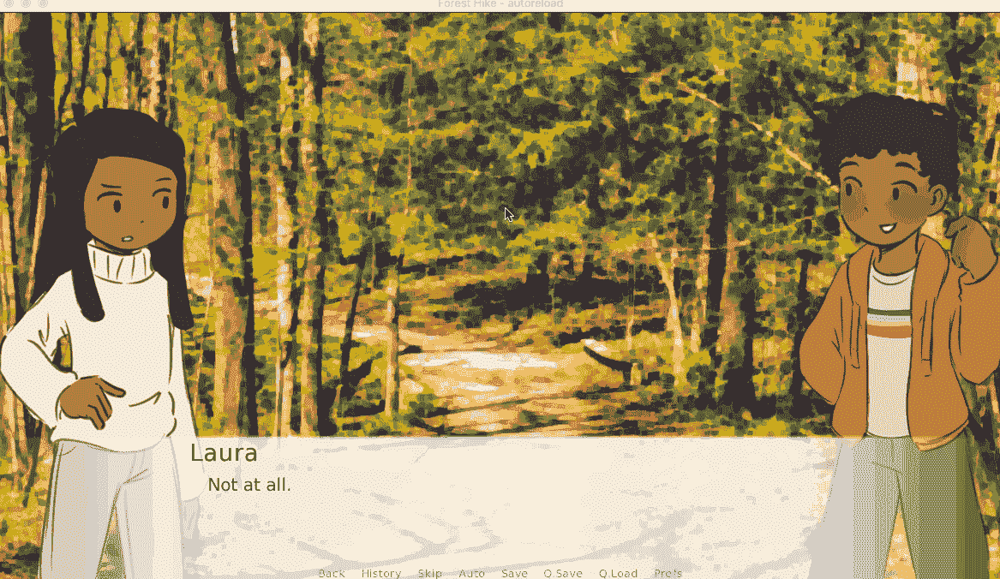

Setting a custom CPS displays the text one character at a time at a given rate

在`gui.rpy` (GUI 代表图形用户界面，包括我们见过的文本框和菜单选项)或`screens.rpy`中，我们甚至可以定制更多。

## 伦比还能做什么？

Ren'Py 的功能远远不止显示文本和图像。我甚至可以说 Ren'Py 和 Python 本身一样有能力和多才多艺。

使用 [Pygame](https://www.pygame.org/news) 模块，可以在 Ren'Py 中创建复杂的迷你游戏。我自己已经创建并开源了一些迷你游戏，包括一个与 Stockfish chess AI 集成的象棋引擎，以及一个自动为任何音乐文件生成节拍图的节奏游戏引擎。

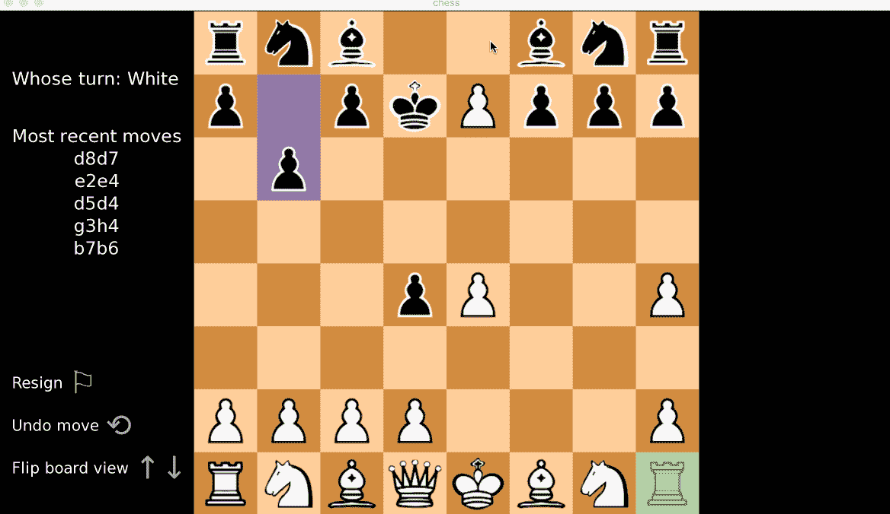

My chess game demo

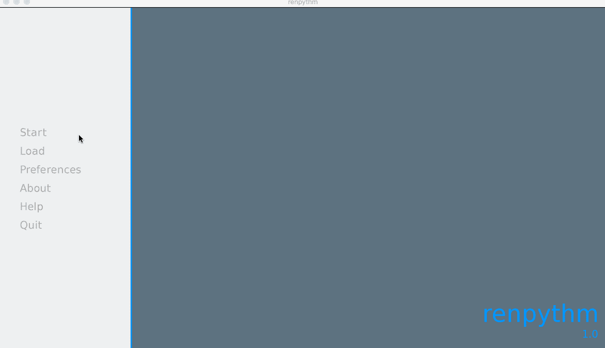

My rhythm game demo

[Ren’Py Chess Game 2.0 by r3dhummingbirdPvP and PvC Chess Game Powered by Stockfish in Ren’PyStudio Madeleine Chaiitch.io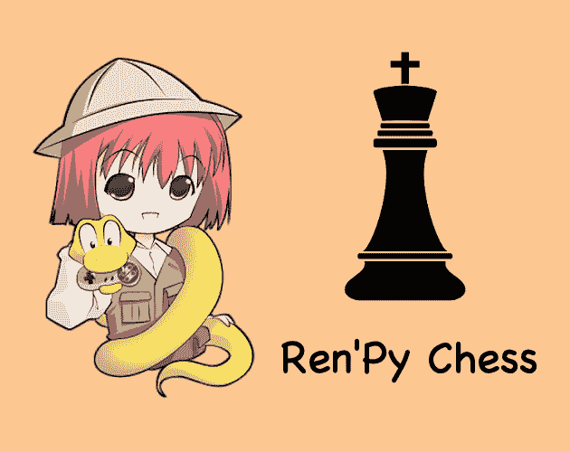](https://r3dhummingbird.itch.io/renpy-chess-game)[Ren’Py Rhythm Game by r3dhummingbirdPlay a rhythm game in your Ren’Py Visual Novel game!itch.io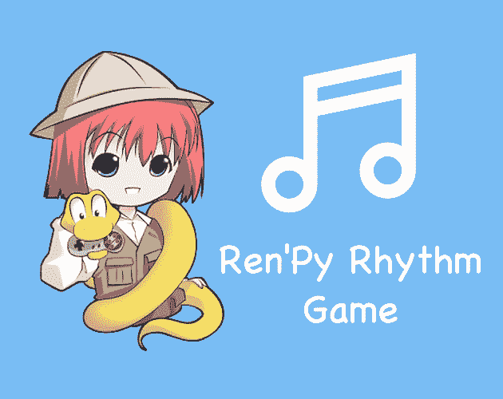](https://r3dhummingbird.itch.io/renpy-rhythm-game)

## 资源

本教程将帮助你开始使用 Ren'Py。当你学习更高级的特性来为你的项目添加活力时，参考官方文档总是有用的。

我还创建了一些课程材料来帮助你复习 Python 基础知识以及它们在脚本中的功能。

[RuolinZheng08/python-for-renpy-dev[Udemy Course Material] Python Basics for Ren’Py Developers - RuolinZheng08/python-for-renpy-devRuolinZheng08GitHub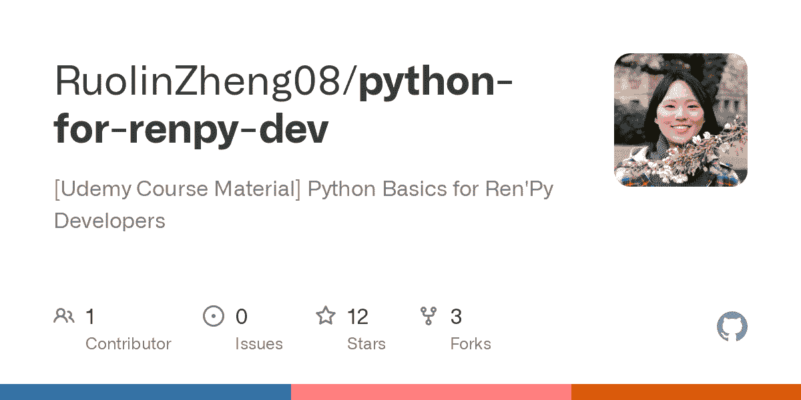](https://github.com/RuolinZheng08/python-for-renpy-dev)[Python Basics for Ren’Py DevelopersLearn the Python basics to build complex components like an inventory system or a minigame in your Ren’Py projectUdemy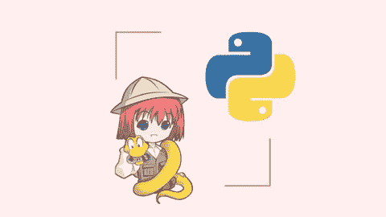](https://www.udemy.com/course/python-basics-for-renpy-developers/?referralCode=774C55606994052EBFCB)

请查看我在 YouTube 上的课程介绍视频:

[https://www.youtube.com/embed/pQcb_pfIbI0?feature=oembed](https://www.youtube.com/embed/pQcb_pfIbI0?feature=oembed)

感谢您的阅读，并愉快地讲述您的故事！