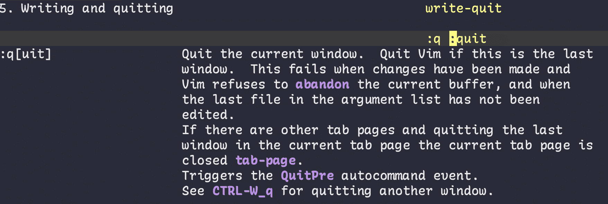
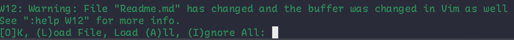
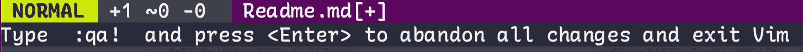
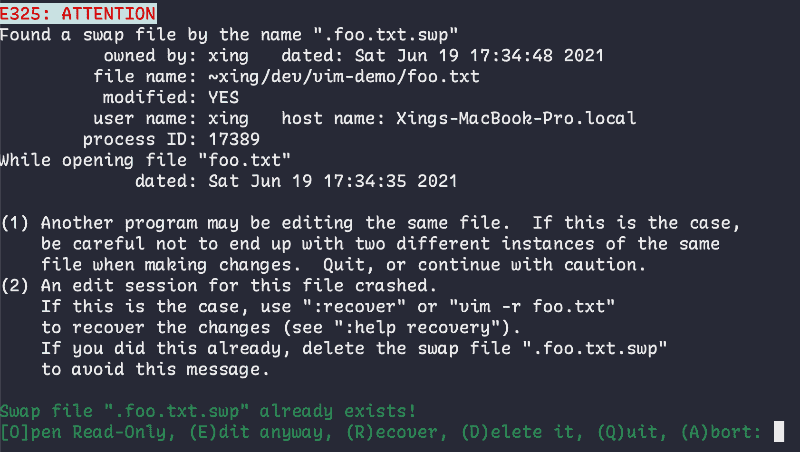
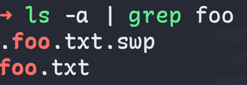
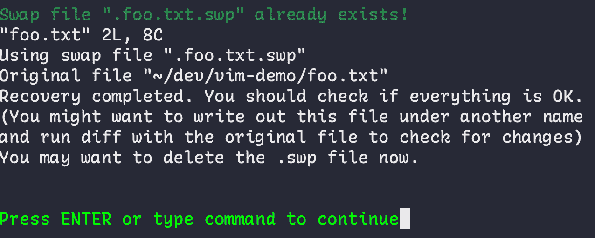

# 如何退出 Vim–Vim 保存并退出命令教程

> 原文：<https://www.freecodecamp.org/news/how-to-exit-vim/>

从我开始编码的第一年起，我就一直在使用 Vim。对于我用过的所有 IDEs 编辑器，Vim 插件总是我安装的第一个插件。

我知道对于不熟悉 Vim 的人来说，使用 Vim 可能会很有挑战性。在本文中，我们将讨论一些基本话题，比如如何退出 Vim，而不是退出 Vim。

我还将包括您可以用来显示相应的帮助文档的命令。为此，首先我们需要按几次`ESC`，运行提供的命令，例如`:h vim-modes`，然后按`Enter`。

## TL；DR–如何退出 Vim

1.  按一次`ESC`(*有时按两次*)
2.  确保您使用的是英语输入法
3.  下一步取决于当前状态和您的期望:
    *   如果您没有进行任何更改，请键入`:q`并按下`Enter` / `return`
    *   如果您做了一些更改，并希望**保留**这些更改，请键入`:wq`并按下`Enter` / `return`
    *   如果您做了一些更改，并且希望**放弃**它们，请键入`:q!`并按下`Enter` / `return`

如果您想更详细地了解这是如何工作的，让我们开始吧。

## Vim 中有哪些模式？

Vim 中有七种基本模式和七种被视为基本模式变体的附加模式。如果您想了解更多，可以在 Vim 中运行`:h vim-modes`来阅读文档。

幸运的是，我们不必为了开始而了解它们。但是有三种模式我们需要知道:`Normal Mode`、`Insert Mode`和`Command-line Mode`。

### Vim 中的正常模式是什么？

`Normal Mode`是至关重要的，因为只有在`Normal Mode`中我们才能运行命令(也有例外，但超出了本文的范围)。

比方说，如果我们想阅读`vim-modes`的文档，那么在输入`:h vim-modes`之前，我们必须首先确保我们在`Normal Mode`中。而最规范的进入`Normal Mode`的方式就是按下`ESC`。即使你已经在`Normal Mode`了，按`ESC`也会让你一直在`Normal Mode`里，不用担心。

在文档中找到:`:h Normal`，`:h mode-switching`。

### Vim 中的插入模式是什么？

您使用`Insert Mode`来编辑当前文件(在 Vim 中，这通常被称为`buffer`)。默认情况下，我们打开一个文件后就进入了`Normal Mode`。如果我们需要对当前文件进行修改，首先我们需要切换到`Insert Mode`。

最常见的切换方式是在将光标导航到我们要编辑的位置后，按下`Normal mode`中的`i`。

进入`Insert Mode`的方式其实还有很多，比如`o`、`O`、`a`、`A`、`I`等等。

在文档中找到:`:h Insert`、`:h i_<Esc>`、`:h o`、`:h O`、`:h a`、`:h A`、`:h I`。

### Vim 中的命令行模式是什么？

`Command-line Mode`通常是“短命”模式，用于运行“Ex 命令”(不要与`Normal Mode`中的“命令”混淆)。

有趣的事实:Vim 实际上是`Vi Improved`的缩写，它基于另一个名为`[vi](https://en.wikipedia.org/wiki/Vi)`的文本编辑器。而`vi`是基于一个名为`[ex](https://en.wikipedia.org/wiki/Ex_(text_editor))`的行编辑器。`vi`和`ex`都是由[比尔乔伊](https://en.wikipedia.org/wiki/Bill_Joy)开发的。

对 macOS 用户来说，另一个有趣的事实是:在 macOS 上只有`Vim`，命令`vi`被符号链接到`vim`。还要注意`Command-line Mode`中的“Ex 命令”不同于`Normal Mode`中的“命令”。

在`Normal Mode`中输入`:`就可以进入`Command-line Mode`。例如，如果您运行上面的命令来查看文档，那么当您键入`:`时，您实际上正在使用`Command-line Mode`。

同样，如果您想切换回`Normal Mode`，请按`ESC`。

在文档中找到:`:h Command-line`，`:h cmdline-lines`。

## 如何退出 Vim

documentation of `:h quit`

如果你看一下`:h quit`的文档，注意到`quit`的前缀是`:`。这意味着`quit`在`Command-line Mode`内使用。

为了进入`Command-line Mode`，首先我们需要确保我们在`Normal Mode`，然后简单地输入`:`。现在我们在`Command-line Mode`中，只需输入`quit`并按下`Enter`或`return`。

您可能还注意到了那里的`:q`，它实际上是`:quit`命令的简写版本。也就是说，我们也可以通过执行`:q`来退出 Vim。

不过，它确实提到了这个命令将会失败，“当已经进行了更改并且 Vim 拒绝放弃当前的缓冲区时”(如果您还记得的话，buffer 只是打开的文件，没什么特别的)。

在这种情况下，我们需要使用`:wq`，意思是“写并退出”。您可以在`:h :wq`下的文档中找到。

`:x`是另一个与`:wq`几乎相同的命令。按照`:h :x`的说法，就是“like :wq，但是只写已经修改过的”。

这里的不同之处在于，无论您是否对文件进行了更改，`:wq`都会保存文件。如果您没有进行任何更改，则`:x`不会保存文件。这里重要的是文件的修改时间，因为`:wq`会更新修改时间，而`:x`不会。

有些时候，我们宁愿不保留已经做出的改变。此时，我们需要`:q!`命令。`!`通常被称为“砰”，这使得`q!`有点像“强制退出”。

请注意，如果您使用这种方式，您将丢失对该文件所做的所有更改，并且几乎没有任何方法可以恢复它们。

## 如何排除现有 Vim 的故障

### 不想进`Command-line Mode`怎么办？

没问题。在`Normal Mode`中，也可以按`ZZ`或`ZQ`退出 Vim。其中`ZZ`与`:x`相同，`ZQ`与`:q!`相同。

这里，`ZZ`和`ZQ`被认为是`Normal Mode`的命令，而`:x`和`:q!`是 Ex 命令。

### 如果`:wq`失败了怎么办？

这是合法的，因为当文件是只读的或者文件名丢失时,`:wq`可能会失败。

请注意，当文件是只读的时，Vim 不会阻止您打开和编辑文件。你可能还会发现`:wq!`在那个时刻也不行。你可能最终会放弃所有用`:q!`做的修改，打开前缀为`sudo`的同一个文件，再做一次同样的修改。

你可以做的一件事是将这个文件保存在你有写权限的另一个目录中，比如`~`或者甚至`/tmp`。然后将它移回您没有写权限的目录。

为了实现这一点，您可以运行`:w ~/my-backup-file`，它会将该文件保存在`~`下。接下来你可以使用`mv`命令来移动这个文件。还要注意，当 Vim 抱怨文件名丢失时，这就是您需要做的。

Vim 内部还有另一个解决方案。您可以运行这个命令:`:w !sudo tee %`。这里的`!sudo`意味着在您的 shell 环境中运行 sudo 命令。

例如，`:ls`将列出 Vim 中的所有缓冲区，但是`:!ls`将从 shell 中运行`ls`命令并显示结果。`tee`从标准输入(又名`stdin`)复制到标准输出(又名`stdout`)。`%`指当前文件名。

这意味着我们从 shell 环境中使用`sudo`命令，从 Vim 中复制当前文件(注意:修改后的版本)的内容，并将修改后的内容重定向到文件(使用文件名引用)。

Warning of file content change

您会注意到上面的警告。出现这个警告是因为文件内容在 shell 环境中被更新了，而没有引起 Vim 的注意。所以 Vim 认为这是外部变化，并让您知道发生了什么。

由于您有意进行了外部更改，此时您只需按`Enter`即可。

您可能还会注意到，修改后的文件内容也会显示在警告消息的上方。这是意料之中的，因为它来自`stdout`。如果你不想看，你可以做`:w !sudo tee% >/dev/null`，这将从`tee`中丢弃`stdout`。

### 如果我迷路了，不得不强制退出怎么办？

如果我们尝试按下`control + c`退出，Vim 会显示上面的信息。但是你仍然可以通过 Windows 上的`Ctrl + Alt + Delete`或者 macOS 上的`Force Quit...`来解决这个问题。

下次当你试图再次打开同一个文件时，你*应该*看到这个(这里我用一个名为`foo.txt`的文件作为例子):

swap file

不要惊慌——这是意料之中的，因为 Vim 正试图帮助您恢复可能丢失的有价值的更改。

通过检查目录，你会发现一个扩展名为`.swp`的文件。这是一个`swap`文件(文档:`:h swap-file`):

swap file .swp

如果按下`R`恢复，我们将看到以下内容:

.swp recover

按下`Enter`后，现在你会注意到之前所做的更改又回来了。完成恢复过程后，您可以简单地删除`.swp`文件，这样您就不会再看到上面的错误了。

## **结论**

在本文中，我们介绍了关于 Vim 模式和如何退出 Vim 的一些基础知识。我们还学习了如何解决退出 Vim 时的常见问题。

感谢阅读。谈到 Vim，还有很多东西需要学习。但是如果您想了解更多信息，请随意浏览 Vim 帮助文档。