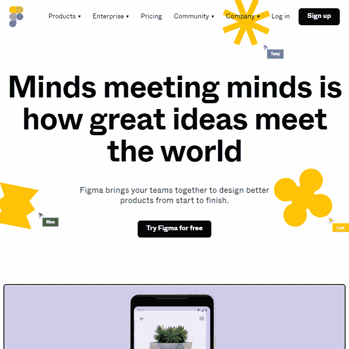
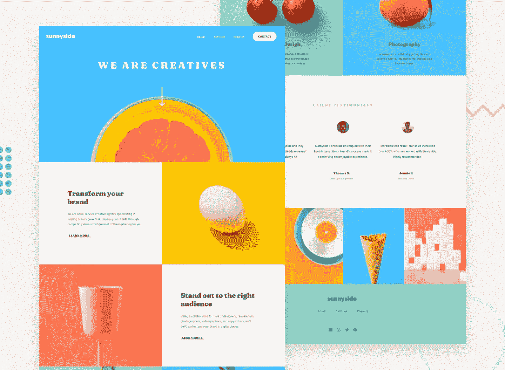
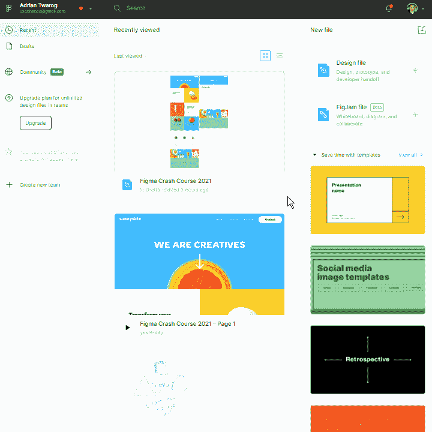
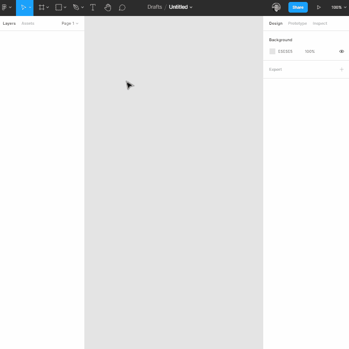
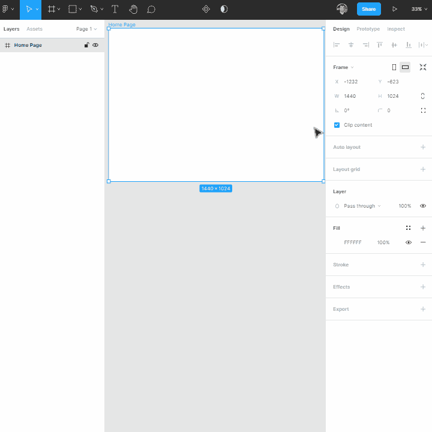
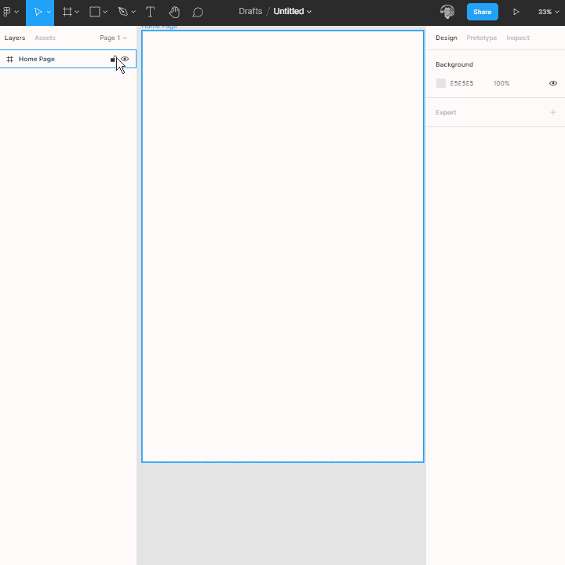
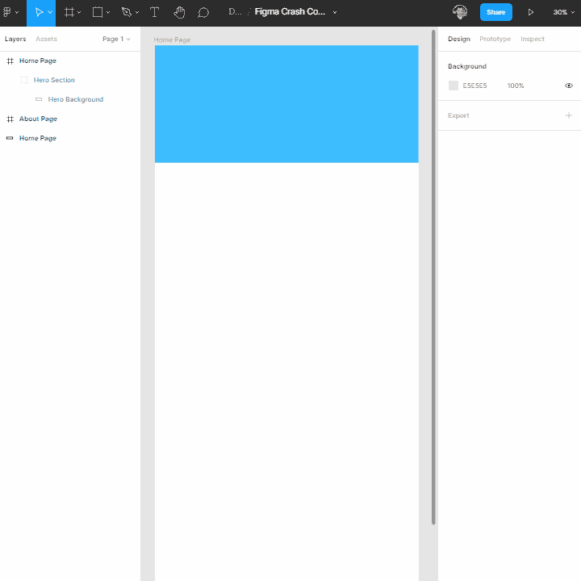
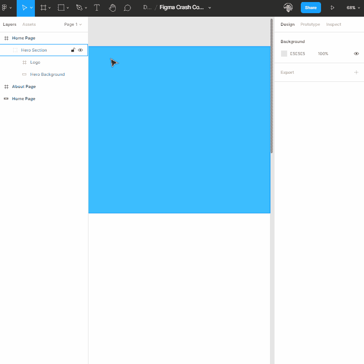
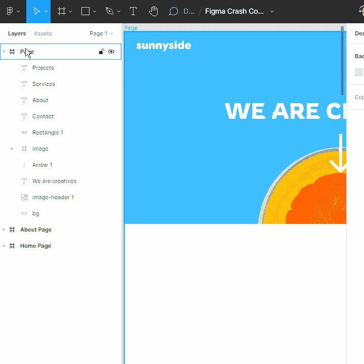
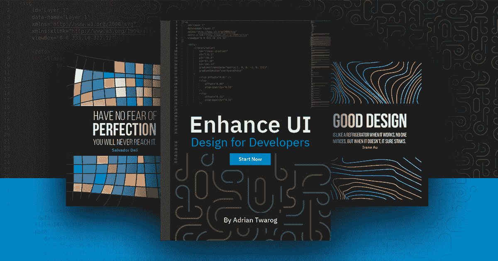

# Figma 是什么？一个设计速成班【2021 教程】

> 原文：<https://www.freecodecamp.org/news/figma-crash-course/>

Figma 是一个强大的设计工具，可以帮助你创建任何东西:网站、应用程序、徽标等等。

通过学习使用 Figma，你将向用户界面设计和用户体验设计迈出第一步。这些技能对于为你自己甚至你自己的公司建立一个伟大的投资组合是必不可少的。

在这个 Figma 速成课程中，我将使用 Frontend Mentor 的一个真实项目网站，我们将在 Figma 中重新创建该网站。通过构建项目来学习是巩固您的知识的一个很好的方式，所以我建议下载这些资源并跟随学习。

[https://www.youtube.com/embed/lg7w3Ntfqy0?feature=oembed](https://www.youtube.com/embed/lg7w3Ntfqy0?feature=oembed)

Figma Crash Course [Video Version](https://youtu.be/lg7w3Ntfqy0) 

我将把这个速成课程分成几个部分，我们将探索 Figma 的不同特性，包括:

*   帐户设置
*   设计文件
*   设计资产
*   如何开始——基础
*   框架
*   网格列和行
*   形状
*   导入图像
*   标签和分组
*   文本
*   导航栏
*   按钮设计
*   页眉标题和缩放
*   附加文本设置
*   英雄部分和 Figma 层
*   组和节
*   字体和 Figma 颜色
*   文本行高度和间距
*   对齐和捕捉
*   用形状和图像遮罩
*   复制组和节
*   更新部分
*   颜色选择器和复制部分继续
*   颜色选择和挑选正确的色调
*   证明部分
*   Autolayout
*   自动布局选项
*   自动布局对齐
*   自动布局内容
*   图库图像
*   调整图像大小
*   页脚
*   SVG 颜色和覆盖编辑
*   自动布局菜单页脚
*   图层工具栏，隐藏和锁定
*   原型查看器
*   框架和页面
*   原型交互
*   原型交互导航到页面
*   共享测试和预览原型
*   导出页面
*   导出组或部分

在本文中，我将向您简要介绍课程的一些主要部分，以便您可以开始使用 Figma 进行设计。

## 介绍

让我们首先在 Figma 网站上创建一个帐户。你可以在这里这样做:[Figma.com](https://figma.com)。

只需注册一个新账户(电子邮件或谷歌登录)——完全免费

接下来，我们需要获得用于这个项目的设计资产，我们将从前端导师那里获得。您可以在此下载:

[Frontend Mentor | Sunnyside agency landing page coding challenge solutionAdarshshanbhag5′s front-end solution for the Sunnyside agency landing page coding challenge on Frontend MentorSolution byAdarsh70Frontend Mentor](https://www.frontendmentor.io/solutions/sunnyside-agency-landing-page-mVy7o6ijV)

我们将构建我们的第一个草稿页面。看看下面我们将要使用的默认设计布局。选择+号，或在右侧创建一个新的设计页面。

## 如何在 Figma 中制作相框

首先，我们将创建一个框架。这和页面是一样的，这是我们的设计将存在的地方。您可以根据自己的需求随意调整框架的大小。

此示例将是一个网站，因此我们将选择桌面框架，但您也可以创建移动应用程序框架，甚至自定义框架。

*   从顶部菜单中选择框架工具
*   在右侧面板上选择框架尺寸

## 如何在 Figma 中添加网格和列

在我们开始设计之前，您需要添加网格来帮助您保持页面内容对齐的一致性。

您可以在框架中添加网格并进行自定义。例如，我经常喜欢 12 个网格，因为这是网站开发的默认设置。

*   选择要网格化的框架
*   选择右侧面板上的布局网格
*   选择列和 12 个单位

## 如何在 Figma 中使用形状

使用 Figma 中的形状和元素创建正方形、圆形、线条等。这些是在页面上创建设计的基础。

我将从一个简单的矩形开始，我们将用它来为这个主页的顶部创建我们的英雄导航部分。

*   选择方形工具
*   创建一个正方形
*   开始塑造和调整它

## 如何在 Figma 中添加图像

您可以从在线来源或本地将图像添加到您的页面。图像是设计网站的重要部分，尤其是对于英雄部分。

让我们添加一个标志作为我们的第一个图像，我们将添加到屏幕的左上角。

*   从您的本地计算机拖放图像
*   从形状图像上传选项导入图像
*   调整图像大小并将其放置在设计上

## 如何在 Figma 中为设计添加文本

要将文本添加到设计中，请选择文本工具并将其放在页面上。字体将默认为 Roboto，但是您可以在任何阶段更改字体系列、大小和颜色。

在这个例子中，我们将使用右面板来改变字体的颜色和大小，以及后来的字体系列。

*   选择文本工具
*   添加“关于”文本作为导航的开始
*   确保尺寸和颜色是 24 和白色

## 如何在 Figma 中标记元素和创建组

在 Figma 中使用大量的层会让人感到困惑，所以在创建元素时就给它们加上标签。更好的是用“英雄背景”或“导航条”等标签将不同的部分和形状分组。

*   选择您的元素并右键单击以进行分组，或者按 Ctrl + G
*   命名您的小组
*   将组放在页面每个部分的组中，以提高页面变大后的可读性

## 结论

Figma 使用起来很简单，但是要充分发挥它的潜力，还有很多东西需要学习。有了形状、图像和文本的基础知识，您可以轻松地开始构建网站原型、设计移动应用程序等等。

如果你想更深入地了解这些基础知识，我建议你观看并跟随[整个视频速成班]( https://youtu.be/lg7w3Ntfqy0)，它会更深入地研究每个方面。

您可以在下面查看设计的全部结果:

[https://www.figma.com/embed?embed_host=oembed&url=https://www.figma.com/file/9kw3Z8n5t5l3BHAvyZy39X/Figma-Crash-Course-2021?node-id=0:1](https://www.figma.com/embed?embed_host=oembed&url=https://www.figma.com/file/9kw3Z8n5t5l3BHAvyZy39X/Figma-Crash-Course-2021?node-id=0:1)

这整个过程是我试图在自己的频道上教授的内容的一部分，也是我正在写的关于设计的课程/书的一部分，名为 ****增强 UI**** 。 ****的目标是帮助开发者理解**** 设计的基本原理。查看下面我的增强用户界面的书:

[Enhance UI - Design for DevelopersLearn Design for Developers wanting to know UI, UX and more.Design for Developers](https://www.enhanceui.com)

我希望你喜欢这篇文章。如果你不知道我是谁，我是澳大利亚的阿德里安。我在 Twitter 和 YouTube 上有一个小小的频道，所以如果你想更多地了解我或者喜欢我的内容，有空可以去看看。😉

*   ********************************你****************T**************ube:******************************
*   ********************************碎碎念:********************************[https://twitter.com/adrian_twarog](https://twitter.com/adrian_twarog)