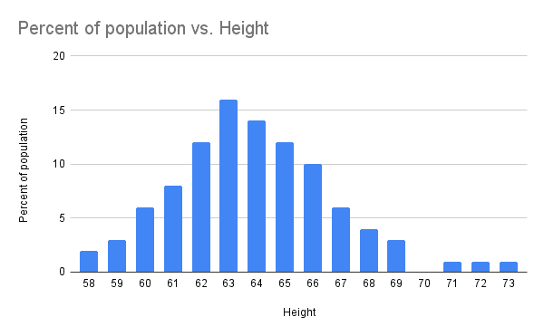
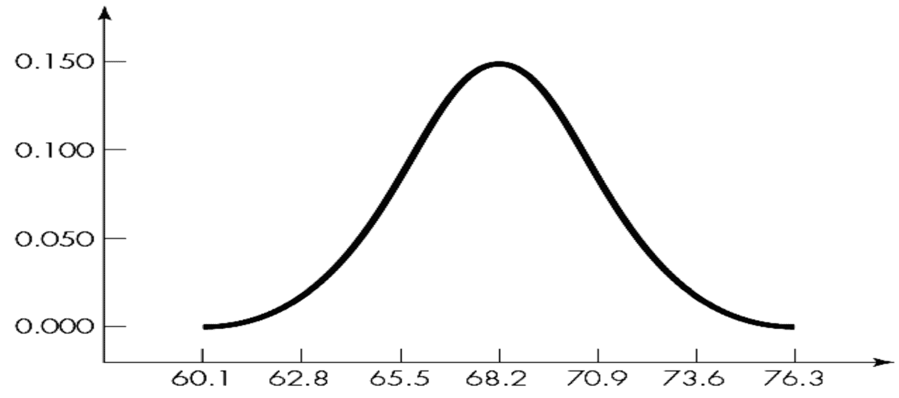
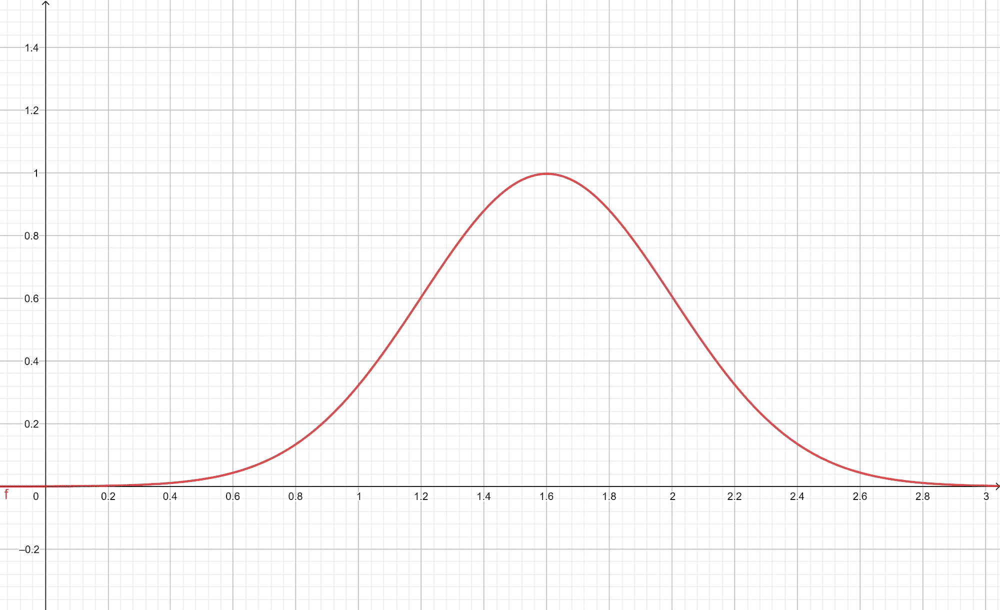
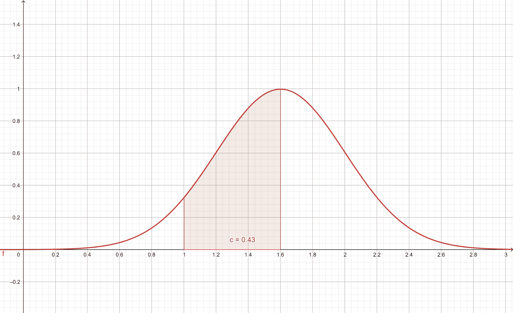
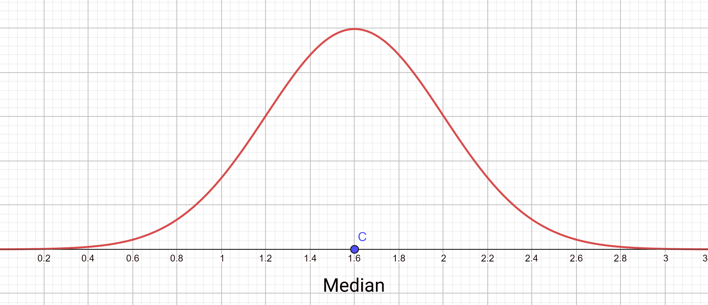
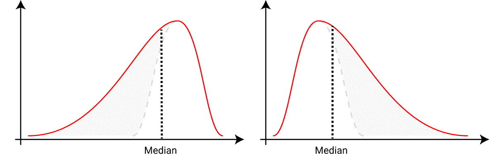
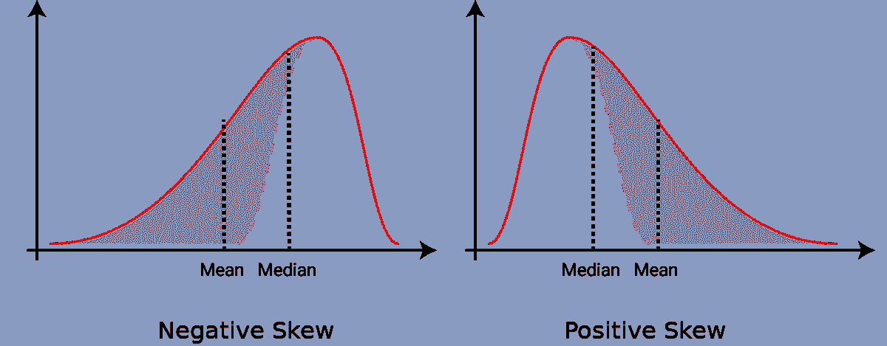
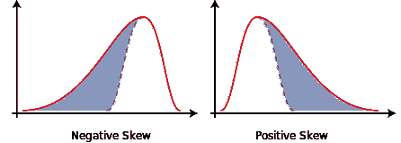
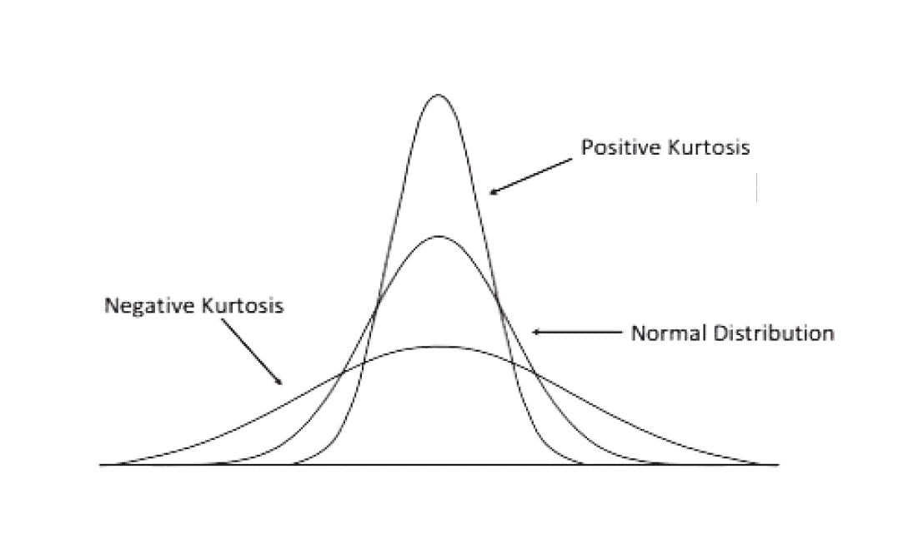

# 偏斜度和峰度——解释统计学中的正偏斜和负偏斜分布

> 原文：<https://www.freecodecamp.org/news/skewness-and-kurtosis-in-statistics-explained/>

在这篇文章中，我将解释统计学中的两个重要概念:偏度和峰度。不要担心——你不需要了解太多的数学知识就能理解这些概念并学会如何应用它们。

## 什么是密度曲线？

让我们先谈一谈密度曲线，因为偏度和峰度是基于它们的。它们只是我们表示分布的一种方式。让我们通过一个例子来看看我的意思。

说你需要记录很多人的身高。因此，假设您的分布有 20 个代表输出范围的类别(58-59 英寸，59-60 英寸...78-79).您可以绘制一个直方图来表示这些类别以及每个类别中身高的人数。



Histogram of height vs population

好吧，你可能对数千人这样做，所以你对确切的数字不感兴趣——而是对这些类别的百分比或概率感兴趣。

我也明确地提到过，你有一个相当大的分布，因为百分比对于较小的分布通常是无用的。

如果你用较小的数字表示百分比，我经常称之为用统计数据撒谎——这种说法在技术上是正确的，但在我们心中造成了错误的印象。

我举个例子:一个学生异常兴奋，告诉班上所有人，他的成绩提高了 100%！但他没说的是他的分数从 2/30 上升到了 4/30😂。

我希望你现在清楚地看到使用较小数字的百分比的问题。

回到密度曲线，当你处理一个大的分布时，你希望有更多的粒度类别。因此，您将每个 1 英寸宽的类别变成了 2 个\(\frac{1}{2}\)英寸宽的类别。也许您想更细化，开始使用\(\frac{1}{4}\)英寸宽的类别。你能猜到我要说什么吗？

在某一点上，我们得到无限多的这种长度无限小的范畴。这允许我们从这个直方图中创建一条曲线，我们之前已经将它分成了不同的类别。请看下面从直方图中绘制的密度曲线。



Probability density curve for our distribution

### 为什么要努力呢？

很棒的问题！你可能已经猜到了，我喜欢用例子来解释自己，所以让我们看看另一条密度曲线，让我们更容易理解。如果你以前没有使用过分布，在这个阶段可以跳过曲线方程。

您也可以通过这个 Geogebra 项目(它在浏览器中运行)自己跟随并创建本文中的图形和可视化。

\[f(x)= \ frac { 1 } { 0.4 \ sqrt { 2 \ pi } } \ cdot e^{-\frac{1}{2}(\ frac { x-1.6}{0.4})^2} \]



那么现在如果我问你“我的分布在 1 - 1.6 类中的百分比是多少？”你只需要计算 1 到 1.6 之间的曲线下的面积，就像这样:

\[ \int_{1}^{1.6} f(x) \,dx \]



对你来说，从密度曲线中回答类似的问题也相对容易，比如:“低于 1.2 的分布百分比是多少？”或者“高于 1.2 的分布百分比是多少？”

你现在可能明白为什么制作密度曲线的努力是值得的，以及它如何让你容易地做出推论🚀。

## 偏斜分布

现在让我们来谈谈偏斜分布——也就是说，那些不像我们之前看到的曲线那样令人愉快和对称的分布。我们会用均值和中值的概念更直观地讨论这个问题。

从这个密度曲线图的图像中，试着找出这个分布的中间值在哪里。也许对你来说很容易算出——曲线是对称的，你可能会得出中位数是 1.6 的结论，因为它是关于(x=1.6)对称的。

另一种说法是，中值是指曲线左侧和右侧的面积相等的值。



我们讨论这个想法是因为它允许我们计算非对称密度曲线的中值。

作为一个例子，我展示了两个非常常见的偏态分布，以及我们刚刚讨论的等面积概念如何帮助我们找到它们的中位数。如果我们试着目测我们的中间值，这就是我们得到的结果，因为我们希望两边的面积相等。



Eyeballing the median for skewed curves

你也可以通过这些密度曲线计算平均值。也许你已经尝试过自己计算平均值，但是请注意，如果你使用一般公式来计算平均值:

\[ mean = \frac{\sum a_n}{n} \]

您可能会注意到其中的一个缺陷:我们考虑了\( x \)值，但是我们也有与这些值相关的概率。把这个因素也考虑进去是有意义的。

因此，我们通过使用加权平均值来修改我们计算平均值的方法。我们现在也将有一个代表相关权重的项\(w_n\ ):

\[mean = \ frac { \ sum { a _ n \ cdot w _ n } } { n } \]

所以，我们将使用我们刚刚讨论过的想法，来计算密度曲线的平均值。

你也可以更直观地理解为 x 轴上的一个点，如果它是一个实心物体，你可以在这个点上放置一个支点，平衡曲线。这个想法应该帮助你更好地理解从我们的密度曲线中寻找平均值。

但是另一个非常有趣的方法是，把它作为这条曲线上转动惯量为零的点的 x 坐标。

你可能已经知道如何找到对称曲线的平均值:我们的中值和平均值位于同一点，对称点。

我们将使用我们刚刚讨论过的想法，在 x 轴上放置一个支点并平衡曲线，从而得出偏斜图形的平均值，就像我们之前在计算中值时看到的那样。



我们将很快更详细地讨论偏斜度的概念。但是在这个阶段，*一般来说*，你可以确定你的曲线歪斜的方向。如果中位数在平均值的右边，那么它就是负偏的。如果平均值在中间值的右边，那么它就是正偏的。

在本文的后面，为了简单起见，我们也将这些曲线的狭窄部分称为“尾巴”。

## 什么是瞬间？

在我们谈论更多的偏度和峰度之前，让我们先探讨一下矩的概念。稍后我们将使用这个概念来发展一个测量分布中偏度和峰度的想法。

我们将使用一个小数据集，[1，2，3，3，3，6]。这些数字意味着您的点距离原点 1 个单位，距离原点 2 个单位，依此类推。

因此，我们非常关心数据集中离原点的距离。我们可以将数据中距离原点的平均距离表示为:

\[\ frac { \ sum a _ n-0 } { n } = \ frac { \ sum a _ n } { n } \]

这就是我们所说的第一时刻。对我们的样本数据集进行计算，我们得到 3，但是如果我们改变数据集，使所有元素都等于 3，

\[ [1，2，3，3，3，6] \rightarrow [3，3，3，3，3] \]

你会看到我们的第一个瞬间依然如故。我们能设计一些东西来区分两个具有相同一阶矩的数据集吗？(PS:已经是第二个时刻了。)

我们将计算距离平方的平均和，而不是距离的平均和:

\[ \frac{\sum (a_n)^2}{n} \]

我们对原始数据集的二阶矩是 11.33，对新数据集的二阶矩是 9。注意，原始数据集的二阶矩比新数据集的大。此外，原始数据集中的二阶矩值更高，因为它分散开来，具有更大的平均平方距离。

本质上，我们是说，我们的原始数据集中有几个值大于平均值，当平方时，我们的二阶矩增加了很多。

这里有一个有趣的思考力矩的方法——假设我们的分布是质量，那么第一个力矩就是质量的中心，第二个力矩就是转动惯量。

你也可以看到，我们的第二个瞬间高度依赖于我们的第一个瞬间。但是我们有兴趣知道二阶矩能独立给我们的信息。

为此，我们从平均值或一阶矩而不是从原点计算距离的平方。

\[\ frac { \ sum(a _ n-\mu_{1}^{'})^2 } { n } \]

你有没有注意到我们也直观地推导出了方差公式？接下来，您将看到我们如何使用刚才讨论的概念来测量偏度和峰度。

## 偏斜度和峰度介绍？

让我们看看如何使用我们之前讨论过的矩的概念来计算我们如何测量偏度(你已经有一些概念了)和峰度。

### 什么是偏斜度？

让我们拿刚才讲的矩的概念，试着计算三阶矩。你可能已经猜到了，我们可以计算距离的立方。但是正如我们上面讨论的，我们更感兴趣的是看到三阶矩提供的额外信息。

所以我们想从三阶矩中减去二阶矩。后面我们也会把这个因素称为对时刻的调整。所以我们调整后的时刻会是这样的:

\[skewness = \ frac { \ sum(a _ n-\mu)^3 } { n \ cdot \西格玛^3} \]

这个调整后的时刻就是我们所说的*偏斜度。*它帮助我们测量数据中的不对称性。

完全对称的数据的偏斜度值为 0。负偏度值意味着分布的尾部在分布的左侧，而正偏度值的尾部在分布的右侧。



Positive skew and negative skew

在这一阶段，计算偏斜度似乎很难，因为在公式中我们使用总体均值\( \mu \)和总体标准差\( \sigma \ ),这是我们在取样时无法获得的。

相反，您只有样本均值和样本标准差，因此我们很快就会看到如何使用它们。

### 什么是峰度？

你可能已经猜到了，这一次我们将计算我们的四阶矩或者使用我们距离的四次方。就像我们之前讨论的那样，我们有兴趣了解它提供的额外信息，因此我们也将从中减去调整系数。

这就是我们所说的*峭度*或者衡量我们的数据是有很多离群值还是很少离群值的指标。这将看起来像:

\[峭度= \ frac { \ sum(a _ n-\mu)^4 } { n \ cdot \西格玛^4} \]

对于这里发生的事情，一个更好的术语是弄清楚分布是重尾还是轻尾。我们可以将其与正态分布进行比较。

如果你做一个简单的替换，你会看到正态分布的峰度是 3。由于我们对峰度和正态分布的比较感兴趣，我们经常使用超额峰度，它只是从上面的等式中减去 3。



Positive and negative kurtosis (Adapted from Analytics Vidhya)

这实际上是我们试图将正态分布的峰度强制为 0，以便于比较。因此，如果我们的分布有正峰度，它表示重尾分布，而负峰度表示轻尾分布。从图形上看，这类似于上面的图像。

## 抽样调整

所以，我们刚刚建立的方程的一个问题是，它们有两个项，分布均值和分布标准差。但是我们正在进行观察取样，所以我们没有整个分布的参数。我们只有样本均值和样本标准差。

为了保持本文的重点，我们将不详细讨论抽样调整项，因为自由度不在本文的范围之内。

这个想法是使用我们的样本均值\( \bar{x} \)和样本标准差\( s \)来估计我们分布的这些值。我们也必须调整我们在这些方程中的自由度。

如果你在这一点上没有完全理解这个概念，也不用担心。我们可以继续前进。这导致我们像这样修改我们早先谈论的方程:

\[skewness = \ frac { \ sum(a _ n-\bar{x})^3 }{s^3} \ cdot \ frac { n } {(n-1)(n-2)} \]

\[峰度= \ frac { \ sum(a _ n-\bar{x})^4 }{s^4} \ cdot \ frac { n(n+1)} {(n-1)(n-2)(n-3)}-\frac{3(n-1)^2}{(n-2)(n-3)} \]

## 如何用 Python 实现这一点

最后，让我们通过一个例子来看看如何在 Python 中测量偏斜度和峰度。如果你想跟随并尝试代码，你可以跟随[这个 Colab 笔记本](https://colab.research.google.com/drive/1pbWIz7X7_k5iNZ5w2x6eQUPz24l7yfLm?usp=sharing)，在这里我们测量数据集的偏斜度和峰度。

用 Python 中的 [Scipy](https://www.scipy.org/) 实现这一点非常简单。它提供了一些方法，可以通过预先构建的方法轻松测量分布的偏度和峰度。

下面的代码块显示了如何测量[波士顿住房数据集](https://www.cs.toronto.edu/~delve/data/boston/bostonDetail.html)的偏度和峰度，但是您也可以将它用于您自己的分布。

```
from scipy.stats import skew
from scipy.stats import kurtosis

skew(data["MEDV"].dropna())
kurtosis(data["MEDV"].dropna())
```

## **感谢您的阅读！**

谢谢你坚持到最后。我希望你从这篇文章中学到了很多。

我很高兴看到这篇文章是否帮助你更好地理解这两个非常重要的想法。如果你对我有任何反馈或建议，请随时在 Twitter 上联系我。