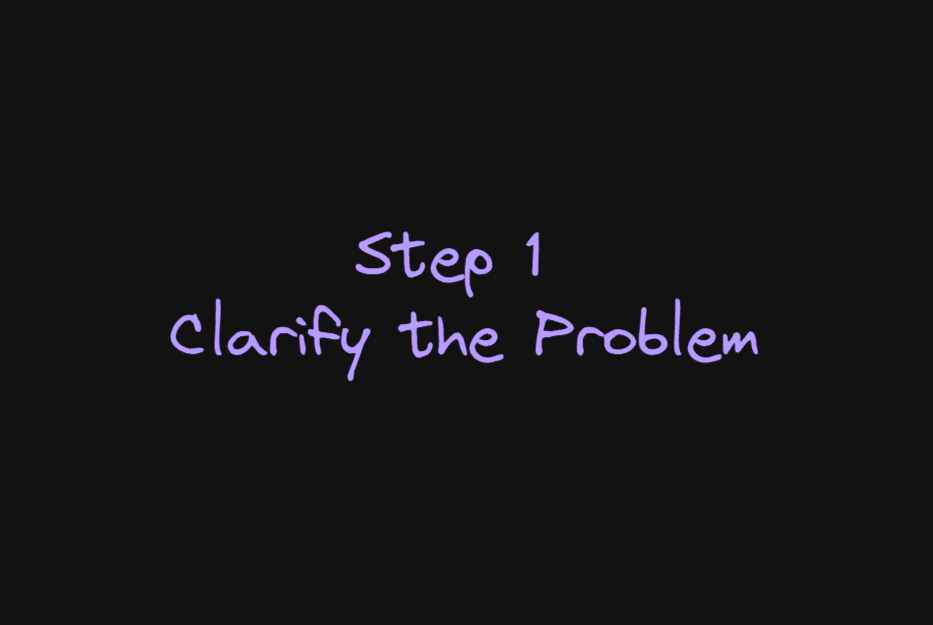
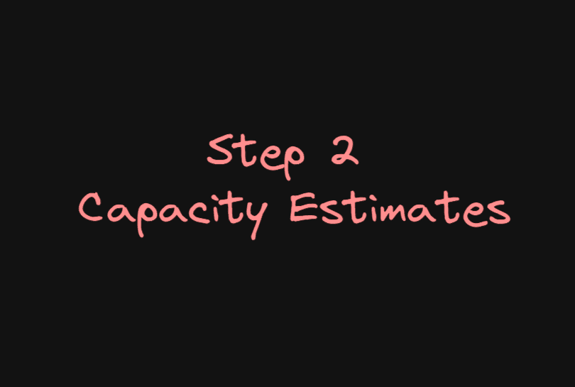
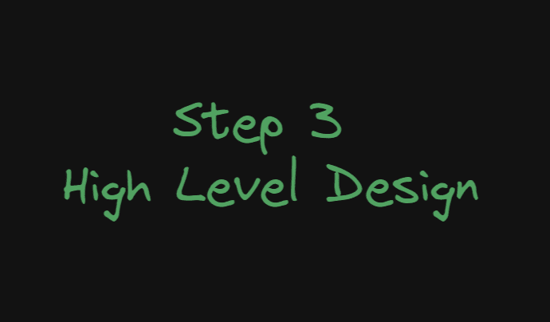
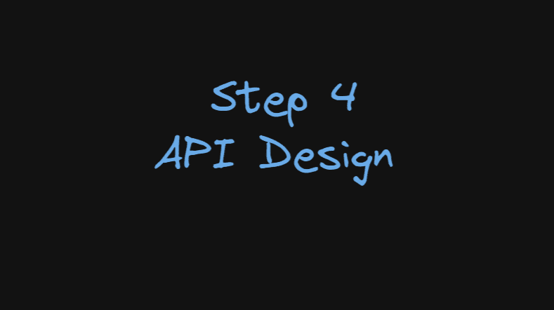
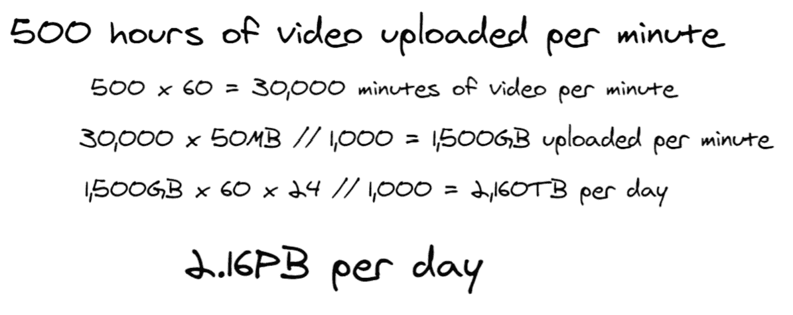
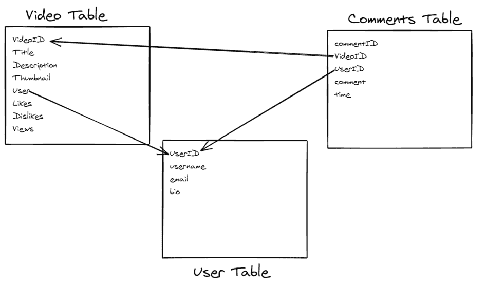
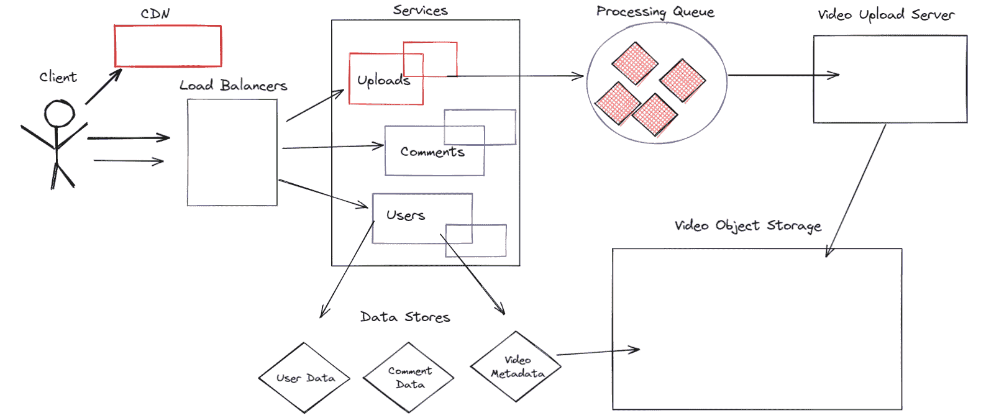

# 系统设计面试教程——系统设计初学者指南

> 原文：<https://www.freecodecamp.org/news/system-design-interview-practice-tutorial/>

如果你想在软件工程师的职业生涯中更进一步，系统设计是一个需要理解的重要话题。即使你刚刚开始你的编码之旅，先学习系统设计也是一个好主意。

在你职业生涯的早期，你大部分时候只是测试你的编码能力。然而，在更高层次的面试中，通常会更注重测试你设计应用程序的能力和经验。

工程师在系统设计面试中遇到的最大困难是他们更加开放，没有唯一正确的答案。这种缺乏结构的情况可能会令人生畏，所以我这篇文章的目的是给你一个路线图，让你自信地驾驭这种类型的面试。

本文将涵盖的内容:

*   什么是系统设计面试，为什么要进行面试
*   系统设计面试的主要阶段
*   面试问题示例——设计 YouTube

## 视频教程

如果你喜欢，也可以在 YouTube 上观看本教程:

[https://www.youtube.com/embed/YEwKnGARDZI?feature=oembed](https://www.youtube.com/embed/YEwKnGARDZI?feature=oembed)

我还创建了一个与系统设计和 web 架构相关的特定主题的视频播放列表:

[system design tutorialsThis series of videos covers of the the most important concepts related to system design, with a focus on practical system design knowledge for interviews. T...YouTube](https://www.youtube.com/playlist?list=PL_esswHjNwIeiFfVFer8uYly3Zk6YqXd0)

## 系统设计面试概述

乍一看，要求某人在 45-60 分钟内设计一个像 Twitter 或 YouTube 这样的大型应用程序似乎很愚蠢。这些应用程序是由数百名工程师一起工作，历时数年设计而成的，因此很明显，这是一个不可能在短时间内完成的任务。

公司使用这些类型的面试有两个主要原因。第一个当然是测试你对正在讨论的技术的了解。他们希望你足够深入，以确保你不是在不了解事情实际上是如何运作的情况下就随便乱说。

不过，第二个原因可能更重要。系统设计面试是一种模拟现实场景的方式，在这种情况下，您将与面试官一起确定最佳设计决策。

得到完美的答案并不一定是最重要的事情——你还可以展示其他一些东西，比如:

*   你如何面对挑战？你会自我防御还是以积极的态度接受反馈？你是固执还是小心眼？
*   你展示了某些设计决策涉及的各种权衡的知识吗？盲目做决定和没有意识到后果，以及知道利弊和接受权衡之间有很大的区别。
*   你能有效地沟通，并在必要时以简单易懂的方式解释复杂的技术概念吗？
*   你是面试官想要长期合作的候选人吗？即使有人是天才，如果和他们一起工作很痛苦，他们可能不是一个好雇员。

## 系统设计面试的各个阶段

在本节中，您将学习一个在系统设计面试中处理问题的一般框架。

### 澄清问题并确定设计范围

面试官给你问题后，你想做的第一件事就是花几分钟问一些问题，弄清楚他们到底在找什么。

在这里你能做的最糟糕的事情就是从一个完全错误的方向开始，因为你没有花时间问几个问题。面试时你的时间有限，所以你要确保把注意力放在重要的事情上。

以下是一些你可能会问的问题:

#### 该应用程序有哪些使用案例/功能？

在本文中，我们将以 YouTube 为例。你可以设计数百种不同的功能，比如广告投放、认证、推荐算法、评论、视频上传、视频处理等等。

在面试中，你只有时间回答其中的几个问题，所以一定要问面试官一些问题，以弄清楚他们希望你重点设计什么。

#### 预计有多少用户/可能的流量是多少？

系统的复杂性将取决于它需要处理的通信量，所以一定要收集这些信息。

如果流量相对较低，你不希望过度设计，也不希望因为设计不当而导致应用无法扩展。

问一些问题，比如应用程序将有多少用户，每个请求的平均数据量，数据需要存储多长时间，以及系统需要有多可靠和可用？

这一步将帮助你获得更多的信息。你也向面试官展示了你知道如何收集关于一个模糊问题的信息。

### 确定粗略的容量估计

使用您在第一步中收集的信息，您可以开始对存储和带宽要求等进行一些粗略的估计和概括。

这个过程将涉及一些基本的数学计算，如将用户数量乘以平均请求大小，以及每个用户每天的请求量。

### 创建高水平的设计

这里你想为系统创建一个粗略的架构。画出负载平衡器、web 服务器、应用服务器、任务队列、数据库、缓存、文件存储等等。您应该包括创建系统所需的所有核心组件。

确保在这个阶段与面试官交流，并检查以确保你没有遗漏任何东西。虽然他们可能不会直接告诉你，但如果你忘记了一些重要的功能，他们会给你一个正确的提示。

### API 设计

这部分几乎是欺骗，因为你在利用面试的结构来证实你是在正确的道路上。

面试官永远不会故意把你引入歧途，所以一旦你创建了高层次的设计，你就可以开始为每个组件勾画出一些粗略的 API 端点。

对于 YouTube 示例，它们可能看起来像这样，这取决于您正在构建的功能:

*   上传视频(用户标识，视频，描述，标题)
*   评论(用户标识、视频标识、评论)
*   viewVideo (videoID)
*   videoSearch (query)

在某些情况下，您可能不需要深入到这个级别。如果面试问题像“设计 Youtube”这种水平很高的，大概可以跳过这部分。另一方面，如果你得到一个更有针对性的问题，比如“设计 YouTube 的评论系统”，那么更深入一点是有意义的。

### 创建数据模式

此时，您应该对应用程序运行所需的所有需求和数据有了很好的了解，所以现在您可以计划如何构建数据了。

根据您构建的内容和需求，您需要权衡使用关系数据库和非关系数据库的成本和收益。在对数据建模时，您还需要考虑潜在的数据分区和复制等因素。

### 仔细看看这些组件

在这一部分会发生什么主要取决于面试官的反馈。他们可能会挑选出一些特定的因素来关注，并问你为什么做出某些决定。

这里最重要的部分不一定是 100%正确的。相反，这是为了表明你不只是盲目地做决定，并确切地了解你在做什么样的权衡。

你应该能够提出可以使用的替代设计决策，并解释为什么不使用它们。

## 如何设计 YouTube

现在你对系统设计面试的工作原理和处理系统设计问题的框架有了大致的了解，我将以 YouTube 为例向你展示如何将这一切付诸实践。

### 步骤 1–定义问题范围和需求

这将是一个高层次的问题，我们实现了 YouTube 的几个主要功能，而没有对它们进行太深入的研究。重点关注的功能包括:

*   用户可以上传视频
*   用户可以观看视频
*   用户可以对视频发表评论

### 步骤 2–确定容量估计值

像 YouTube 这样处理大量视频的应用程序的两个最大容量因素是存储所有内容和向用户提供内容的带宽要求。在本节中，您将了解如何对容量需求进行粗略估计。

这里主要关注的不是高度准确，而是展示一个逻辑思维过程，用于根据您可用的信息计算这些数字。

在采访中，你会得到数据，但在这种情况下，我使用的是 YouTube 公开的两个关键数据:

*   **YouTube 创作者每分钟上传 500 小时的视频**
*   **YouTube 用户每天观看 10 亿小时的视频**

您可以使用这些数字，通过一些假设来计算存储和带宽需求。

#### 带宽计算

Daily bandwidth calculation

为了估算带宽，我们从每天观看的视频量开始。这里的关键假设是每小时观看使用了多少带宽，因为这取决于大多数用户选择观看的视频质量。

3gb 的估计是基于以标准清晰度观看的用户和选择高清或 4K 的其他用户的粗略比例，这些用户每小时观看时消耗更多的带宽。

这里的数学相当简单:用 10 亿小时乘以一小时视频的平均带宽，然后除以 1000 转换成兆兆字节，再除以 1000 得到兆兆字节。最终的带宽估计是**每天使用 3000 PB**。

#### 存储计算

Step by step calculations for storage

基于一些假设，我们可以计算出 YouTube 每天将需要存储大约**2.16****Pb**的新视频。我们是这样得到这个数字的:

*   将 500 小时转换为每分钟上传 30，000 分钟的视频
*   由于每个视频都有多种格式的副本，每分钟的高清视频大约为 50 兆字节。我们将其乘以 30，000 分钟，然后除以 1000，转换成千兆字节。
*   然后，我们将每分钟上传的 1，500GB 乘以 60 再乘以 24，计算出每天上传的视频量。我们再次除以 1000，将千兆字节转换为兆兆字节
*   我们最终的总上传量是每天 2，160 太字节或 2.16 太字节

### 步骤 3–数据库设计

对于我们的数据库，我们将使用一个标准的关系数据库，如 MySQL。该模式将如下所示:

这种设计非常简单，但是具有基本实现所需的要素。对关系数据库和非关系数据库之间的差异做一些研究是一个好主意，这样您就可以了解各自擅长什么样的情况以及何时使用它们。

对于某些具有不同需求的应用程序，NoSQL 数据库可能是有意义的。通常，大型系统会有许多不同的服务，这些服务根据它们的需求使用不同类型的数据库。

### 第 4 步–高级设计

这是一个相当复杂的图表，让我来分解一下发生了什么:

*   **客户端**——这可能是一个正在使用手机应用程序或电脑上传视频、发表评论或观看视频的用户
*   **CDN**–内容分发网络用于在交付视频或图像等静态内容时减少延迟并提高可靠性。CDN 的工作原理是将内容存储在世界各地的数据中心，使内容更接近用户。这导致延迟减少，因为请求传输的距离更短。内容存储在多个位置还有一个额外的好处，即使一个位置由于某种原因无法提供流量，另一个位置也可以。
*   **负载平衡器**–负载平衡器接受请求，并根据多种因素将其路由到服务器。以 YouTube 的规模，一台服务器无法处理所有的流量，你需要复制来防止单点故障。负载平衡器可以检查服务器的状态，并验证它们可以处理流量，或者选择另一个可以处理请求的服务器。
*   **服务**——你可以把这个想象成系统的 app 层。我们将使用几个微服务来处理特定的任务，而不是使用单个整体来处理流量。图中每个服务的第二个方框代表为每个服务运行的多个服务器，以提高可靠性。如果服务的一个副本出现故障，总会有另一个副本介入并处理流量。
*   **数据存储**–使用微服务时，通常最佳做法是每个微服务拥有自己的数据。如果一个服务需要来自另一个服务的数据，他们可以通过 API 访问它。
*   **视频上传流程**–处理视频上传将涉及多个步骤，因为试图与应用服务器同步处理视频上传将会很脆弱并降低性能。我将在下一节更深入地讨论这个问题

我不想太深入地讨论这些单独的组件，因为如果我想完整地解释它们，我可以就它们中的任何一个写整篇文章。

如果你对更详细的解释感兴趣，你可以看看我上面链接的系统设计播放列表，里面有涵盖大部分这些概念的视频。

### 第 5 步-检查具体的组件和细节

在这个阶段，你有一个工作设计。现在，让我们详细看看一些具体的组件。

#### 视频上传

视频内容是 YouTube 的命脉，没有它就不存在。这意味着让用户能够快速、轻松地上传视频可能是最重要的功能。

想象一下，上传一个几千兆字节的视频到 YouTube，然后在 30 分钟后，当 95%完成时，看到上传失败。为了防止这种情况发生，你需要支持在客户端连接暂时中断的情况下恢复上传的能力。上传的视频可以存储在分布式文件系统中，比如 HDFS。

一旦上传完成，在视频可供用户访问之前还有很多工作要做。视频需要编码成多种不同的质量格式，你需要生成缩略图，并将视频的副本推送到全球 CDN。

同样，这些过程中的任何一个阶段都可能失败。为了防止这种情况，您将有一个任务队列来管理这个过程，并在任何阶段失败时重试处理尝试。

#### 数据库缩放

数据库通常是应用程序的瓶颈。您可能会被测试是否理解数据库伸缩的一些基本概念。这可能包括处理读取请求的缓存、分片和复制。

## 结论

希望这篇文章能让你更好地理解在系统设计面试中会遇到什么。

这篇文章主要关注的是面试本身的结构，而不是回答面试中提出的问题所需要理解的概念。

开始了解这一点的两个重要资源是:

免费代码营新闻上的一篇好文章:[https://www . freecodecamp . org/News/systems-design-for-interview/](https://www.freecodecamp.org/news/systems-design-for-interviews/)

GitHub 上的系统设计 primer repo:[https://github.com/donnemartin/system-design-primer](https://github.com/donnemartin/system-design-primer)

两者都涵盖了你在系统设计面试中需要了解的每个主要概念，应该会让你处于一个非常成功的位置。