# 如何使用 AWS 云备份 Squarespace 管理的样式

> 原文：<https://www.freecodecamp.org/news/how-to-backup-squarespace-managed-styles-using-aws-cloud/>

不久前，我为一个在 Squarespace 上有网站的客户做兼职。他们要求我为一个网页实现一个高级设计，这是网站目前的 DIY 工具所不能实现的。

对于像我这样经验丰富、久经考验的 web 开发人员来说，这是一个简单的任务，尽管我以前从未使用过网站制作工具。我所要做的就是编写我的定制 CSS 和 JavaScript，并在引用 Squarespace 的开发者文档时将它们注入到站点中。

但是尽管我有经验，我还是遇到了一个问题，这个问题让我跪了下来，让我怀疑自己是不是一个开发人员(哦，你好，骗子综合症——好久不见！).这是我如何遇到那个问题的故事，我如何调试它，最后我如何使用 AWS cloud 修复它。

## 网站的风格去了哪里？

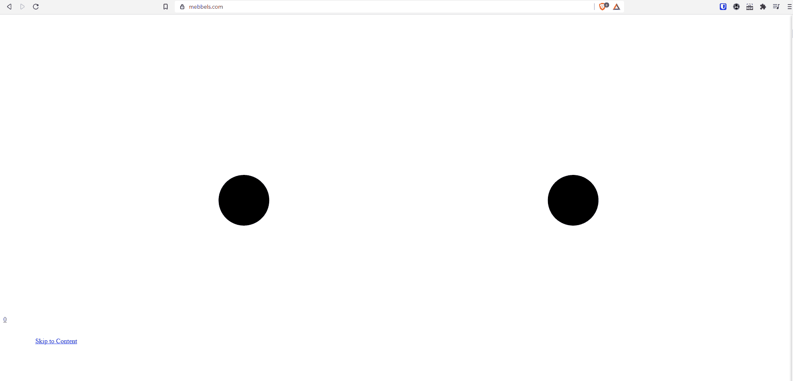

A broken site === A broken heart

我记得在网站的 CSS 编辑器中用一个变量改变了一个类的边距。当我在管理站点的样式编辑器中点击 save 时，我看到实时预览只是一片空白。我在一个新的标签页中打开了 live 网站，迎接我的是一个所有路线都坏了的网站。

命运...这个简单的改变不应该破坏网站。可能他们的样式编辑器不支持变量？我删除了自己创建的 CSS 变量，使用了普通像素。网站仍然中断。控制台显示没有错误。

好吧。我从样式编辑器中移除了所有的自定义 CSS。同样的问题。此时我开始恐慌。我是怎么攻破网站的？为什么网站拒绝加载任何样式？

等等。我只是问了正确的问题。为什么网站**没有加载**我的风格？我意识到我不知道我所有的自定义 CSS 和 Squarespace CSS 是嵌入到 HTML 中，还是通过网络发布。

我检查了 HTML 中任何链接的样式表，并在名为 *site.css* 的标题中发现了一个可疑之处

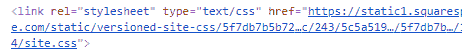

An externally linked stylesheet

当我切换到 Network 选项卡来查看对这个特定 CSS 文件的请求是否成功时，我确认了罪魁祸首。

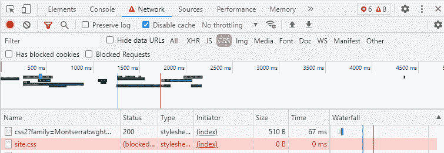

不是的。它返回一个 5xx 错误。在截图中，我手动阻止了复制问题的请求，因此状态不同于原始状态，但效果是相同的:我们的站点正在从 Squarespace 请求主样式表，而该请求失败了，这破坏了站点的样式。

唷！我不再恐慌，重拾信心。这不是我的错，是 Squarespace 的错。

为了证实这一点，我查看并访问了 Squarespace 的状态页面。事实上，他们的状态页面显示他们在服务器上遇到了一些问题，导致很多用户无法加载样式。我无能为力了。我只是等到问题解决。

Squarespace 花了 15 分钟修复这个问题。我想这可能是一个罕见的问题，我很幸运它发生在午夜过后的一个深夜。我大错特错了...

## 我们需要一个解决方案

几天后，我的客户试图提醒我这个网站，你猜对了，坏了，但没有成功。那天晚些时候我们联系时，我发现同样的问题又出现了。而且发生在中午，持续时间更长，接近 **30 分钟。**

可以理解的是，客户吓坏了，删除了所有自定义 CSS(谢天谢地我有一个本地副本)，并祈祷一切顺利(同时可能认为我破坏了他们的网站并消失了)。

事后看来，我应该更好地沟通，并在第一次面对这个问题时通知他们。这一次不是 Squarespace 的错(尽管完全是)，是我在遇到问题时没有想出解决方案。

在我看来，这里的问题是我们的样式表托管在不受我们控制的服务器上。如何从网站中移除外部依赖？

为了回答这个问题，我把目光投向了云...

## 我最初的 AWS 解决方案

在我最初的开发中，我会将我的自定义 CSS 代码放在 Squarespace 的自定义 CSS 编辑器中。站点编辑器接受 SASS，所以我用 SASS 编写我的样式，并且总是在我机器上的本地 Git 文件夹中存储一个副本，以便进行某种版本控制。

正如我之前提到的，样式表托管在 Squarespace 的服务器上，所以我需要自己的无障碍方式来托管这些样式表。所以我想到了下面的解决方法。

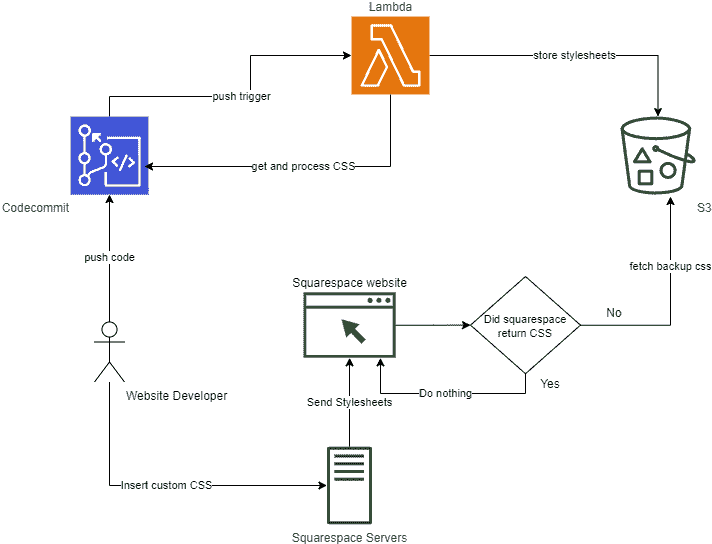

在这个场景中，我，网站开发人员，将在 Squarespace 的自定义 CSS 编辑器上编写代码，然后将 SASS 复制/粘贴到我的本地机器上。然后将发生以下流程:

*   我将我的代码推送到 CodeCommit
*   推送事件将触发 Lambda 函数
*   Lambda 函数将获取最新的 SASS 文件，并将其转换为 CSS 样式表。
*   Lambda 函数将 CSS 样式表存储在一个公开可用的 S3 桶中
*   网站上的定制内联脚本将检查是否加载了来自 Squarespace 的预期样式表。如果不是，它从 S3 桶中请求备用样式表，并将其注入页面。

因此，在网站再次崩溃之前，我尽可能快地实现了这个解决方案。就在第二天，新的流程就建立起来了，并按预期工作。

### 如何配置代码提交触发器

在我将代码推送到 CodeCommit 存储库之后，我转到存储库的设置，然后转到触发器选项卡，并单击“创建触发器”按钮。

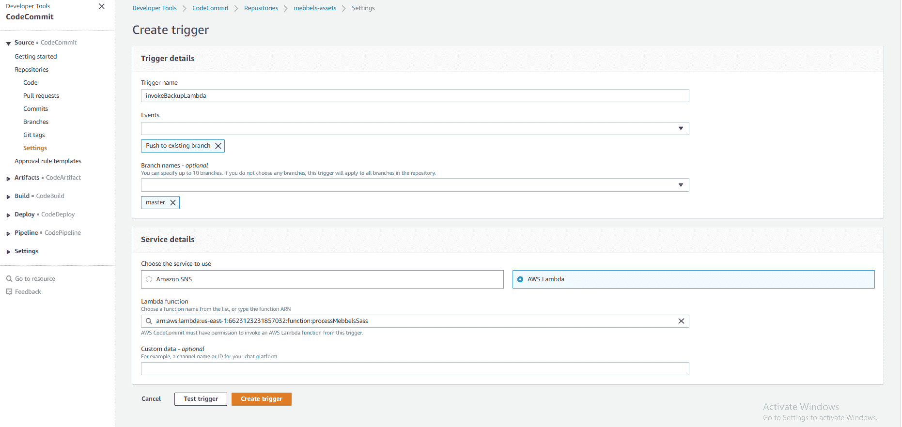

我命名了触发器，选择了“Push to existing branch”作为事件类型，master 作为我要监听的分支。然后我选择 AWS Lambda 作为要使用的服务，指向我的 Lambda 函数，然后创建触发器。

这个 Lambda 现在在 CodeCommit 上将任何代码推送到主分支后立即运行。

### λ逻辑

下面是调用 lambda 的 JS 代码:

```
const {
    S3,
    CodeCommit,
} = require('aws-sdk')
const sass = require('node-sass');

const getFileFromCodeCommit = (filePath) => new Promise((resolve, reject) => {
    const ccClient = new CodeCommit({ region: "us-east-1" })
    const ccParams = {
        filePath,
        repositoryName: 'mebbels-assets'
    }

    ccClient.getFile(ccParams, (err, data) => {
        if (err) reject(err)
        console.log(data)
        let stringData = new TextDecoder().decode(data.fileContent);
        resolve(stringData)
    })

})

const sendStylesheetToS3 = (fileData, fileName) => new Promise((resolve, reject) => {
    const s3Client = new S3({ region: "eu-south-1" })
    let putObjectBody = {
        Bucket: 'mebbels-assets',
        Key: fileName,
        ACL: 'public-read',
        Body: fileData,
        ContentType: 'text/css'
    }
    s3Client.putObject(putObjectBody, (err, data) => {
        if (err) reject(err)
        resolve(data)
    })
})

const processSASS = (fileData) => new Promise((resolve, reject) => {
    sass.render({
        data: fileData
    }, (err, data) => {
        if (err) reject(err)
        resolve(data)
    })
})
exports.handler = async (event) => {
    const sassFile = await getFileFromCodeCommit('mebbels-sass.scss')
    const processedSass = await processSASS(sassFile)
    await sendStylesheetToS3(processedSass.css, 'fallbackStyles.css')
    const response = {
        statusCode: 200,
        body: JSON.stringify("Done"),
    };

    return response;
}; 
```

简而言之，它提取 SASS 样式表(mebbels-sass.scss)，使用 node-sass 包将其转换为 css，然后将输出的 CSS 文件放入一个公共的 S3 桶中。

当然，要让这个 lambda 运行时不出现与访问我们在 CodeCommit 和 S3 上的资源相关的问题，它需要正确的权限。

下面是附加到该功能的 IAM 角色策略:

```
{
    "Version": "2012-10-17",
    "Statement": [
        {
            "Sid": "VisualEditor0",
            "Effect": "Allow",
            "Action": [
                "s3:PutObject",
                "codecommit:GitPull",
                "s3:PutObjectAcl",
                "codecommit:GetFile"
            ],
            "Resource": [
                "arn:aws:s3:::*/*",
                "arn:aws:s3:::mebbels-assets",
                "arn:aws:codecommit:us-east-1:6653912857032:mebbels-assets"
            ]
        }
    ]
} 
```

### 如何配置 S3 存储桶:

存储备用 CSS 样式表的目标 S3 存储桶需要是公共的。我在创建 bucket 时确保了这一点，并在我的 S3 bucket 的“Permissions”选项卡的 Block public access 部分中仔细检查了一下:

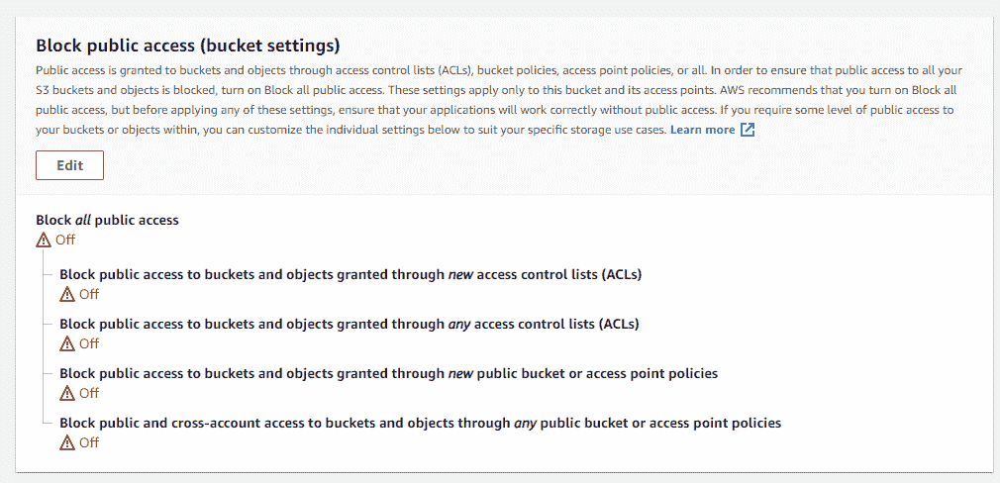

这个 bucket 还需要启用并设置 [CORS，因为我们将从一个不同的域请求它，即 mebbels.com](https://docs.aws.amazon.com/sdk-for-javascript/v2/developer-guide/cors.html)的[。](http://mebbels.com)

在同一个“Permissions”选项卡上，在跨源资源共享(CORS)部分下，我添加了以下 CORS 配置:

```
[
    {
        "AllowedHeaders": [
            "Authorization"
        ],
        "AllowedMethods": [
            "GET"
        ],
        "AllowedOrigins": [
            "https://www.mebbels.com"
        ],
        "ExposeHeaders": [],
        "MaxAgeSeconds": 3000
    }
] 
```

## 网站脚本

最后，这里是站点头部的小内联脚本，它检查 Squarespace 请求的样式表的加载状态。如果它在 20 毫秒后没有被加载，那么脚本将链接注入到我们网站的头部，链接到我们的 S3 桶中托管的回退样式。

```
var isSiteCssLoaded = false;
var siteCssLink = document.querySelector("link[href*='/site.css']")
siteCssLink.addEventListener('load', () => {
    console.log('site.css loaded')
    isSiteCssLoaded = true;
})

const fallBackIfNeeded = () => {
    if (!isSiteCssLoaded) {
        console.log('site.css not loaded')
        var headID = document.getElementsByTagName('head')[0];
        var link = document.createElement('link');
        link.type = 'text/css';
        link.rel = 'stylesheet';
        link.href = '<https://mebbels-assets.s3.eu-south-1.amazonaws.com/fallbackStyles.css>'
        headID.appendChild(link);
		console.log('fallback styles loaded')
    }
}
setTimeout(fallBackIfNeeded, 20) 
```

## 如何测试这个解决方案

嗯，我等不及 Squarespace 的服务器再次出现故障来测试我的解决方案了。我是这样测试的。

正如我在本文开头所暗示的，我可以通过转到浏览器的 Network 选项卡(确保我禁用了缓存以避免缓存样式表)，然后阻塞 CSS 请求的 URL，来模拟从 Squarespace 获取站点样式表的失败请求:

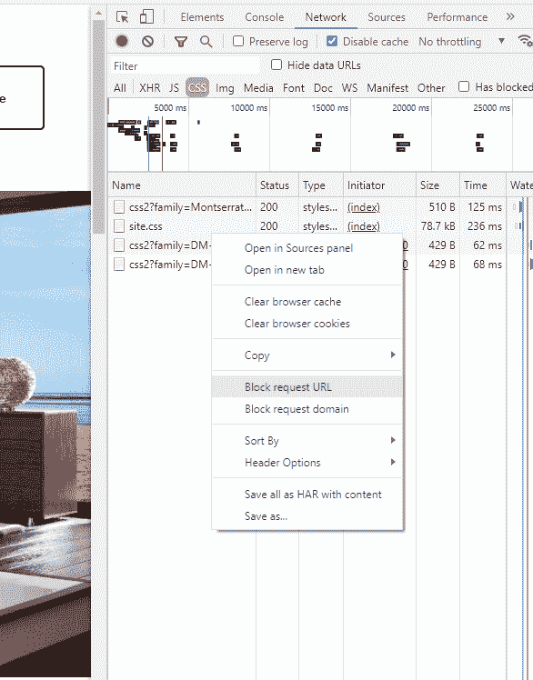

单击“阻止请求 URL”并刷新页面后，我们应该会看到我的脚本在 20 毫秒后开始运行。它应该在控制台中打印出“site.css not loaded”和“fallback styles loaded”，然后添加来自 S3 的 fallback 样式表。而且网站应该工作不中断！

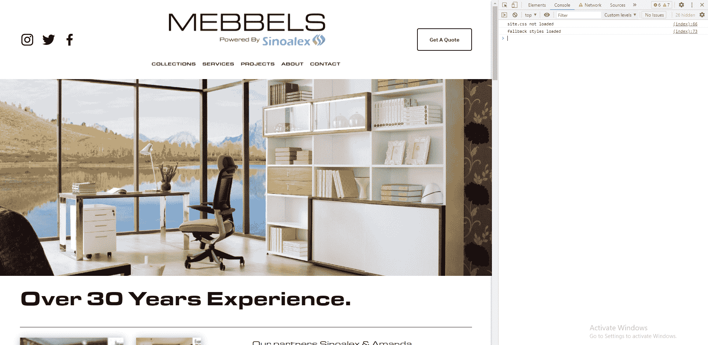

## 更好的解决方案

老实说，我为这个快速的解决方案感到自豪，看到它工作是一种快乐。这是一个便宜的无服务器选项，也不太复杂。

但是这个解决方案*比它需要的更加复杂。它也不是没有警告。*

这种解决方案的缺点是回退样式仍然依赖于网站开发人员来保持 CodeCommit 存储库中的回退样式始终是最新的。

此外，还有其他站点管理员用户(如设计者)，他们有时自己编辑站点的自定义样式。因此，这个解决方案依赖于团队成员之间的完美沟通，让拥有 AWS 访问权限的开发人员知道定制的更改，以便他们可以更新存储库。

当我阅读更多关于可用的 AWS 服务时，我遇到了一个很棒的服务，叫做 [CloudWatch Events](https://docs.amazonaws.cn/en_us/AmazonCloudWatch/latest/events/WhatIsCloudWatchEvents.html) 。此服务允许您根据监控的指标或按计划触发 AWS 帐户中的工作流。

所以我决定使用 CloudWatch Events 作为无服务器 cronjob，它触发一个 Lambda 函数，每天抓取我们网站的样式表，并将其存储在 S3 桶中。

修改后的解决方案现在看起来像这样:

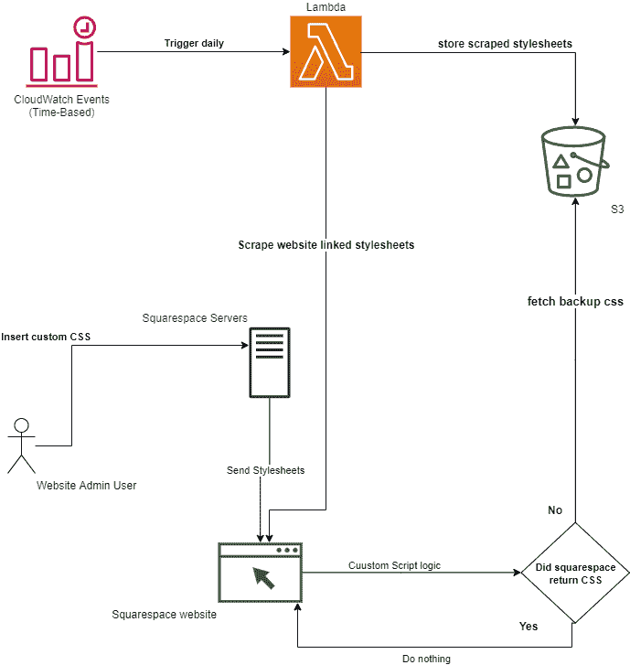

在这个修改后的流程中，我们消除了对网站开发人员手动更新样式表和推送代码提交以创建回退样式的依赖。

在本例中，我们有一个触发 Lambda 函数的每日计划的 CloudWatch 事件。

然后，我们的 Lambda 函数从我们的网站中抓取外部链接的样式表，将它们合并到一个后备 CSS 文件中，并将其存储在公共可用的 S3 桶中。网站脚本保持不变，因为它检查默认样式表，如果没有找到，就从我们的 S3 桶请求它。

### λ代码

让我们从新的 lambda 函数开始。

```
import sys, os
import urllib.request as req
from bs4 import BeautifulSoup
import logging
import boto3
from botocore.exceptions import ClientError

s3_client = boto3.client('s3')

def lambda_handler(event, context):
    fallback_css_filename = 'fallbackStyles.css'
    fallback_css_path = '/tmp/' + fallback_css_filename
    url = '<https://www.mebbels.com>'

    html = req.urlopen(url) # request the initial page
    soup = BeautifulSoup(html, 'html.parser') 
    fallback_styles = open(fallback_css_path, 'ab')

    for link in soup.find_all('link', type='text/css'): # get links to external style sheets
        address = link['href'] # the address of the stylesheet
        if address.startswith('/'): # relative link
            address = url + address
        css_file_name, headers = req.urlretrieve(address) # make a request to download the stylesheet from the address, returns bytes
        css = open(css_file_name, 'rb')
        fallback_styles.write(css.read())
        css.close()

    try:
        s3_client.upload_file(
            fallback_css_path,
            'mebbels-assets',
            fallback_css_filename,
            ExtraArgs={
                'ACL': 'public-read',
                'ContentType': 'text/css'
                }
        )
        return True
    except ClientError as e:
        logging.error(e)
        return False 
```

在这个 lambda 中，我使用 BeautifulSoup 库来抓取我们的网站。我下载了每一个外部链接的样式表，并将它们写到临时文件夹中的一个文件中(AWS Lambdas 允许您在运行时将文件临时存储在一个名为‘tmp’的文件夹中)。

将所有样式写入一个 fallbackStyles.css 文件后，我像以前一样使用 AWS SDK 将它上传到我们的 S3 bucket。

但与以前不同的是，我现在备份了任何外部链接的样式表，所以我可以备份外部链接的 Google fonts 样式表或引导 CSS CDN。

## 如何使用计划的 CloudWatch 事件

这对我来说是一项新的服务，我非常兴奋能够在这样的实际用例中进行尝试。令人难以置信的是，它是如此简单易用，只需两步。

在 AWS 控制台中，在 CLoudWatch > Events > Rules 下，我创建了一个新规则并定义了我的设置。

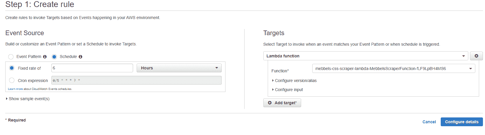

在 Event Source 部分，我选择了“Schedule”选项，并选择了一个 6 小时的时间段。这意味着该事件将每六小时自动触发一次。如果您想要一个非常具体的自定义时间间隔，甚至可以选择自定义 cron 表达式。

但是这个事件有什么作用呢？我们需要在目标部分告诉它。我从下拉列表中选择“Lambda function ”,然后选择我可用的 Lambda function。然后，我单击“配置详细信息”继续。

在下一步也是最后一步中，我只是输入了我创建的事件规则的名称和描述。

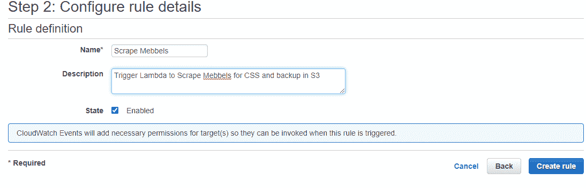

谢天谢地，这个屏幕回答了我关于权限的一个迫切问题:“这个事件会被允许触发我的 Lambda 函数吗？还是我必须为它分配一个 IAM 角色？”

而且，如屏幕截图所示，CloudWatch 完全负责分配事件在其目标上运行所需的权限，因此我不必担心额外的工作和测试。

# 最后的话

我希望这篇文章在某种程度上对你有用，无论你是对云开发、网站制作者感兴趣，还是仅仅对编程感兴趣。

如果你拥有并管理一个 Squarespace 网站(或任何网站制作商),该网站神秘地崩溃了，并且你正在恐慌的状态下阅读这篇文章，我建议你访问他们的状态页面以获取更新。像这样的中断通常会在一小时内得到解决。

我还计划构建一个云本地 web 应用程序来实现和自动化这个解决方案，这样我就可以将它提供给我未来和现有的客户。当我公开构建它时，你可以关注我的更新。👨‍💻

想了解更多关于云和 web 开发的技巧和见解，请在 Twitter 上关注我 [@adham_benhawy](https://twitter.com/adham_benhawy) 。