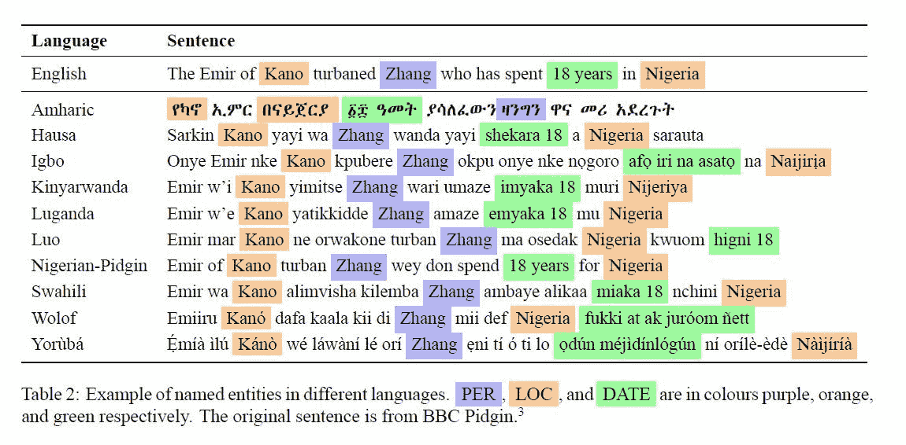

# 数据科学项目的 10 个最佳非洲语言数据集

> 原文：<https://www.freecodecamp.org/news/african-language-datasets-for-data-science-projects/>

非洲有超过 2000 种语言，但这些语言在现有的自然语言处理生态系统中没有得到很好的体现。

一个挑战是缺乏有用的非洲语言数据集，我们可以用它来解决不同的社会和经济问题。

在这篇文章中，我从网上收集了一系列非洲语言数据集。您可以在各种 NLP 任务中使用这些数据集，如文本分类、命名实体识别、机器翻译、情感分析、语音识别和主题建模。

我公开了这些数据集，让你有机会运用自己的技能，帮助解决不同的挑战。

## 文本分类数据集

文本分类数据集根据其内容被分类或组织成不同的组。

下面是针对[文本分类](https://hackernoon.com/14-open-datasets-for-text-classification-in-machine-learning-xd1u3wit?ref=hackernoon.com)的非洲语言数据集列表。

### [斯瓦希里语新闻数据集](https://zenodo.org/record/4300294?ref=hackernoon.com#.YKvsdqiA59A)

斯瓦希里语新闻数据集包含超过 31，000 篇新闻文章，来自不同的新闻类别，如本地、国际、商业或金融、健康、体育和娱乐。斯瓦希里语是非洲最常用的语言之一，东非大约有 1 亿到 1 . 5 亿人使用。

我从坦桑尼亚境内外不同的新闻发布平台收集数据。您可以使用该数据集开发多类分类模型，根据特定类别对新闻内容进行分类。

斯瓦希里语在线新闻平台可以使用该模型根据类别自动对新闻进行分组，并帮助读者找到他们想要阅读的特定新闻。

您也可以从[数据集 python 库](https://pypi.org/project/datasets/?ref=hackernoon.com)下载该数据集:

```
from datasets import load_dataset

dataset = load_dataset("swahili_news")
```

**注:**斯瓦希里语新闻数据集类别分布不平衡。它包含以下几类新闻文章:

*   国际新闻(6.2%)
*   健康新闻(4.9%)
*   商业新闻(4.3%)

### [奇切瓦新闻数据集](https://zenodo.org/record/4315018?ref=hackernoon.com#.YKvs16iA59A)

该数据集由 Chichewa 的**篇新闻文章**组成。奇奇瓦语是一种班图语，在非洲南部、东南部和东部的大部分地区使用，即在马拉维和赞比亚，奇奇瓦语是官方语言。

该数据集包含了 3482 篇文章的集合，包含超过 930000 个单词的 T2 和超过 48000 个句子的 T4。奇切瓦族的新闻文章被分为 19 类，如教育、法律/秩序、政治、文化、艺术和手工艺、农业、经济和野生动物。

你也可以在这里下载这个数据集: [AI4D 马拉维新闻分类津迪挑战赛](https://zindi.africa/competitions/ai4d-malawi-news-classification-challenge?ref=hackernoon.com)。

## 命名实体识别数据集

通过定位和分类非结构化文本中提到的命名实体，您可以使用命名实体识别数据集来提取信息。实体的例子有人名、组织、位置、时间和日期。

NER 是许多应用程序的基本组件，包括拼写检查器、会话代理以及语音和对话系统的本地化。

这是用于命名实体识别的非洲语言数据集列表。

### [马萨坎-内尔数据集](https://github.com/masakhane-io/masakhane-ner?ref=hackernoon.com)

Masakhane 是非洲的一个基层 NLP 社区，由非洲人创建，旨在加强和促进非洲语言的 NLP 研究。该社区以十种非洲语言为命名实体识别(NER)创建了第一个大型公开可用的高质量数据集。

*   阿姆哈拉语
*   豪萨人
*   伊格博人
*   基尼亚卢旺达语
*   卢干达语
*   罗人
*   我要结婚了
*   斯瓦希里语。亦称 KISWAHILI
*   沃洛夫语
*   yorùbá



[Image source](https://arxiv.org/abs/2103.11811?ref=hackernoon.com)

你可以在这里阅读研究论文: [MasakhaNER:非洲语言的命名实体识别](https://arxiv.org/abs/2103.11811?ref=hackernoon.com)，你也可以在这里下载十个 NER 数据集[。](https://github.com/masakhane-io/masakhane-ner/tree/main/data?ref=hackernoon.com)

## 机器翻译数据集

机器翻译(MT)是将源语言的文本或语音翻译成不同的目标语言的任务。您可以使用机器翻译快速翻译大量文本，无需任何人工输入。

您可以使用机器翻译数据集来创建用于不同目的的机器翻译模型，例如:

*   内部电子邮件和其他书面或口头交流。
*   产品或服务的文档和说明。

以下是用于机器翻译的非洲语言数据集列表。

### [法语到 Ewe 和法语到 Fongbe 的机器翻译数据集](https://zindi.africa/competitions/ai4d-takwimu-lab-machine-translation-challenge?ref=hackernoon.com)

这是一个用于从**法语到 Ewe** 和**法语到 Fongbe** 的机器翻译的并行语料库数据集。

丰格语和埃维语是尼日尔-刚果语。贝宁约有 410 万人讲丰贝语，多哥和加纳东南部约有 450 万人讲埃维语。

这个数据集包含大约 **23，000 个**法语到母羊和 **53，000 个**法语到 Fongbe 的平行句子，这些句子是从博客、故事、报纸、日常对话和网页中收集的，并且已经被标注用于神经机器翻译。

### [yor obáto 英语机器翻译数据集](https://zindi.africa/competitions/ai4d-yoruba-machine-translation-challenge?ref=hackernoon.com)

这是一个用于从约伯语到英语的机器翻译的平行句子语料库数据集。

约鲁巴语是尼日尔-刚果语，在西非(尼日利亚西南部)使用。说约尔巴语的人数估计在 4，500 万到 5，500 万之间。

该数据集由来自不同领域的 **10，054** 个平行约伯语-英语句子组成，如新闻、约伯语谚语、电影脚本、本地化翻译和书籍。

### [英语到卢甘达语的机器翻译数据集](https://zenodo.org/record/4764039?ref=hackernoon.com#.YKzBkKiA59A)

这是一个用于从英语到卢甘达语机器翻译的平行句子语料库数据集。

卢甘达语是一种班图语，是乌干达的主要语言之一。850 多万巴干达人和坎帕拉(乌干达首都)的许多人一起说这种语言。

数据集由**15022**个平行的英语-卢甘达语句子组成。来自 Makerere 大学人工智能和数据科学研究实验室的一组研究人员与一组 Luganda 教师、学生和自由职业者一起创建了它。

## 情感分析数据集

情感分析数据集用于使用不同的文本分析方法对文本数据中的情感( **、积极的、消极的和中性的** )进行解释和分类。

情感分析在各种领域都有应用，例如社交媒体监控、品牌监控、客户服务和市场研究。

以下是用于情感分析的非洲语言数据集列表。

### 突尼斯资料集

Tunizi 是第一个突尼斯阿拉伯人情感分析数据集。突尼斯阿拉伯语代表用拉丁字符和数字而不是阿拉伯字母书写的突尼斯方言。

iCompass 从社交媒体平台收集评论，表达对热门话题的看法。他们使用公共流 API 提取了 **10 万条评论**。

收集的意见使用整体极性进行手动注释:

*   阳性(1)
*   负数(-1)
*   中性(0)

注释者在性别、年龄和社会背景方面各不相同。

您也可以从[数据集 python 库](https://pypi.org/project/datasets/?ref=hackernoon.com)下载该数据集:

```
from datasets import load_dataset

dataset = load_dataset("tunizi")
```

## 语音识别数据集

语音识别，也称为自动语音识别(ASR)，是一种实时分析人类语音并制定输出(通常是书面转录)的技术。这有时被称为“语音到文本”

不要将这与语音识别混淆，因为语音识别只是试图识别单个用户的声音。

下面是用于语音识别的非洲语言数据集列表。

### [Wolof 中的语音识别数据集](https://zindi.africa/competitions/ai4d-baamtu-datamation-automatic-speech-recognition-in-wolof/data?ref=hackernoon.com)

沃洛夫语是塞内加尔、冈比亚和毛里塔尼亚的语言。超过 1000 万人说沃洛夫语，塞内加尔约 40%的人口(约 500 万人)将沃洛夫语作为他们的母语。

ASR 数据集共有 6683 个音频文件和转录，由塞内加尔 Baamtu Datamation 公司的一个研究团队创建。

### [基尼亚卢旺达语语音识别数据集](https://commonvoice.mozilla.org/rw/datasets?ref=hackernoon.com)

基尼亚卢旺达语是班图语，也是卢旺达的官方语言。在卢旺达、刚果民主共和国东部和乌干达南部，至少有 1200 万人说这种语言。

[数据集](https://commonvoice.mozilla.org/rw/speak?ref=hackernoon.com)由来自不同性别和年龄的 **895 位说话者**在一个共同的语音平台上创建。该数据集总共有**1183 小时**的有效语音。当前数据集是 **40GB。**

## 主题建模数据集

主题建模使用无监督学习技术来提取出现在文本文档集合中的主要主题或主题集。

这是一个用于主题建模的非洲语言数据集。

### [南非新闻数据集](https://zenodo.org/record/3668495?ref=hackernoon.com)

这是来自南非的新闻数据集。新闻数据收集自 SABC4 脸书网页。南非广播公司是南非的公共广播公司。

数据集包含来自**塞特斯瓦那语**和**塞佩迪语**的新闻标题(即短文本)。塞茨瓦纳语是一种班图语，在南非大约有 820 万人使用，而塞佩迪语主要在南非北部地区有 470 万人使用。

因为数据集没有注释，所以可以用它来创建主题模型，将新闻数据聚集到不同的新闻主题中，如体育、政治、文化和娱乐。

## 关于非洲语言数据集的最终想法

我希望你发现这个不同非洲语言数据集的列表很有用，你可以在你下一个[数据科学项目](https://hackernoon.com/top-datasets-on-climate-change-for-data-science-projects-rzz34p0?ref=hackernoon.com)中使用它们。我很想看看你们从这些数据集中创造了什么样的应用/解决方案。

如果您没有找到您需要的数据集，请查看以下链接:

*   [芝诺多:非洲自然语言处理(AfricaNLP)](https://zenodo.org/communities/africanlp/search?page=1&size=20&ref=hackernoon.com)
*   Github: Masakhane

**恭喜**👏👏，你已经做到这篇文章的结尾了！我希望你学到了一些新的东西，对你下一个数据科学项目有所帮助。

如果你学到了新的东西或者喜欢阅读这篇文章，请分享给其他人看。在那之前，下期帖子再见！

你也可以在 Twitter 上找到我 [@Davis_McDavid](https://twitter.com/Davis_McDavid?ref=hackernoon.com) 。

可以阅读[其他文章这里](https://hackernoon.com/u/davisdavid) ****。****