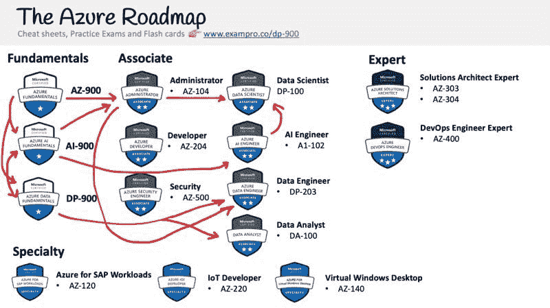

# Azure 数据基础认证(DP-900)-通过这个免费的 4.5 小时课程的考试

> 原文：<https://www.freecodecamp.org/news/azure-data-fundamentals-certification-dp-900-pass-the-exam-with-this-free-4-5-hour-course/>

通过完成这个 4.5 小时的免费课程，您可以了解获得 Azure 数据基础认证所需的一切。

# 什么是 Azure 数据基础认证？

Azure Data Fundamentals 认证面向那些寻求数据相关角色的人，如**数据分析师、数据工程师或数据科学家**。

大多数新技术公司都是数据驱动的，这意味着他们公司的价值并不直接取决于他们提供的服务，而是取决于他们收集、组织和可能重新分发的数据。

在第一天了解数据驱动架构的基础知识将有助于云工程师长期了解存储、转换、分析和保护数据的成本和工作。

# Azure 数据基础概述

Azure 数据基础包括以下内容:

*   基本数据概念
*   数据湖和执行分析
*   数据仓库
*   ELT 转换
*   Hadoop 和 Apache 激发工作负载
*   功率 BI
*   关系数据库和 Azure SQL
*   非关系数据库和 ComosDB

# **如何获得 Azure 数据基础认证？**

你可以通过支付考试费并在与微软 Azure 合作的考试中心参加考试来获得认证。

微软 Azure 与 Pearson Vue 和 PSI Online 合作，它们在世界各地都有考试中心网络。他们提供现场考试和在线考试。如果有机会，我建议你亲自参加考试。

微软在 Pearsue Vue 上有一个门户页面，你可以在那里注册和预订考试。

那个考试费是 **$99 美金**。

# 我可以简单的看视频通过考试吗？

对于像 DP-900 这样的基础认证，你可以通过观看视频内容来通过，而不用亲自动手探索 Azure 服务

Azure 的更新频率远高于其他云服务提供商。有时每个月都会有新的认证更新，但是 DP-900 不是以动手为中心的，所以学习课程不太容易过时。

*   考试有 **40 到 60** 道题，时间线为 **60 分钟**。
*   考试包含许多不同的题型。
*   及格分数是 70%左右。

## 免费的 Azure 数据基础课程

就像我在 freeCodeCamp 上发布的其他云认证课程一样，这个课程将永远免费。

该课程包含学习策略、讲座、跟进和备忘单，是一门完整的端到端课程。

[前往 freeCodeCamp 的 YouTube 频道](https://youtu.be/P3qmqUZJ7l0)开始学习整个 4.5 小时的课程。

[https://www.youtube.com/embed/P3qmqUZJ7l0?feature=oembed](https://www.youtube.com/embed/P3qmqUZJ7l0?feature=oembed)