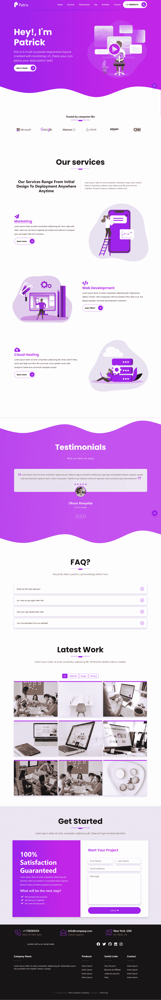

# 通过建立一个作品集网站学习 Bootstrap 5 和 SASS

> 原文：<https://www.freecodecamp.org/news/learn-bootstrap-5-and-sass-by-building-a-portfolio-website/>

Bootstrap 是最流行的 CSS 框架之一，Sass 是最流行的 CSS 预处理程序之一。

我们刚刚在 freeCodeCamp.org YouTube 频道上发布了一门课程，将通过建立一个投资组合网站来教你 Bootstrap 5 和 Sass。

Patrick Muriungi 开发了这个课程。他是一名经验丰富的开发人员和教师。

以下是本课程的不同部分:

*   第 1 部分:网站项目简介
*   第 2 部分:SASS 设置和定制引导
*   第 3 部分:文件结构
*   第 4 部分:导航条部分
*   第 5 部分:简介部分
*   第 6 部分:公司部分
*   第 7 部分:服务部分
*   第 8 部分:证明部分
*   第 9 部分:常见问题部分
*   第 10 部分:作品集
*   第 11 部分:入门部分
*   第 12 部分:页脚部分

以下是您将构建的投资组合网站的外观:

观看以下全部课程或在 freeCodeCamp.org YouTube 频道观看[(5 小时观看)。](https://www.youtube.com/watch?v=iJKCj8uAHz8)

[https://www.youtube.com/embed/iJKCj8uAHz8?feature=oembed](https://www.youtube.com/embed/iJKCj8uAHz8?feature=oembed)