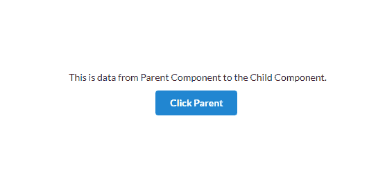
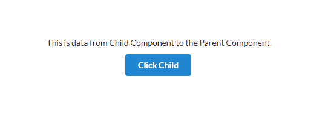
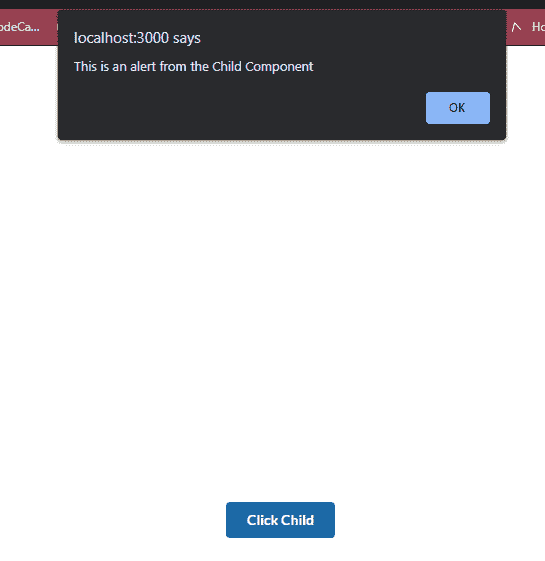

# 如何在 React 中的组件之间传递数据和事件

> 原文：<https://www.freecodecamp.org/news/pass-data-between-components-in-react/>

如果您试图使用 API 端点实现 CRUD 操作，您可能会发现很难跨多个组件管理数据。

或者你有一个模态，但是你想从一个不同的组件中触发它。

思考如何应对这些情况可能会很困难。

在本教程中，我将向您展示如何做到这一点。

## 如何在父组件和子组件之间传递数据

首先，让我们在父组件和子组件之间传递数据。。

首先，您需要创建两个组件，一个父组件和一个子组件。

```
import React from 'react'

export default function Parent() {
  return (
    <div>

    </div>
  )
} 
```

Parent.js

```
import React from 'react'

export default function Child() {
    return (
        <div>

        </div>
    )
} 
```

Child.js

接下来，您将导入父组件中的子组件并返回它。

```
import React from 'react'
import Child from './Child';

export default function Parent() {
  return (
    <div>
      <Child/>
    </div>
  )
}
```

Call the Child Component in the Parent Component

然后，您将创建一个函数和一个按钮来触发该函数。此外，您将使用 *useState* 钩子创建一个状态来管理数据。

```
import React from 'react'
import Child from './Child';
import { Button } from 'semantic-ui-react';
import { useState } from 'react';
import './App.css';

export default function Parent() {
  const [data, setData] = useState('');

  const parentToChild = () => {
    setData("This is data from Parent Component to the Child Component.");
  }
  return (
    <div className="App">
      <Child/>

      <div>
        <Button primary onClick={() => parentToChild()}>Click Parent</Button>
      </div>
    </div>
  )
} 
```

正如你在这里看到的，我们在*点击父*按钮点击上调用 *parentToChild* 函数。当点击“点击父组件”按钮时，它会将“这是从父组件到子组件的数据”存储在*数据*变量中。

现在，让我们将数据状态传递给我们的子组件。你可以用道具来做这件事。

像这样调用子组件时，将数据作为道具传递:

```
<Child parentToChild={data}/>
```

Parent.js

这里，我们将子组件中的数据作为*数据**传递。***

`data`是我们要传递的数据，`parentToChild`是道具的名字。

接下来，是时候捕获子组件中的数据了。而且很简单。

这里，可以有两种情况。

案例 1:如果使用的是功能组件，只需在参数中捕捉 parentToChild 即可。

```
import React from 'react'

export default function Child({parentToChild}) {
    return (
        <div>
            {parentToChild}
        </div>
    )
}
```

React Functional Component

案例 2:如果你有一个类组件，那么只需要使用`this.props.parentToChild`。

```
import React, { Component } from 'react'

export default class Child extends Component {
    render() {
        return (
            <div>
                {this.props.parentToChild}
            </div>
        )
    }
}
```

React Class Component

无论哪种方式，你都会得到相同的结果:



当我们点击`Click Parent`按钮时，我们将在屏幕上看到数据输出。

```
import React from 'react'
import Child from './Child';
import { Button } from 'semantic-ui-react';
import { useState } from 'react';
import './App.css';

export default function Parent() {
  const [data, setData] = useState('');

  const parentToChild = () => {
    setData("This is data from Parent Component to the Child Component.");
  }
  return (
    <div className="App">
      <Child parentToChild={data}/>

      <div className="child">
        <Button primary onClick={() => parentToChild()}>Click Parent</Button>
      </div>
    </div>
  )
}
```

上面你会看到`Parent Component`的完整代码。

## 如何在子组件和父组件之间传递数据

这个有点棘手。

首先，您需要在父组件中创建一个名为`childToParent`的函数和一个名为`data`的空状态。

```
const [data, setData] = useState('');

const childToParent = () => {

}
```

Parent Component

然后，将`childToParent`函数作为道具传递给子组件。

```
<Child childToParent={childToParent}/>
```

Passing childToParent to Child Component.

现在，在我们的子组件中，接受这个函数调用作为道具，并将其分配给一个 onClick 事件。

此外，声明一个包含一些字符串或数字形式的数据的状态。

将数据作为参数传递给`parentToChild`函数。

```
import React from 'react'
import { Button } from 'semantic-ui-react';

export default function Child({childToParent}) {
    const data = "This is data from Child Component to the Parent Component."
    return (
        <div>
            <Button primary onClick={() => childToParent(data)}>Click Child</Button>
        </div>
    )
}
```

Child Component

接下来，在父组件中，接受`childToParent`函数中的数据作为参数。然后使用 useState 钩子设置数据。

```
import './App.css';
import { useState } from 'react';
import Child from './Child';

function Parent() {
  const [data, setData] = useState('');

  const childToParent = (childdata) => {
    setData(childdata);
  }

  return (
    <div className="App">
      <div>
        <Child/>
      </div>
    </div>
  );
}

export default Parent; 
```

Parent Component

接下来，显示返回函数中数据变量。

```
import './App.css';
import { useState } from 'react';
import Child from './Child';

function Parent() {
  const [data, setData] = useState('');

  const childToParent = (childdata) => {
    setData(childdata);
  }

  return (
    <div className="App">
     {data}
      <div>
        <Child childToParent={childToParent}/>
      </div>
    </div>
  );
}

export default Parent;
```

Parent Component

点击`Click Child` 按钮，子数据将覆盖父数据。



现在，你可以像专家一样将数据从**子节点传递到父节点**以及从**父节点传递到子节点**。

### 您还可以传递 onClick 或 OnChange 之类的事件

只需在`childToParent` 函数中调用一个 alert 方法，并将该函数作为道具传递给子组件*。*

```
import './App.css';
import Child from './Child';

function Parent() {
  const childToParent = () => {
    alert("This is an alert from the Child Component")
  }

  return (
    <div className="App">
      <div className="child">
        <Child childToParent={childToParent}/>
      </div>
    </div>
  );
}

export default Parent;
```

Parent Component

并且在子 *c* 组件中，接受`childToParent` 功能作为道具。然后将其分配给按钮上的 onClick 事件。

```
import React from 'react'
import { Button } from 'semantic-ui-react';

export default function Child({childToParent}) {
    return (
        <div>
            <Button primary onClick={() => childToParent()}>Click Child</Button>
        </div>
    )
}
```

Child Component

当您单击子组件中的按钮时，父组件 *c* 中的函数将被调用，您将看到以下警告:



就是这样！

如果你想进一步试验，你可以在 Github 上找到代码。

> 好了，大家都到齐了。快乐学习。