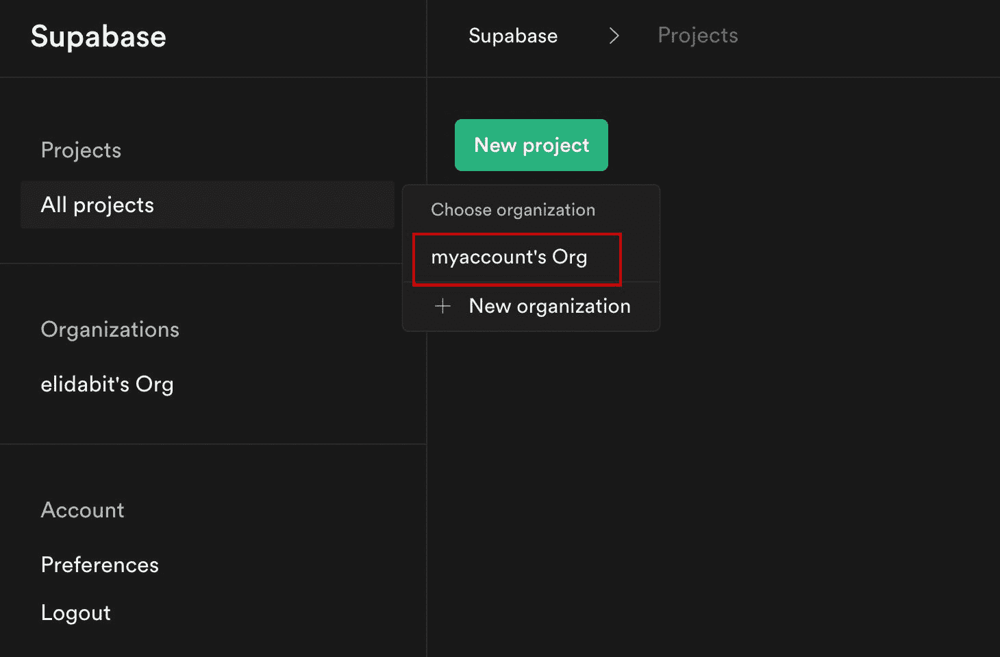
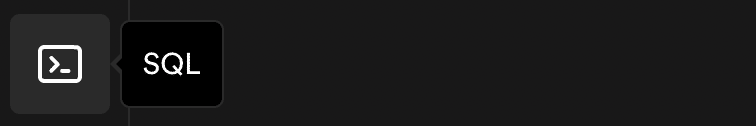
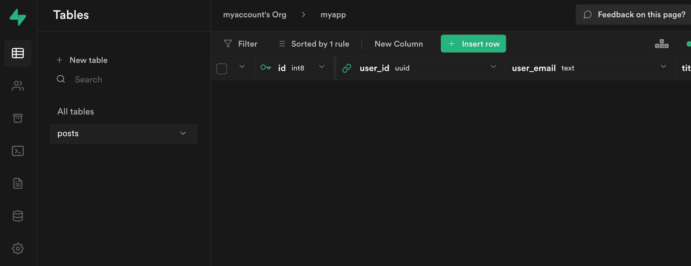
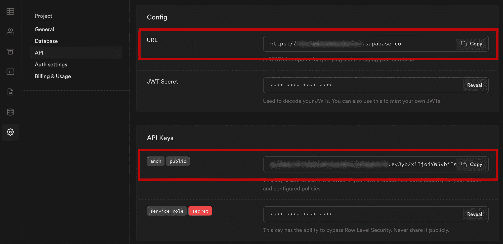
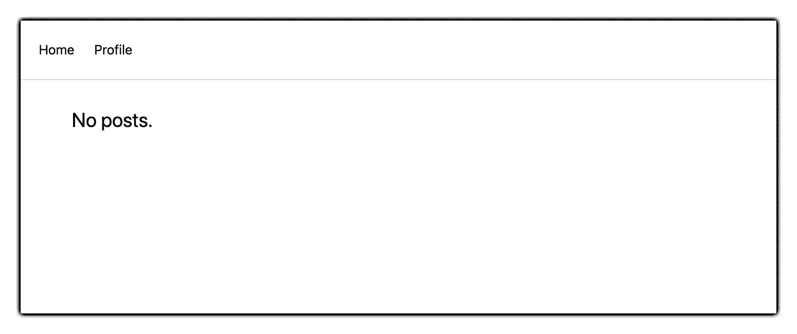
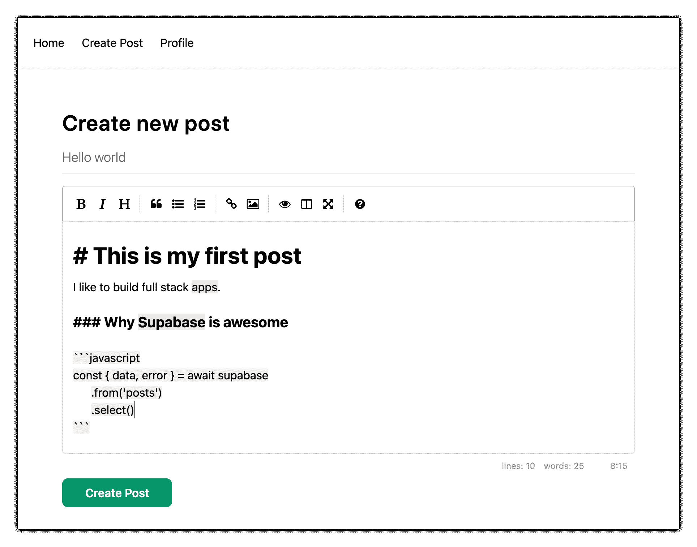
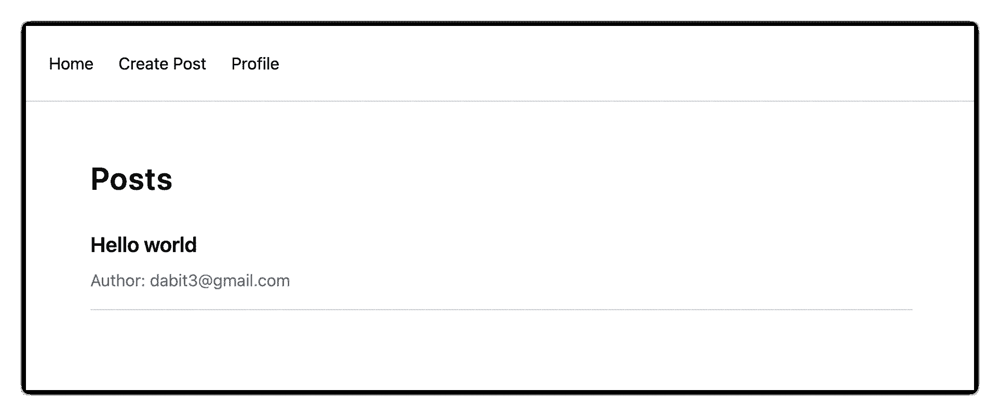

# 使用 Next.js 和 Supabase 进行全栈开发——完整指南

> 原文：<https://www.freecodecamp.org/news/the-complete-guide-to-full-stack-development-with-supabas/>

Supabase 是一个开源的 Firebase 替代方案，它可以让你在不到两分钟的时间内创建一个实时后端。

在过去的几个月里，Supabase 在我的网络中继续得到开发人员的大肆宣传和采用。我与之交谈过的许多人更喜欢它利用了 SQL 风格的数据库，他们也喜欢它的开源性。

当您创建一个项目时，Supabase 会自动为您提供 Postgres SQL 数据库、用户验证和 API。从那里，您可以轻松地实现附加功能，如实时订阅和文件存储。

在本指南中，您将学习如何构建一个完整的应用程序，实现大多数应用程序所需的核心功能，如路由、数据库、API、身份验证、授权、实时数据和细粒度访问控制。我们将使用一个现代堆栈，包括 [React](https://reactjs.org/docs/getting-started.html) 、 [Next.js](https://nextjs.org/) 和 [TailwindCSS](https://tailwindcss.com/) 。

我试图在尽可能短的指南中提炼我所学到的一切，同时我自己也可以用 Supabase 来加快速度，这样你也可以开始用这个框架构建完整的应用程序。

我们将构建的应用程序是一个多用户博客应用程序，它整合了你在许多现代应用程序中看到的所有类型的功能。这将使我们超越基本的 CRUD，实现文件存储、授权和细粒度访问控制等功能。

> 你可以在这里找到我们将要构建的应用程序的代码[。](https://github.com/dabit3/supabase-next.js)

通过学习如何将所有这些特性结合在一起，你应该能够把你在这里学到的东西，并建立自己的想法。理解了基本的构建模块本身，你就可以在未来将这些知识运用到你认为合适的任何地方。

## Supabase 概述

### 如何构建全栈应用

我对全栈无服务器框架很感兴趣，因为它们为希望构建完整应用程序的开发人员提供了强大的功能和灵活性。

Supabase 带来了强大的后端服务和易于使用的客户端库和 SDK 的重要组合，用于端到端解决方案。

这种组合让您不仅可以在后端构建必要的单独特性和服务，还可以通过利用由同一个团队维护的客户端库，在前端轻松地将它们集成在一起。

因为 Supabase 是开源的，所以您可以选择自托管或作为托管服务部署您的后端。如您所见，这对于我们来说很容易做到，因为我们不需要信用卡。

## 为什么要用 Supabase？

我曾在 AWS 领导过前端 Web 和移动开发者宣传团队，并写了一本关于构建这类应用的书。所以我在这个领域积累了不少经验。

我认为 Supabase 带来了一些真正强大的功能，当我开始用它进行构建时，这些功能立刻就吸引了我。

### 数据访问模式

我过去使用的一些工具和框架的最大限制之一是缺乏查询功能。我非常喜欢 Supabase 的一点是，因为它是建立在 Postgres 之上的，所以无需编写任何额外的后端代码，它就可以实现一组非常丰富的开箱即用的高性能查询功能。

客户端 SDK 提供了易于使用的[过滤器](https://supabase.io/docs/reference/javascript/using-filters)和[修改器](https://supabase.io/docs/reference/javascript/using-modifiers)来实现几乎无限的数据访问模式组合。

因为数据库是 SQL，关系数据很容易配置和查询，客户机库把它作为一等公民来考虑。

### 许可

当你越过“hello world”时，许多类型的框架和服务很快就会崩溃。这是因为大多数真实世界的用例远远超出了这些工具提供的基本 CRUD 功能。

一些框架和托管服务的问题在于，它们创建的抽象不够可扩展，无法轻松修改配置或定制业务逻辑。这些限制通常使得在现实世界中构建应用程序时很难考虑到许多一次性用例。

除了支持多种数据访问模式之外，Supabase 还使配置授权和细粒度访问控制变得容易。这是因为它只是 Postgres，使您能够直接从内置的 SQL 编辑器中实现您想要的任何[行级安全策略](https://www.postgresql.org/docs/10/ddl-rowsecurity.html)(我们将在这里讨论)。

### UI 组件

除了由构建其他 Supabase 工具的同一个团队维护的客户端库之外，他们还维护了一个 [UI 组件库](https://ui.supabase.io/) (beta)，允许您使用各种 UI 元素。

最强大的是 [Auth](https://ui.supabase.io/components/auth) ,它与您的 Supabase 项目集成在一起，可以快速启动用户认证流程(我将在本教程中使用)。

### 多个身份验证提供者

Supabase 支持以下所有类型的认证机制:

1.  用户名和密码
2.  神奇的电子邮件链接
3.  谷歌
4.  脸谱网
5.  苹果
6.  开源代码库
7.  推特
8.  蔚蓝的
9.  GitLab
10.  Bitbucket

### 开放源码

它最大的优势之一是它是完全开源的(是的，也是后端)。这意味着您可以选择无服务器托管方式或自己托管。

这意味着如果你愿意，你可以用 Docker 运行 Supabase，在 AWS、GCP 或 Azure 上运行你的应用程序。这将消除供应商锁定问题，你可能会遇到与 Supabase 的替代品。

## 如何开始使用 Supabase

### 项目设置

首先，让我们创建 Next.js 应用程序。

```
npx create-next-app next-supabase
```

接下来，进入目录，使用 NPM 或 Yarn 安装应用程序所需的依赖项:

```
npm install @supabase/supabase-js @supabase/ui react-simplemde-editor easymde react-markdown uuid
npm install tailwindcss@latest @tailwindcss/typography postcss@latest autoprefixer@latest
```

接下来，创建必要的顺风配置文件:

```
npx tailwindcss init -p
```

现在更新 **tailwind.config.js** 将 tailwind 排版插件添加到插件数组中。我们将使用这个插件来设计我们博客的降价:

```
plugins: [
  require('@tailwindcss/typography')
]
```

最后，用以下内容替换 **styles/globals.css** 中的样式:

```
@tailwind base;
@tailwind components;
@tailwind utilities;
```

### Supabase 项目初始化

现在项目已经在本地创建了，让我们创建 Supabase 项目。

为此，前往 [Supabase.io](https://supabase.io/) 并点击**开始你的项目**。使用 GitHub 进行认证，然后在您的帐户中提供给您的组织下创建一个新项目。



给项目起一个**名**和**密码**，点击**创建新项目**。

创建项目大约需要 2 分钟。

### 如何在 Supabase 中创建数据库表

一旦你创建了你的项目，让我们继续为我们的应用程序创建表格以及我们需要的所有权限。为此，点击左侧菜单中的 **SQL** 链接。



在该视图中，点击**打开查询**下的**查询-1** ，粘贴以下 SQL 查询，点击**运行**:

```
CREATE TABLE posts (
  id bigint generated by default as identity primary key,
  user_id uuid references auth.users not null,
  user_email text,
  title text,
  content text,
  inserted_at timestamp with time zone default timezone('utc'::text, now()) not null
);

alter table posts enable row level security;

create policy "Individuals can create posts." on posts for
    insert with check (auth.uid() = user_id);

create policy "Individuals can update their own posts." on posts for
    update using (auth.uid() = user_id);

create policy "Individuals can delete their own posts." on posts for
    delete using (auth.uid() = user_id);

create policy "Posts are public." on posts for
    select using (true);
```

这将创建我们将用于应用程序的`posts`表。它还启用了一些行级别的权限:

*   所有用户都可以查询帖子
*   只有登录的用户才能创建帖子，并且他们的用户 ID 必须与传递到参数中的用户 ID 相匹配
*   只有帖子的所有者可以更新或删除帖子

现在，如果我们单击**表编辑器**链接，我们应该看到用正确的模式创建的新表。



就是这样！我们的后端现在已经准备好了，我们可以开始构建 UI 了。默认情况下已经启用了用户名+密码身份验证，所以我们现在需要做的就是在前端连接所有东西。

### Next.js Supabase 配置

既然项目已经创建，我们需要一种方法让我们的 Next.js 应用程序了解我们刚刚为它创建的后端服务。

我们配置它的最好方法是使用环境变量。Next.js 允许通过在项目的根目录下创建一个名为 **.env.local** 的文件并将它们存储在那里来设置环境变量。

为了向浏览器显示一个变量，你必须给变量加上前缀`NEXT_PUBLIC_`。

在项目的根目录下创建一个名为 **.env.local** 的文件，并添加以下配置:

```
NEXT_PUBLIC_SUPABASE_URL=https://app-id.supabase.co
NEXT_PUBLIC_SUPABASE_ANON_KEY=your-public-api-key
```

您可以在 Supabase 仪表板设置中找到 API URL 和 API 密钥的值:



接下来，在项目的根目录下创建一个名为 **api.js** 的文件，并添加以下代码:

```
// api.js
import { createClient } from '@supabase/supabase-js'
export const supabase = createClient(
  process.env.NEXT_PUBLIC_SUPABASE_URL,
  process.env.NEXT_PUBLIC_SUPABASE_ANON_KEY
)
```

现在我们将能够导入`supabase`实例，并在我们的应用程序中的任何地方使用它。

这里有一个使用 Supabase JavaScript 客户端与 API 交互的概述。

**查询数据:**

```
import { supabase } from '../path/to/api'

const { data, error } = await supabase
  .from('posts')
  .select()
```

**在数据库中创建新项目:**

```
const { data, error } = await supabase
  .from('posts')
  .insert([
    {
      title: "Hello World",
      content: "My first post",
      user_id: "some-user-id",
      user_email: "myemail@gmail.com"
    }
  ])
```

正如我前面提到的，[过滤器](https://supabase.io/docs/reference/javascript/using-filters)和[修饰符](https://supabase.io/docs/reference/javascript/using-modifiers)使得实现各种数据访问模式和数据选择集变得非常容易。

**认证-注册:**

```
const { user, session, error } = await supabase.auth.signUp({
  email: 'example@email.com',
  password: 'example-password',
})
```

**认证-登录:**

```
const { user, session, error } = await supabase.auth.signIn({
  email: 'example@email.com',
  password: 'example-password',
})
```

在我们的例子中，我们不会手工编写主要的认证逻辑，我们将使用来自 [Supabase UI](https://ui.supabase.io/components/auth) 的认证组件。

## 如何构建应用程序

现在让我们开始构建 UI 吧！

首先，让我们更新应用程序，实现一些基本的导航和布局样式。

我们还将配置一些逻辑来检查用户是否已登录，如果用户已登录，则显示用于创建新帖子的链接。

最后，我们将为任何`auth`事件实现一个监听器。当一个新的`auth`事件发生时，我们将检查以确保当前有一个登录的用户，以便显示或隐藏**创建帖子**链接。

打开 **_app.js** ，添加以下代码:

```
// pages/_app.js
import Link from 'next/link'
import { useState, useEffect } from 'react'
import { supabase } from '../api'
import '../styles/globals.css'

function MyApp({ Component, pageProps }) {
  const [user, setUser] = useState(null);
  useEffect(() => {
    const { data: authListener } = supabase.auth.onAuthStateChange(
      async () => checkUser()
    )
    checkUser()
    return () => {
      authListener?.unsubscribe()
    };
  }, [])
  async function checkUser() {
    const user = supabase.auth.user()
    setUser(user)
  }
  return (
  <div>
    <nav className="p-6 border-b border-gray-300">
      <Link href="/">
        <span className="mr-6 cursor-pointer">Home</span>
      </Link>
      {
        user && (
          <Link href="/create-post">
            <span className="mr-6 cursor-pointer">Create Post</span>
          </Link>
        )
      }
      <Link href="/profile">
        <span className="mr-6 cursor-pointer">Profile</span>
      </Link>
    </nav>
    <div className="py-8 px-16">
      <Component {...pageProps} />
    </div>
  </div>
  )
}

export default MyApp
```

### 如何制作用户资料页面

接下来，让我们创建**概要文件**页面。在 pages 目录中，创建一个名为 **profile.js** 的新文件，并添加以下代码:

```
// pages/profile.js
import { Auth, Typography, Button } from "@supabase/ui";
const { Text } = Typography
import { supabase } from '../api'

function Profile(props) {
    const { user } = Auth.useUser();
    if (user)
      return (
        <>
          <Text>Signed in: {user.email}</Text>
          <Button block onClick={() => props.supabaseClient.auth.signOut()}>
            Sign out
          </Button>
        </>
      );
    return props.children 
}

export default function AuthProfile() {
    return (
        <Auth.UserContextProvider supabaseClient={supabase}>
          <Profile supabaseClient={supabase}>
            <Auth supabaseClient={supabase} />
          </Profile>
        </Auth.UserContextProvider>
    )
}
```

个人资料页面使用 [Supabase UI 库](https://ui.supabase.io/components/auth)中的 [`Auth`](https://ui.supabase.io/components/auth) 组件。该组件将为未经验证的用户呈现一个“注册”和“登录”表单，并为经过验证的**用户呈现一个带有“退出”按钮的基本用户配置文件。它还将启用一个神奇的登录链接。**

### 如何创建新帖子

接下来，让我们创建**创建-发布**页面。在 pages 目录中，用下面的代码创建一个名为 **create-post.js** 的页面:

```
// pages/create-post.js
import { useState } from 'react'
import { v4 as uuid } from 'uuid'
import { useRouter } from 'next/router'
import dynamic from 'next/dynamic'
import "easymde/dist/easymde.min.css"
import { supabase } from '../api'

const SimpleMDE = dynamic(() => import('react-simplemde-editor'), { ssr: false })
const initialState = { title: '', content: '' }

function CreatePost() {
  const [post, setPost] = useState(initialState)
  const { title, content } = post
  const router = useRouter()
  function onChange(e) {
    setPost(() => ({ ...post, [e.target.name]: e.target.value }))
  }
  async function createNewPost() {
    if (!title || !content) return
    const user = supabase.auth.user()
    const id = uuid()
    post.id = id
    const { data } = await supabase
      .from('posts')
      .insert([
          { title, content, user_id: user.id, user_email: user.email }
      ])
      .single()
    router.push(`/posts/${data.id}`)
  }
  return (
    <div>
      <h1 className="text-3xl font-semibold tracking-wide mt-6">Create new post</h1>
      <input
        onChange={onChange}
        name="title"
        placeholder="Title"
        value={post.title}
        className="border-b pb-2 text-lg my-4 focus:outline-none w-full font-light text-gray-500 placeholder-gray-500 y-2"
      /> 
      <SimpleMDE
        value={post.content}
        onChange={value => setPost({ ...post, content: value })}
      />
      <button
        type="button"
        className="mb-4 bg-green-600 text-white font-semibold px-8 py-2 rounded-lg"
        onClick={createNewPost}
      >Create Post</button>
    </div>
  )
}

export default CreatePost
```

该组件呈现一个 Markdown 编辑器，允许用户创建新帖子。

`createNewPost`函数将使用本地表单状态使用`supabase`实例创建新的帖子。

您可能会注意到，我们没有传入任何头。这是因为如果用户登录，Supabase 客户端库会自动将访问令牌包含在登录用户的头中。

### 如何查看单个帖子

我们需要配置一个页面来查看单个帖子。

该页面使用`getStaticPaths`在构建时基于从 API 返回的帖子动态创建页面。

我们还使用`fallback`标志为动态 SSG 页面生成启用回退路由。

我们使用`getStaticProps`来获取 Post 数据，然后在构建时作为道具传递到页面中。

在 **pages** 目录下新建一个名为**帖子**的文件夹和一个名为**的文件【id】。js** 在那个文件夹里。在**页面/帖子/【id】。js** ，添加以下代码:

```
// pages/posts/[id].js
import { useRouter } from 'next/router'
import ReactMarkdown from 'react-markdown'
import { supabase } from '../../api'

export default function Post({ post }) {
  const router = useRouter()
  if (router.isFallback) {
    return <div>Loading...</div>
  }
  return (
    <div>
      <h1 className="text-5xl mt-4 font-semibold tracking-wide">{post.title}</h1>
      <p className="text-sm font-light my-4">by {post.user_email}</p>
      <div className="mt-8">
        <ReactMarkdown className='prose' children={post.content} />
      </div>
    </div>
  )
}

export async function getStaticPaths() {
  const { data, error } = await supabase
    .from('posts')
    .select('id')
  const paths = data.map(post => ({ params: { id: JSON.stringify(post.id) }}))
  return {
    paths,
    fallback: true
  }
}

export async function getStaticProps ({ params }) {
  const { id } = params
  const { data } = await supabase
    .from('posts')
    .select()
    .filter('id', 'eq', id)
    .single()
  return {
    props: {
      post: data
    }
  }
}
```

### 如何查询和呈现帖子列表

接下来，让我们更新 **index.js** 以获取并呈现帖子列表:

```
// pages/index.js
import { useState, useEffect } from 'react'
import Link from 'next/link'
import { supabase } from '../api'

export default function Home() {
  const [posts, setPosts] = useState([])
  const [loading, setLoading] = useState(true)
  useEffect(() => {
    fetchPosts()
  }, [])
  async function fetchPosts() {
    const { data, error } = await supabase
      .from('posts')
      .select()
    setPosts(data)
    setLoading(false)
  }
  if (loading) return <p className="text-2xl">Loading ...</p>
  if (!posts.length) return <p className="text-2xl">No posts.</p>
  return (
    <div>
      <h1 className="text-3xl font-semibold tracking-wide mt-6 mb-2">Posts</h1>
      {
        posts.map(post => (
          <Link key={post.id} href={`/posts/${post.id}`}>
            <div className="cursor-pointer border-b border-gray-300	mt-8 pb-4">
              <h2 className="text-xl font-semibold">{post.title}</h2>
              <p className="text-gray-500 mt-2">Author: {post.user_email}</p>
            </div>
          </Link>)
        )
      }
    </div>
  )
}
```

### 让我们测试一下

我们现在已经准备好了应用程序的所有部分，所以让我们试一试。

要运行本地服务器，从终端运行`dev`命令:

```
npm run dev
```

当应用程序加载时，您应该会看到以下屏幕:



要注册，请点击**个人资料**并创建一个新账户。注册后，您应该会收到一封电子邮件链接来确认您的帐户。

您也可以使用 magic link 创建一个新帐户。

登录后，您应该可以创建新帖子:



导航回主页，您应该能够看到您已经创建的帖子的列表，并且能够点击帖子的链接来查看它:



## 如何编辑帖子

现在我们已经安装并运行了应用程序，让我们来学习如何编辑帖子。首先，让我们创建一个新视图，该视图将只获取登录用户创建的帖子。

为此，使用以下代码在项目的根目录下创建一个名为 **my-posts.js** 的新文件:

```
// pages/my-posts.js
import { useState, useEffect } from 'react'
import Link from 'next/link'
import { supabase } from '../api'

export default function MyPosts() {
  const [posts, setPosts] = useState([])
  useEffect(() => {
    fetchPosts()
  }, [])

  async function fetchPosts() {
    const user = supabase.auth.user()
    const { data } = await supabase
      .from('posts')
      .select('*')
      .filter('user_id', 'eq', user.id)
    setPosts(data)
  }
  async function deletePost(id) {
    await supabase
      .from('posts')
      .delete()
      .match({ id })
    fetchPosts()
  }
  return (
    <div>
      <h1 className="text-3xl font-semibold tracking-wide mt-6 mb-2">My Posts</h1>
      {
        posts.map((post, index) => (
          <div key={index} className="border-b border-gray-300	mt-8 pb-4">
            <h2 className="text-xl font-semibold">{post.title}</h2>
            <p className="text-gray-500 mt-2 mb-2">Author: {post.user_email}</p>
            <Link href={`/edit-post/${post.id}`}><a className="text-sm mr-4 text-blue-500">Edit Post</a></Link>
            <Link href={`/posts/${post.id}`}><a className="text-sm mr-4 text-blue-500">View Post</a></Link>
            <button
              className="text-sm mr-4 text-red-500"
              onClick={() => deletePost(post.id)}
            >Delete Post</button>
          </div>
        ))
      }
    </div>
  )
}
```

在对`posts`的查询中，我们使用用户`id`只选择由登录用户创建的帖子。

接下来，在**页面**目录中创建一个名为 **edit-post** 的新文件夹。然后，创建一个名为**【id】的文件。js** 在这个文件夹里。

在这个文件中，我们将从一个路由参数中访问帖子的`id`。当组件加载时，我们将使用路由中的帖子 id 来获取帖子数据，并使其可用于编辑。

在该文件中，添加以下代码:

```
// pages/edit-post/[id].js
import { useEffect, useState } from 'react'
import { useRouter } from 'next/router'
import dynamic from 'next/dynamic'
import "easymde/dist/easymde.min.css"
import { supabase } from '../../api'

const SimpleMDE = dynamic(() => import('react-simplemde-editor'), { ssr: false })

function EditPost() {
  const [post, setPost] = useState(null)
  const router = useRouter()
  const { id } = router.query

  useEffect(() => {
    fetchPost()
    async function fetchPost() {
      if (!id) return
      const { data } = await supabase
        .from('posts')
        .select()
        .filter('id', 'eq', id)
        .single()
      setPost(data)
    }
  }, [id])
  if (!post) return null
  function onChange(e) {
    setPost(() => ({ ...post, [e.target.name]: e.target.value }))
  }
  const { title, content } = post
  async function updateCurrentPost() {
    if (!title || !content) return
    await supabase
      .from('posts')
      .update([
          { title, content }
      ])
      .match({ id })
    router.push('/my-posts')
  }
  return (
    <div>
      <h1 className="text-3xl font-semibold tracking-wide mt-6 mb-2">Edit post</h1>
      <input
        onChange={onChange}
        name="title"
        placeholder="Title"
        value={post.title}
        className="border-b pb-2 text-lg my-4 focus:outline-none w-full font-light text-gray-500 placeholder-gray-500 y-2"
      /> 
      <SimpleMDE value={post.content} onChange={value => setPost({ ...post, content: value })} />
      <button
        className="mb-4 bg-blue-600 text-white font-semibold px-8 py-2 rounded-lg"
        onClick={updateCurrentPost}>Update Post</button>
    </div>
  )
}

export default EditPost
```

现在，在 **pages/_app.js** 中为我们的导航添加一个新链接:

```
// pages/_app.js
{
  user && (
    <Link href="/my-posts">
      <span className="mr-6 cursor-pointer">My Posts</span>
    </Link>
  )
}
```

当运行应用程序时，您应该能够查看自己的帖子，编辑它们，并从更新的 UI 中删除它们。

### 如何启用实时更新

既然我们已经运行了应用程序，添加实时更新就变得很简单了。

默认情况下，数据库上的实时是禁用的。让我们打开**帖子**表格的实时功能。

为此，打开应用仪表板，点击**数据库**->-**复制**->-**0 表**(在 Source 下)。打开**文章**表格的实时功能。[这里的](https://supabase.io/docs/guides/api#managing-realtime)是一个视频演示，清晰地展示了如何做到这一点。

接下来，打开 **src/index.js** ，用下面的代码更新`useEffect`钩子:

```
 useEffect(() => {
    fetchPosts()
    const mySubscription = supabase
      .from('posts')
      .on('*', () => fetchPosts())
      .subscribe()
    return () => supabase.removeSubscription(mySubscription)
  }, [])
```

现在，我们将订阅 **posts** 表中的实时变化。

> 应用程序的代码位于[这里](https://github.com/dabit3/supabase-next.js)。

## 后续步骤

到目前为止，您应该已经很好地理解了如何使用 Supabase 和 Next.js 构建全栈应用程序。

如果你想了解更多关于使用 Supabase 构建全栈应用的知识，我可以参考以下资源。

*   [超级文档](https://supabase.io/docs)
*   [Supabase 示例项目](https://github.com/supabase/supabase/tree/master/examples)
*   Supabase 合法吗？火基替代故障
*   Supabase Auth 深潜第 1 部分:JWTs
*   [建在公共 001 -建一个 Next.js + Supabase 教程](https://www.youtube.com/watch?v=p561ogKZ63o)
*   [授权深潜](https://supabase.io/docs/learn/auth-deep-dive/auth-deep-dive-jwts)
*   [Supabase 和 Sveltekit](https://www.youtube.com/watch?v=j4AV2Liojk0)
*   [在 Replit with node.js 中使用 Supabase](https://www.youtube.com/watch?v=lQ5iIxaYduI)