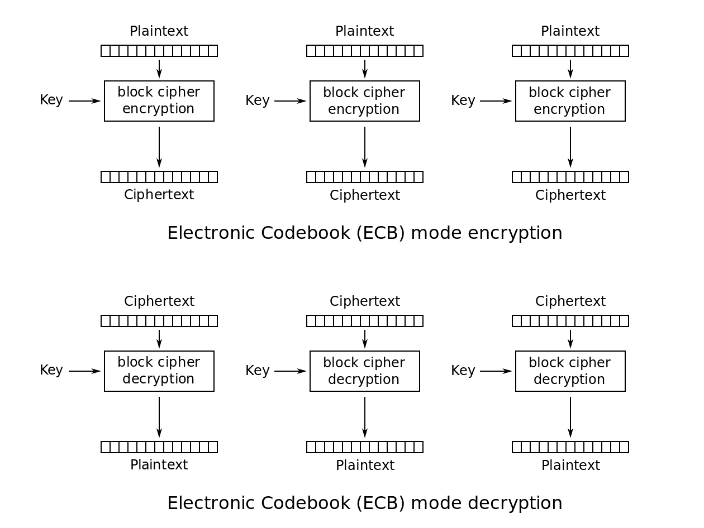
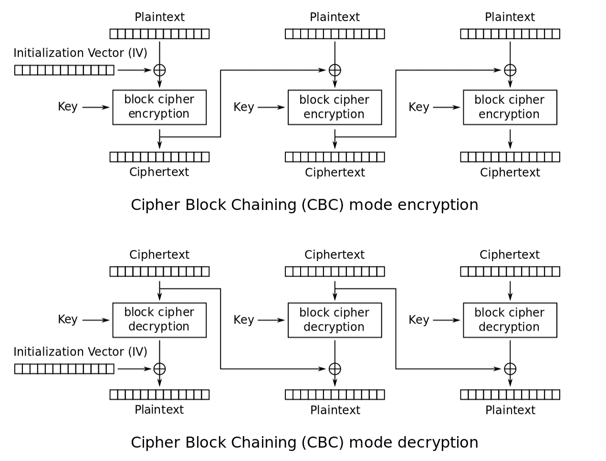
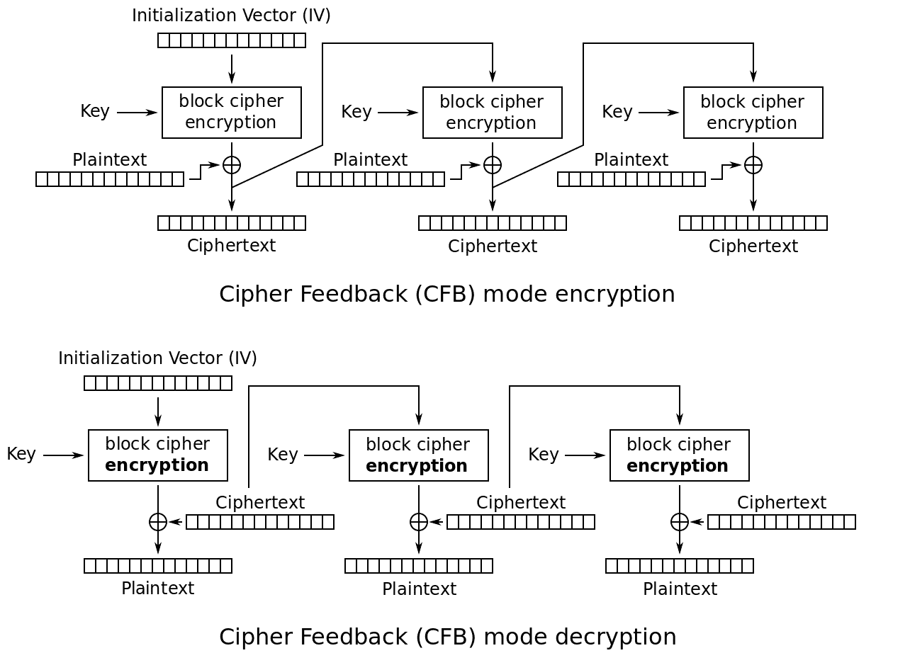
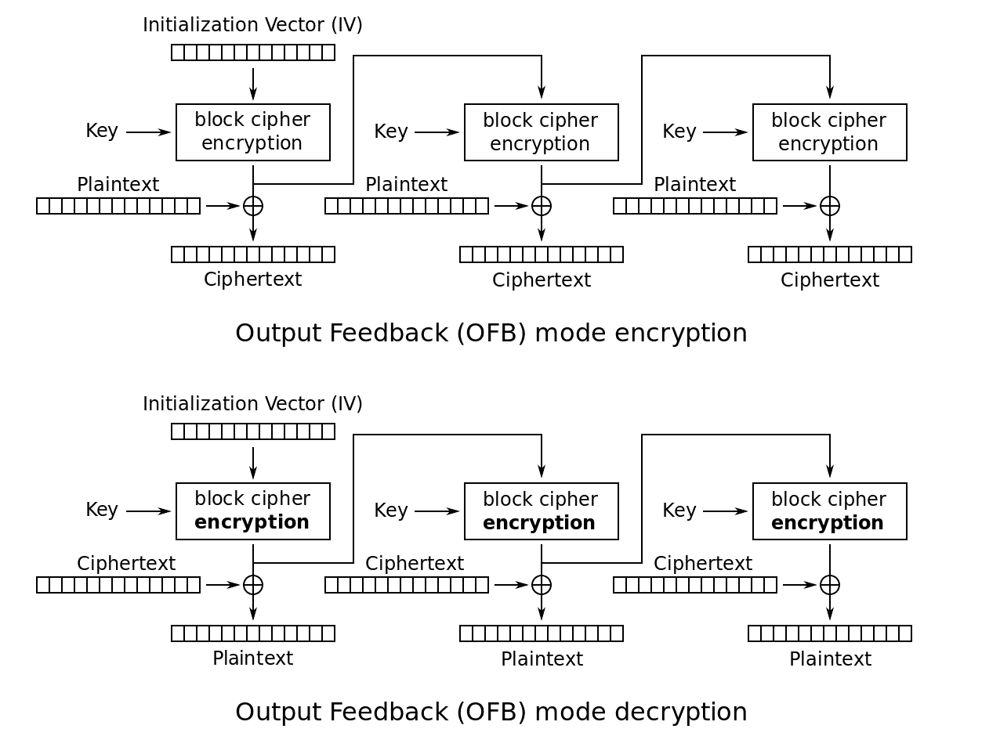
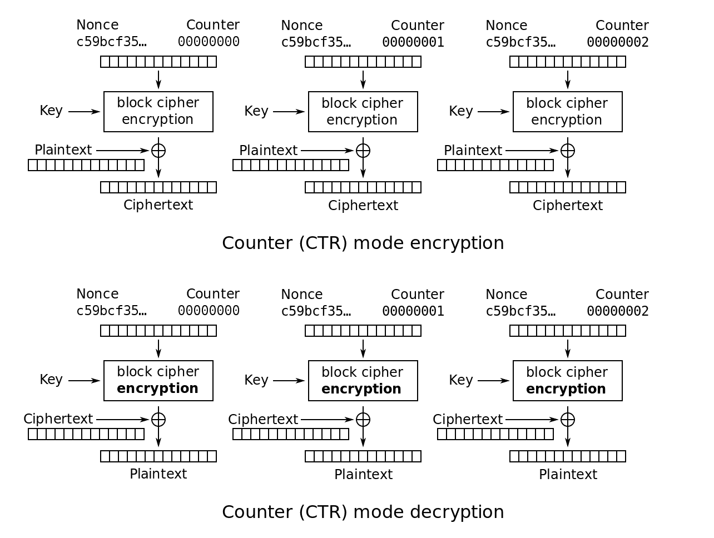

# 密码定义–什么是分组密码，它如何保护您的数据？

> 原文：<https://www.freecodecamp.org/news/what-is-a-block-cipher/>

密码学是使用代码和密码来保护信息的科学。加密包括对信息进行编码，这样只有目标接收者才能理解信息的含义。它通常用于保护传输中的数据。

加密是一种双向功能，也就是说，你需要能够撤销你对信息所做的任何加密。

今天，有两种基本类型的算法——对称和非对称。

对称算法也称为“秘密密钥”算法，非对称算法称为“公开密钥”算法。

两者的关键区别在于，对称算法使用相同的密钥进行加密和解密，而非对称算法使用不同的密钥进行加密和解密。

要了解密码学的概述以及对称和非对称密码之间的区别，请查看本文。

## 当你开发一个密码时，什么原则是重要的？

克霍夫的原则指出，密码系统应该是安全的，即使所有的细节(除了密钥)都是公开的。克劳德·香农(Claude Shannon)后来将这条信息改写为“敌人知道这个系统。”

本质上，一个设计非常好的系统应该能够发送秘密消息，即使攻击者可以使用相同的算法(使用不同的密钥)加密和解密他们自己的消息。加密消息的安全性应该完全依赖于密钥。

此外，为了阻止统计分析(试图破解加密算法)，一个好的密码系统应该采用混淆和扩散的原则。

混淆要求密钥不以简单的方式与密文相关。密文的每个字符应该依赖于密钥的多个部分。目标是使攻击者很难从密文中确定密钥。

扩散意味着如果明文中的一个字符发生变化，那么密文中的几个字符也会发生变化。如果密文的一个字符被改变，那么明文的几个字符也会改变。

理想情况下，密文和明文之间的关系是隐藏的。没有一个扩散是完美的(所有的扩散都会有一些模式)，但最好的扩散会将模式分散得很广，甚至将几个模式混在一起。

扩散使得攻击者很难发现模式，并要求攻击者拥有更多数据才能发起成功的攻击。

如果你想在这方面读得更多一点，看看[一个密码学的数学理论](https://www.iacr.org/museum/shannon/shannon45.pdf)。

## 什么是分组密码和流密码？

块密码和流密码都是对称密钥密码(如 DES、RCx、Blowfish 和 Rijndael AES)。分组密码将明文逐块转换为密文，而流密码一次转换一个字节。

大多数现代对称算法都是块密码，尽管块大小各不相同(如 DES (64 位)、AES (128、192 和 256 位)等)。

### 流密码的优势是什么？

流加密更快(在时间上是线性的)并且在空间上是恒定的。它不太可能传播错误，因为一个字节翻译中的错误不会影响下一个字节。

然而，当一个明文符号被直接转换成一个密文符号时，几乎没有扩散。此外，密文容易被插入或修改。如果攻击者能够破解算法，他们就可以插入看起来可信的文本。

当明文的数量未知时(如音频或视频流)，或者当极端性能非常重要时(如非常高速的连接，或者对于需要非常高效和紧凑的设备，如智能卡)，通常使用流密码。

流密码的工作原理是生成一系列依赖于密钥的伪随机字节(对于任何给定的密钥，加密和解密的字节系列是相同的)。不同的键会产生不同的字节串。

为了加密数据，明文字节与伪随机字节串进行异或运算。解密时，将密文与相同的字符串进行异或运算，以便看到明文。

### 分组密码的优势是什么？

分组密码具有高扩散性(来自一个明文符号的信息扩散到几个密文符号中)。攻击者在不被发现的情况下插入符号也是相当困难的，因为他们不能轻易地将它们插入到块的中间。

然而，它比流密码慢(在加密/解密发生之前需要传输整个块),并且如果发生错误，它会在整个块中传播，破坏整个部分。

当您知道传输大小时，块密码是更好的选择，例如在文件传输中。

## 分组密码的常见模式有哪些？

为了加密比单个块长的数据，已经开发了几种“模式”。这些描述了如何将单块原则应用于较长的消息。

块密码有 5 种保密模式。其中一些模式需要初始化向量(IV)才能运行。

### 什么是初始化向量(IV)？

IV 本质上只是另一种用于创建密文的输入(除了明文和密钥之外)。它是一个数据块，被多种模式的分组密码用来随机化加密，这样即使相同的明文被重复加密，也会创建不同的密文。

它通常不需要保密，尽管它不能被重复使用。理想情况下，它应该是随机的、不可预测的、一次性的。

用相同的密钥加密的两个相同的消息，但是不同的 iv，将产生不同的密文。这使得攻击者的工作更加困难。

### 电子代码簿模式(ECB)

在明文的输入块和密文的输出块之间存在固定的映射(本质上类似于实际的密码本，其中密文字直接与明文字相关)。

ECB 独立地对每个明文块应用密码函数进行加密(对每个密文块应用反函数进行解密)。这意味着 CBC 可以并行加密和解密多个块(因为它们互不依赖)，从而加快了进程。

https://en.wikipedia.org/wiki/Block_cipher_mode_of_operation

要使这种模式正常工作，要么消息长度需要是块大小的倍数，要么需要使用填充来满足长度条件。

填充实际上是为了确保满足块大小而添加的额外数据。在这种模式下，给定相同的密钥，相同的明文块将总是产生相同的密文块。这使得它容易受到攻击，所以这种模式很少使用(应该避免)。

### 密码块链接模式(CBC)

这种模式在对新的明文块和以前的密文块进行加密时将它们“链接”或组合起来，这需要第一个块的 IV。静脉注射不需要保密，但需要不可预测。

将第一个明文块与第四个密文块进行异或运算，生成第一个密文块。IV 使用 ECB 模式作为短信单独发送。

然后，CBC 对该块应用加密算法，创建第一个密文块。然后，CBC 将该块与第二个明文块进行异或运算，并应用加密算法生成第二个密文块，依此类推，直到消息结束。

为了解密消息，CBC 对第一个密文块反向应用加密算法的逆运算，然后将该块与 IV 进行异或运算，以获得第一个明文块。

然后，CBC 将加密算法的逆运算应用于第二密文块，并将该块与第一密文块进行异或运算，以获得第二明文块。这个过程一直持续到消息被解密。

https://en.wikipedia.org/wiki/Block_cipher_mode_of_operation

因为每个输入块(除了第一个)都依赖于前一个被加密的块，所以 CBC 不能并行执行加密。然而，由于解密需要与(立即可用的)密文块进行异或运算，因此可以并行进行。CBC 是最常用的模式之一。

与 ECB 类似，要使该模式正常工作，要么消息长度需要是块大小的倍数，要么需要使用填充来满足长度条件。

### 密码反馈模式(CFB)

CFB 类似于 CBC，但是 CFB 不是使用整个前一个密文块来计算下一个密文块，而是使用前一个密文块的一部分。

CFB 从一个与分组密码预期的块大小相同的 IV 开始，并使用加密算法对其进行加密。

CFB 从该输出中保留 s(有效)字节，并将它们与要传输的 s 字节明文进行异或运算。

然后，CFB 将 IV 的 s 字节向左移动，插入步骤 2 产生的密文字节作为右边的字节(IV 保持相同的长度)。

然后重复这些步骤。

为了解密消息，CFB 使用 IV 作为第一个块，并且通过执行上面的步骤 3 并应用加密算法来形成块，来形成每个后续的块。然后，CFB 与相应的密文进行异或运算，以揭示明文。

在 CFB 中，加密系统一次处理 s < b 个明文位，即使算法本身执行 b 位到 b 位的转换。这意味着 s 可以是任何数字，包括 1 个字节，并且 CFP 可以在功能上作为流密码操作。

https://en.wikipedia.org/wiki/Block_cipher_mode_of_operation

不幸的是，这意味着 CFB 可以向下游传播错误。如果接收到一个有错误的字节，当 CFB 使用它来解密第一个字节时，它将产生一个错误的解密，当反馈到解密时，导致下游错误。

像 CBC 一样，当 CFB 加密时，每一轮的输入都依赖于前一轮的结果，这意味着加密不能并行完成，尽管如果输入块首先从 IV 和密文创建，解密可以并行执行。

### 输出反馈(OFB)

OFB 类似于 CFB，但是它不是将 s < b 位处理成 b 位到 b 位的转换，而是直接处理 s 位。与 CFB 类似，OFB 在功能上可以用作流密码。

OFB 要求对于给定密钥的每次执行，IV 必须是唯一的 nonce(使用一次的数字)。

首先，OFB 用加密算法加密 IV，产生一个输出块。然后，OFB 将这个块与第一个明文块进行异或运算，产生第一个密文块。

OFB 用加密算法加密第一输出块以产生第二输出块。然后，它将该块与第二明文块进行异或运算，以产生第二密文块。OFB 在整个消息长度内重复这一过程。

https://en.wikipedia.org/wiki/Block_cipher_mode_of_operation

解密时，OFB 用加密算法加密 IV，生成一个输出块。然后，OFB 将这个块与第一个密文块进行异或运算，恢复出第一个明文块。

OFB 用加密算法加密第一输出块以产生第二输出块。然后，OFB 将其与第二密文块进行异或运算，以恢复第二明文块。OFB 在整个消息长度内重复这一过程。

因为用于解密的输出块是本地生成的，所以 OFB 比 CFB 更能抵抗传输错误。

### 计数器

CTR 将加密算法应用于一组唯一的输入块(计数器),以产生与明文进行异或运算的输出，从而产生密文。

CTR 用加密算法加密第一个计数器，然后将结果输出与第一个明文块进行异或运算，生成第一个密文块。CTR 对每个块重复这一过程(使用新的计数器，计数器在所有使用单个密钥加密的消息中必须是唯一的)。

如果最后的块是 s 字节的部分块，则输出块的最高有效位 s 用于 XOR，而输出块的 b - s 字节被丢弃。

https://en.wikipedia.org/wiki/Block_cipher_mode_of_operation

解密遵循相同的模式。CTR 使用加密算法对计数器进行加密，然后将输出与相应的密文块进行异或运算，生成明文块。

如果最后的块是 s 字节的部分块，则输出块的最高有效位 s 用于 XOR，而输出块的 b - s 字节被丢弃。

CTR 已被证明至少与其他四种模式一样安全，同时还能够并行执行(加密和解密)，这意味着它非常快。

如果可以确定每个块的计数器块，并且可以在接收明文或密文之前对计数器应用加密(如果存储器没有限制)，则可以独立地恢复每个块。

延伸阅读:[分组密码操作模式的 NIST 建议](https://nvlpubs.nist.gov/nistpubs/Legacy/SP/nistspecialpublication800-38a.pdf)

## 攻击者如何试图破解密码？

攻击者使用了许多技术，但根据实施攻击所需的信息，这些技术大致分为以下几类。

这并不是一个详尽的列表(还有其他攻击，如旁道攻击)，但许多最常见的攻击都属于这些类别之一。

### 已知密文攻击

攻击者有一些密文，但不知道用什么明文来生成这些密文。攻击者不能选择他们拥有的密文，并且他们不能获得/产生更多的密文。

这是最容易尝试的攻击类型，因为窃听加密的对话是最容易的(因为进行对话的人可能正在使用强加密，并且不担心窃听者)。但是，只要发送信息的人使用了适当的强加密技术，这是最难成功的。

例如:大卫在一个[秘密地点](https://en.wikipedia.org/wiki/Dead_drop#:~:text=A%20dead%20drop%20or%20dead,individuals%20can%20maintain%20operational%20security.)发现了一条加密信息(密文)，但是他不知道这条信息是什么意思。

### 已知明文攻击

攻击者有一些他们没有选择的明文和密文对(因此攻击者没有选择加密的消息，但是能够成功地窃取明文消息及其相关的密文)。攻击者不能获得/产生更多对。

例如:大卫发现了一个敌方间谍的藏身之处，并在他发送加密信息时打断了他。间谍傻到逃跑了，留下明文信息和相关的密文。

### 选择明文攻击

攻击者可以选择任何明文，并获得密文作为回报(但他们看不到密钥本身)。

这进一步细分为批量选择明文(攻击者可以提交一组明文并接收密文，但不能再次这样做)和自适应选择明文(攻击者可以提交明文、接收密文并基于之前的密文提交附加的明文)。)

例如:一个民族国家正在窃听另一个国家的加密通信，并且知道他们使用相同的密钥进行所有的加密。他们向另一个民族国家发送敏感的外交通信，知道它将通过加密通道传输，从而给他们一个选择的明文-密文对。

### 选择密文攻击

这与上一种攻击相反，攻击者可以选择任意密文，并获得明文作为回报(但他们看不到密钥本身)。

例如:大卫知道敌人的间谍明天会发送一条加密信息，所以他用自己选择的密文替换文本，然后监视接收者，听他们读出信息的明文。

### 来源/延伸阅读:

*   [NIST 关于分组密码操作模式的建议](https://nvlpubs.nist.gov/nistpubs/Legacy/SP/nistspecialpublication800-38a.pdf)
*   [扩散和混乱](https://www.nku.edu/~christensen/diffusionandconfusion)
*   [混乱和扩散](https://en.wikipedia.org/wiki/Confusion_and_diffusion)
*   克尔克霍夫原理
*   [衬垫机构](http://www.crypto-it.net/eng/theory/padding.html)
*   [计算机科学基础:流和块加密](https://www.cs.utexas.edu/~byoung/cs361/lecture45.pdf)