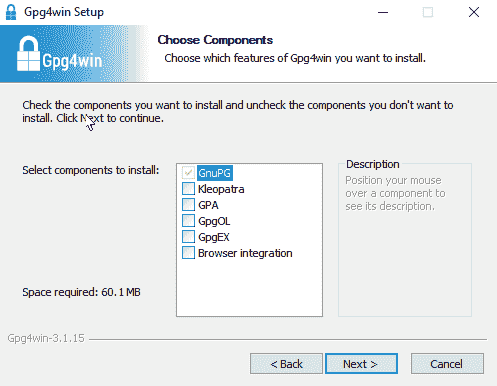
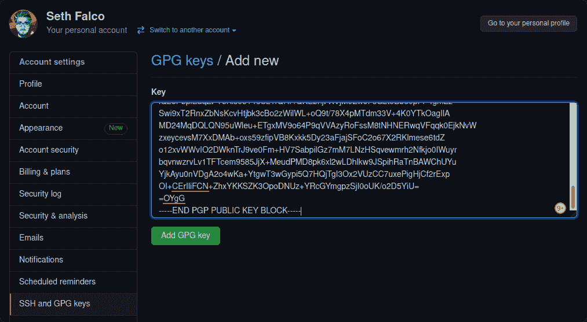
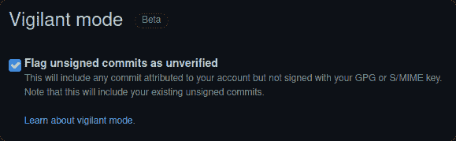

# Git 中的提交签名是什么？

> 原文：<https://www.freecodecamp.org/news/what-is-commit-signing-in-git/>

[Git](https://git-scm.com/) 有一个“签名”提交的特性，但是什么是签名，有什么好处呢？

**TL；DR:** 如果你不关心细节，只需要快速设置提交签名，跳到[如何签署提交](#how-to-sign-commits-in-git)。

签名，或者具体地说是代码签名，是使用加密技术向数据中添加数字签名的过程。数据的接收者可以验证签名是真实的，因此一定是来自签名者。

这就像物理签名，但数字和更可靠。

# Git 的默认行为

首先，我们注意到所有提交都具有以下属性:

*   作者——完成工作的贡献者，这是*信息。*
*   提交者–提交变更的用户。

在大多数情况下，它们是相同的，但是它们可以在提交时被覆盖，所以注意它们的区别是很重要的。

当您第一次安装 Git 时，您可能需要配置一些设置，即`user.email`和`user.name`。根据您的 Git 客户端，这可能已经为您处理好了。

在命令行中，这需要执行以下命令:

```
git config --global user.email "seth@example.org"
git config --global user.name "Seth Falco" 
```

Git 提交是基于信任的，所以它会假设您输入了真实的电子邮件和姓名。然后，您可以将提供的详细信息提交并推送到 GitHub 和 GitLab 等远程提供商。

当其他人使用你的电子邮件地址，然后远程推送更改时会发生什么？

```
git config --global user.email "seth@example.org"
git commit -m "Jen did this."
git push origin main 
```


结果看起来很正常，但我不是那个犯这个错误的人。Jen 提交了她的存储库，用她的 GitHub 证书认证，但是它显示了我的名字并链接到我的个人资料。默认行为将作者和提交者都设置为`git config`中的细节。

在 GitHub 上，提交已经和我自己的无法区分了。如果用户将`user.email`和`user.name`都设置为 mine，这可以通过对我的任何提交执行`git log`来获得，那么即使在本地看起来也是一样的。

这意味着任何人都可以将他们的`user.email`设置为你的电子邮件地址，这看起来就像是你提交的。

# Git 为什么要这么做？

你可能想知道为什么这是可能的。当你推送到存储库时，你对你的账户进行了认证，难道它不应该使用那个电子邮件吗？这是不是显得有点瑕疵？

当您进行身份验证以推送至远程存储库时，您正在进行身份验证以做到这一点—推送更改。无论是谁创作或提交，提交都不需要验证。

如果默认提交所需的身份验证，就不可能将项目迁移或镜像到其他平台。提交历史将包括以前的雇员，死亡的用户，不活跃的帐户，或不在其他平台上的电子邮件地址。

唯一的解决办法是重写历史，删除他们曾经参与过这个项目，这并不理想。

另一种情况是，如果我在 GitHub 上派生了一个项目，但想在 GitLab 上维护我的派生。我的第一次推送将包括来自之前提交者的所有提交。对于一个大型项目，验证每个提交者是不可行的。

提交的作者表示谁做了工作的归属，而不是谁做了工作的证明。

事实上，您可以在提交时覆盖作者，只为了这个目的。使用`--author`参数，您可以为您的全局设置指定一个不同的名称和电子邮件，甚至是与托管存储库的帐户无关的详细信息。

不过，在公共存储库上，当代表没有账户的人提交时要小心。姓名和电子邮件地址一旦被推送，就会成为公共信息，任何人都可以使用`git log`！

```
git commit -m "Jen didn't even author this." --author "Jen <jen@example.org>"
git push origin main 
```

这与在`git config`中使用另一封电子邮件的行为不同。这使得作者成为我们在`--author`中指定的，而提交者成为我们在`git config`中指定的。


像 [Weblate](https://weblate.org/) 这样的翻译平台依靠这一特性来确保翻译人员仍然能够获得归属，即使是自动用户而不是翻译人员提交和打开拉取请求。

# 如何证明你是 Git 中的提交者

GNU 隐私保护 (GnuPG 或 GPG)允许你创建用于数据加密和签名的非对称密钥对。它们由公钥和私钥组成。

你可以与任何人分享公钥——你可以将它上传到你的 GitHub 和 GitLab 账户，或者放在互联网上供任何人访问。

顾名思义，私钥是私有的。您应该像对待密码一样对待它，并且在任何情况下都不应该与任何人共享您的私钥。

我们将生成一个密钥对，然后将公钥上传到 GitHub 和 GitLab。使用您的私钥，您可以签署您的提交，并且具有公钥的服务器将使用它来确认这真的是您。

# 如何在 Git 中签署提交

我将只介绍如何在终端中做到这一点，因为这提供了跨操作系统的统一体验。如果您对终端感到不舒服，您几乎只需要复制命令。

## 先决条件

除了 Git 本身，唯一的先决条件是安装 GPG 命令行实用程序。

可以验证一下是不是装了`gpg --version`。

### Windows 操作系统

#### 去吧，巴什

如果您安装了 Git BASH(可选地与用于 Windows 的 Git 捆绑在一起)，那么您已经可以访问 GPG 了。只需启动 Git BASH 的一个实例，它就会立即可用。

#### Gpg4win

如果你没有 Git BASH，那么就没有必要安装它。你可以安装 [Gpg4win](https://gpg4win.org/download.html) ，它将在全球范围内提供 Gpg，所以你可以直接从 PowerShell 使用它。

安装 Gpg4win 时，您可以取消选中所有附加组件，因为我们计划使用终端，所以不需要它们。



如果您已经打开了 PowerShell，您必须重新启动它才能使用 GPG。

### Linux 操作系统

你的发行版很可能已经包含了 GPG。如果没有，那么你可以通过你的软件包管理器来安装它。

#### apt (Debian / Ubuntu)

`sudo apt install gnupg`

#### pacman (Arch / Manjaro)

`sudo pacman -S gnupg`

## 如何生成 GPG 密钥

如果您已经有一个 GPG 键，您可以跳过这一步。重复使用 GPG 键完全没问题。只需阅读以下内容，并验证您的密钥是否与 Git 和 GitHub 兼容。

您可以通过以下方式获得 GPG 键列表:

```
gpg --list-keys 
```

首先，我们需要生成一个 RSA 密钥对。下面将启动一个交互式脚本，该脚本将提问，以便我们可以提供必要的信息。

```
gpg --full-gen-key 
```

1.  对于想要什么样的密钥，输入`1`也就是“RSA 和 RSA”。
2.  对于密钥大小，输入`4096`。这是 GitHub 和 GitLab 的最小尺寸，也是 GPG 允许我们生成的最大尺寸。
3.  对于密钥应该持续多长时间，使用任何适合您的密钥。默认为`0`，表示永不过期。
4.  通过输入`y`验证信息是否正确。

GPG 将要求您提供存储在您的密钥中的个人信息。

1.  您的姓名，长度可以是至少 5 个字符。
2.  您的电子邮件地址，使用您计划提交的电子邮件。你一定已经在你要推送的远程账户上验证了这封邮件。
3.  注释，您可以键入任何内容，或者按 enter 键将其留空。
4.  通过输入`o`验证信息是否正确。

```
root@799d1cc3c99c:/# gpg --full-gen-key
gpg (GnuPG) 2.2.19; Copyright (C) 2019 Free Software Foundation, Inc.
This is free software: you are free to change and redistribute it.
There is NO WARRANTY, to the extent permitted by law.

Please select what kind of key you want:
   (1) RSA and RSA (default)
   (2) DSA and Elgamal
   (3) DSA (sign only)
   (4) RSA (sign only)
  (14) Existing key from card
Your selection? 1
RSA keys may be between 1024 and 4096 bits long.
What keysize do you want? (3072) 4096
Requested keysize is 4096 bits
Please specify how long the key should be valid.
         0 = key does not expire
      <n>  = key expires in n days
      <n>w = key expires in n weeks
      <n>m = key expires in n months
      <n>y = key expires in n years
Key is valid for? (0) 0
Key does not expire at all
Is this correct? (y/N) y

GnuPG needs to construct a user ID to identify your key.

Real name: Seth Falco
Email address: seth@example.org
Comment: 
You selected this USER-ID:
    "Seth Falco <seth@example.org>"

Change (N)ame, (C)omment, (E)mail or (O)kay/(Q)uit? o
```

Here is how my terminal looks, after performing all the steps above.

GPG 将要求一个密码来保护密钥。您可以将它设置为任何值，或者将其留空以表示没有密码。当然，使用一个好的密码是最理想的，如果你使用密码管理器的话，依靠它。

密码提示是与环境相关的，所以这一步对于不同的用户来说看起来是不同的，但是它询问的内容实际上是相同的。

它将开始生成密钥，这需要大量随机生成的数据。在你的电脑上执行动作将有助于使它更加随机，所以我建议在密钥生成时移动你的鼠标。

## 如何导出您的密钥

接下来，您需要获取新生成的密钥的标识符，以便我们在导出您的密钥和配置 Git 时可以引用它。

GPG 键可以以多种方式引用。使用和共享完整的指纹是一个好习惯，这样可以在用户从密钥服务器请求指纹时最大限度地降低不确定性的风险。长(64 位)id 对现在的来说是好的*，但是短(32 位)id 最好避免，因为它很容易产生冲突。([更多信息](https://evil32.com/)*

我们将使用完整的 GPG 指纹，可以通过以下命令获得:

```
gpg --list-keys 
```

您将得到如下输出:

```
pub   rsa4096 2021-05-23 [SC]
      C6656513A0F9B7B7F4E76389EF39187D04795745
uid           [ultimate] Seth Falco <seth@example.org>
sub   rsa4096 2021-05-23 [E] 
```

对我来说，就是`C6656513A0F9B7B7F4E76389EF39187D04795745`。当你执行剩下的命令时，确保使用你的指纹而不是我的。

您需要导出公钥，这样就可以将它上传到 GitHub。我们使用`--armor`参数来表示我们想要以[ASCII armed](https://en.wikipedia.org/wiki/Binary-to-text_encoding)格式导出它，而不是二进制。这会将公钥写入名为`gpg-key.pub`的文件。

```
gpg --export --armor C6656513A0F9B7B7F4E76389EF39187D04795745 > ./gpg-key.pub 
```

### 如何备份您的密钥

为你的 GPG 键做一个远程备份是值得的，因为你可能会跨服务使用它们。如果你丢失了它，就不得不更新所有的东西。

您可以像导出公钥一样导出您的私钥，这将私钥写入一个名为`gpg-key.asc`的文件:

```
gpg --export-secret-keys --armor C6656513A0F9B7B7F4E76389EF39187D04795745 > ./gpg-key.asc 
```

现在，您可以备份您的公钥和私钥，但是请记住，您不应该将私钥的未加密副本发送到云中。总是使用端到端的加密云存储，或者像 [Bitwarden](https://bitwarden.com/) 这样的密码管理器来备份敏感数据。

## 如何启用提交签名

然后，要启用对所有提交的签名，请使用`git config`设置`commit.gpgsign`设置。这将使`git commit`默认签署提交。

```
git config --global commit.gpgsign true 
```

如果你有多个 GPG 键，或者只是为了将来参考，你也可以设置`user.signingkey`。这将明确指出 Git 应该使用哪个密钥进行签名，以避免歧义。

```
git config --global user.signingkey C6656513A0F9B7B7F4E76389EF39187D04795745 
```

## 如何使用你的钥匙

最后，您必须上传您的公钥。您可以对 GitHub 和 GitLab 或任何其他 Git 提供者使用相同的 GPG 密钥。

我们将在接下来的步骤中需要导出的公钥，因此在任何编辑器(如 Visual Studio 代码)中打开`gpg-key.pub`文件，并将内容复制到剪贴板。

在 GitHub 上，你可以到你的[设置](https://github.com/settings/profile)，在 [SSH 和 GPG 键](https://github.com/settings/keys)下，然后点击[新 GPG 键](https://github.com/settings/gpg/new)。将`gpg-key.pub`的内容粘贴到 GitHub 上的 Key 字段，点击“添加 GPG 密钥”。



在 GitLab 上，步骤几乎完全相同，只需转到你的[偏好](https://gitlab.com/-/profile/preferences)，然后“ [GPG 键](https://gitlab.com/-/profile/gpg_keys)”。将`gpg-key.pub`的内容粘贴到 GitLab 上的 key 字段，点击“添加 Key”。

现在您可以对您的存储库进行签名提交了！下一次提交将提示您输入 GPG 密钥密码，因为这是您第一次使用它。后续提交将是无缝的。

# 如何在 Git 中验证提交

GitHub 和 GitLab 会在你的新提交旁边显示一个“已验证”的徽章。


最后要记住的是，提交签名将只验证提交者，而不是作者。这意味着当你看到一个已验证的提交时，作者与已验证的状态无关。


## 警惕模式

作为奖励，GitHub 上专门有一个设置叫做[警惕模式](https://docs.github.com/en/github/authenticating-to-github/managing-commit-signature-verification/displaying-verification-statuses-for-all-of-your-commits)。

如果您希望所有未签名的提交都明确表示“未验证”，您可以选择启用此选项。这可以在您的[设置](https://github.com/settings/profile)中，在“ [SSH 和 GPG 键](https://github.com/settings/keys)下启用，然后勾选“将未签名的提交标记为未验证”。



现在 Jen 提交的我的电子邮件地址旁边显示“未验证”,表明它不是用与我的帐户相关的密钥签名的。

