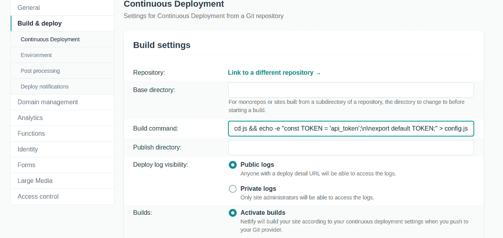

# 如何在 VanillaJS 中使用环境变量

> 原文：<https://www.freecodecamp.org/news/how-to-use-environment-variables-in-vanillajs/>

在本文中，您将了解普通 JavaScript 中的环境变量。您还将学习如何通过 Netlify build 命令为您的应用程序提供 API 键。

## 什么是 JavaScript 环境变量？

当您使用 React 或 Vue 等 JavaScript 框架在服务器端创建前端用户界面或节点时，环境变量非常常见。

环境变量的全部意义(或者至少我是这样理解的)在于，它们让您可以灵活地设置条件，以决定您希望应用程序或软件在不同模式(开发和生产)下的行为方式。

当软件的 UI/前端开始与 API 或后端服务器交互时，需要在提供操作结果(如 API 调用)之前进行身份验证，这时您就创建了这些条件。最常见的方法是在完成请求之前提供一个 API 密钥。

如果您以前尝试过从 API 获取数据，那么您必须提供这个 API 键，以便数据请求能够成功。这包括向 API 调用添加一个`Authorization`头。

看看下面典型的获取请求及其授权头。

```
const apiCall = () => {
    fetch(url, {
    	headers: {
            Authorization: `bearer ${private_api_key}`
        }
    })
    .then(res => res.json())
    .then(data => console.log(data))
    .catch(err => JSON.stingify(err))
}
```

顾名思义，环境变量存储变量。赋给这些变量的值或东西可能是执行某些请求或操作所需的 API 键。

要创建环境变量，您只需创建一个名为。env 位于您正在处理的项目的根文件夹中。然后你可以开始添加所有你不想透露给任何人的变量。

`.gitignore`文件保存了 Git 不应该跟踪的文件列表，`.env`文件将在这个文件中。

## 如何使用。VanillaJS 中的 env 文件

您在应用程序的后端使用环境变量。现在，你可能会说“但是我可以在 React 应用程序中创建一个`.env`文件”。

事实是，你说得很对——但是 React 的引导方式是 Node.js 包含在其中。这意味着您需要使用节点包管理器来执行某些操作。

当您使用 VanillaJS 时，您也可以创建一个. env 文件，但是您将无法访问 Node 在运行时提供的 process.env 全局变量。Node 把`.env`文件当作一个对象，所以它有这个能力:`process.env.env_variable`。

```
const env = {
    env_variable: "bgrtyaqQtyfadV0F08BHGvfsgskl",
    topic_id: "F08BHGvfsgsklgrtyaqQtyfadV0F08"
}

console.log(process.env.env_variable)

// prints bgrtyaqQtyfadV0F08BHGvfsgskl to the console
```

您在客户端使用 VanillaJS，因此创建一个`.env`并使用环境变量实际上并不可行。这是因为您不能在浏览器中使用 process.env 全局变量节点提供的(以访问在`.env`文件中创建的变量)。

那么你如何使用环境变量呢？嗯（表示踌躇等）...尤其是在编写客户端 JavaScript(我指的是 VanillaJS)的时候不能使用环境变量。

名为 [dotenv](https://npmjs.org/dotenv) 的 npm 包提供了一个解决方案，因为它可以访问节点全局变量`process.env`。

一旦你安装了这个包，一个`node_modules`会自动创建一个带有两个文件的文件夹，`package.json`和`package-lock.json`。这些保存了应用程序的细节。

但是你一使用它，JavaScript 就会抛出一个错误，说`require`没有定义:

```
require("dotenv").config()

const apiCall = () => {
    fetch(url, {
    	headers: {
            Authorization: `bearer ${process.env.env_variable}`
        }
    })
    .then(res => res.json())
    .then(data => console.log(data))
    .catch(err => JSON.stingify(err))
}
```

发生这个错误是因为`require`不在`node_module`中，或者不在使`dotenv`包起作用的包列表中。

简单来说，`dotenv`需要`require`才能发挥作用。你可以从[requires](https://requirejs.org/)那里得到`require`，但是这又是一个麻烦。您必须通读关于如何应用脚本使 Node 的全局变量在客户端可用的文档。

## 为什么要经历这么多麻烦？

真的。为什么？

人们通常将公共 API 用于个人项目，或者用于一些他们还没有完全掌握的概念。

大多数情况下，这些 API 不需要使用私有(API)密钥进行身份验证。当您处理只允许使用`GET`方法获取数据的端点时，这种情况很常见。

像 GitHub 或 Twitter 这样的 api 在允许请求通过之前需要使用 api_keys 来认证用户。例如，GitHub GraphQL API 需要一个访问令牌才能成功调用 API。但是访问令牌有一些奇怪的地方，其中之一是一小时可以执行 5000 个请求。

您永远不能将这个访问令牌提交到项目的 Git 工作流中。如果你提交了，GitHub 会出于安全原因删除它。这就是 VanillaJS 不能保存环境变量的问题所在。

GitHub 提供的访问令牌(一旦提交到工作流中，最终会被删除)不允许应用程序在`production`模式下运行。它在`development`中工作得非常好——但是一旦它被删除，并且存储库/项目被部署到 Netlify，那么 Netlify 就不能再访问这些键了。

## 你如何解决这个问题？

Netlify 有一个“构建和部署”设置选项卡。这允许您改变 GitHub 上项目或存储库的持续部署过程。

一旦 Netlify 检测到对`master`或`main`分支的推送，您可以决定停止所有并发的自动构建，停用所有构建，直到项目在开发模式下完全完成，以及许多我不记得的功能。

但是，这不是本文的重点。我们关心的是如何在本地使用 GitHub 访问令牌(通过确保它不会进入提交历史)，然后在`production`中允许 Netlify 访问它。

下图显示了 Netlify 上的“构建和部署”选项卡。



注意构建命令输入字段吗？使用下面的代码片段:

```
cd js && echo -e "const TOKEN = 'api-token';\n\nexport default TOKEN;" > config.js
```

上面的命令只是在构建过程中在`js`文件夹中注入一个名为`config.js`的新文件。这使得 Netlify 可以访问您的 API 密钥(访问令牌)。

如果您的项目中没有`js`文件夹，也就是说项目的根文件夹中有所有文件，您可以简单地添加`echo -e "const TOKEN = 'api-token';\n\nexport default TOKEN;" > config.js`作为构建命令。

```
const TOKEN = 'api-token';

export default TOKEN;
```

为了确保您能够在 JavaScript 文件中使用 ES6 `import`语句，您需要在脚本标签中添加`type="module"`属性

```
<script src="./index.js" type="module"></script>
```

## 结论

这似乎不是使用环境变量的最佳实践或方法。这是因为当任何人在互联网上查看或访问您的应用程序时，当他们在自己喜欢的浏览器上打开 devtools 时，您的 API 密钥可能仍然可见。

但是它帮助我绕过了 GitHub 删除这些键的问题，这些键反过来会阻止应用程序在`production`中工作。

当你使用一个 API 时，你应该只考虑这种方法，当你的 API 密匙被泄露时，当它被第三方使用时不会造成太大的伤害。

感谢您阅读这篇文章。希望有帮助。；)