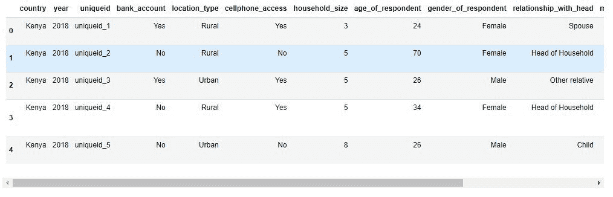
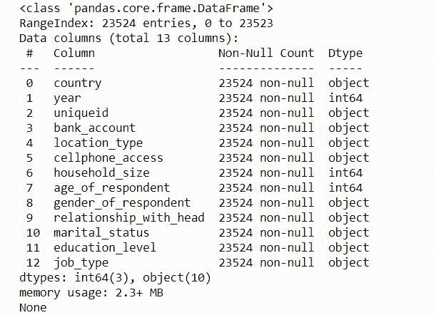
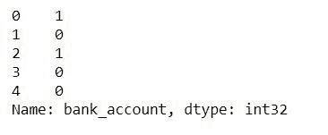

# 如何通过组合分类特征来提高机器学习模型的性能

> 原文：<https://www.freecodecamp.org/news/improve-machine-learning-model-performance-by-combining-categorical-features/>

当您训练机器学习模型时，您的数据集中可以有一些表示分类值的要素。分类要素是可以分组的数据类型。

有三种常见的分类数据类型:

1.  **序数**–以升序或降序排列的一组值。例子:用 1-10 的尺度给幸福打分
2.  **二进制**–只有两个值的集合。例如:热或冷。
3.  **名义**–包含没有特定顺序的值的集合。示例:国家列表

大多数机器学习算法需要数字输入和输出变量。这意味着您必须将数据集中的分类特征转换为整数或浮点数，以便机器学习算法可以使用它们。

您可以对二进制特征使用[标签编码](https://www.freecodecamp.org/news/feature-engineering-and-feature-selection-for-beginners/?ref=hackernoon.com)，或者对名义特征使用[一次热编码](https://hackernoon.com/what-is-one-hot-encoding-why-and-when-do-you-have-to-use-it-e3c6186d008f?ref=hackernoon.com)方法。

在本文中，您将了解组合分类特征如何提高机器学习模型的性能。

所以让我们开始吧。🚀

## 如何组合机器学习模型中的分类特征

您可以创建一个由其他两个分类要素组合而成的新要素。您还可以组合三个或四个以上甚至更多的分类特征。

```
df["new_feature"] = (
	df.feature_1.astype(str)
	 + "_"
	 + df.feature_2.astype(str)
	)
```

在上面的代码中，您可以看到如何使用 Pandas 合并两个分类要素，并在数据集中形成一个新要素。

那么你应该结合哪些分类特征呢？这个问题没有简单的答案。这取决于您的数据和要素类型。一些领域知识可能对创建这样的新特性有用。

为了说明整个过程，我们将使用来自 [Zindi 竞赛页面](https://zindi.africa/competitions/financial-inclusion-in-africa?ref=hackernoon.com)的[非洲金融包容性数据集](https://zindi.africa/competitions/financial-inclusion-in-africa/data?ref=hackernoon.com)。它有许多分类特征，我们可以将它们结合起来，看看是否可以改进模型的性能。

该数据集的目标是预测谁最有可能拥有银行帐户。所以这是一个分类问题。

## 步骤 1–加载数据集

我们的第一步是确保我们已经下载了比赛中提供的数据集。你可以在这里下载数据集[。](https://zindi.africa/competitions/financial-inclusion-in-africa/data?ref=hackernoon.com)

像这样导入重要的 Python 包:

```
import pandas as pd
import numpy as np
import matplotlib.pyplot as plt
import seaborn as sns
import warnings
np.random.seed(123)
warnings.filterwarnings('ignore')
%matplotlib inline 
```

然后加载数据集。

```
# Import data
data = pd.read_csv('data/Train_v2.csv') 
```

让我们看看数据集的形状:

```
# print shape
print('data shape :', data.shape)

data shape : (23524, 13) 
```

上面的输出显示了数据集中的行数和列数。数据集中有 13 个变量——12 个自变量，1 个因变量。

通过使用 Pandas 库中的 **`head()`** 方法，我们可以看到数据集中的前五行。

```
# inspect data 

data.head()
```



理解每个特征的含义非常重要，这样您才能真正理解数据集。您可以阅读 **VariableDefinition.csv** 文件来理解数据集中出现的每个变量的含义。

## 步骤 2–解释数据集

我们可以通过使用 **`info()`** 方法从熊猫身上获得更多关于我们所拥有的特征的信息。

```
#show Some information about the dataset

print(train_data.info())
```



输出显示变量/特征列表、大小(如果包含缺失值)以及每个变量的数据类型。

数据集中没有任何值丢失。我们有 3 个整数数据类型的特性和 10 个对象数据类型的特性(大多数是分类特性)。

## 步骤 3–为机器学习模型准备数据

下一步是从数据中分离出自变量和目标(bank_account)。然后使用 [LabelEncoder](https://towardsdatascience.com/categorical-encoding-using-label-encoding-and-one-hot-encoder-911ef77fb5bd?ref=hackernoon.com) 将目标值从对象数据类型转换成数字。

```
#import preprocessing module
from sklearn.preprocessing import LabelEncoder
from sklearn.preprocessing import MinMaxScaler

# Convert target label to numerical Data
le = LabelEncoder()
data['bank_account'] = le.fit_transform(data['bank_account'])

#Separate training features from target
X = data.drop(['bank_account'], axis=1)
y = data['bank_account']

print(y) 
```



我们已经将目标值转换为数字数据类型——1 代表“是”, 0 代表“否”。

我创建了一个简单的预处理函数来:

*   处理数据类型的转换。
*   使用[一键编码器和/或标签编码器](https://towardsdatascience.com/categorical-encoding-using-label-encoding-and-one-hot-encoder-911ef77fb5bd?ref=hackernoon.com)将分类特征转换为数字特征。
*   删除 uniqueid 变量。
*   执行[特征缩放](https://towardsdatascience.com/preprocessing-with-sklearn-a-complete-and-comprehensive-guide-670cb98fcfb9?ref=hackernoon.com)。

```
# function to preprocess our data 

def preprocessing_data(data):

    # Convert the following numerical labels from interger to float
    float_array = data[["household_size", "age_of_respondent", "year"]].values.astype(float
    )

    # categorical features to be converted to One Hot Encoding
    categ = [
        "relationship_with_head",
        "marital_status",
        "education_level",
        "job_type",
        "country",
    ]

    # One Hot Encoding conversion
    data = pd.get_dummies(data, prefix_sep="_", columns=categ)

    # Label Encoder conversion
    data["location_type"] = le.fit_transform(data["location_type"])
    data["cellphone_access"] = le.fit_transform(data["cellphone_access"])
    data["gender_of_respondent"] = le.fit_transform(data["gender_of_respondent"])

    # drop uniquid column
    data = data.drop(["uniquid"]), axis=1)

    # scale our data 
    scaler = StandardScaler()
    data = scaler.fit_transform(data)

    return data 
```

让我们预处理我们的数据集。

```
# preprocess the train data 
processed_test_data = preprocessing_data(X_train) 
```

## 步骤 4–模型构建和实验

我们将使用数据集的一部分来评估我们的模型。

```
# Split train_data
from sklearn.model_selection import train_test_spilt
X_Train, X_val, y_Train, y_val = train_test_split(processed_train_data, y_train, stratify = y, test_size = 0.1, random_state=42) 
```

我们将只使用数据集的 **10%** 来评估机器学习模型。参数**分层= y** 将确保训练集和验证集的两个类的值相等(“是”和“否”)。

对于这个分类问题，我们将使用**逻辑回归算法**来训练和预测谁最有可能拥有银行账户。

```
#import classifier algorithm here
from sklearn.linear_model import LogisticRegression

# create classifier
lg_model = LogisticRegression()

#Training the classifier
lg_model.fit(X_Train,y_Train) 
```

训练完分类器之后，让我们使用训练好的模型来预测我们的评估集，看看它的表现如何。我们将使用准确性作为我们的评估标准。

```
# import evaluation metrics
from sklearn.metrics import confusion_matrix, accuracy_score

# evaluate the model
y_pred = lg_model.predict(X_val)

# Get the accuracy
print("Accuracy Score of Logistic Regression classifier: ","{:.4f}".format(accuracy_score(y_val, lg_y_pred))) 
```

我们从逻辑回归分类器得到的准确度分数为 **0.8874** 。

## 如何结合`education_level`和`job_type`特性来提高性能

现在我们知道了基本模型的性能，让我们看看是否可以通过结合 **`education_level`** 和 **`job_type`** 特性来改进它。

在我们的第一个实验中，我们需要更新我们已经创建的预处理函数，然后运行剩余的代码。

```
# function to preprocess our data 

def preprocessing_data(data):

    # Convert the following numerical labels from integer to float
    float_array = data[["household_size", "age_of_respondent", "year"]].values.astype(float)

    # combine some cat features 
    data["features_combination"] = (data.education_level.astype(str) + "_" + data.job_type.astype(str) )

    # remove individual features that are combined together
    data = data.drop(['education_level','job_type'], axis=1)

    # categorical features to be converted by One Hot Encoding
    categ = [
      "relationship_with_head",
      "marital_status",
      "features_combination",
      "country"
      ]

    # One Hot Encoding conversion
    data = pd.get_dummies(data, prefix_sep="_", columns=categ)

    # Label Encoder conversion
    data["location_type"] = le.fit_transform(data["location_type"])
    data["cellphone_access"] = le.fit_transform(data["cellphone_access"])
    data["gender_of_respondent"] = le.fit_transform(data["gender_of_respondent"])

    # drop uniquid column
    data = data.drop(["uniqueid"], axis=1)

    # scale our data 
    scaler = StandardScaler()
    data = scaler.fit_transform(data)

    return data 
```

在上面的预处理函数中，我通过以下方式更新了代码:

*   结合`education_level`和`job_type`创建一个名为 **`features_combination`** 的新特征。
*   从数据集中移除单个要素(` education_level '和`job_type`)。
*   在**一个热编码**将转换的分类特征列表中添加一个名为 **`feature_combinaton`** 的新特征。

**注意:**我只选择了名义分类特征(具有两个以上的唯一值)。

在为该实验重新训练逻辑回归分类器之后，模型性能从 **0.8874** 提高到 **0.8882** 。这表明结合分类特征可以提高模型的性能。

请记住，我们没有改变任何东西，如机器学习分类器中的超参数。

## 如何结合`relation_with_head`和`marital_status`特性来提高性能

在我们的第二个实验中，我们将结合另外两个分类特征，它们是 **`relationship_with_head`** 和 **`marital_status`** 。

我们只需要更新预处理函数(就像第一个实验一样)，然后运行剩下的代码。

```
# function to preprocess our data 

def preprocessing_data(data):

    # Convert the following numerical labels from integer to float
    float_array = data[["household_size", "age_of_respondent", "year"]].values.astype(
        float
    )

    # combine some cat features 
    data["features_combination"] = (data.relationship_with_head.astype(str) + "_"
                           + data.marital_status.astype(str) 
                      )
    # remove individual features that are combined together
    data = data.drop(['relationship_with_head','marital_status'], axis=1)

    # categorical features to be converted by One Hot Encoding
    categ = [
        "features_combination",
        "education_level",
        "job_type",
        "country",
    ]

    # One Hot Encoding conversion
    data = pd.get_dummies(data, prefix_sep="_", columns=categ)

    # Label Encoder conversion
    data["location_type"] = le.fit_transform(data["location_type"])
    data["cellphone_access"] = le.fit_transform(data["cellphone_access"])
    data["gender_of_respondent"] = le.fit_transform(data["gender_of_respondent"])

    # drop uniquid column
    data = data.drop(["uniqueid"], axis=1)

    # scale our data 
    scaler = StandardScaler()
    data = scaler.fit_transform(data)

    return data
```

在上述预处理函数中，我通过以下方式更新了代码

*   结合`relation_with_head`和`marital_status`创建一个名为 **`features_combination`** 的新特征。
*   从数据集中移除单个特征(` relation_with_head '和`marital_status`)。
*   在**一个热编码**将转换的分类特征列表中添加一个名为 **`feature_combination`** 的新特征。

在为第二个实验重新训练逻辑回归分类器后，模型性能从 **0.8874** 下降到 **0.8865** 。

这说明有时候当你结合分类特征的时候你的机器学习模型并不会像你预期的那样提高。因此，你将需要运行大量的实验，直到你从你的机器学习模型中获得令人满意的性能。

## 包扎

在本文中，您了解了如何组合数据集中的分类特征，以提高机器学习模型的性能。

请记住——为了从您的模型中获得令人满意的性能，您需要对您正在解决的问题有一定的领域知识。此外，您需要运行大量需要更多计算资源的实验。

恭喜👏👏，你已经做到这篇文章的结尾了！我希望你学到了一些新的东西，对你的下一个机器学习或数据科学项目有所帮助。

如果你学到了新的东西或者喜欢阅读这篇文章，请分享给其他人看。在那之前，下期帖子再见！

你也可以在 Twitter 上找到我 [@Davis_McDavid](https://twitter.com/Davis_McDavid?ref=hackernoon.com) 。

你可以在这里 *阅读[其他文章。](https://hackernoon.com/u/davisdavid)*