# 如何制作一个材质与质感统一的弹跳篮球🏀

> 原文：<https://www.freecodecamp.org/news/how-to-make-a-basketball-in-unity-with-materials-and-textures/>

在这篇文章中，我将教你如何在 Unity 中使用材质和纹理制作一个篮球。你可以扩展这个微概念来创造任何种类的球，比如足球、网球或斯诺克球。

也就是说，这些技术不仅仅局限于创建像球这样的圆形 3D 对象。您应该能够使用这个概念来定制任何类型的几何体(或网格)的外观。

以下是您将创建的内容👇🏻

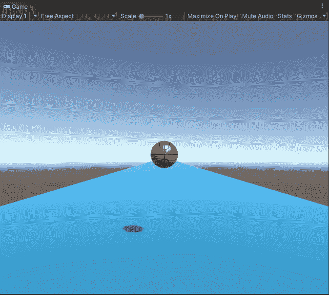

Basketball🏀

把篮球想象成一个用漂亮的纸(也就是纹理)包裹起来的球体(也就是网孔)。

让我们开始吧。

### 先决条件

要制作弹跳球，您的示例场景应该具有以下内容:

1.  一架飞机
2.  具有自定义材质的球体

让我们先看看怎么做。

## 步骤 1:如何添加一个平面和一个球体到场景中

首先进入 Unity 的层级面板。右键单击并选择平面，在场景中放置一个平面。用同样的方法添加一个球体。

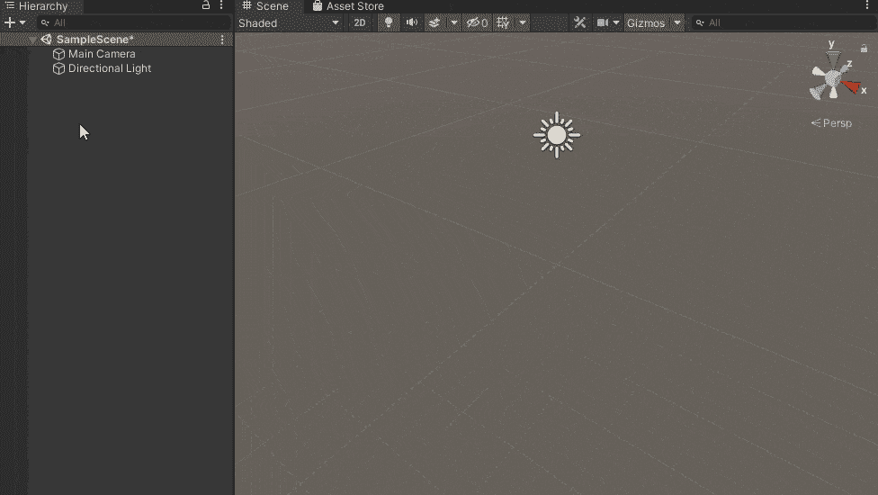

Add a plane and a sphere to the scene

## 步骤 2:如何创建一个包含所有颜色的文件夹

从创建一个包含所有颜色和材质的文件夹开始总是一个好习惯。这有助于您创建调色板(或颜色和材质的集合),并使您更容易将调色板中的资源应用到游戏对象。

只需转到项目面板。然后右键单击“资源”子面板，单击“创建”，然后选择“文件夹”。将该文件夹命名为“材料”。

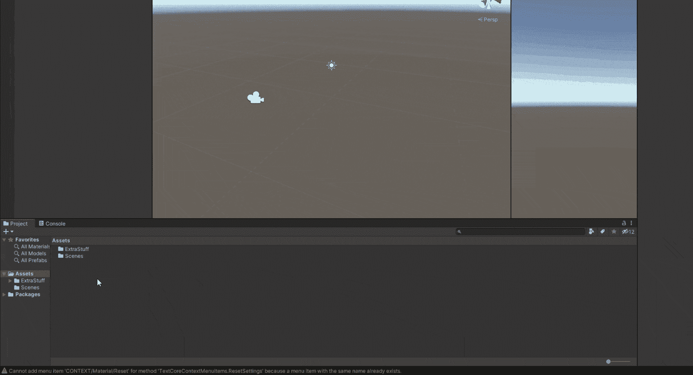

Right-click in Assets Panel > Create > Folder > Name it “Materials”

## 步骤 3:如何为平面创建材质

下一步是为平面创建颜色(或材质)。

双击上一步中创建的材料文件夹，进入该文件夹。右键单击并选择创建。然后从下拉列表中选择“材料”。

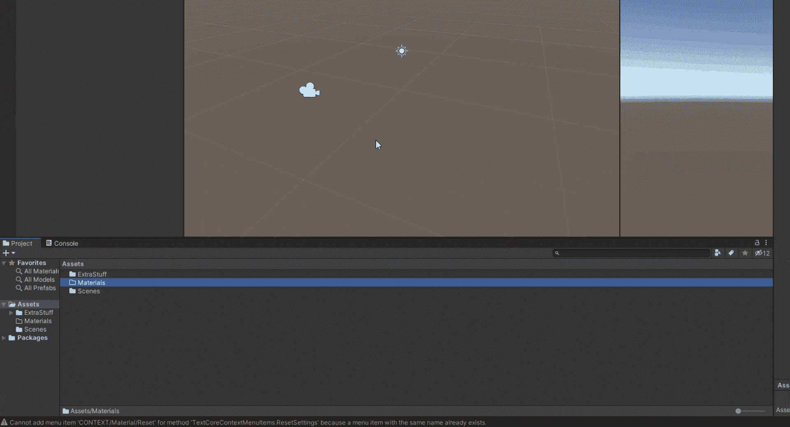

Go inside Materials Folder > Right-click > Create > Material > Name it “MyColor”(or whatever you want)

## 步骤 4:如何改变材质的反照率属性

接下来选择创建的材质，并在右边的检查面板中检查它的属性。

注意，你只需要改变平面材质的反照率属性，而不需要改变球体的材质。在本文的后面，我们将为球体创建一个材质。

在这一步，你的球体有一个自定义材质是很重要的。否则，您将无法查看或修改材料的各种属性。

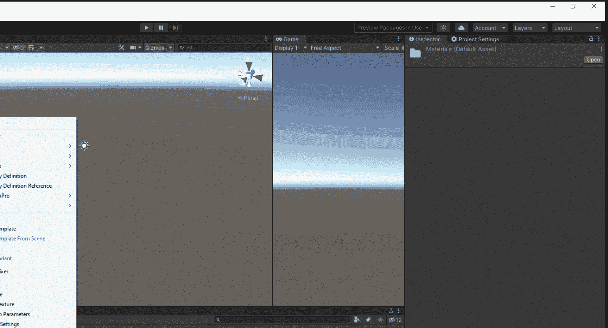

Change the “albedo” property to whatever color you want.

太好了！现在，您可以使用相同的技术创建一个颜色集合。

现在我们可以像这样将颜色应用于任何游戏对象👇。

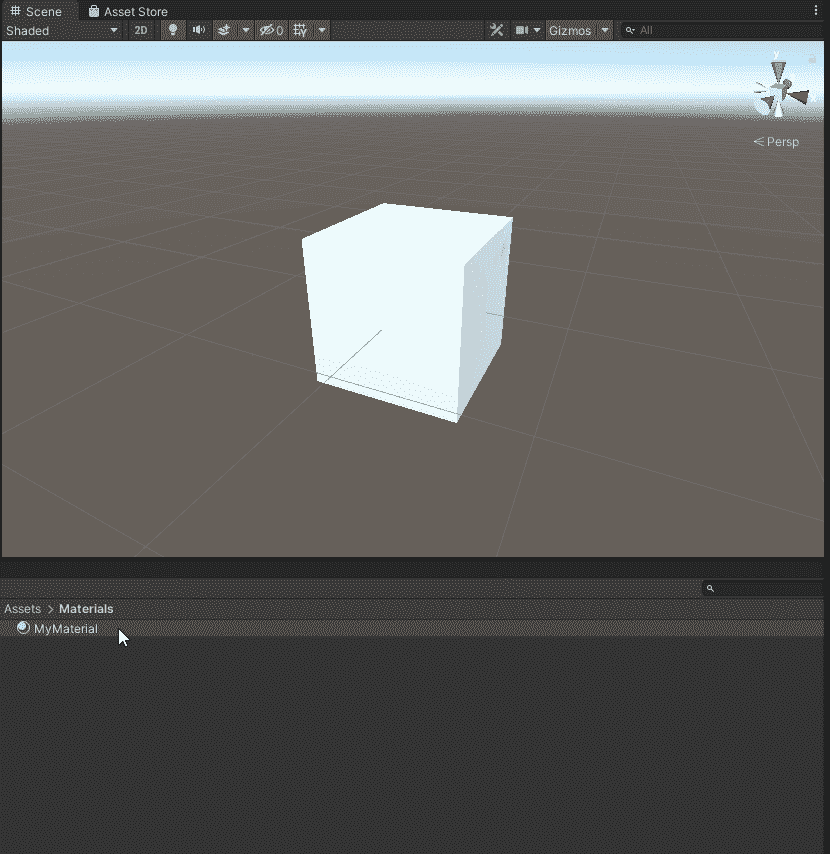

Drag and drop the material into the Game Object (in our case it will be a plane instead of a cube)

## 步骤 5:如何给球添加刚体组件

因为我们需要我们的球遵守物理定律，我们将不得不附加刚体组件到它上面。

为此，请从场景层次面板中选择球体。点击添加组件，然后确保“使用重力”框被选中。我们不希望球飘向太空😅。

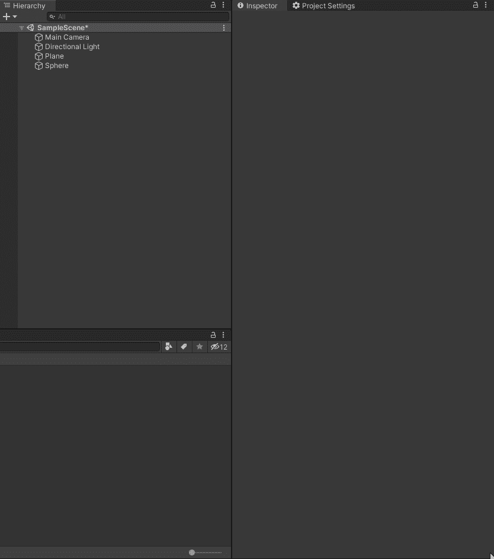

Select the Sphere > Add Component > Rigid Body > Keep “Use Gravity” box checked

## 步骤 6:如何创建一个“有弹性”的材料

转到“资产”面板。右键单击，然后单击创建。确保你选择了“物理材质”和**而不是**材质。你想给这个材料起什么名字都行。出于显而易见的原因，我将其命名为“Bouncy”。

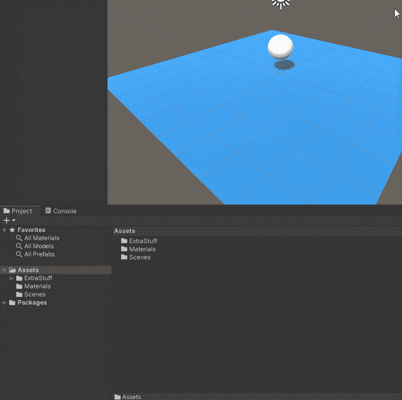

Right-click in the assets panel > Create > Physic Material > Name it “Bouncy”

## 步骤 7:如何改变弹性材料的属性

选择弹性材质。您应该能够在检查器面板的右侧查看该材质的属性。现在改变属性。

Set Friction to 0 and Bounciness to 1

## 步骤 8:如何将材质应用到球体

现在，通过简单地将有弹性的材质拖放到球体上，将该材质应用到我们场景中的球体(即球)上。

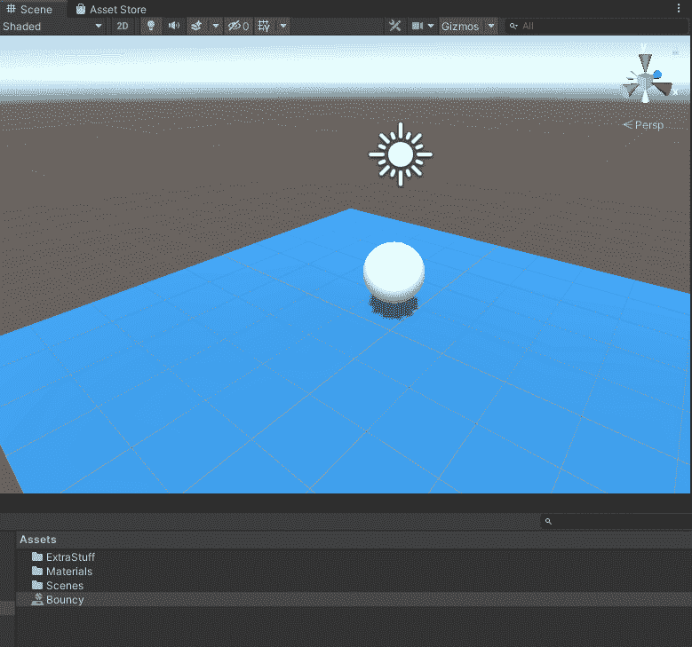

Drag and drop the Bouncy Material into the Sphere

就是这样！🎉这一步确认了球体会在地板上反弹。

## 第九步:点击播放按钮

在游戏面板的顶部，你会发现播放按钮。点击它，球就会开始反弹。

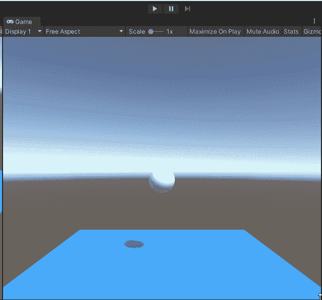

Our ball is bouncing now. Yayyy!

注意反弹是如何在一段时间后停止的。这是预期行为，我们将在下一步中解决此问题。

## 步骤 10:如何改变“弹性”材料的属性

不同的球反弹不同。你可以控制球反弹的次数。尝试用不同属性的“弹性”材料做实验。

在“材质”文件夹中选择“弹力”材质，并尝试更改属性值。如果希望球永远反弹，请将反弹组合的值设定为最大值。

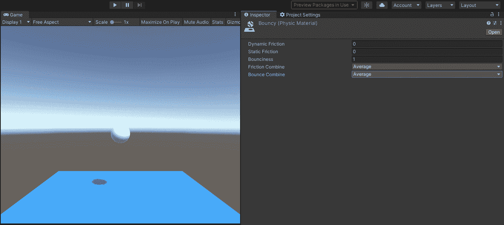

Set the value of Bounce Combine to Maximum and our ball won’t stop bouncing at all

好吧。现在让我们把那个球做得像一个真正的篮球。

## 步骤 11:如何创建一个包含所有纹理的文件夹

为了保持有序，让我们创建一个包含所有纹理的文件夹。

为此，请转到“资源”面板，创建一个名为“纹理”的新文件夹。这是我们存储所有纹理的地方。

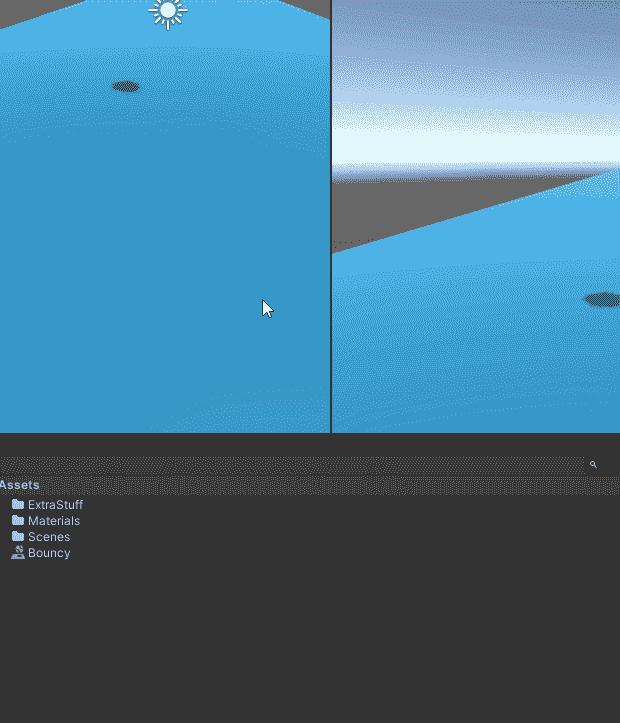

Right-click in Assets Panel > Create > Folder > Name it “Textures”

## 步骤 12:如何下载纹理

因为我们需要一个篮球的纹理，简单地在网上下载一个。纹理只是中的一个图像。png 或者。jpg 格式。现在，你可以从这里下载篮球纹理:

[Free Textures for Basketball, Beach Ball, Pool Balls, Softball, and Tennis Balls.](https://www.robinwood.com/Catalog/FreeStuff/Textures/TexturePages/BallMaps.html)[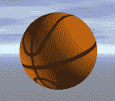](https://www.robinwood.com/Catalog/FreeStuff/Textures/TexturePages/BallMaps.html)

确保你有适当的许可来使用你下载的纹理。以上纹理免费使用。

## 步骤 13:如何将纹理放到你的 Unity 项目中

简单地拖放纹理到纹理文件夹中，如下所示👇

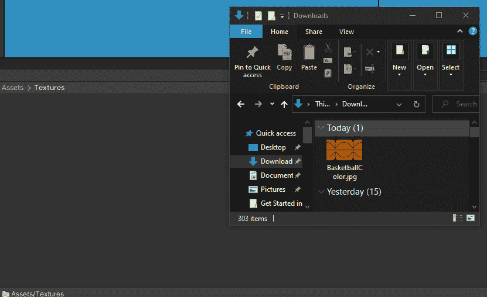

Drag and drop the downloaded texture into the “Textures” folder that you created in Step 1 above.

## 步骤 14:如何将下载的纹理应用到球体上

选择球体以在检查器面板中查看其所有属性。然后将“BasketballColor”纹理拖放到反照率属性左侧的方形框中。

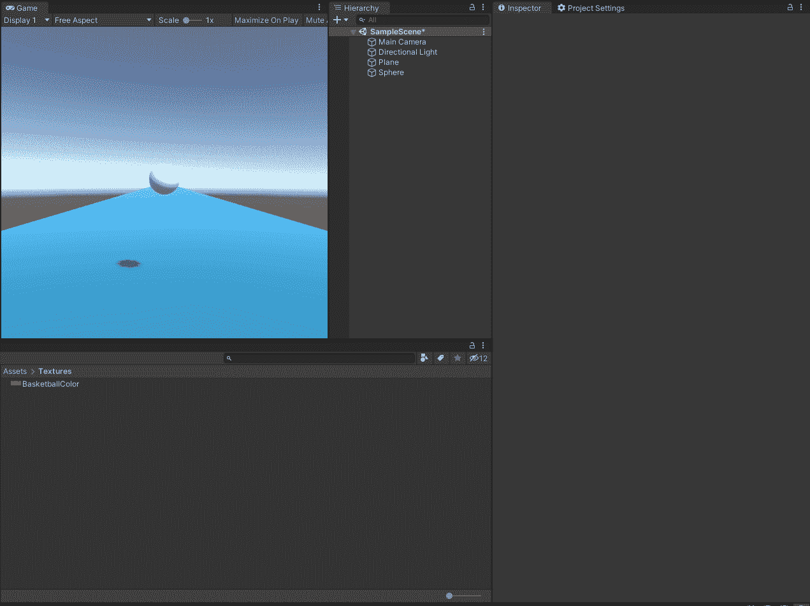

Drag and drop the downloaded texture to the box at the left of the Albedo property.

您已经成功地使用材料和纹理创建了一个篮球。现在你可以为你开发的所有游戏或 AR/VR 体验做同样的事情。

不同类型的球表现不同。尝试使用弹性和调整附加到球体的刚体组件的不同参数来创建高尔夫球、足球或网球。

尽情享受吧！👏🏻

[Rajat Kumar Gupta is teaching how to create AR/VR experiencesHey everyone👋 I just created a page here. You can now buy me a coffee to support me!I write articles and make videos related to AR/VR and 3D Technologies on Medium...Buy Me a Coffee](https://buymeacoffee.com/knightcube)

### 你可以在社交媒体上联系我:

*   Twitter id: [@knightcube](https://twitter.com/knightcube)
*   [订阅我的 YouTube 频道，了解更多关于 AR/VR 的信息](https://www.youtube.com/channel/UCvB2-KQUEwXSrzX4-lhEfPg?sub_confirmation=1)
*   在这里阅读更多关于我的媒体简介的文章