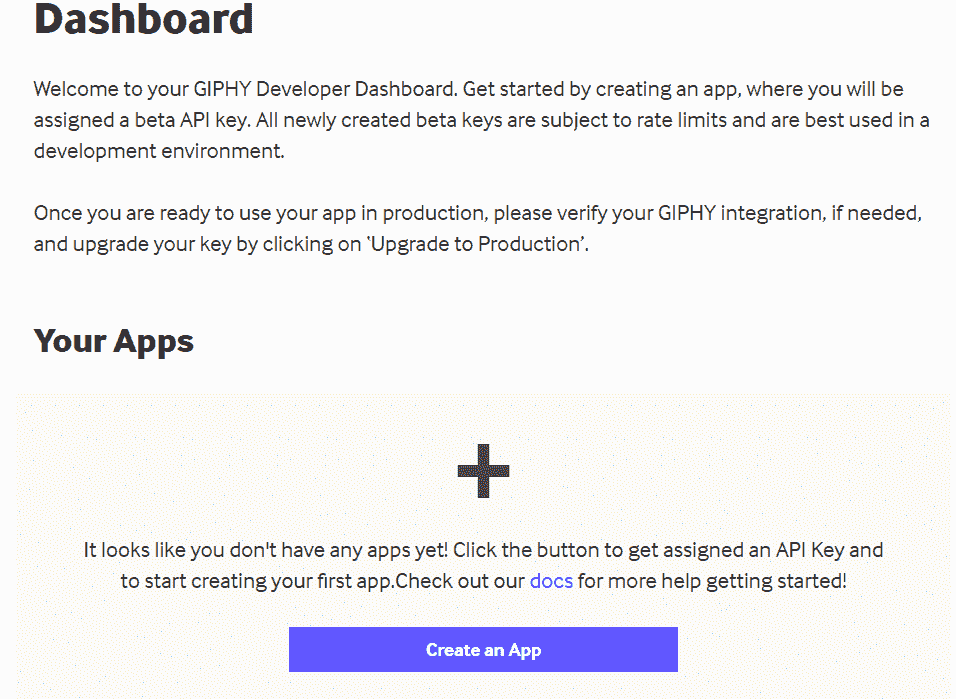
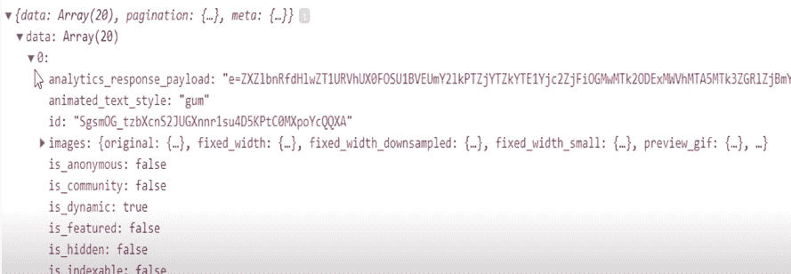
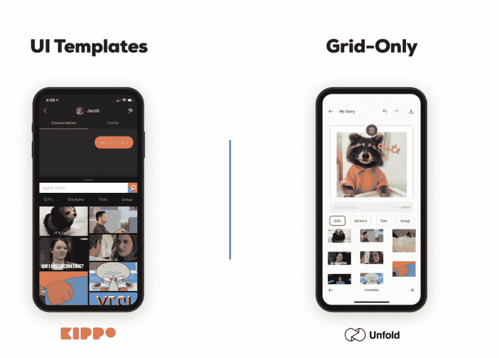

# Giphy API 教程——如何用 ReactJS 生成动画文本 gif

> 原文：<https://www.freecodecamp.org/news/giphy-api-tutorial/>

在本教程中，您将创建一个使用 Giphy 的 API 和 ReactJS 生成动态动画文本的应用程序。

之后，我将介绍 Giphy 提供的一些其他 API 特性，您可以使用它们来创建其他有趣的项目。

你可以在这里找到教程的代码。

## 视频教程

要查看成品的预览，您可以观看此视频的开头。如果你喜欢跟随视频教程而不是阅读(或者除了阅读之外)，你也可以跟随视频的其余部分。

[https://www.youtube.com/embed/H8JpzxRoS18?feature=oembed](https://www.youtube.com/embed/H8JpzxRoS18?feature=oembed)

## 入门指南

首先，您需要一个 ReactJS 的基本开发环境。我将使用 create-react-app 作为起始项目模板。

接下来你需要访问 [Giphy 的开发者页面](https://developers.giphy.com)并创建一个账户，这样你就可以获得你的 API 密匙。创建帐户后，您会看到一个如下所示的控制面板:



你需要点击“创建应用”并为你的应用选择 SDK 选项。然后，您的仪表板将为您提供一个 API 密钥，您将使用它来调用 Giphy API。

### 如何设置应用程序文件和文件夹

本教程的结构将是 ReactJS 项目的标准。在`src`目录中，创建一个`components`目录，并创建两个文件`Error.js`和`TextList.js`

您还需要在项目的根目录下创建一个`.env`文件，用于存储您的 API 密匙。无论您如何命名您的变量，您都需要在它前面附加 REACT_APP，就像这样:

`REACT_APP_GIPHY_KEY=apikeyhere`

### 安装 Giphy JS 提取

您需要做的最后一件事是安装 Giphy 的 API helper 库，您可以使用以下命令来完成:

`npm install @giphy/js-fetch-api`

## Giphy API 调用

制作这个应用程序的第一个任务是创建一个输入表单来接受您想要从 Giphy API 生成的文本。然后，您将使用该文本输入，并将其作为 API 请求发送。

在显示这个响应数据之前，让我们通过简单地发出 API 请求然后记录响应来测试它。在您的`App.js`文件中编写以下代码:

```
import { GiphyFetch } from '@giphy/js-fetch-api'
import {useState} from 'react'
import TextList from './components/TextList'
import Error from './components/Error'
import './App.css';

const giphy = new GiphyFetch(process.env.REACT_APP_GIPHY_KEY)

function App() {
  const [text, setText] = useState('')
  const [results, setResults] = useState([])
  const [err, setErr] = useState(false)

  const handleInput = (e) => {
    setText(e.target.value)
  }

  const handleSubmit = (e) => {
    if(text.length === 0) {

      //set error state to true
      setErr(true)
      return
    }

    console.log(text)

    const apiCall = async () => {
      const res = await giphy.animate(text, {limit: 20})
      console.log(res.data)
      setResults(res.data)
    }

    apiCall()
    setText('')
    setErr(false)

  }

  return (
    <div className="App">
      <h1>Animated Text Generator</h1>
      <h3>Type text into the form and hit submit</h3>
      <input className='input-field' value={text} onChange={handleInput} />
      <button className='submit-btn' onClick={handleSubmit}>Submit</button>
    </div>
  );
}
export default App;
```

让我们看看这段代码中发生了什么:

`const giphy = new GiphyFetch(process.env.REACT_APP_GIPHY_KEY)`是您使用 Giphy 助手库来创建您将用于与 Giphy API 交互的对象的地方。

`process.env.REACT_APP_GIPHY_KEY`是您的 API 密匙如何作为参数从`.env`文件中传递的。您还可以将 API 密钥作为字符串传递，但是您不希望在生产环境中这样做，因为有人可能会窃取并使用您的密钥。

在主应用程序组件中，您使用钩子创建了三种状态。第一个是`text`，它将存储用户输入。这是将作为参数传递给 API 以生成文本的内容。

如果用户试图提交一个空字符串，那么`err`将被用来有条件地呈现一个错误。

而`results`是一个空数组，将用于存储 API 响应的结果。

如果您运行代码并检查您的开发人员控制台，您应该看到 Giphy API 返回了一个包含 20 个对象的数组。



## 如何用 React 显示数据

既然数据已经正确地存储在 state 中，那么您需要做的就是用 JSX 显示这些数据。为了处理这个问题，我们将完成之前创建的两个组件。

首先，我们将创建一个简单的错误组件，它可以显示自定义消息。将以下代码放入 components 文件夹内的`Error.js`:

```
const Error = (props) => {
    if(!props.isError) {
        return null
    }

    return (
        <p className='error'>{props.text}</p>
    )
}

export default Error
```

`Error`组件非常简单。它将`err`状态和一个文本字符串作为道具，如果值为 true，它将呈现文本。如果`err`为假，则返回 null。

接下来是 TextList 组件，它将把`results`状态作为道具，然后在您的应用程序中显示数据:

```
const TextList = (props) => {
  const items = props.gifs.map((itemData) => {
    return <Item url={itemData.url} />;
  });
  return <div className="text-container">{items}</div>;
};
const Item = (props) => {
  return (
    <div className="gif-item">
      
    </div>
  );
};
export default TextList;
```

这个组件稍微复杂一点，所以现在的情况是这样的:

`Item`组件接受从 API 返回的每个值中的 URL 值。它使用这个 URL 作为图像元素的来源。

来自 App 组件的`results`状态数组作为`gifs`传递给 TextList 组件。该数组被映射以生成所有结果的所有`Item`组件，并被分配给`items`变量，然后在容器 div 中返回。稍后我们将设计这个容器的样式来创建一个网格布局。

### 如何将组件导入主应用程序

现在你只需要在你的 JSX 中使用那些成品组件。您的`App.js`文件的最终代码应该如下所示:

```
import TextList from './components/TextList'
import Error from './components/Error'
import { GiphyFetch } from '@giphy/js-fetch-api'
import {useState} from 'react'
import './App.css';

const giphy = new GiphyFetch(process.env.REACT_APP_GIPHY_KEY)

function App() {
  const [text, setText] = useState('')
  const [results, setResults] = useState([])
  const [err, setErr] = useState(false)

  const handleInput = (e) => {
    setText(e.target.value)
  }

  const handleSubmit = (e) => {
    if(text.length === 0) {

      //set error state to true
      setErr(true)
      return
    }

    console.log(text)

    const apiCall = async () => {
      const res = await giphy.animate(text, {limit: 20})

      setResults(res.data)
    }

    apiCall()
    //change error state back to false
    setText('')
    setErr(false)

  }

  return (
    <div className="App">
      <h1>Animated Text Generator</h1>
      <h3>Type text into the form and hit submit</h3>
      <input className='input-field' value={text} onChange={handleInput} />
      <button className='submit-btn' onClick={handleSubmit}>Submit</button>
      <Error isError={err} text='need length longer than 0 for input'/>
      {results && <TextList gifs={results}  />}
    </div>
  );
}
export default App;
```

这里唯一的变化是 return 语句中添加的底部两行:

向`Error`组件传递`err`状态和一个`text`道具，只有在出现错误时才会呈现。

在这个应用程序中，如果输入为空，只有一个错误条件，但是您也可以添加带有自定义错误消息的额外检查。

然后我们使用带有`&&`逻辑操作符的条件渲染。这使得`TextList`组件仅在结果数组不为空时才呈现，这意味着 API 响应成功返回了 gif。

如果你现在运行你的代码，你应该会看到一个丑陋但功能强大的应用程序。如果您使用输入字段并单击提交按钮，gif 应该会返回并显示在您的应用程序中。

## 如何用 CSS 添加样式

最后要做的是让应用程序看起来更漂亮一点。如果您想调整事物的外观，请随意定制这些样式。将这段代码放入您的`App.css`文件中:

```
.App {
  text-align: center;
}

.error {
  color: #b50000;
  font-size: 20px;
  font-weight: 500;
}

.input-field {
  font-size: 20px;
  vertical-align: middle;
  transition: .5s;
  border-width: 2px;
  margin: 5px;
}

.input-field:focus {
  box-shadow: 0 14px 28px rgba(0,0,0,0.25), 0 10px 10px rgba(0,0,0,0.22);
  outline: none;
}

.input-field:hover {
  box-shadow: 0 14px 28px rgba(0,0,0,0.25), 0 10px 10px rgba(0,0,0,0.22);

}

.submit-btn {
  background-color: rgb(19, 209, 235);
  color: #fff;
  padding: 6px 30px;
  vertical-align: middle;
  outline: none;
  border: none;
  font-size: 16px;
  transition: .3s;
  cursor: pointer;
}

.submit-btn:hover {
  background-color: rgb(10, 130, 146);
}

.text-container {
  display: flex;
  flex-wrap: wrap;
  justify-content: center;
}

.gif-item {
  flex-basis: 19%;
}

img {
  max-width: 100%;
}

@media screen and (max-width: 992px) {
  .gif-item {
    flex-basis: 31%;
  }
}

@media screen and (max-width: 600px) {
  .gif-item {
    flex-basis: 48%;
  }
} 
```

CSS 没有什么疯狂的。只是一些提交按钮的样式和一些输入框的阴影。

也有一些媒体询问一些响应式设计，根据屏幕大小改变列数。

## 其他 Giphy API 特性

动画文本 API 只是 Giphy API 中的一个特性。我将介绍几个其他的特性，这些特性可以作为项目的一部分或单独项目使用。

### 动画表情符号

表情端点在使用方面非常简单。它返回一堆动画表情符号，就像上面使用的动画文本 API 一样，只是你不需要向它传递任何参数。API 调用示例:

`const data = await gf.emoji()`

如果您正在构建一个聊天应用程序，并且希望让用户能够轻松地在他们的消息中使用表情符号，那么这个端点可能会很有用。

### 预构建的 UI 组件

如果你不想像我们在本教程中那样摆弄大量的自定义代码，Giphy 实际上为 ReactJS 和常规 JavaScript 都提供了组件。

只需几行代码，您就可以创建一个非常类似于我们在本教程中创建的网格:

```
import { Grid } from '@giphy/react-components'
import { GiphyFetch } from '@giphy/js-fetch-api'

// use @giphy/js-fetch-api to fetch gifs
// apply for a new Web SDK key. Use a separate key for every platform (Android, iOS, Web)
const gf = new GiphyFetch('your Web SDK key')

// fetch 10 gifs at a time as the user scrolls (offset is handled by the grid)
const fetchGifs = (offset: number) => gf.trending({ offset, limit: 10 })

// React Component
ReactDOM.render(<Grid width={800} columns={3} gutter={6} fetchGifs={fetchGifs} />, target)
```

您可以获得一些额外的额外功能，比如当用户滚动到网格底部时自动动态更新以获取更多内容。

你可以选择处理几乎所有事情的模板，或者只是一个给你更多控制的网格组件。



这里有一个由 Giphy 提供的[互动演示](https://codesandbox.io/s/giphyreact-components-hbmcf?from-embed)。

### 趋势 API

该端点根据用户参与度和 Giphy 上当前流行的内容返回一个不断更新的内容列表。

### 搜索 API

这个端点类似于动画文本端点，您只需要将一个搜索查询作为参数传递，您将得到一个匹配的 gif 数组。

还有更多可用的 API 端点。你可以在 [Giphy 的 API 文档](https://developers.giphy.com/docs/api/endpoint)中看到其余部分。

## 结论

本教程到此为止！我希望你觉得这很有趣，并使用 Giphy API 制作了一些很酷的项目。

如果你对其他一些可以用来制作项目组合的很酷的 API 感兴趣，你也可以看看这个视频，里面有超过 8 个我认为很酷的 API。

[https://www.youtube.com/embed/3ZRBDIA8C6E?feature=oembed](https://www.youtube.com/embed/3ZRBDIA8C6E?feature=oembed)