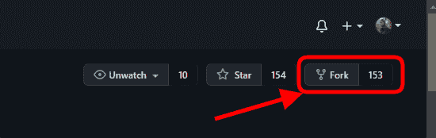

# 如何为开源项目做贡献——初学者指南

> 原文：<https://www.freecodecamp.org/news/how-to-contribute-to-open-source-projects-beginners-guide/>

随着技术的不断进步，越来越多的产品和服务正在转变为软件就绪型服务。其中许多都是开源的。

大多数开发者和公司依靠开源工具和软件来使他们的产品工作。我想你会同意我的观点，最近对开源的贡献确实增加了——不仅仅是个人开发者，还有公司。

我对开源社区的第一次贡献是在 2020 年的一年一度的 Hacktoberfest 活动中。作为一个初学者，我参加了初学者友好项目，我将在以后分享，以帮助你了。

现在，如果你正在阅读这篇文章，那是因为你想成为伟大的开源社区的一员——但是也许你不知道从哪里开始？嗯，你来对地方了。

在本指南中，我们将涵盖:

*   到底什么是开源？
*   你如何开始做贡献？
*   你应该期待什么？

那么，在这篇文章中，我们将涵盖所有这一切，甚至更多。

我们开始吧！

## 什么是开源？

简而言之，我们可以将开放源代码项目描述为在许可许可下可供公众查看、使用、修改和分发的源代码。

作为解释这一点的例子，让我们使用一个教室场景。教师可以在 Goggle Docs 这样的平台上共享文档。在这个平台上，学生可以编辑文档，甚至制作自己的副本。但是，无论他们何时进行编辑，他们都必须得到老师的批准，才能再次对文件进行反思。

这就是开源代码的工作方式:一旦它被公开，你需要添加一个特性或进行更改，所有者必须批准添加的更改并发布给其他人。

大多数成功的开源项目都是各种技能水平的人共同努力的结果——不仅仅是编码技能，还有其他技能，比如写作、语言等等。

每当有人修复了一个打字错误，添加了一个关于可能的编译器警告的警告，修复了一个 bug，或者甚至向一个项目添加了详细的文档，就取得了进展。如果我们把所有这些来自不同技能的不同人的小贡献放在一起，伟大的事情就会发生。

正如文森特·梵高所说:

> 伟大的事情是由一系列的小事集合起来完成的。

## 为什么你应该为开源做贡献

为开源项目做贡献是一种有益的学习、教学、分享和积累经验的方式。

您应该为开源项目做贡献的原因有很多，比如:

*   来改进你日常依赖的软件。
*   如果你需要的话，去找一个导师。
*   学习新技能或提高现有技能。
*   分享你的技能。
*   更深入地了解您正在使用的软件。
*   建立你的声誉并帮助你发展事业。
*   另外，这很有趣，能给你带来个人满足感，嘿，你永远不知道谁在看着你，也许是你的下一个雇主或合作伙伴🙂。

## 如何为开源做贡献的分步指南

当我们说为开源做贡献时，并不一定意味着你需要知道如何编码。即使你不是程序员，你也可以通过不同的方式做出贡献——但是掌握一些编码技能会对你(和项目)有很大帮助。

一些共同的贡献可以通过:

*   向项目文档中添加描述，详细阐述某一点，通常称为自述文件(*查看本指南，了解如何编写一个* [的自述文件](https://www.freecodecamp.org/news/how-to-write-a-good-readme-file/))。
*   对一个特定的项目以及如何使用它给予指导。
*   添加示例输出以展示代码如何工作。
*   为项目编写深入的教程。
*   为一个项目添加翻译——一个好的起点可能是使用 [freeCodeCamp 的翻译程序](https://contribute.freecodecamp.org/#/index?id=translations)。
*   回答关于项目的问题(如堆栈溢出或 Reddit)
*   你可以主动提出指导另一位贡献者。
*   您可以修复错别字并正确排列项目的工作文件夹。

所有这些方式，以及更多的方式，都可以算作贡献。现在，在你开始为一个 OS 项目做贡献之前，你到底应该知道什么？

## 在参与操作系统项目之前需要知道什么

正如我们期望每个开源产品都是不同的一样，社区也是如此。每个社区都有自己的规则，会有不同的指导方针和角色，如果你幸运的话，有些社区会在你做出贡献后给予奖励。

尽管如此，还是有一些适用于所有操作系统项目的共同特征，这就是我们将要讨论的:

### 典型操作系统项目中的角色

在一个典型的 OS 项目中，我们会有以下人员:

*   **作者**——这是创建项目的人。他们有权向其他成员分配新的角色，以帮助维护项目。
*   **所有者** -所有者拥有项目的管理所有权(可以是与作者相同的人)
*   **维护人员**——这些人负责推动项目的愿景和目标。他们通常是那些对项目的方向负责并致力于改进项目的人。
*   贡献者(Contributors)——贡献者以这样或那样的方式为项目做出贡献。它们遵循相同的代码审查过程，服从相同的代码风格要求，等等。
*   **社区成员/用户**——这些有价值的社区成员可以提供关于特性、错误报告等的反馈。

## 所有 OS 项目中都必须有元素

当谈到一个操作系统项目时，根据结构、产品平台的类型、使用的编程语言、它是受资助的还是完全独立的等等，它们被分成几种类型。

所有这些信息都应在指南和信息的帮助下进行概述:

*   **许可证**
    如果一个项目没有开源许可证，那么它就不是开源的。许可证有助于保护贡献者和用户。没有这种保护，企业和精明的开发人员通常不会碰一个项目。如果你想知道如何获得一个并为你的项目选择一个正确的，查看官方的操作系统许可网站:[https://choosealicense.com/](https://choosealicense.com/)。
*   自述文件
    这是一本解释如何开始一个项目的手册。它列出了参与项目的要求、参与项目的步骤等...一份好的自述应该包含潜在贡献者想要了解的关于项目的一切。如果你已经有了一个项目，并且正在试图写一个好的自述文件，这个指南会派上用场: [*如何写一个好的自述文件*](https://www.freecodecamp.org/news/how-to-write-a-good-readme-file/) 。
*   贡献指导方针
    这些指导方针帮助那些为项目做出贡献的人确切地知道对他们的期望。尽管这不是强制性的，但添加一个总是好的做法。如果你需要帮助写一个或者理解它需要什么，OS 官方网站有一个模板指南来帮助你:[贡献者指南模板](https://opensource.com/life/16/3/contributor-guidelines-template-and-tips)
*   **行为准则**
    行为准则是一份确立你对贡献者和参与者行为的期望的文件。采纳并执行行为准则有助于为您的社区创造一个积极友好的环境。操作系统指南详细解释了它需要什么:[https://opensource.guide/code-of-conduct/](https://opensource.guide/code-of-conduct/)。

作为运行开源项目的个人或组织，这一切都是为了创建一个人们可以共同成长的社区。这意味着你必须创造一个友好的环境，让人们可以分享想法，应对挑战，甚至有时可以随意聊天。

这里有一些常用选项，您可以使用以下工具:

*   问题跟踪者
    这是你在 GitHub 上跟踪工作的地方，以及开发是如何进行的。如果有任何问题，贡献者可以创建一个问题，并将其链接到一个拉请求，其他贡献者可以选择尝试并修复它。修好后就关门了。
*   **Pull Requests**
    它们让你告诉别人你已经推送到 GitHub 上的一个分支的变更。打开一个拉请求后，您可以与协作者讨论和检查潜在的更改，并在合并到基本分支之前添加后续提交。
*   聊天频道
    虽然这不是强制性的，但你可以把成为操作系统社区频道的一员当作一个好习惯。它是专门为人们分享他们的想法和进行对话而设计的。为此，一些最常见的媒体包括 Slack 和 Discord。

所以，现在你对什么是 OS 项目有了一个概念，当你为一个项目做贡献的时候会有什么期望。进入最重要的部分，你如何知道该为哪个项目做贡献？

## 如何找到一个开源项目来做贡献

贡献在各个层面都起作用，没有必要过多考虑你将如何去做。相反，想想你已经在使用的一些项目，以及如何对它们做出改变或改进。

研究表明，大约 30%的临时贡献是文档、打字错误修复，甚至是翻译。

在开始的时候，我承诺分享一些在我第一次捐款时帮助我的项目。幸运的是，如果你是第一次投稿——每个人在某种程度上都是这样——这里有一些链接可以帮助你进入开源世界:

*   [仅限第一次使用](https://www.firsttimersonly.com/)
*   [首次投稿](https://github.com/firstcontributions/first-contributions)
*   [贡献者忍者](https://contributor.ninja/)
*   [开源星期五](https://opensourcefriday.com/)
*   [24 个拉取请求](https://24pullrequests.com/)
*   [python 项目脚本](https://github.com/larymak/Python-project-Scripts)
*   赫巴蒂卡
*   [代码分流](https://www.codetriage.com/)

***为你快速破解**在开源软件的世界里，问题会很快被报告和修复。因此，启动的一个好方法是接受一个问题，并确保立即着手解决它。*

## 如何选择一个开源项目

在你找到你想参与的项目后，是时候做一些调查了。确保它符合以下标准，这样你就知道它会是一个很好的项目:

1.  检查它是否有许可文件。
2.  检查最后一次提交的时间。这将有助于您了解维护者是否活跃，并且还会给您一个对您的贡献做出响应所需时间的估计。
3.  寻找贡献者的数量。
4.  检查人们提交的频率。

如果你看到很多最近的活动，这是一个好的迹象——这意味着社区很活跃，维护者也很活跃。

现在，如果第一次“审查”通过，请继续检查以下几点:

1.  它有什么未解决的问题吗？如果是的话，这可能是一个好的迹象，你将有一个开始的地方。
2.  维护人员需要多长时间响应？这将取决于问题关闭和 PRs 合并的频率。
3.  对一个问题有积极的讨论吗？
4.  问题是否定期关闭？
5.  有多少个打开的拉取请求？
6.  最近的拉取请求是在什么时候合并的？
7.  维护者感谢人们的贡献吗？

如果这个最后的审查过程通过了，那么你就可以开始你的贡献了。

## 在你开始开源之前要考虑什么

我知道你很兴奋并准备好震撼操作系统世界，但是你知道在一个项目中要寻找什么吗？

如上所述，你可以通过不同的方式做出贡献。但是在你第一次投稿之前，最好注意一些关于你将要选择的项目的事情，比如:

*   **项目使用什么编程语言？**
    任何应用背后最根本的技术就是它所使用的编程语言。GitHub 上一些最流行的语言是 JavaScript、Python、Java、Ruby 和 PHP——但还有更多。有许多项目可能适合你的技能和兴趣。所以找一个你觉得舒服的工作吧。
*   在你选择了你想要使用的语言之后，你还需要选择你喜欢的项目类型。随便看看，挑一个你感兴趣的项目或者话题。

一旦你找到了一个项目，你就会想要实际上做出贡献。您可以通过提交拉取请求来实现。让我们现在谈论那个。

## 什么是拉取请求？

还记得关于护目镜医生的例子吗？嗯，拉请求是相似的，只是这次是关于代码的。

我们可以将“拉”请求描述为贡献者提交变更——无论是代码、文档还是其他地方——并要求维护者检查它，确保它是好的，然后将其合并到基础项目中。

那么，如何提交一份呢？

## 如何提交拉式请求

如果你处于这个阶段，说明你已经找到了一个项目，你已经准备好做出自己的贡献了。那么我们来谈谈如何实际提交一个拉取请求。

### 提交采购申请的步骤

*   **叉库**
    在右上角，你会看到“叉”这个词。你所需要做的就是点击它，你就已经在你的帐户中创建了一个相同项目的副本。



在此操作之后，项目的 URL 将更改为:

```
https://github.com/<YourUserName>/projectname 
```

*   **将项目克隆到您的本地机器上**
    为了执行这一步，您必须在本地机器上安装 Git。如果你不知道，参考官方的 [Git 文档](https://git-scm.com/)来了解如何开始。

复制分叉的项目 URL，并转到您将打开 git bash 的本地机器，并继续执行下面的命令:

```
git clone https://github.com/<YourUserName>/<projectname> 
```

这将在您的本地计算机上创建项目的副本。现在您已经克隆了回购，我们需要做两件事:

首先是做出必要的改变/贡献，并提交这些改变。完成更改并添加新文件后，在将这些更改推送到远程之前，应该将它们添加到一个单独的分支中。

但是，首先让我们创建一个分支。在 git bash 中，将路径改为 pint 到您的存储库目录。为此，请使用以下命令:

```
cd project folder name 
```

现在，为了创建一个分支，我们将使用命令:`git checkout`

```
git checkout -b your-new-branch-name 
```

这里有一个例子:

```
git checkout -b lary-mak 
```

是时候将新的变更添加到我们创建的分支中了。为了查看您所做的所有更改，我们将使用`git status`命令:

```
git status 
```

该命令将列出您所做的所有更改。要添加它们，我们将使用`git add *`，这将把所有文件添加到我们的分支。

```
git add * 
```

让我们添加一条提交消息，简要说明我们添加的内容:

```
git commit -m "<message here>" 
```

*   将更改推送到远程
    现在一切都已设置好，是时候让我们的维护人员知道我们添加了什么了。这可以通过使用以下命令推动更改来实现:

```
git push origin <add-your-branch-name> 
```

用您之前创建的分支的名称替换`<add-your-branch-name>`，在我的例子中是`git push origin larykmak`。

*   **提交变更**
    如果你去你在 GitHub 上的仓库并刷新页面，你会看到一个比较和拉请求按钮。点击那个按钮。

很快维护者就会将你所有的变更合并到这个项目的主分支中(除非他们需要你的变更)。一旦更改被合并，您将收到一封通知电子邮件。

创建拉取请求有一些优点，例如:

*   它允许您参与另一个回购，而不需要管理权限来更改该回购。
*   它允许其他人查看您的更改，并提出更正、添加、编辑等建议。
*   它使回购管理员能够控制添加到项目回购中的内容。

祝贺你🥳🎉，
您刚刚完成了标准的 fork->clone->edit->pull request 工作流，该工作流总结了您的第一个贡献。您将经常使用它作为贡献者！那么，接下来呢？

## 第一次拉取请求之后会发生什么？

这并不标志着结束！现在，只需要找到更多的项目，并继续做出贡献。此外，请务必关注由 *Digital Ocean* 举办的每年一个月的开源贡献活动，有机会赢得一些令人惊叹的礼物。

在我们结束之前，还有一件事要谈一谈。这就是为什么为 OS 做贡献是值得的。

## 为开源做贡献的好处

*   为开源项目做出贡献的人比仅仅使用技术的人更深入地了解技术。
*   您可以根据在现实世界中可行和不可行的经验，集中精力添加和利用有利于企业的功能。
*   它建立你的士气和声誉。为开源项目做出贡献的人可以获得其他社区成员的见解和经验。
*   为开源做贡献提供了一个清晰的项目前景
*   如果你在 GitHub 上，你在那个平台上做的很大一部分事情是公开的。利用这一点，在贡献和与其他贡献者交流时，总是尽最大努力。

## 作为一名开发人员，你为什么应该为开源做出贡献

*   这将有助于提高你的编码技能，并改进你的代码。
*   这有助于社区和你的同龄人了解你。这种认可能给你的职业生涯带来很多机会。
*   它有助于你了解更多关于项目管理的知识，也能激励你开始自己的项目。

## 总结一下！

正如我提到的，开源对每个人都开放。有很多机会你可以利用，学习新的东西。你所需要的是决定开始，并开始行动。

**开源正等着你**

如果你已经读到这里，我真的很感激。请分享您的宝贵意见，感谢您的真诚反馈！

在[Twitter](https://twitter.com/larymak1)|[YouTube](https://www.youtube.com/channel/UCrT1ARRZfLOuf6nc_97eXEg)|[LinkedIn](https://www.linkedin.com/in/hillary-nyakundi-3a64b11ab/)|[GitHub](https://github.com/larymak)与我联系

享受编码❤