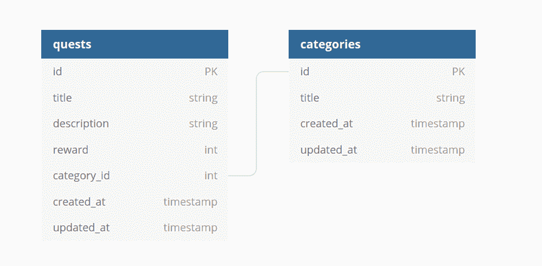
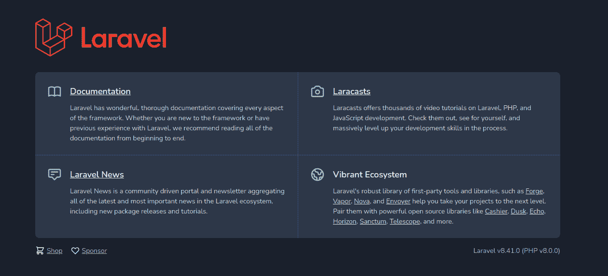
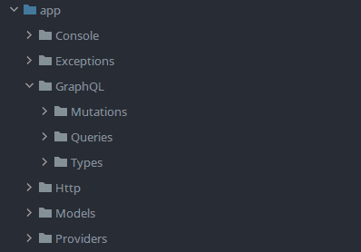
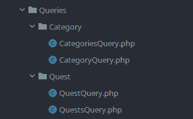
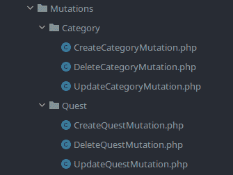
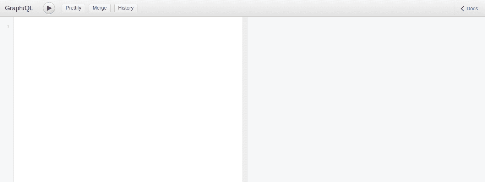
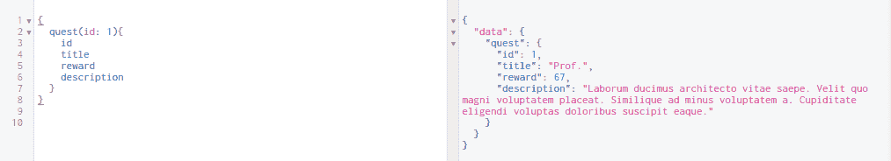
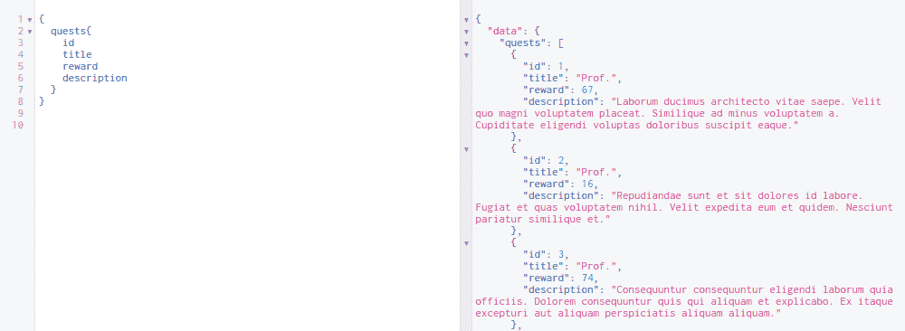
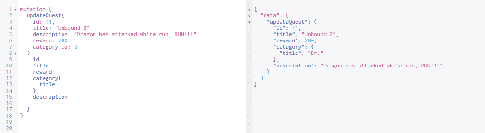
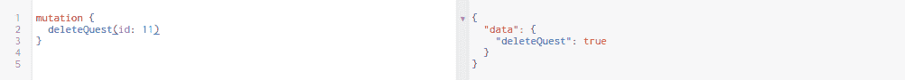

# 如何使用 Laravel 构建 GraphQL API

> 原文：<https://www.freecodecamp.org/news/build-a-graphql-api-using-laravel/>

在本文中，我将带您了解如何使用 PHP 和 Laravel 建立自己的 GraphQL API。

两年前，我开始专业地做后端开发人员。我对那些我还不知道的技术感到非常害怕。像 Docker、Kubernetes 和 GraphQL 这样的词似乎很可怕。

但是我鼓起勇气，开始一个一个地学习它们。

这实际上比我想象的要容易，所以我想通过一起创建一个简单的演示项目来与您分享我对 GraphQL 的了解。

你可以在 GitHub [这里](https://github.com/TamerlanG/GraphQL-using-Laravel)找到最终的项目。

## 先决条件

在我们开始之前，请确保在您的系统上安装了这些软件:

*   PHP 7+版本
*   作曲家 2.0
*   Docker 20.10.6(任何其他版本都可以)
*   Docker-Compose 1.29.1(其他任何版本都可以)

我还假设你有:

*   Laravel 的基础知识(口才、迁移、MVC、路线等等)
*   PHP 知识(语法、OOP 等)
*   GraphQL 的基础知识(理论上)

## 我们将要建造的

我喜欢像《上古卷轴》系列或者《最终幻想》这样的 RPG 游戏，所以我们的 app 当然会是关于游戏的。这个项目将只包括两个模型，分别叫做任务和 T2 种类。



Database Schema

在这篇文章的最后，我们将为每个模型创建一个 CRUD GraphQL API。

## 如何初始化项目

使用以下命令创建一个 Laravel 项目:

```
composer create-project laravel/laravel quest_journal 
```

这将在名为`quest_journal`的新目录中创建一个新项目。

接下来，让我们像这样设置航行:

```
# Move into the project
cd quest_journal

# Install and configure laravel sail
php artisan sail:install 
```

它会问你要安装哪些服务。只需按`enter`就可以只安装 MySQL。

如果一切顺利，您现在应该会在项目目录中看到一个`docker-compose.yml`文件。

然后让我们使用 sail 运行容器:

```
# Run the containers
./vendor/bin/sail up -d

# Check if the containers are running
docker ps 
```

此时我建议你将`sail`别名为`./vendor/bin/sail`。您可以将这段代码添加到您的`bashrc`或`zshrc`中:

```
# in ~./zshrc or ~./bashrc

alias sail = 'bash vendor/bin/sail' 
```

继续，如果您转到 [localhost](http://localhost/) ，您应该会看到类似这样的内容:



Default Laravel Home Page

但是在我们继续之前，我们需要先安装一些软件包:

```
# IDE helper for laravel, always useful to have.
sail composer require --dev barryvdh/laravel-ide-helper

# GraphQL library which we are going to use
sail composer require rebing/graphql-laravel 
```

接下来我们必须像这样发布 GraphQL 库:

```
sail artisan vendor:publish --provider="Rebing\\GraphQL\\GraphQLServiceProvider" 
```

这将创建一个我们将在`config/graphql.php`中使用的 GraphQL 配置文件。

## 如何创建迁移和模型

这不是一个 Laravel 教程，所以我们将快速创建带有适当迁移的模型。

先说品类模型:

```
# Create model with migrations
sail artisan make:model -m Category 
```

这将创建带有迁移文件的类别模型。

我们的类别将由四个字段组成:

*   身份证明
*   标题
*   创建日期
*   更新数据

我们的类别迁移文件应该如下所示:

```
<?php

// database/migrations/yyyy_mm_dd_hhMMss_create_categories_table.php

use Illuminate\\Database\\Migrations\\Migration;
use Illuminate\\Database\\Schema\\Blueprint;
use Illuminate\\Support\\Facades\\Schema;

class CreateCategoriesTable extends Migration
{
    /**
     * Run the migrations.
     *
     * @return void
     */
    public function up()
    {
        Schema::create('categories', function (Blueprint $table) {
            $table->id();
            $table->text('title');
            $table->timestamps();
        });
    }

    /**
     * Reverse the migrations.
     *
     * @return void
     */
    public function down()
    {
        Schema::dropIfExists('categories');
    }
} 
```

接下来让我们配置类别模型类。

我们将在这里做两件事:

*   使字段`title`可编辑，因此我们将把它添加到我们的`$fillable`数组中。
*   定义类别模型和任务模型之间的关系。

```
<?php

// App\\Models\\Category

namespace App\\Models;

use Illuminate\\Database\\Eloquent\\Factories\\HasFactory;
use Illuminate\\Database\\Eloquent\\Model;

class Category extends Model
{
    use HasFactory;

	protected $fillable = ['title'];

    public function quests(){
        return $this->hasMany(Quest::class);
    }
} 
```

关于任务模型，你会有一些错误，但是不要担心——我们接下来会处理它。

运行命令为 quest 创建一个模型和迁移文件:

```
sail artisan make:model -m Quest 
```

这将为它创建一个名为 Quest 的模型和一个迁移文件。

我们的探索将会有领域:

*   身份证明
*   标题
*   描述
*   报酬
*   类别 ID
*   创建日期
*   更新数据

```
<?php
// database/migrations/yyyy_mm_dd_hhMMss_create_quests_table.php

use Illuminate\\Database\\Migrations\\Migration;
use Illuminate\\Database\\Schema\\Blueprint;
use Illuminate\\Support\\Facades\\Schema;

class CreateQuestsTable extends Migration
{
    /**
     * Run the migrations.
     *
     * @return void
     */
    public function up()
    {
        Schema::create('quests', function (Blueprint $table) {
            $table->id();
            $table->text('title');
            $table->text('description');
            $table->integer('reward');
            $table->foreignId('category_id')->constrained();
            $table->timestamps();
        });
    }

    /**
     * Reverse the migrations.
     *
     * @return void
     */
    public function down()
    {
        Schema::dropIfExists('quests');
    }
} 
```

如您所见，我们将`category_id`声明为`foreignId`。这样，Laravel 将自动在表`categories`和`quests`之间创建一个外键关系。

接下来让我们配置 quest 模型类。

在这里，我们将:

*   将适当的字段添加到`$fillable`数组，使其可编辑。
*   定义类别模型和任务模型之间的关系。

```
<?php

// App\\Models\\Quest

namespace App\\Models;

use Illuminate\\Database\\Eloquent\\Factories\\HasFactory;
use Illuminate\\Database\\Eloquent\\Model;

class Quest extends Model
{
    use HasFactory;

	protected $fillable = ['title', 'category_id', 'description', 							  'reward'];

    public function category(){
        return $this->belongsTo(Category::class);
    }
} 
```

迁移和模型都准备好了，我们可以将更改应用到数据库中。

运行以下命令:

```
# Apply migrations
sail artisan migrate 
```

我们的数据库应该更新！接下来，我们应该将一些数据放入我们的表中。

## 如何为数据库设定种子

我们需要数据来工作，但是作为开发人员，我们懒得手动操作。

这就是工厂的由来。

首先，我们将为 quest 和 category 模型创建工厂类。

运行以下命令:

```
# Create a factory class for quest model
sail artisan make:factory QuestFactory --model=Quest

# Create a factory class for category model
sail artisan make:factory CategoryFactory --model=Category 
```

这将为我们创建两个新的类:

*   帮助我们生成任务的职业。
*   帮助我们生成类别的类。

让我们从`QuestFactory`开始。在我们的`definitions`函数中，我们将告诉 Laravel 每个字段应该如何生成。对于`category_id`领域，我们将随机选择一个类别。

```
<?php

// database/factories/QuestFactory.php

namespace Database\\Factories;

use App\\Models\\Category;
use App\\Models\\Quest;
use Illuminate\\Database\\Eloquent\\Factories\\Factory;

class QuestFactory extends Factory
{
    /**
     * The name of the factory's corresponding model.
     *
     * @var string
     */
    protected $model = Quest::class;

    /**
     * Define the model's default state.
     *
     * @return array
     */
    public function definition()
    {
        $categoryIDs = Category::all()->pluck('id')->toArray();

        return [
            'title' => $this->faker->title(),
            'description' => $this->faker->text(),
            'reward' => $this->faker->numberBetween(1 , 100),
            'category_id' => $this->faker->randomElement($categoryIDs)
        ];
    }
}
```

更简单，因为我们只需生成一个标题。

```
<?php

// database/factories/CategoryFactory.php

namespace Database\\Factories;

use App\\Models\\Category;
use Illuminate\\Database\\Eloquent\\Factories\\Factory;

class CategoryFactory extends Factory
{
    /**
     * The name of the factory's corresponding model.
     *
     * @var string
     */
    protected $model = Category::class;

    /**
     * Define the model's default state.
     *
     * @return array
     */
    public function definition()
    {
        return [
            'title' => $this->faker->title()
        ];
    }
} 
```

现在，我们将简单地运行`DatabaseSeeder.php`中的工厂创建方法，而不是创建种子:

```
<?php

// database/seeders/DatabaseSeeder.php

namespace Database\\Seeders;

use App\\Models\\Category;
use App\\Models\\Quest;
use Illuminate\\Database\\Seeder;

class DatabaseSeeder extends Seeder
{
    /**
     * Seed the application's database.
     *
     * @return void
     */
    public function run()
    {
        Category::factory(10)->create();
        Quest::factory(10)->create();
    }
} 
```

最后运行命令来播种数据库。

```
sail artisan db:seed 
```

## 文件夹结构

至此，我们已经准备好创建我们的 GraphQL APIs 了。为此，让我们首先在`app`目录中创建一个名为`GraphQL`的新文件夹。

在 GraphQL 文件夹中，创建三个新文件夹:

*   突变
*   问题
*   类型

它看起来会像这样:



这是我们大部分代码的位置。您可能会发现，它与 REST 架构非常不同。在我们开始编写代码之前，让我快速解释一下每个文件夹的用途。

*   **突变**:这个文件夹将包含管理插入、更新和删除操作的类。
*   **查询**:这个文件夹将包含从数据库获取数据的类。
*   **类型**:你可以把它看作一个模型，或者一个模型资源。基本上，类型是可以从数据库中获取的对象。例如，我们将有一个`QuestType`和一个`CategoryType`。

## 如何定义类别和任务类型

我们先从类型说起。我们将在我们的类型文件夹中创建两个新类，名为:

1.  `CategoryType`
2.  `QuestType`

这里我们将使用`rebing/graphql-laravel`包，它基本上帮助我们创建类型、查询和变异。

我们的类型将从`Rebing\\GraphQL\\Support\\Type`继承`Type`类。包中还有另一个名为`Type`的类，但它用于声明字段的类型(如 string、int 等)。

让我们从`CategoryType`类开始:

```
<?php

// app/graphql/types/CategoryType 

namespace App\\GraphQL\\Types;

use App\\Models\\Category;
use GraphQL\\Type\\Definition\\Type;
use Rebing\\GraphQL\\Support\\Facades\\GraphQL;
use Rebing\\GraphQL\\Support\\Type as GraphQLType;

class CategoryType extends GraphQLType
{
    protected $attributes = [
        'name' => 'Category',
        'description' => 'Collection of categories',
        'model' => Category::class
    ];

    public function fields(): array
    {
        return [
            'id' => [
                'type' => Type::nonNull(Type::int()),
                'description' => 'ID of quest'
            ],
            'title' => [
                'type' => Type::nonNull(Type::string()),
                'description' => 'Title of the quest'
            ],
            'quests' => [
                'type' => Type::listOf(GraphQL::type('Quest')),
                'description' => 'List of quests'
            ]
        ];
    }
} 
```

让我们来分解一下:

*   **属性**:这是你的类型配置。它有关于您的类型的核心信息，以及它与哪个模型相关联。
*   **字段**:这个方法返回您的客户可能需要的字段。

您可能已经注意到，我们有一个名为`quests`的字段，它是`QuestType`的列表。但是我们不直接关联这个类——而是从它的属性中使用它的`name`。

接下来是`QuestType`类:

```
<?php

// app/graphql/types/QuestType 

namespace App\\GraphQL\\Types;

use App\\Models\\Quest;
use GraphQL\\Type\\Definition\\Type;
use Rebing\\GraphQL\\Support\\Facades\\GraphQL;
use Rebing\\GraphQL\\Support\\Type as GraphQLType;

class QuestType extends GraphQLType
{
    protected $attributes = [
        'name' => 'Quest',
        'description' => 'Collection of quests with their respective category',
        'model' => Quest::class
    ];

    public function fields(): array
    {
        return [
            'id' => [
                'type' => Type::nonNull(Type::int()),
                'description' => 'ID of quest'
            ],
            'title' => [
                'type' => Type::nonNull(Type::string()),
                'description' => 'Title of the quest'
            ],
            'description' => [
                'type' => Type::nonNull(Type::string()),
                'description' => 'Description of quest'
            ],
            'reward' => [
                'type' => Type::nonNull(Type::int()),
                'description' => 'Quest reward'
            ],
            'category' => [
                'type' => GraphQL::type('Category'),
                'description' => 'The category of the quest'
            ]
        ];
    }
} 
```

## 如何为您的模型定义查询

现在我们已经定义了我们的类型，我们可以继续查询。

对于每个模型，我们将有两个查询:

*   查询单个模型的类
*   查询模型列表的类

为了保持物品有序，在你的`Queries`文件夹中创建两个新文件夹:

*   种类
*   探索

让我们创建我们的类:

*   `QuestQuery`
*   `QuestsQuery`
*   `CategoryQuery`
*   `CategoriesQuery`

您的文件结构应该如下所示:



让我们从`QuestQuery`类开始:

```
<?php

// app/graphql/queries/quest/QuestQuery 

namespace App\\GraphQL\\Queries\\Quest;

use App\\Models\\Quest;
use GraphQL\\Type\\Definition\\Type;
use Rebing\\GraphQL\\Support\\Facades\\GraphQL;
use Rebing\\GraphQL\\Support\\Query;

class QuestQuery extends Query
{
    protected $attributes = [
        'name' => 'quest',
    ];

    public function type(): Type
    {
        return GraphQL::type('Quest');
    }

    public function args(): array
    {
        return [
            'id' => [
                'name' => 'id',
                'type' => Type::int(),
                'rules' => ['required']
            ]
        ];
    }

    public function resolve($root, $args)
    {
        return Quest::findOrFail($args['id']);
    }
} 
```

让我们来分解一下:

*   我们的查询类将继承自`Rebing\\GraphQL\\Support\\Query`
*   `attributes`函数用作查询配置。
*   `type`函数用于声明这个查询将返回什么类型的对象。
*   `args`函数用于声明该查询将接受什么参数。在我们的例子中，我们只需要任务的`id`。
*   `resolve`函数完成了大部分工作——它使用口才返回实际的对象。

其余的类都有类似的格式，所以基本上是不言自明的。

```
<?php

// app/graphql/queries/quest/QuestsQuery 

namespace App\\GraphQL\\Queries\\Quest;

use App\\Models\\Quest;
use GraphQL\\Type\\Definition\\Type;
use Rebing\\GraphQL\\Support\\Facades\\GraphQL;
use Rebing\\GraphQL\\Support\\Query;

class QuestsQuery extends Query
{
    protected $attributes = [
        'name' => 'quests',
    ];

    public function type(): Type
    {
        return Type::listOf(GraphQL::type('Quest'));
    }

    public function resolve($root, $args)
    {
        return Quest::all();
    }
} 
```

```
<?php

// app/graphql/queries/category/CategoryQuery 

namespace App\\GraphQL\\Queries\\Category;

use App\\Models\\Category;
use GraphQL\\Type\\Definition\\Type;
use Rebing\\GraphQL\\Support\\Facades\\GraphQL;
use Rebing\\GraphQL\\Support\\Query;

class CategoryQuery extends Query
{
    protected $attributes = [
        'name' => 'category',
    ];

    public function type(): Type
    {
        return GraphQL::type('Category');
    }

    public function args(): array
    {
        return [
            'id' => [
                'name' => 'id',
                'type' => Type::int(),
                'rules' => ['required']
            ]
        ];
    }

    public function resolve($root, $args)
    {
        return Category::findOrFail($args['id']);
    }
} 
```

```
<?php

// app/graphql/queries/category/CategoriesQuery 

namespace App\\GraphQL\\Queries\\Category;

use App\\Models\\Category;
use GraphQL\\Type\\Definition\\Type;
use Rebing\\GraphQL\\Support\\Facades\\GraphQL;
use Rebing\\GraphQL\\Support\\Query;

class CategoriesQuery extends Query
{
    protected $attributes = [
        'name' => 'categories',
    ];

    public function type(): Type
    {
        return Type::listOf(GraphQL::type('Category'));
    }

    public function resolve($root, $args)
    {
        return Category::all();
    }
} 
```

## 如何创建变异类

突变将容纳我们控制模型插入/删除的类。因此，对于每个模型，我们将有三个类别:

*   创建模型的类
*   更新模型的类
*   删除模型的类

我们的应用程序中有两个模型，因此我们将有 6 个突变类。

为了保持有序，请在您的`Mutations`文件夹中创建两个新文件夹:

*   种类
*   探索

让我们创建我们的变异类:

*   `CreateCategoryMutation`
*   `DeleteCategoryMutation`
*   `UpdateCategoryMutation`
*   `CreateQuestMutation`
*   `DeleteQuestMutation`
*   `UpdateQuestMutation`

您的文件结构应该如下所示:



先说`CreateCategoryMutation`:

```
<?php

// app/graphql/mutations/category/CreateCategoryMutation 

namespace App\\GraphQL\\Mutations\\Category;

use App\\Models\\Category;
use Rebing\\GraphQL\\Support\\Mutation;
use GraphQL\\Type\\Definition\\Type;
use Rebing\\GraphQL\\Support\\Facades\\GraphQL;

class CreateCategoryMutation extends Mutation
{
    protected $attributes = [
        'name' => 'createCategory',
        'description' => 'Creates a category'
    ];

    public function type(): Type
    {
        return GraphQL::type('Category');
    }

    public function args(): array
    {
        return [
            'title' => [
                'name' => 'title',
                'type' =>  Type::nonNull(Type::string()),
            ],
        ];
    }

    public function resolve($root, $args)
    {
        $category = new Category();
        $category->fill($args);
        $category->save();

        return $category;
    }
} 
```

如您所见，该结构与我们的查询非常相似。

让我们再一次分解这个类:

*   我们的变异类将继承自`Rebing\\GraphQL\\Support\\Mutation`
*   `attributes`功能用作突变配置。
*   `type`函数用于声明这个查询将返回什么类型的对象。
*   `args`函数用于声明这个变异将接受什么参数。在我们的例子中，我们只需要`title`字段。
*   `resolve`函数完成了大部分工作——它使用口才完成实际的变异。

其余的突变具有相似的格式，因此它们应该是不言自明的。

```
<?php

// app/graphql/mutations/category/DeleteCategoryMutation 

namespace App\\GraphQL\\Mutations\\Category;

use App\\Models\\Category;
use Rebing\\GraphQL\\Support\\Mutation;
use GraphQL\\Type\\Definition\\Type;

class DeleteCategoryMutation extends Mutation
{
    protected $attributes = [
        'name' => 'deleteCategory',
        'description' => 'deletes a category'
    ];

    public function type(): Type
    {
        return Type::boolean();
    }

    public function args(): array
    {
        return [
            'id' => [
                'name' => 'id',
                'type' => Type::int(),
                'rules' => ['required']
            ]
        ];
    }

    public function resolve($root, $args)
    {
        $category = Category::findOrFail($args['id']);

        return  $category->delete() ? true : false;
    }
} 
```

```
<?php

// app/graphql/mutations/category/UpdateCategoryMutation 

namespace App\\GraphQL\\Mutations\\Category;

use App\\Models\\Category;
use GraphQL\\Type\\Definition\\Type;
use Rebing\\GraphQL\\Support\\Facades\\GraphQL;
use Rebing\\GraphQL\\Support\\Mutation;

class UpdateCategoryMutation extends Mutation
{
    protected $attributes = [
        'name' => 'updateCategory',
        'description' => 'Updates a category'
    ];

    public function type(): Type
    {
        return GraphQL::type('Category');
    }

    public function args(): array
    {
        return [
            'id' => [
                'name' => 'id',
                'type' =>  Type::nonNull(Type::int()),
            ],
            'title' => [
                'name' => 'title',
                'type' =>  Type::nonNull(Type::string()),
            ],
        ];
    }

    public function resolve($root, $args)
    {
        $category = Category::findOrFail($args['id']);
        $category->fill($args);
        $category->save();

        return $category;
    }
} 
```

```
<?php

// app/graphql/mutations/quest/CreateQuestMutation 

namespace App\\GraphQL\\Mutations\\Quest;

use App\\Models\\Quest;
use Rebing\\GraphQL\\Support\\Mutation;
use GraphQL\\Type\\Definition\\Type;
use Rebing\\GraphQL\\Support\\Facades\\GraphQL;

class CreateQuestMutation extends Mutation
{
    protected $attributes = [
        'name' => 'createQuest',
        'description' => 'Creates a quest'
    ];

    public function type(): Type
    {
        return GraphQL::type('Quest');
    }

    public function args(): array
    {
        return [
            'title' => [
                'name' => 'title',
                'type' =>  Type::nonNull(Type::string()),
            ],
            'description' => [
                'name' => 'description',
                'type' =>  Type::nonNull(Type::string()),
            ],
            'reward' => [
                'name' => 'reward',
                'type' => Type::nonNull(Type::int()),
            ],
            'category_id' => [
                'name' => 'category_id',
                'type' => Type::nonNull(Type::int()),
                'rules' => ['exists:categories,id']
            ]
        ];
    }

    public function resolve($root, $args)
    {
        $quest = new Quest();
        $quest->fill($args);
        $quest->save();

        return $quest;
    }
} 
```

```
<?php

// app/graphql/mutations/quest/DeleteQuestMutation 

namespace App\\GraphQL\\Mutations\\Quest;

use App\\Models\\Quest;
use GraphQL\\Type\\Definition\\Type;
use Rebing\\GraphQL\\Support\\Mutation;

class DeleteQuestMutation extends Mutation
{
    protected $attributes = [
        'name' => 'deleteQuest',
        'description' => 'Deletes a quest'
    ];

    public function type(): Type
    {
        return Type::boolean();
    }

    public function args(): array
    {
        return [
            'id' => [
                'name' => 'id',
                'type' => Type::nonNull(Type::int()),
                'rules' => ['exists:quests']
            ]
        ];
    }

    public function resolve($root, $args)
    {
        $category = Quest::findOrFail($args['id']);

        return  $category->delete() ? true : false;
    }
} 
```

```
<?php

// app/graphql/mutations/quest/UpdateQuestMutation 

namespace App\\GraphQL\\Mutations\\Quest;

use App\\Models\\Quest;
use GraphQL\\Type\\Definition\\Type;
use Rebing\\GraphQL\\Support\\Facades\\GraphQL;
use Rebing\\GraphQL\\Support\\Mutation;

class UpdateQuestMutation extends Mutation
{
    protected $attributes = [
        'name' => 'updateQuest',
        'description' => 'Updates a quest'
    ];

    public function type(): Type
    {
        return GraphQL::type('Quest');
    }

    public function args(): array
    {
        return [
            'id' => [
                'name' => 'id',
                'type' =>  Type::nonNull(Type::int()),
            ],
            'title' => [
                'name' => 'title',
                'type' =>  Type::nonNull(Type::string()),
            ],
            'description' => [
                'name' => 'description',
                'type' =>  Type::nonNull(Type::string()),
            ],
            'reward' => [
                'name' => 'reward',
                'type' => Type::nonNull(Type::int()),
            ],
            'category_id' => [
                'name' => 'category_id',
                'type' => Type::nonNull(Type::int()),
                'rules' => ['exists:categories,id']
            ]
        ];
    }

    public function resolve($root, $args)
    {
        $quest = Quest::findOrFail($args['id']);
        $quest->fill($args);
        $quest->save();

        return $quest;
    }
} 
```

## 计划

所有艰苦的工作都完成了！现在我们必须把所有东西放在一起。

我们必须在我们的`config/graphql`中注册我们的查询、突变和类型:

```
<?php

return [
    // ... some code

    'schemas' => [
        'default' => [
            'query' => [
                'quest' => \\App\\GraphQL\\Queries\\Quest\\QuestQuery::class,
                'quests' => \\App\\GraphQL\\Queries\\Quest\\QuestsQuery::class,
                'category' => \\App\\GraphQL\\Queries\\Category\\CategoryQuery::class,
                'categories' => \\App\\GraphQL\\Queries\\Category\\CategoriesQuery::class,
            ],
            'mutation' => [
                'createQuest' => \\App\\GraphQL\\Mutations\\Quest\\CreateQuestMutation::class,
                'updateQuest' => \\App\\GraphQL\\Mutations\\Quest\\UpdateQuestMutation::class,
                'deleteQuest' => \\App\\GraphQL\\Mutations\\Quest\\DeleteQuestMutation::class,
                'createCategory' => \\App\\GraphQL\\Mutations\\Category\\CreateCategoryMutation::class,
                'updateCategory' => \\App\\GraphQL\\Mutations\\Category\\UpdateCategoryMutation::class,
                'deleteCategory' => \\App\\GraphQL\\Mutations\\Category\\DeleteCategoryMutation::class,
            ],
            'middleware' => [],
            'method' => ['get', 'post'],
        ],
    ],

		'types' => [
       'Quest' => \\App\\GraphQL\\Types\\QuestType::class,
       'Category' => \\App\\GraphQL\\Types\\CategoryType::class
    ],

    // some code 
]; 
```

现在所有这些都完成了，让我们来测试一下我们的 API。

## 如何测试查询

我们的 GraphQL 库为我们提供了一个 IDE。

因此，请确保您的 Docker 容器正在运行，并进入[http://localhost/graphi QL](http://localhost/graphiql)。

您应该会看到类似这样的内容:



让我们测试一下我们的查询:

### 获取一个任务



### 获取任务列表



### 在数据库中插入一个任务


### 更新任务



### 从数据库中删除一个任务



## 结论

恭喜你，你已经创建了你的第一个 GraphQL API。

总而言之:

*   GraphQL API 由三部分组成:查询、类型和变异。
*   突变管理你的 CRUD 操作。
*   查询从数据库中提取。
*   类型是返回给客户端的模型资源。

感谢您的阅读！