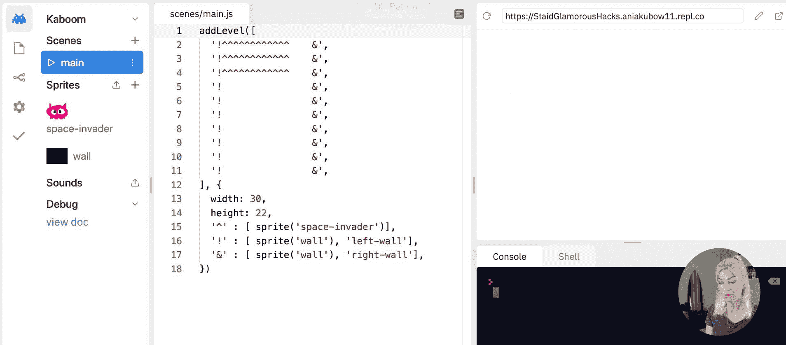
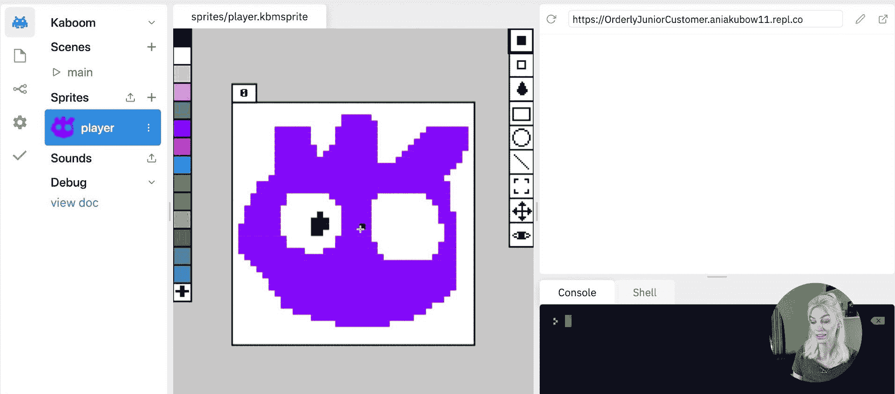
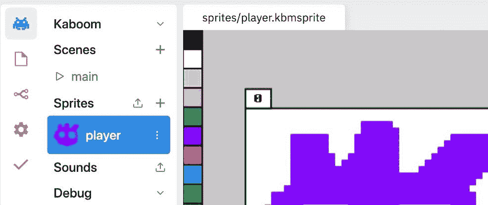

# 如何用 Kaboom.js 构建超级马里奥兄弟、塞尔达、太空入侵者

> 原文：<https://www.freecodecamp.org/news/how-to-build-mario-zelda-and-space-invaders-with-kaboom-js/>

在这个视频课程中，我将向您展示如何使用最新的 JavaScript 游戏开发库 Kaboom.js 构建三个流行的游戏。

这门课程令人兴奋有两个原因:

首先，我将介绍一种专为 JavaScript 游戏开发设计的新技术。

第二，我将使用这项技术一步一步地教你如何创建一些经典游戏，如超级马里奥兄弟，塞尔达和太空入侵者。

## Kaboom.js 是什么？

所以在我们开始之前，让我们从这门课令人兴奋的第一个原因开始——新技术。

Kaboom.js 是一个帮助你快速制作游戏的 JavaScript 库。我们将使用这个库来简化场景的创建，添加图层，创建精灵，处理动作和碰撞，添加关键事件，调试和[更多](https://youtu.be/xF3--Ec_E-0)。

这种简单性允许你以较低的门槛进入游戏开发的世界。它还能让你在试图费力地阅读一页又一页的文档后，不会灰心丧气地进行编码——这在我们今天看到的游戏开发过程中很常见。



## 我们将在本课程中讨论的内容

在本课程中，我将向您展示如何在预先配置的环境中使用 Kaboom.js 方法编写一个通用游戏。然后，我们将在相同的预配置环境中创建一个太空入侵者游戏，接着是超级马里奥兄弟。

在我们完成这两个游戏后，我们将完全从零开始制作塞尔达。我们将以一个部分来结束，关于你可以在哪里彼此分享你的游戏，以及如何在 VS 代码中使用 Kaboom.js。

既然我们已经介绍了这些，那么让我们开始设置一个环境并了解一些 Kaboom.js 基础知识，这样您就可以开始学习完整的视频课程了！我们也将在视频中涉及这些内容，因此如果您遇到困难，请参考视频课程寻求帮助。

## 如何使用 Replit Kaboom.js 环境

为了直接进行编码，我们将在 Replit 上使用 Kaboom.js 环境。这个环境将使我们不必编写 Kaboom 生命周期方法，例如初始化 Kaboom 或添加场景。

它还允许我们直接在环境中创建精灵。



如果你想知道如何在你选择的**代码编辑器中从头开始设置 Kaboom.js，**在课程的最后有一小段专门介绍这个。

现在，请点击[这里](https://replit.com/kaboom)，前往 Replit 并创建您的第一个 Kaboom.js 环境。

## 如何使用 kaboom . js–基础知识

在本课程中，我们将使用 Kaboom.js **版本 0.5.0。**

在这一节中，我将介绍 Kaboom.js 的基本概念和方法。我将向您展示如何添加精灵，移动精灵，处理碰撞，以及向您展示我们可以用它做的所有其他事情。

一旦我们有了基础，我们将使用这些知识来创建我们的三个游戏。在这个过程中我们会学到更多。

我不建议你跳过这门课的某些部分。我编排了这些章节，这样你就可以在每一节学到的知识的基础上再接再厉。

在开始本课程之前，您需要具备的唯一先决条件是对 JavaScript 的基础有一个基本的了解。但是，如果你喜欢冒险，请试着跟随。

如我所说，这个库旨在通过提供一层“快捷方式”来创建游戏，从而使 JavaScript 编码变得更加容易。

### 如何添加层

一旦你在 Kaboom 中初始化了一个游戏，你可以选择添加层。例如，这些层将防止你的精灵与你放在背景层或 UI 层上的元素发生冲突。

在下面的例子中，我定义了三层，默认为`obj`层。

```
layers([
    "bg",
    "obj",
    "ui",
], "obj")
```

### 如何添加精灵

接下来，让我们添加一个雪碧。为此，只需在 Replit Kaboom.js 环境中直接创建一个 sprite，方法是单击左侧工具栏中单词“Sprite”下的下拉按钮。使用以下视频作为指导，或参考视频课程。



一旦你创建了一个 sprite，使用 add Kaboom 方法，然后使用 sprite Kaboom 方法，并以字符串的形式传递你的 sprite 名称。

在这种情况下，我将我的精灵命名为“player”。请确保将它赋给一个 const，以便以后可以重用。

```
const player = add([
    sprite("player"),
]) 
```

### 如何移动精灵

接下来让我们移动精灵。通过使用`keyDown`的 Kaboom 方法，并传递所按下的键的字符串，以及一个函数，我可以在每次按下指定的键时调用该函数。然后我会在播放器上使用`move` Kaboom 方法，通过 X 轴和 Y 轴来移动它。

在我下面的例子中，X 轴是`100`，Y 轴是`0`。这意味着每当我按下右箭头键时，我们的玩家将在游戏板上向右移动。

```
keyDown('right', () => {
    player.move(100,0)
})
```

### 如何添加文本

我们也可以选择在游戏中添加文本。例如，我可以选择添加一些显示分数的文本。

目前，它被硬编码为字符串`0`。通过使用 Kaboom 方法`layer`，我可以确保这个文本在我们之前创建的`ui`层上。这样它就不会干扰我的精灵。

```
const score = add([
    text("0"),
    layer("ui"),
])
```

### 如何处理碰撞

使用 Kaboom.js 处理碰撞有很多种方法，一种方法是抓取播放器，使用 Kaboom 方法`collides`。

在下面的例子中，如果我的玩家撞上任何一个`tag`为‘危险’的精灵，它将会由于`destroy` Kaboom 方法而被摧毁。

```
player.collides('dangerous', () => {
    destroy(player)
})
```

### 我们走吧！

好了，现在我们已经讲了基础知识，让我们开始上课吧！

[https://www.youtube.com/embed/4OaHB0JbJDI?feature=oembed](https://www.youtube.com/embed/4OaHB0JbJDI?feature=oembed)

这门课程是在 Replit 的资助下开办的。

### 订阅更多关于软件开发的视频:

[Code with Ania KubówHello everyone. My name is Ania Kubow and I am a Software Developer during the day who loves to teach code through building retro Games and awesome projects in the evening. I am also part of the core team @ FreeCodeCamp. You can find me putting out videos on there, as well as on my own channel eve…YouTube](https://www.youtube.com/aniakubow)