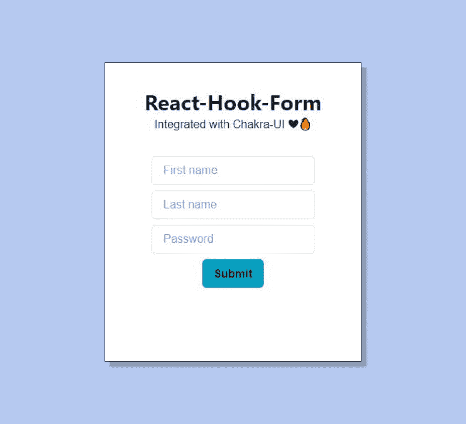
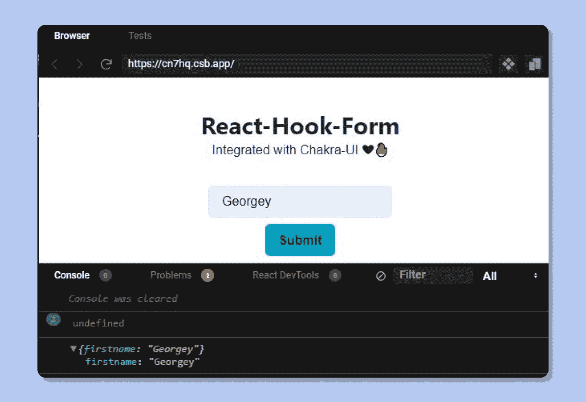
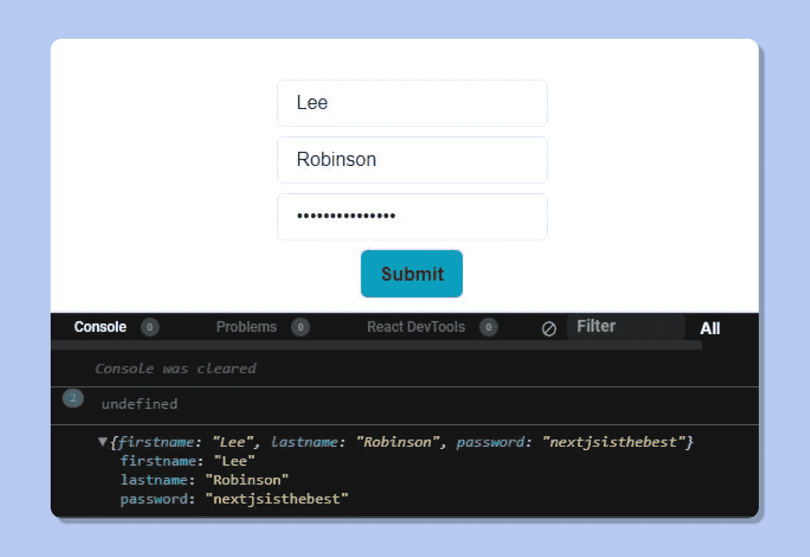
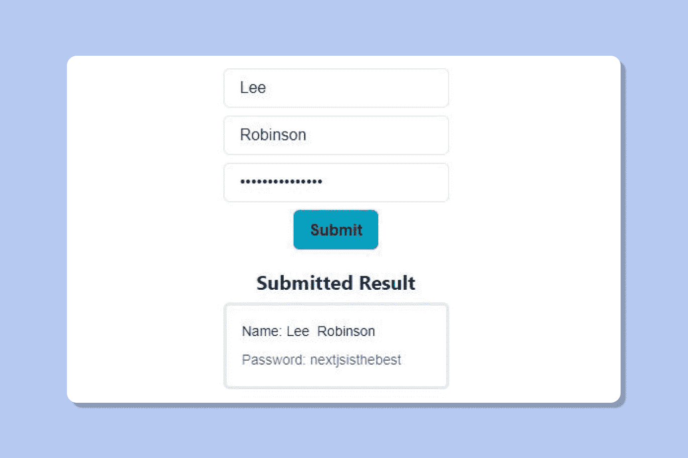
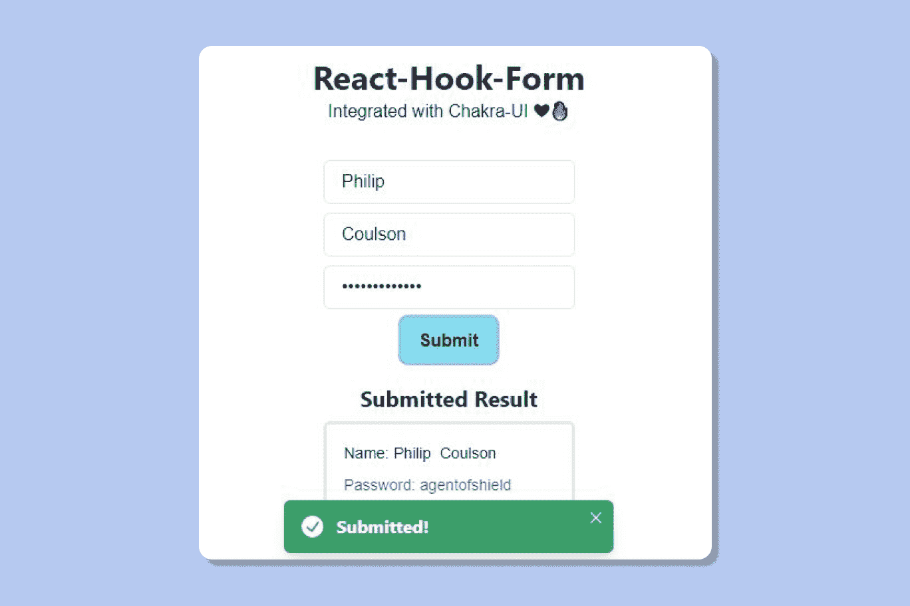

# 查克拉界面和反应-钩形-如何建立美丽的形式

> 原文：<https://www.freecodecamp.org/news/how-to-use-react-hook-form-with-chakra-ui/>

在 HTML 中，每当提交表单时，表单的默认行为是重定向到新页面。所以为了提供动态功能，React 使用了一种叫做**受控组件**的策略。

如果您最近学习了 React 课程，您可能不喜欢这一部分，因为如果您有多个输入字段，则需要管理许多状态。

首先，使用调用`useState()`函数的`onChange`属性跟踪输入字段的状态。输入字段包含在表单元素中。

当用户提交表单时，它触发`onClick`或`onSubmit`属性将输入设置为包含值或对象的数组，这取决于输入字段的数量。

然后是验证，检查用户是否输入了任何内容。如果不是，则返回一个错误，提示用户输入一个有效的输入。

这里的逻辑是一大堆样板文件。听到这个过程，你可能会感到厌烦。

如果我告诉你一个单独的库就能实现所有这些会怎么样？

以下是我将在本文中介绍的内容:

1.  什么是反应钩形？
2.  反应挂钩形式如何影响性能
3.  如何获取用户数据
4.  如何向表单添加验证
5.  如何提高使用 Chakra-UI 的前端和用户体验？

## 什么是反应钩形？

React-Hook-Form 是一个灵活的库，它负责所有的验证、状态管理和用户数据——它全部打包在 25.3 kb(未打包)和 9.1 kb GZip(随版本变化)的大小内。

它使用起来简单明了，而且您必须编写最少的代码。


[Image source](https://bundlephobia.com/result?p=react-hook-form@7.6.0)

我印象深刻的一个特点是它的性能。如其[官方网站](https://react-hook-form.com/)所述，React-Hook-Form:

*“最大限度地减少重新渲染次数，加快安装速度，努力提供最佳用户体验。”*

## 反应挂钩形式如何影响性能

如果您一直在使用该库的早期版本，那么文档通常会引用`ref`属性来处理状态管理和验证。

```
<input type=”password” placeholder=”Password” ref={register} /> 
```

这样，React-Hook-Form 采用了一种**不受控**输入的方法，而不是每次都改变状态。它隔离选定的组件，并避免呈现子组件。

这大大减少了重新渲染的次数，提高了应用程序的整体性能。([来源](https://blog.logrocket.com/the-complete-guide-to-react-hook-form/#:~:text=React%20Hook%20Form%20adopts%20the,and%20it%20has%20zero%20dependencies.))

## 如何从表单中获取用户数据

我为这个教程制作了一个 Codesandbox，所以如果你迷路了，一定要参考它。

以下是您需要遵循的内容:

*   [App 链接](https://cn7hq.csb.app/)
*   [源代码](https://codesandbox.io/s/funny-cartwright-cn7hq?file=/src/index.js)

这是我们将要建造的。这是一个简单的表单，带有验证、用户提交时的警告和使用 Chakra UI 构建的错误。



首先，让我们安装库:

```
npm install react-hook-form 
```

现在从包中导入`useForm`钩子:

```
import { useForm } from "react-hook-form"; 
```

从`useForm`钩子中析构以下常量:

```
const { register, handleSubmit, formState: { errors } } = useForm(); 
```

创建一个简单的表单元素，如下所示:

```
<form onSubmit={handleSubmit(onSubmit)}>
	<input type=”text” placeholder=”First Name” {...register(“firstname”)} />
	<input type=”submit” />
</form> 
```

提交时，表单会将一个函数传递给 handleSubmit 函数。我们可以这样定义`onSubmit`函数:

```
const onSubmit = data => console.log(data); 
```

现在，如果我们测试我们的表单元素，当它被提交时，控制台返回以下内容:



看起来它返回了一个属性为`firstname`的对象，并且成功地获得了输入字段中的数据。

现在让我们添加更多的输入字段:

```
<form onSubmit={handleSubmit(onSubmit)}>
	<input type=”text” placeholder=”First Name” {...register(“firstname”)} />
	<input type=”text” placeholder=”Last Name” {...register(“lastname”)} />
	<input type=”password” placeholder=”Your password” {...register(“password”)} />
	<input type=”submit” />
</form> 
```

在记录响应时，我们会得到一个对象:



现在，这些数据可以发送回数据库。但是在本教程中，让我们使用`useState( )`将它显示给用户。

```
const [data, setData] = useState();
const onSubmit = (data) => {
   setData(data);
 }; 
```

让我们制作一个新组件，名为`Stats.js`。这里，我们将利用 Chakra UI 的`Stat`组件。

```
import {
 HStack,
 Stack,
 Stat,
 StatHelpText,
 StatLabel
} from "@chakra-ui/react";
import React from "react";

export default function Stats(props) {
 return (
   <Stat mt={5}>
     <Stack
       p={4}
       borderWidth="3px"
       borderRadius="md"
       direction="column"
       align="flex-start"
     >
       <HStack>
         <StatLabel>Name: {props.Firstname}</StatLabel>
         <StatLabel>{props.Lastname}</StatLabel>
       </HStack>
       <StatHelpText>Password: {props.Password}</StatHelpText>
     </Stack>
   </Stat>
 );
} 
```

现在，将这个组件导入到您的根文件中，并传递各自的属性。

```
import Stats from "./Stats";
// App.js
{data && (
       <Stats
         Firstname={data.firstname}
         Lastname={data.lastname}
         Password={data.password}
       />
)} 
```

只有当数据为`true`时，才会显示统计数据。

最终结果应该是这样的:



## 如何向表单添加验证

我们为什么需要验证呢？让我带你看一个我在参与的一个黑客马拉松项目中经历的例子。

我已经构建了一个密码管理器，并且没有注意表单验证。用户开始在表单中输入空密码。最终，数据库中出现了大量无效数据。

现在，如果你访问任何一个受欢迎的网站，你可能会注意到它会强迫你输入一个强密码。

让我们从这个案例研究中得出一些结论

*   我们想要得到有效的数据
*   我们希望通过输入强密码来保护我们的用户数据
*   我们希望通过阻止无效数据来保持数据库的整洁

我们将尝试使用 React-Hook-Form 提供的客户端验证来实现这些目标。我们将使用库提供的`register`方法。它允许您注册用户输入的数据，并对其应用验证规则。

考虑下面的例子:

```
<input
      type="text"
      placeholder="First name"
      {...register("firstname", { required: true })}
/> 
```

通过将规则 required 设置为`true`，用户现在将被迫提供一个字符串来通过验证。当这个事件发生时，我们可以通过向用户返回一条消息来进一步修改它。

```
<input
      type="text"
      placeholder="First name"
      {...register("firstname", { required: “Please enter your first name” })}
/>
{errors.firstname && <p>{errors.firstname.message}</p>} 
```

如果对象`errors`返回真值，它将向用户显示消息。

现在让我们强制用户提供一个超过 8 个字符的密码。

```
<Input
      type="password"
      placeholder="Password"
      {...register("password", {
        required: "Please enter Password",
        minLength: { value: 8, message: "Too short" }
      })}
 /> 
```

通过将 minLength 属性指定为 8，用户现在将被迫输入 8 个字符的密码。

此外，我们可以使用之前使用`And operator`的相同方法在前端警告用户。

```
{errors.password && <p>{errors.password.message}</p>} 
```

如果您现在注意到了，React-Hook-Form 会动态地监听这些变化。因此，如果输入为空，它会同时显示一个警告。如果密码太短，它会动态更新消息。美女！

现在开始制作你自己的表格。在下一节中，我们将定制表单，并在弹出错误时向用户发送警报。

## 如何使用 Chakra-UI 改善前端和用户体验

首先，让我们将目前为止使用的所有组件转换成 Chakra UI 组件。

不用正常的`<input />`，只需用 Chakra UI 的`Input`替换现有的即可。

```
Import { Input } from “@chakra-ui/react” 
```

现在以同样的方式导入`VStack`和`Button`组件，并用`VStack`包装整个表单。

```
<VStack>
         <Input
           type="text"
           placeholder="First name"
           {...register("firstname", {
             required: "Please enter first name",
             minLength: 3,
             maxLength: 80
           })}
         />
         <Input
           type="text"
           placeholder="Last name"
           {...register("lastname", {
             required: "Please enter Last name",
             minLength: 3,
             maxLength: 100
           })}
         />
         <Input
           type="password"
           placeholder="Password"
           {...register("password", {
             required: "Please enter Password",
             minLength: { value: 8, message: "Too short" }
           })}
         />
         <Button
           borderRadius="md"
           bg="cyan.600"
           _hover={{ bg: "cyan.200" }}
           variant="ghost"
           type="submit"
         >
           Submit
         </Button>
</VStack> 
```

你看到的`Button`组件的道具类似于 CSS 属性，所以迁移到 Chakra UI 不会有问题。

现在，让我们在用户输入任何无效数据时向他们发出提示警报。

制作一个新组件`AlertPop.js`。

导入以下代码:

```
import { Alert, AlertIcon, AlertTitle } from "@chakra-ui/react"; 
```

让我们定义一个显示错误消息的道具。

```
export default function AlertPop (props) {
 return (
   <Alert status="error">
     <AlertIcon />
     <AlertTitle mr={2}>{props.title}</AlertTitle>
   </Alert>
 );
} 
```

现在将该组件导入到根文件中，并在每个输入字段下输入以下逻辑:

```
{errors.firstname && <AlertPop title={errors.firstname.message} />}
{errors.lastname && <AlertPop title={errors.lastname.message} />}
{errors.password && <AlertPop title={errors.password.message} />} 
```

最后这样导入`useToast`:

```
import { useToast } from "@chakra-ui/react" 
```

使用这个组件，我们将能够在用户成功提交表单时显示一条弹出消息。

我们将这样做:

```
Import { useToast } from “@chakra-ui/react”

const toast = useToast( )
const onSubmit = (data) => {
   //console.log(data);
   toast({
     title: "Submitted!",
     status: "success",
     duration: 3000,
     isClosable: true
   });

   setData(data);
 }; 
```

最终结果应该是这样的:



## 结论

网络技术每天都在飞速发展。学习使用各种库是很好的，但是要确保你首先了解基础知识。

例如，如果不理解 DOM 操作，就不能突然开始学习 ReactJS。基础是基础，否则你将无法理解网络工作的美妙之处。

## 感谢阅读！✨

很高兴看到你已经读到这里了。如果您确实从这篇文章中获得了一些见解，请随意与您的社区和同事分享。

我谈论 web 技术和构建项目，进一步记录开发过程供其他开发人员参考。如果你需要任何指导，一定要在推特上联系我。