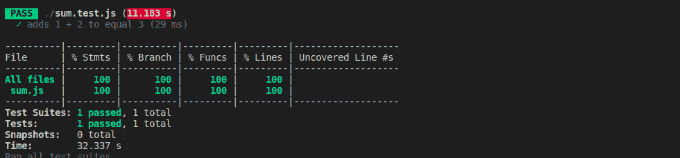
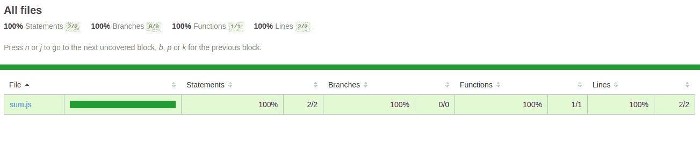
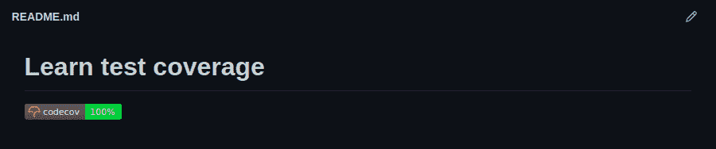

# 如何用 CodeCov 和 GitHub 动作生成代码覆盖率报告

> 原文：<https://www.freecodecamp.org/news/how-to-generate-code-coverage-report-with-codecov-and-github-actions/>

软件测试是软件开发过程的重要组成部分。您在软件开发生命周期的不同阶段运行测试，并且您想要确保您有良好的测试覆盖率。

以下是编写软件测试的一些关键原因:

*   测试可以防止你在将来对你的代码库引入突破性的改变。换句话说，你现在写的测试可能会在将来把你从自我中拯救出来。
*   测试确保您构建的产品符合所需的规范。
*   经过良好测试的代码会让你对代码的质量更有信心。
*   测试降低了您的代码库中具有未知行为的代码成为错误来源的可能性。
*   测试使得维护代码变得更加容易。如果您没有高代码覆盖率，您无法判断更改代码库的一小部分会如何影响整个代码库。

在本文中，您将学习如何使用 [codecov](https://about.codecov.io/) 和 [gitHub actions](https://github.com/features/actions) 生成代码覆盖报告。

## 什么是代码覆盖率？

代码覆盖率是一个度量标准，它可以帮助你知道你的源代码有多少已经被测试。有许多工具可以用来生成代码覆盖率报告。这些工具包括:

*   [codecov](https://about.codecov.io/)
*   [工作服](https://coveralls.io/)
*   [伊斯坦布尔](https://istanbul.js.org/)
*   [优步](https://github.com/uber/uberalls)

大多数代码覆盖分析工具使用一组度量来报告代码覆盖分析。这些指标包括:

*   **函数覆盖率**
    运行测试套件后被调用的已声明函数的数量。
*   **语句覆盖率**
    运行测试套件后已经执行的语句数量。
*   **分支覆盖**
    有多少分支代码，比如`if`代码块，已经被执行。
*   **条件覆盖**
    已经测试过`true`和`false`值的布尔子表达式的数量。
*   **行覆盖率**
    已经测试过的代码行。

在本文中，我们将主要关注如何使用 [codecov](https://about.codecov.io/) 和 [gitHub actions](https://github.com/features/actions) 来为节点项目生成代码覆盖报告。

## 为什么代码覆盖率很重要？

良好的代码覆盖率让你对你发布的代码有信心，特别是如果你的测试是健壮的和经过深思熟虑的。

当您编写测试来增加代码覆盖率时，您更有可能在交付生产之前检测到错误并修复它们。

## Codecov 是什么？

Codecov 是一个可以用来为你的项目生成覆盖率报告的工具。您可以将本地文件系统中生成的代码覆盖率数据上传到 codecov，并在不同的图表上轻松地可视化覆盖率报告。

然而，在本文中，您将使用 GitHub actions，以便生成覆盖报告并将它们上传到 [codecov](https://about.codecov.io/) 的过程是自动化的。

您可以将 codecov 集成为持续集成工作流的一部分。Codecov 能够进行拉请求注释等等。这些注释将帮助其他开发人员了解合并他们的 pull 请求将如何影响代码覆盖率，而无需离开他们的 GitHub UI。

您还可以在您的 GitHub 存储库上显示一个显示覆盖率报告的徽章，让您的项目的所有合作者都能看到。您只需要将 codecov 集成到您的持续集成工作流中。

你可以在[文档](https://docs.codecov.io/docs)中阅读更多关于 codecov 提供的所有其他特性。

## Hpw tp 创建一个项目并生成一个覆盖报告

在下面的步骤中，您将创建一个简单的节点项目，并为它生成一个 codecov 覆盖率报告。

### 先决条件

您需要在您的计算机上安装以下软件，以便能够运行下一小节中的命令。

*   [节点](https://nodejs.org/en/)
*   文本编辑器，如 [VS 代码](https://code.visualstudio.com/)或 [atom](https://atom.io/)
*   [去](https://git-scm.com/)

### 步骤 1:创建一个目录并导航到它

在这一步中，您将创建一个名为`learn-test-coverage`的目录，然后导航到该目录。如果愿意，您可以给目录取一个不同的名称，只要它是一个有意义的名称。

在终端中运行以下命令:

```
mkdir learn-test-coverage
cd learn-test-coverage 
```

在下一步中，您将初始化项目。

### 步骤 2:初始化项目

在本步骤中，您将通过在终端中运行以下命令来初始化项目:

```
npm init --yes 
```

成功运行上述命令将在项目目录的根目录下创建一个`package.json`文件。

下一步，您将安装 [jest](https://jestjs.io/) 作为开发依赖项。

### 步骤 3:将 Jest 作为依赖项安装

在这一步中，您将安装 [jest](https://jestjs.io/) 作为开发依赖项。Jest 是一个简单的 JavaScript 测试框架，通常在 Node 中以最小的设置开箱即用。

在终端中运行以下命令:

```
npm install --save-dev jest 
```

成功运行上述命令后，您应该能够看到在项目目录的根目录下创建的`node_modules`目录和`package-lock.json`文件。您还应该能够看到 Jest 作为开发依赖项安装在`package.json`文件中。

在下一步中，您将在项目中初始化一个 git 存储库。

### 步骤 4:初始化 Git 存储库

在此步骤中，您将通过运行以下命令来初始化项目中的 git 存储库:

```
git init 
```

在项目目录的根目录下创建一个`.gitignore`文件，并向其中添加以下代码。这将忽略`node_modules`文件，这样它以后就不会提交给远程存储库。

```
/node_modules 
```

下一步，我们将声明一个简单的函数，并为它编写一个测试。

### 步骤 5:声明一个函数并为其编写一个测试

在这一步中，您将在`sum.js`文件中声明一个名为`sum`的简单函数。这个函数接受两个参数并返回它们的和。您还将在`sum.test.js`文件中为您的代码编写测试。

在终端中运行以下命令:

```
touch sum.js sum.test.js 
```

您应该能够看到在您的项目中创建的两个文件。将下面的代码复制并粘贴到`sum.js`中:

```
function sum(num1, num2) {
  return num1 + num2;
}

module.exports = sum; 
```

同样，将下面的代码复制并粘贴到`sum.test.js`中:

```
const sum = require("./sum");

test("adds 1 + 2 to equal 3", () => {
  expect(sum(1, 2)).toBe(3);
}); 
```

将您的`package.json`中的`"test"`属性的值更改为`"jest --coverage"`，这样`"scripts"`属性的值如下所示:

```
{
    "test": "jest --coverage"
} 
```

在终端运行`npm test`来运行您的测试。测试完成后，您应该能够在终端中看到代码覆盖概要，并生成一个`coverage`目录。

以下是我在终端中看到的内容:



您也可以通过打开`coverage/lcov-report`文件夹中的`index.html`文件在浏览器中查看摘要。您应该能够看到以下内容:



您能够生成覆盖报告，因为 Jest 与[伊斯坦布尔](https://istanbul.js.org/)捆绑在一起。确保您删除了`coverage`文件，因为您不需要它，因为我们将使用 GitHub 动作来自动执行该过程。

您应该能够识别伊斯坦布尔使用哪些指标来生成覆盖报告(我在文章开头提到的指标)。

下一步，我们将把 GitHub actions 的持续集成添加到我们的项目中。

### 步骤 6:添加 GitHub actions 的持续集成工作流

在这一步中，您将把 GitHub actions 的持续集成工作流添加到您的项目中，这样 codecov 将自动生成一个关于创建 pull 请求的报告。

在项目文件夹的根目录下创建一个`.github`文件。在`.github`文件夹中，创建一个`workflows`文件夹。然后在`workflows`里面创建一个`codecov.yml`文件。文件不需要命名为`codecov`。你可以给它起任何你喜欢的名字。

将下面的代码复制并粘贴到您的`codecov.yml`文件中。

这是工作流配置文件。当两个事件`push`和`pull_request`发生时，它将运行您的测试。你可以阅读更多关于 [YAML 语法](https://yaml.org/spec/1.2/spec.html)和 [gitHub 动作](https://github.com/features/actions)来理解下面文件的内容。

```
name: Running Code Coverage

on: [push, pull_request]

jobs:
  build:

    runs-on: ubuntu-latest

    strategy:
      matrix:
        node-version: [12.x, 13.x, 14.x, 15.x]

    steps:
    - name: Checkout repository
      uses: actions/checkout@v2
      with:
        fetch-depth: 2

    - name: Set up Node.js ${{ matrix.node-version }}
      uses: actions/setup-node@v1
      with:
        node-version: ${{ matrix.node-version }}

    - name: Install dependencies
      run: npm install

    - name: Run tests
      run: npm run test

    - name: Upload coverage to Codecov
      uses: codecov/codecov-action@v1 
```

最后一步负责将覆盖率报告上传到上面配置文件中的 codecov。

下一步，您将在 GitHub 上创建一个存储库，并将您的项目推送到这个存储库中

### 步骤 7:在 GitHub 上创建一个存储库，并将您的更改推送到其中

在这一步中，您将在 gitHub 上创建一个存储库，并将您的更改推送到其中。

导航到 GitHub。创建一个空存储库，并将其命名为`learn-test-coverage`。

在您的机器上的项目目录的根目录下，运行以下命令来初始化您的项目存储库并提交您的更改。

```
git add .
git commit -m "Initial commit" 
```

然后，您可以使用下面的命令将上面创建的远程存储库添加到本地存储库:

```
git remote add origin <Remote repository> 
```

最后，您可以使用下面的命令将您的更改推送到远程存储库:

```
git push origin master 
```

下一步，我们将把 GitHub 库链接到 codecov。这确保了每当我们创建一个拉取请求时，我们的覆盖率数据被自动上传，从而生成一个报告。

### 步骤 8:将您的远程存储库链接到 codecov

在这一步中，您将把您的存储库链接到 codecov。但是你需要先注册。

Codecov 允许你在几分钟内注册 GitHub 账户。然后，您可以在 codecov 仪表板上选择想要链接的 GitHub 存储库。

选择存储库后，您将被重定向到带有令牌的页面。对于公共存储库，您不需要这个令牌。

对于私有存储库，您需要将其添加到 GitHub secrets 中，然后在工作流配置文件的底部添加以下内容，如下所示:

```
- name: Upload coverage to Codecov
    uses: codecov/codecov-action@v1
    with:
        token: ${{ secrets.YOUR_SECRET_TOKEN }} 
```

### 步骤 9:测试您的持续集成工作流

在这一步中，您将测试您的持续集成工作流。

在项目的根目录下创建一个`README.md`文件。将 codecov 面板上的 codecov 徽章复制并粘贴到`README.md`文件中的 settings 选项卡下。这是徽章的样子。


提交并将更改推送到 GitHub。CI 工作流运行完成后，您应该能够看到工卡上指示的代码覆盖率。



您还可以在 codecov 仪表板上查看覆盖率报告。尝试创建一个拉请求，看看会发生什么。

关于你还能做什么的更多见解，请查看 [Codecov 文档](https://docs.codecov.io/docs)。

如果你卡住了，还可以在 GitHub 上查看[我的项目](https://github.com/nibble0101/learn-test-coverage)。

## codecov 如何生成其覆盖报告？

Codecov 使用术语**命中**、**部分**和**未命中**来描述项目中的代码覆盖率。覆盖率是`hits`与`hits`、`partials`和`misses`之和的比值。

如果代码被描述为**命中**，这意味着源代码被测试套件执行了。

如果描述为**部分**，说明源代码没有被测试套件完全执行。还有未执行的剩余分支。

**未命中**表示源代码没有被测试套件执行。

> 总共 12 行代码中有 5 行由测试执行的代码库将获得 41%的覆盖率(向下舍入)- [Codecov 文档](https://docs.codecov.io/docs)

这就是如何将 codecov 集成为持续集成工作流的一部分。如果你想探索更多的特性，你可以查看一下 [Codecov 文档](https://docs.codecov.io/docs)。

## 结论

在本文中，我们研究了如何将 [codecov](https://docs.codecov.io) 集成为持续集成工作流的一部分。

增加代码覆盖率将在很多方面帮助你。但是，如果您的测试不够健壮且考虑不周，仅仅为了提高代码覆盖率而提高代码覆盖率可能会给您带来麻烦。

代码覆盖分析工具只是为了让你的工作更容易。但是你不应该用它们来代替代码审查。工具的好坏取决于它的使用者。

### 参考

*   [Codecov 文档](https://docs.codecov.io/docs)
*   [Jest 文档](https://jestjs.io/docs/getting-started)
*   [伊斯坦布尔文件](https://istanbul.js.org/)