# 2021 年开发者最好的无代码工具

> 原文：<https://www.freecodecamp.org/news/best-no-code-tools-for-developers/>

无代码工具让世界各地的人们无需编写代码就能构建不同的产品和应用程序。在无代码工具出现之前，构建简单的网站或移动应用程序需要几周或几个月的时间，只有经验丰富的软件开发人员才能完成。

但现在已经不是这样了。现在，您可以使用正确的无代码工具创建博客、网站等等。即使你知道如何编码，这些工具也能帮助你变得更有效率。今天有大量的无代码工具可用。因此，选择正确的方法是很棘手的。这篇文章旨在强调一些最好的无代码工具，供开发人员在 2021 年使用。

## Webflow

Webflow 是一个强大的基于网络的设计工具，它给你设计、构建和启动响应网站的超能力，而无需编写一行代码。很神奇吧？我知道！

您可以使用 Webflow 的不同方法，而不是绘制/设计您的项目，然后将它们编码到实际的产品中。

使用 Webflow 构建的网站由亚马逊 Cloudfront 提供支持，托管在 Fastly 上，不需要外部插件。

**通过 Webflow，您可以:**

*   创建自动站点备份(版本控制)和暂存 URL。
*   在几分钟内从原型变成实体模型。
*   你可以一次设计上百个页面。
*   毫无压力地设计、构建和发布。

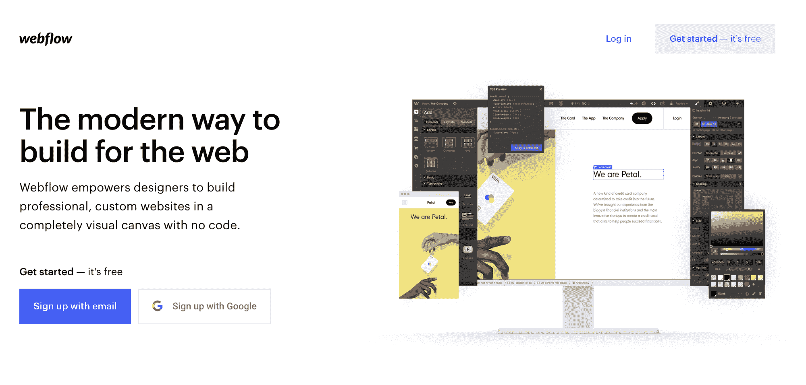

#### 定价💵

Webflow 有一个免费层和下面列出的其他四个付费层:

*   **基本:**每月 12 美元(按年支付)或每月 15 美元(按月支付)
*   CMS: $16 一个月(按年付费)或$20 一个月(按月付费)
*   业务:每月 36 美元(按年支付)或 45 美元(按月支付)
*   企业:您必须联系销售团队才能获得这些信息

## 建筑机器人

你有没有想过不用写代码就能创造出令人兴奋的游戏？我很高兴让你知道它是！

想象一下，如果你已经忙于编写游戏应用程序，但一个新客户要求你为他们创建一个游戏。你可以使用 [BuildBox](https://signup.buildbox.com/) 来制作游戏，而不是拒绝这个提议。如果你问我，这是一个双赢的局面。😉

Buildbox 是世界上第一个真正允许任何人创造惊人游戏的软件，不管技术水平如何。由于其独特的用户界面，制作游戏成为一个流畅的过程，不需要任何脚本，编程或软件设计经验。

**作为开发人员，您可以使用 build box:**

*   拖放创建独特和专业的 3D 游戏。
*   将智能资产添加到游戏中。
*   为您的游戏添加动作效果和逻辑等等！🚀

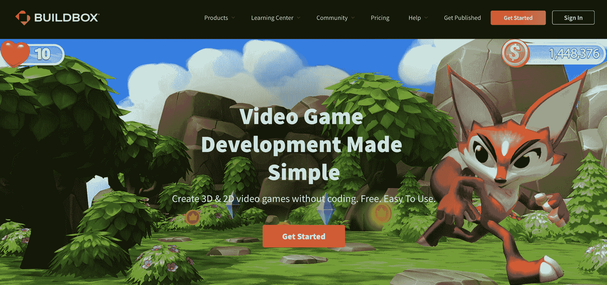

#### 定价💵

Buildbox 有一个免费层和下面列出的另外两个付费层:

*   **加:**每月 9.99 美元或每年 89.99 美元
*   **Pro:** 每年 224.99 美元

## **哈希节点**

作为一名开发人员，博客让您可以与开发人员社区分享您的技术知识和经验。它也帮助你巩固你所写的每个主题的学习。

Hashnode 允许开发者免费创建一个映射到他们自定义领域的博客。所以你只需要专注于在你的博客上发布文章，而 Hashnode 会处理剩下的事情——定制、读者群、可见性、网络盈利等等。

这些年来，我看到许多开发人员从零开始建立博客**只是**，因为他们想把它映射到他们的个人领域，并给它一个特殊的外观和感觉。你猜怎么着？这个无代码工具可以让你实现所有这些甚至更多。

**有了 Hashnode，你:**

*   不必担心维护或不断更新你的博客，因为 Hashnode 处理一切。
*   只有专注于写作和在博客上发表文章。
*   从第一天起你的博客就会有读者。
*   可以定制您的博客，以满足您的需求等等！

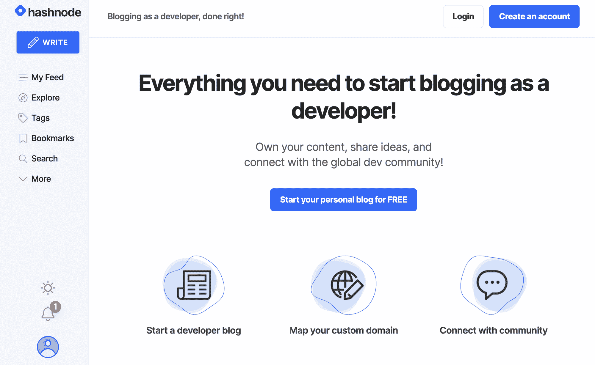

#### 定价💵

Hashnode 对开发者来说是永远免费的。然而，[他们计划为业务](https://hashnode.com/post/hashnode-is-changing-more-about-our-business-model-new-mission-and-goal-ckbhowv9100lyzes1oo6qneri)推出付费团队层级。

## 泡泡

[Bubble](https://bubble.io/) 让你为桌面和移动网络浏览器创建交互式的多用户应用，包括你建立一个像脸书或 Airbnb 这样的网站所需的所有功能。

传统的 web 应用程序要求您管理您的代码，并设置到 web 服务器的部署过程。不冒泡–它为您处理部署和托管。

最重要的是，对用户数量、流量或数据存储没有硬性限制。

**这里有一些你可以作为开发者使用 Bubble 的方法:**

*   您可以为一个完美的产品创建移动友好的布局和动态内容，并自豪地向您的潜在客户、客户或投资者展示。
*   您可以构建响应迅速的 web 应用程序。
*   你可以创建混合移动应用。
*   您可以通过 API 连接到外部服务和硬件。

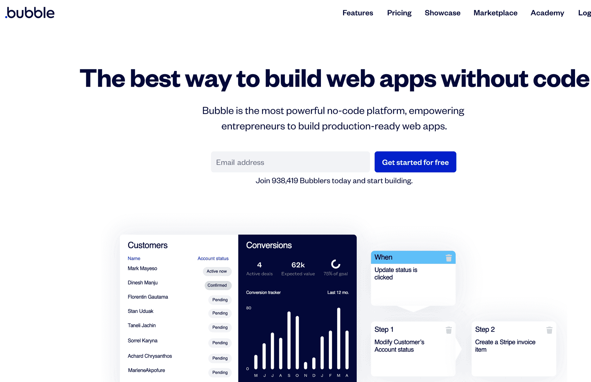

#### 定价💵

Bubble 有一个免费层和三个付费层。找到以下付费层级:

*   个人:每月 25 美元(按年支付)或 29 美元(按月支付)
*   专业: $115 一个月(按年支付)或$129 一个月(按月支付)
*   生产:每月 475 美元(按年支付)或 529 美元(按月支付)

## 乐章结尾部

Coda 是一个一体化的文档，可以将你所有的文字和数据放在一个灵活的界面上。

有了 Coda，你不再需要一个由文档、电子表格、数据库和小众工作流应用组成的互不相连的网络来完成工作——因为一切都将被统一到一个地方。

Coda 附带了像表格和按钮这样的构建模块——以及节省时间的模板，因此您的文档可以随着团队的需求而增长和发展。

**这里有一些开发人员使用 Coda 的方法:**

*   您可以针对该特定实例以精确的方式管理其他地方的数据。
*   您可以非常快速地编辑、上下文化或“按摩”数据。
*   您可以显示或隐藏行或列，拖放列，甚至按元素分组来创建数据透视表或看板。

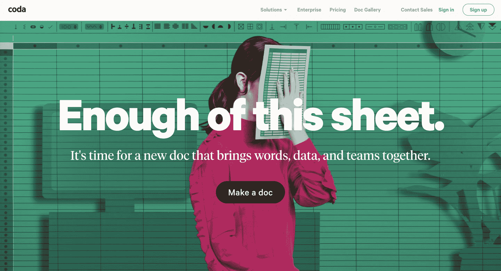

#### 定价💵

Coda 有一个免费等级和三个付费等级，突出显示如下:

*   **Pro:**$ 10/月(按年支付)或$ 12/月(按月支付)
*   **团队:**$ 30/月(按年支付)或$ 36/月(按月支付)
*   企业:您必须联系销售团队才能获得这些信息

## **Gumroad**

Gumroad 让开发者可以在几秒钟内开始销售他们的数字产品。它还能让你获得大量工具，帮助你吸引那些关心你和你作品的观众。

您可以根据自己的喜好个性化您的登录页面，嵌入关注表单，添加美妙的结账和消费体验，并获得基于产品使用情况的可靠数据。

**使用 Gumroad，您可以:**

*   通过设置自动工作流程和追加销售，与全球最大的零售商一样强大。
*   直接在你的网站上添加 [Gumroad 的 widgets](https://gumroad.com/widgets) ，让你的观众离你很近。
*   出售关于技术、职业发展等的课程或电子书赚钱！

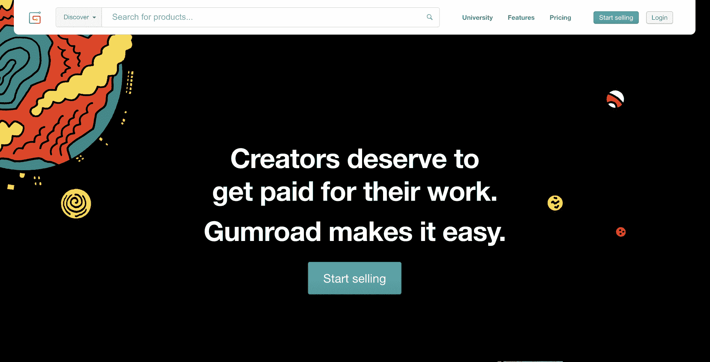

#### 定价💵

创作者赚钱，Gumroad 也赚钱。所以，这个平台是免费的，直到你有超过 1000 个客户。然后，你将开始支付每月 10 美元或每年 108 美元。

## 概念

观念是一个帮助你组织工作的神奇工具，你可以根据自己的需要进行调整。此外，有[许多模板](https://www.notion.so/Notion-Template-Gallery-181e961aeb5c4ee6915307c0dfd5156d)可供选择，这些模板是由极具创造力的人制作的。

**作为一名开发人员，这里有几种使用概念的方法:**

*   发布和宣传您的日程表或您正在组织的即将到来的活动的日程表。
*   你可以用它来做笔记。
*   它帮助你与他人合作。
*   你可以用它来编辑和共享公共文档等等。

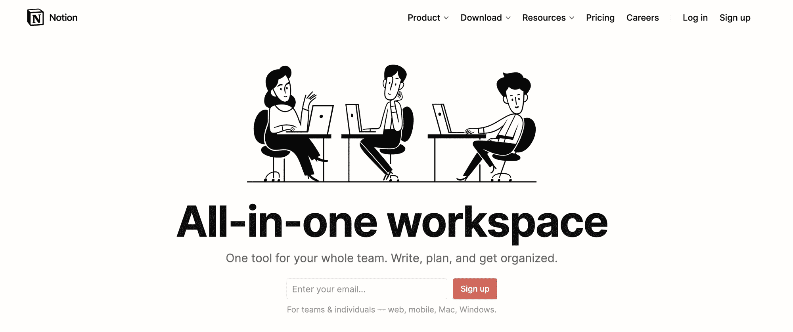

#### 定价💵

Coda 有一个免费等级和三个付费等级，突出显示如下:

*   **个人专业:** $4 一个月(按年支付)或$5 一个月(按月支付)
*   **团队:**每月 8 美元(按年支付)或每月 10 美元(按月支付)
*   **企业:**您必须联系销售团队才能获得这些信息

## **语音流**

[Voiceflow](https://www.voiceflow.com/) 为您提供设计、原型制作和启动语音和聊天机器人所需的资源，无需编写任何代码。

其快速和可视化的拖放画布允许您利用组件、健壮的上下文模型、交互模型导出等等。

在创建语音或聊天机器人方面，这个无代码工具是一个游戏规则改变者。你应该去看看。

**使用 Voiceflow，您可以:**

*   为 Alexa 和谷歌助手设计原型。
*   更轻松、更快速地构建像定制代码一样出色的语音应用。
*   通过自定义分析跟踪和分析语音应用的结果。
*   您可以获得上下文优先的设计，使您能够毫不费力地创建引人入胜的上下文分层语音应用程序和对话。

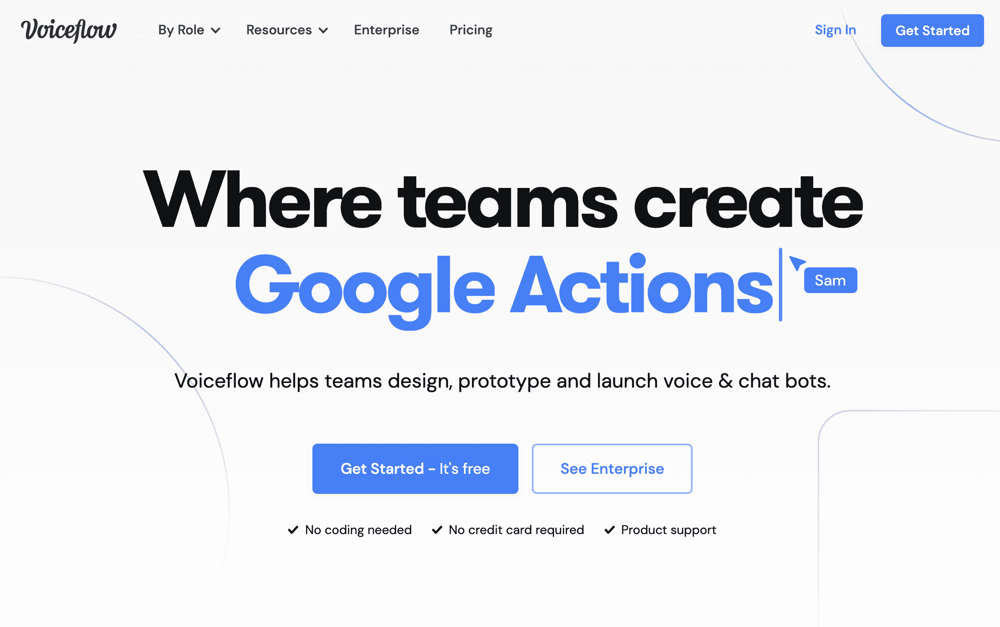

#### 定价💵

Voiceflow 有一个免费层和下面突出显示的两个付费层。

*   每月 40 美元(按年支付)或 50 美元(按月支付)
*   企业:您必须联系销售团队才能获得这些信息

## Bumpa

Bumpa 是开发商或企业主在线销售和管理业务所需的一切的一站式商店。使用 Bumpa，您可以在不到 5 分钟的时间内用您的产品建立您的网站。

Bumpa 允许你记录网站、实体店、各种市场甚至社交媒体上的销售情况。这个无代码工具之所以突出，是因为它易于设置和管理您的在线和离线系统。

**使用 Bumpa，您可以:**

*   创建一个网上商店。
*   管理订单和产品，跟踪销售，在脸书、Instagram 和 Twitter 上分享。
*   接受付款，并通过应用程序直接向您的客户发送通知。

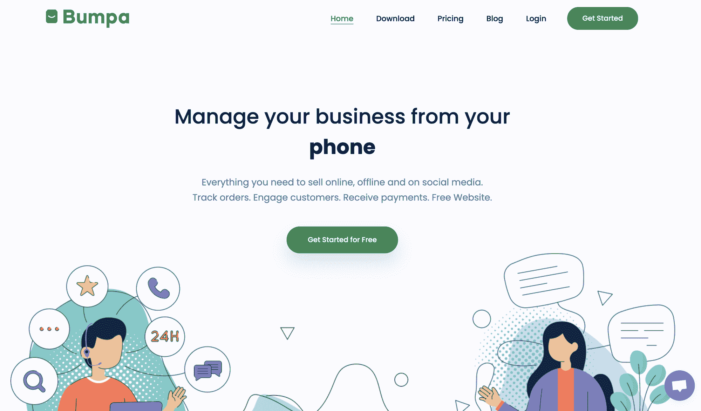

#### 定价💵

Bumpa 为其所有用户提供免费计划。但是如果你需要更多的功能，你必须升级到每月 9 美元的高级计划。

## **萨帕尔**

多亏了 Zapier，你可以自动完成很多日常工作。

它可以帮助您连接应用程序，并自动在它们之间移动信息。这可以让你专注于最重要的工作，而不是做重复性的任务。

Zapier 给你更多的时间来建立关系、发展团队、测试新策略和做你喜欢的工作。😃

**这里有一些你可以作为开发者使用 Zapier 的方法:**

*   从你最喜欢的工作板块接收新工作的电子邮件。
*   自动回复时差消息和提及。
*   把电子邮件变成特雷罗任务卡。
*   简化你的招聘流程。

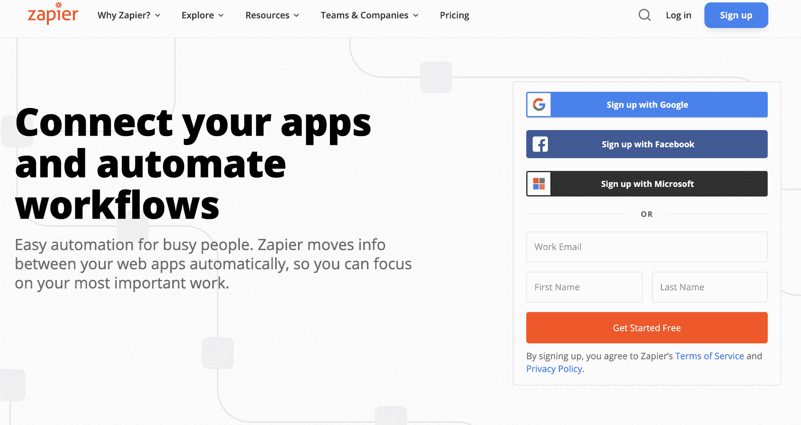

#### 定价💵

Zapier 有一个免费等级和四个其他付费等级，如下所示。

*   **开始:**每月 19.99 美元(按年支付)或每月 29.99 美元(按月支付)
*   专业:每月 49 美元(按年支付)或每月 73.50 美元(按月支付)
*   **团队:**每月 299 美元(按年支付)或每月 448.50 美元(按月支付)
*   公司:每月 599 美元(按年支付)或每月 898.50 美元(按月支付)

## **Shopify**

想创业做电商？你应该去看看 [Shopify](https://www.shopify.com.ng/) 。

你可能会问，为什么？

事实是，Shopify 通过让您创建由强大工具支持的电子商务网站，帮助您找到客户、推动销售和管理日常事务，从而帮助您将业务带到网上。

我喜欢 Shopify，因为它不像大多数平台那样限制你只能卖线上产品。你可以在任何地方销售——亲自到销售点，通过你的网站、社交媒体和在线市场进行在线销售。

**作为开发者，这里有几种使用 Shopify 的方法:**

*   为你的客户或雇主创建一个电子商务网站
*   了解 Shopify 并成为一名 Shopify 开发者(他们会得到一大笔钱)。
*   为开发者社区的人们出售电子书、T 恤衫等等。

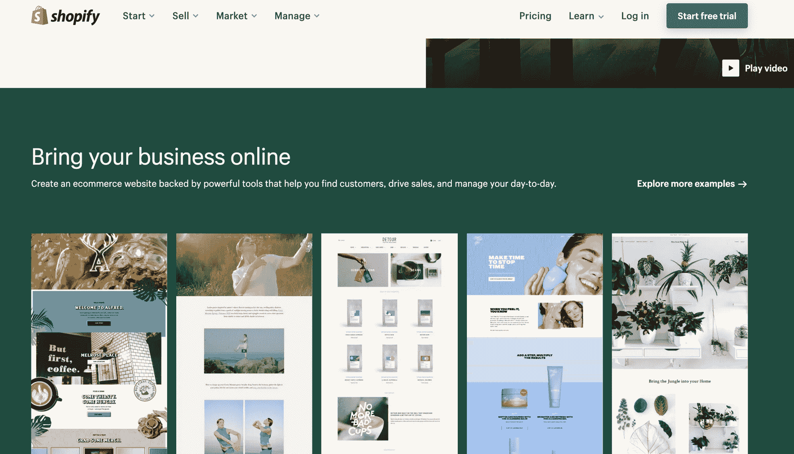

#### 定价💵

*   基本购物:每月 29 美元
*   **Shopify:** $79 包月
*   **高级购物化:** $299 每月

## **Cardd**

无论是个人资料、获取电子邮件的登录页面，还是更复杂的东西， [Cardd](https://carrd.co/) 都有。

你猜怎么着？您可以将这些站点发布到您拥有的任何自定义域，并提供完全的 SSL 支持。

**使用 Cardd，您可以:**

*   为几乎任何内容创建一个简单、免费、响应全面的单页网站。
*   从一个 Carrd 帐户建立和发布三个以上的网站。
*   嵌入来自第三方服务的自定义小部件。

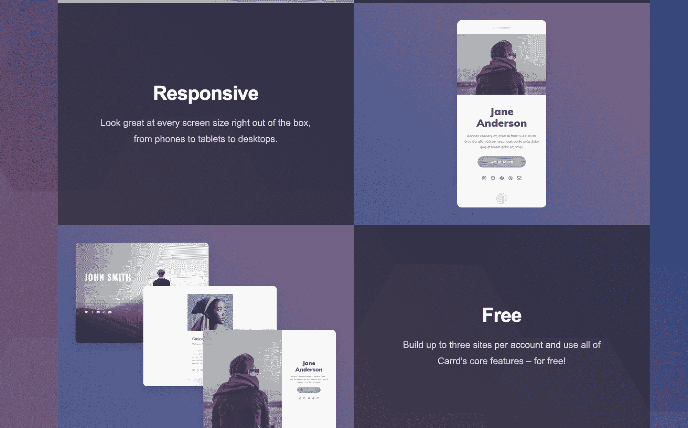

#### 定价💵

Carrd 有一个免费等级和下面列出的其他三个付费等级:

*   Pro Lite: :每年 9 美元
*   **专业标准:** $19 年费
*   **Pro Plus:** $49 年费

## **气动工作台**

Airtable 是一种云协作服务，具有数据库和电子表格的功能，其格式可以让您随时了解正在发生的事情。

Airtable 表格中的字段类似于电子表格中的单元格，但具有诸如复选框、电话号码、下拉列表、图像等类型。

用户可以创建数据库、设置列类型、添加记录、协作、排序记录，甚至将视图发布到外部网站。

无论您需要组织项目可交付成果的日历、编制客户列表，还是组织任何其他类型的信息，Airtable 都可以让您轻松创建和协作。

**作为一名开发人员，这里有几种使用 Airtable 的方法:**

*   Airtable 允许您构建电子表格。因此，您可以将每个电子表格用作数据库。
*   创建为不同用例设计的视图。
*   将您的工作流程连接到数百个应用程序和服务，或者以编程方式访问您的内容。

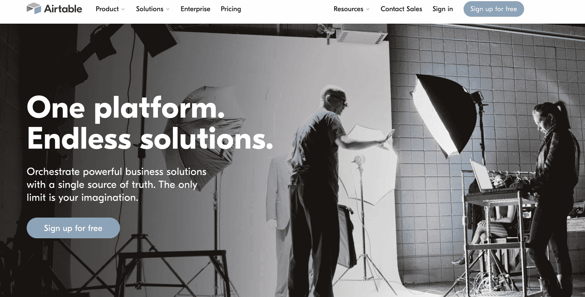

#### 定价💵

Airtable 有一个免费等级和三个其他付费等级，如下所示:

*   **加:** $10 一个月(按年支付)或$24 一个月(按月支付)
*   每月 20 美元(按年支付)或 50 美元(按月支付)
*   企业:您必须联系销售团队才能获得这些信息

## **IFTTT**

有了 [IFTTT](https://ifttt.com/) ，你可以用你以前认为不可能的全新方式连接你的应用和设备。它能让你建立一个更加互联的世界，为**你**工作。

与他们的 API 协议的一个集成将您的产品连接到数百个应用程序、设备和品牌。他们也为开发者准备了精彩的文档。你应该去看看。

**作为一名开发人员，这里有一些使用 IFTTT 的方法:**

*   您将能够深入了解人们如何联系和使用您的产品，从而进一步个性化他们的体验。
*   构建和发布小程序供他人使用。
*   寻找与你的品牌互补的品牌。

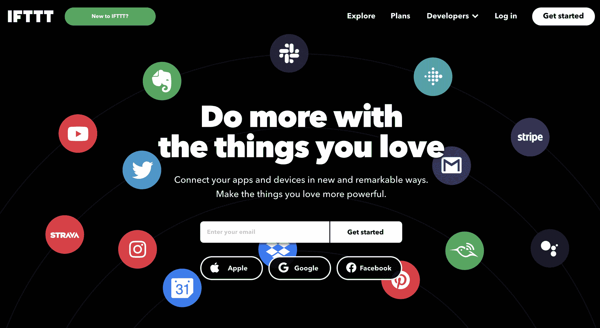

#### 定价💵

IFTTT 有一个免费等级和另外四个付费等级，突出显示如下:

*   **Pro:** $3.99 每月
*   开发者:每年 199 美元
*   团队:您必须联系销售团队才能获得这些信息
*   企业:您必须联系销售团队才能获得这些信息

## **结论**

在一个软件需求远远超过程序员供给的时代，无代码开发工具正在帮助人们快速设计和构建产品和网站。

> 跳上无代码列车的最佳时机就是现在。无代码是未来。如果你现在成为专家，你将是未来最受欢迎的人之一。- **Arun Saigal，Thunkable 联合创始人兼首席执行官。**

上面的引用总结了我对无代码工具的想法，以及为什么你应该现在就开始使用它们。

就这些了，伙计们！我希望这有所帮助。如果是，请在 [Twitter](https://twitter.com/Didicodes) 上关注我，以获取更多类似的内容。