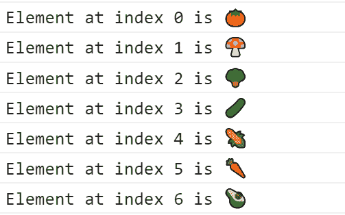

# JavaScript 数组手册——用例子解释 JS 数组方法

> 原文：<https://www.freecodecamp.org/news/the-javascript-array-handbook/>

在编程中，`array`是元素或项目的集合。数组将数据存储为元素，并在需要时检索它们。

数组数据结构在所有支持它的编程语言中被广泛使用。

在这本手册中，我将教你 JavaScript 中所有关于数组的知识。您将了解复杂的数据处理、析构、最常用的数组方法等等。

# 我为什么要写这篇文章？

互联网上已经有很多关于 JavaScript 数组的优秀文章。那么，我为什么还要就同一主题写另一篇文章呢？动机是什么？

嗯，在与我的学员互动的这些年里，我意识到大多数初学者需要一个从头到尾用例子彻底涵盖数组的教程。

所以我决定写一篇充满有意义的例子的文章。如果你是 JavaScript 初学者，我希望你会发现它非常有帮助。

但是，即使作为一个有经验的开发人员，这本手册可能会派上用场，帮助你复习你需要的东西。我在写的时候也在重新学习整个事情。所以让我们开始吧。

# JavaScript 中的数组是什么？

一对`square brackets []`在 JavaScript 中代表一个数组。数组中的所有元素都用`comma(,)`分隔。

在 JavaScript 中，数组可以是任何类型元素的集合。这意味着您可以创建一个包含 String、Boolean、Number、Objects 甚至其他类型元素的数组。

下面是一个包含四个元素的数组示例:类型号、布尔值、字符串和对象。

```
const mixedTypedArray = [100, true, 'freeCodeCamp', {}];
```

一个元素在数组中的位置被称为它的`index`。在 JavaScript 中，数组索引从`0`开始，每个元素加 1。

例如，在上面的数组中，元素 100 位于`index 0`，true 位于`index 1`,‘freeCodeCamp’位于`index 2`，等等。

数组中元素的数量决定了它的长度。例如，上述数组的长度是 4。

有趣的是，JavaScript 数组不是固定长度的。您可以通过分配一个正数值来随时更改长度。稍后我们将了解更多相关信息。

# 如何在 JavaScript 中创建数组

在 JavaScript 中，可以用多种方式创建数组。最直接的方法是将数组值赋给变量。

```
const salad = ['🍅', '🍄', '🥦', '🥒', '🌽', '🥕', '🥑'];
```

你也可以使用`Array`构造函数来创建一个数组。

```
const salad = new Array('🍅', '🍄', '🥦', '🥒', '🌽', '🥕', '🥑');
```

> 请注意:`new Array(2)`将创建一个长度为 2 的数组，其中没有定义任何元素。然而，`new Array(1,2)`将创建一个长度为 2 的数组，其中包含元素 1 和 2。

还有其他方法，比如`Array.of()`和`Array.from()`，并且`spread`操作符(`...`)也可以帮助你创建数组。我们将在本文的后面了解它们。

## 如何在 JS 中从数组中获取元素

您可以使用数组的索引来访问和检索数组中的元素。您需要使用`square bracket`语法来访问数组元素。

```
const element = array[index];
```

基于你的用例，你可以选择一个接一个地或者循环地访问数组元素。

当你像这样使用索引访问元素时:

```
const salad = ['🍅', '🍄', '🥦', '🥒', '🌽', '🥕', '🥑'];
salad[0]; // '🍅'
salad[2]; // '🥦'
salad[5]; // '🥕'
```

您可以使用数组的长度来向后遍历和访问元素。

```
const salad = ['🍅', '🍄', '🥦', '🥒', '🌽', '🥕', '🥑'];
const len = salad.length;
salad[len - 1]; // '🥑'
salad[len - 3]; // '🌽'
```

您还可以使用常规的`for`或`forEach`循环或任何其他循环来遍历数组。

```
const salad = ['🍅', '🍄', '🥦', '🥒', '🌽', '🥕', '🥑'];

for(let i=0; i<salad.length; i++) {
  console.log(`Element at index ${i} is ${salad[i]}`);
}
```

这是输出结果:



## 如何在 JS 中向数组添加元素

使用`push()`方法在数组中插入一个元素。`push()`方法在数组末尾添加一个元素。我们在沙拉里加点花生怎么样，像这样:

```
const salad = ['🍅', '🍄', '🥦', '🥒', '🌽', '🥕', '🥑'];
salad.push('🥜');
```

现在沙拉的排列是:

["🍅", "🍄", "🥦", "🥒", "🌽", "🥕", "🥑", "🥜"]

注意，`push()`方法在数组的末尾添加了一个元素。如果你想在数组的开头添加一个元素，你需要使用`unshift()`方法。

```
const salad = ['🍅', '🍄', '🥦', '🥒', '🌽', '🥕', '🥑'];
salad.unshift('🥜');
```

现在沙拉的排列是:

["🥜", "🍅", "🍄", "🥦", "🥒", "🌽", "🥕", "🥑"]

## 如何在 JS 中从数组中移除元素

从数组中移除单个元素最简单的方法是使用`pop()`方法。每次调用`pop()`方法时，它都会从数组末尾移除一个元素。然后，它返回移除的元素并更改原始数组。

```
const salad = ['🍅', '🍄', '🥦', '🥒', '🌽', '🥕', '🥑'];
salad.pop(); // 🥑

console.log(salad); // ['🍅', '🍄', '🥦', '🥒', '🌽', '🥕']
```

使用`shift()`方法从数组的开头移除一个元素。像`pop()`方法一样，`shift()`返回移除的元素并改变原始数组。

```
const salad = ['🍅', '🍄', '🥦', '🥒', '🌽', '🥕', '🥑'];
salad.shift(); // 🍅

console.log(salad); // ['🍄', '🥦', '🥒', '🌽', '🥕', '🥑'];
```

## 如何在 JS 中复制和克隆一个数组

您可以使用`slice()`方法将一个数组复制并克隆到一个新数组。注意，`slice()`方法不会改变原始数组。相反，它创建原始数组的一个新的浅表副本。

```
const salad = ['🍅', '🍄', '🥦', '🥒', '🌽', '🥕', '🥑'];
const saladCopy = salad.slice();

console.log(saladCopy); // ['🍅', '🍄', '🥦', '🥒', '🌽', '🥕', '🥑']

salad === saladCopy; // returns false
```

或者，您可以使用`spread`操作符来创建数组的副本。我们很快就会了解到这一点。

## JS 中如何判断一个值是否是数组

您可以使用`Array.isArray(value)`方法确定一个值是否是一个数组。如果传递的值是数组，则该方法返回 true。

```
Array.isArray(['🍅', '🍄', '🥦', '🥒', '🌽', '🥕', '🥑']); // returns true
Array.isArray('🍅'); // returns false
Array.isArray({ 'tomato': '🍅'}); // returns false
Array.isArray([]); // returns true
```

# JavaScript 中的数组析构

在 ECMAScript 6 (ES6)中，我们有了一些新的语法，可以从一个数组中提取多个属性，并一次性将它们分配给变量。它可以方便地帮助您保持代码的整洁和简洁。这种新语法被称为析构语法。

下面是一个使用析构语法从数组中提取值的示例:

```
let [tomato, mushroom, carrot] = ['🍅', '🍄', '🥕'];
```

现在，您可以在代码中使用这些变量:

```
console.log(tomato, mushroom, carrot); // Output, 🍅 🍄 🥕
```

要在不进行析构的情况下做同样的事情，它应该是这样的:

```
let vegetables = ['🍅', '🍄', '🥕'];
let tomato = vegetables[0];
let mushroom= vegetables[1];
let carrot= vegetables[2];
```

因此，析构语法使您不必编写大量代码。这极大地提高了你的工作效率。

## 如何将默认值赋给变量

当数组元素没有值或`undefined`时，可以使用析构来分配默认值。

在下面的例子中，我们为蘑菇变量指定了一个默认值。

```
let [tomato , mushroom = '🍄'] = ['🍅'];
console.log(tomato); // '🍅'
console.log(mushroom ); // '🍄'
```

## 如何跳过数组中的值

通过析构，您可以跳过数组元素来映射到变量。例如，您可能对数组中的所有元素都不感兴趣。在这种情况下，跳过一个值就很方便了。

在下面的例子中，我们跳过了蘑菇元素。请注意表达式左侧变量声明中的空格。

```
let [tomato, , carrot] = ['🍅', '🍄', '🥕'];

console.log(tomato); // '🍅'
console.log(carrot); // '🥕'
```

## JS 中嵌套数组的析构

在 JavaScript 中，数组可以嵌套。这意味着一个数组可以有另一个数组作为元素。数组嵌套可以达到任何深度。

例如，让我们为水果创建一个嵌套数组。里面有一些水果和一系列蔬菜。

```
let fruits = ['🍈', '🍍', '🍌', '🍉', ['🍅', '🍄', '🥕']];
```

您将如何访问🥕从上面的数组？同样，你可以在不析构的情况下做到这一点，就像这样:

```
const veg = fruits[4]; // returns the array ['🍅', '🍄', '🥕']
const carrot = veg[2]; // returns '🥕'
```

或者，您可以使用以下简写语法:

```
fruits[4][2]; // returns '🥕'
```

您也可以使用析构语法来访问它，如下所示:

```
let [,,,,[,,carrot]] = ['🍈', '🍍', '🍌', '🍉', ['🍅', '🍄', '🥕']];
```

# 如何在 JavaScript 中使用 Spread 语法和 Rest 参数

从 ES6 开始，我们可以使用`...`(是的，三个连续的点)作为扩展语法，并在数组析构中使用 rest 参数。

*   对于 rest 参数，`...`出现在析构语法的左侧。
*   对于 spread 语法，`...`出现在析构语法的右边。

## 如何在 JS 中使用 Rest 参数

用`Rest Parameter`，我们可以把一个数组的左边元素映射到一个新的数组中。rest 参数必须是析构语法中的最后一个变量。

在下面的例子中，我们将数组的前两个元素映射到了番茄和蘑菇变量。使用`...`将剩余的元素映射到`rest`变量。`rest`变量是一个包含剩余元素的新数组。

```
const [tomato, mushroom, ...rest] = ['🍅', '🍄', '🥦', '🥒', '🌽', '🥕', '🥑'];

console.log(tomato); // '🍅'
console.log(mushroom); // '🍄'
console.log(rest); // ["🥦", "🥒", "🌽", "🥕", "🥑"]
```

## 如何在 JS 中使用 Spread 运算符

使用 spread 运算符，我们可以创建现有阵列的克隆/拷贝，如下所示:

```
const salad = ['🍅', '🍄', '🥦', '🥒', '🌽', '🥕', '🥑'];

const saladCloned = [...salad];
console.log(saladCloned); // ["🍅", "🍄", "🥦", "🥒", "🌽", "🥕", "🥑"]

salad === saladCloned // false
```

# JavaScript 中的解构用例

让我们来看几个激动人心的数组析构、spread 操作符和 rest 参数的用例。

## 如何用析构交换值

我们可以使用数组析构语法轻松地交换两个变量的值。

```
let first = '😔';
let second = '🙂';
[first, second] = [second, first];

console.log(first);  // '🙂'
console.log(second); // '😔'
```

## 如何合并数组

我们可以合并两个数组，并用两个数组中的所有元素创建一个新数组。让我们用两个数组——一个有几个笑脸，另一个有几个蔬菜。

```
const emotion = ['🙂', '😔'];
const veggies = ['🥦', '🥒', '🌽', '🥕'];
```

现在，我们将合并它们以创建一个新的数组。

```
const emotionalVeggies = [...emotion, ...veggies];
console.log(emotionalVeggies); // ["🙂", "😔", "🥦", "🥒", "🌽", "🥕"]
```

# JavaScript 数组方法

到目前为止，我们已经看到了一些数组属性和方法。让我们快速回顾一下我们已经看过的内容:

*   `push()`–在数组末尾插入一个元素。
*   `unshift()`–在数组的开头插入一个元素。
*   `pop()`–从数组末尾删除一个元素。
*   `shift()`–从数组的开头删除一个元素。
*   `slice()`–创建数组的浅层副本。
*   `Array.isArray()`–确定一个值是否为数组。
*   `length`–确定数组的大小。

现在我们将通过例子学习其他重要的 JS 数组方法。

## 如何用 JavaScript 创建、删除、更新和访问数组

在这一节中，我们将学习可以用来创建新数组、删除元素以清空数组、访问元素等等的方法。

### `concat()`阵列法

`concat()`方法合并一个或多个数组，并返回合并后的数组。这是一个不可变的方法。这意味着它不会改变(变异)现有的数组。

让我们连接两个数组。

```
const first = [1, 2, 3];
const second = [4, 5, 6];

const merged = first.concat(second);

console.log(merged); // [1, 2, 3, 4, 5, 6]
console.log(first); // [1, 2, 3]
console.log(second); // [4, 5, 6]
```

使用`concat()`方法我们可以合并两个以上的数组。我们可以使用以下语法合并任意数量的数组:

```
array.concat(arr1, arr2,..,..,..,arrN);
```

这里有一个例子:

```
const first = [1, 2, 3];
const second = [4, 5, 6];
const third = [7, 8, 9];

const merged = first.concat(second, third);

console.log(merged); // [1, 2, 3, 4, 5, 6, 7, 8, 9]
```

### `join()`阵列法

`join()`方法使用分隔符连接数组的所有元素，并返回一个字符串。用于连接的默认分隔符是`comma(,)`。

```
const emotions = ['🙂', '😍', '🙄', '😟'];

const joined = emotions.join();
console.log(joined); // "🙂,😍,🙄,😟" 
```

您可以传递您选择的分隔符来连接元素。以下是使用自定义分隔符连接元素的示例:

```
const joined = emotions.join('<=>');
console.log(joined); // "🙂<=>😍<=>🙄<=>😟"
```

在空数组上调用`join()`方法会返回一个空字符串:

```
[].join() // returns ""
```

### `fill()`阵列法

方法用静态值填充一个数组。您可以将所有元素更改为静态值，或者更改一些选定的项目。注意，`fill()`方法改变了原始数组。

```
const colors = ['red', 'blue', 'green'];

colors.fill('pink');
console.log(colors); // ["pink", "pink", "pink"]
```

下面是一个例子，我们使用`fill()`方法只改变了数组的最后两个元素:

```
const colors = ['red', 'blue', 'green'];

colors.fill('pink', 1,3); // ["red", "pink", "pink"]
```

在这种情况下，`fill()`方法的第一个参数是我们用来改变的值。第二个参数是要更改的起始索引。从`0`开始。最后一个参数是确定在哪里停止填充。它的最大值可能是`colors.length`。

请查看这个 Twitter 帖子，了解`fill()`方法的实际用法。

> 你在实践中用过 [#JavaScript](https://twitter.com/hashtag/JavaScript?src=hash&ref_src=twsrc%5Etfw) array fill()方法吗？它用一个静态值填充所有数组元素。🧵 👇pic.twitter.com/ahfsJBOacT[# dev community](https://twitter.com/hashtag/DEVCommunity?src=hash&ref_src=twsrc%5Etfw)[# 100 daysofcode](https://twitter.com/hashtag/100DaysOfCode?src=hash&ref_src=twsrc%5Etfw)
> 
> — Tapas Adhikary (@tapasadhikary) [February 12, 2021](https://twitter.com/tapasadhikary/status/1360185996768251904?ref_src=twsrc%5Etfw)