# 来自 Stack Overflow 2016 年对 50，000 名开发人员的调查的见解

> 原文：<https://www.freecodecamp.org/news/2-out-of-3-developers-are-self-taught-and-other-insights-from-stack-overflow-s-2016-survey-of-50-8cf0ee5d4c21/>

今天，Stack Overflow 发布了他们 2016 年对 5 万多名开发者的调查结果。

我梳理了这份大文件，为您带来其中最令人惊讶的见解。开始了。

#### 相对于一名女性开发人员，至少有九名男性开发人员。

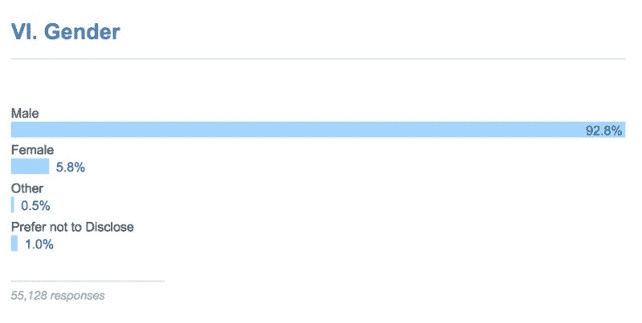

我们在技术部门没有足够的女性。这对任何人来说都不是新闻。但是 15 比 1 的男女比例？这比大多数人意识到的差距要大得多。

看看女性开发人员的年龄分布就能明白其中的原因。

#### 三四十岁的女性开发者要少得多。

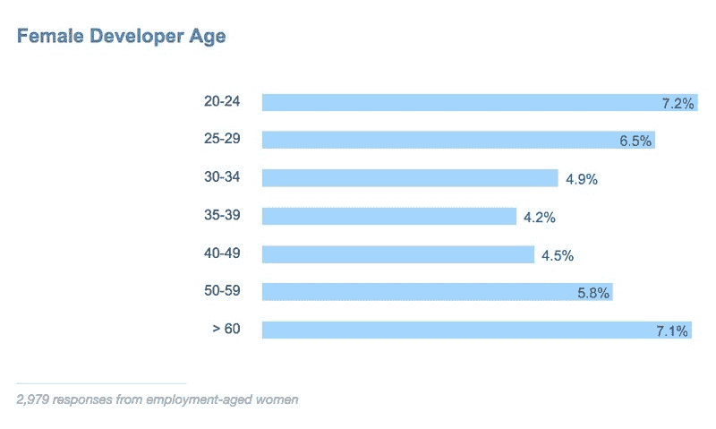

大多数女性开发人员都是 20 多岁或者 50 多岁。从这张图表中，你可以看到整整一代女性在软件开发领域的代表性比正常情况下更低。

在性别平等方面有一个积极的发展…

#### 在职业生涯的早期，美国的女性开发人员现在和男性开发人员挣得一样多。

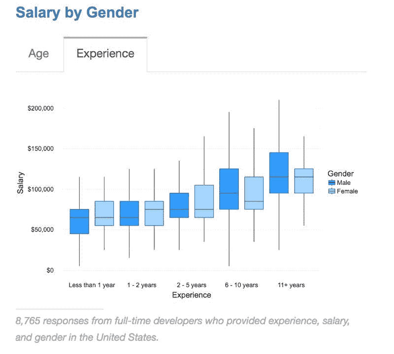

幸运的是，有一个领域的软件开发非常多样化:教育背景。

#### 学习编程最流行的方法仍然是自己看书。

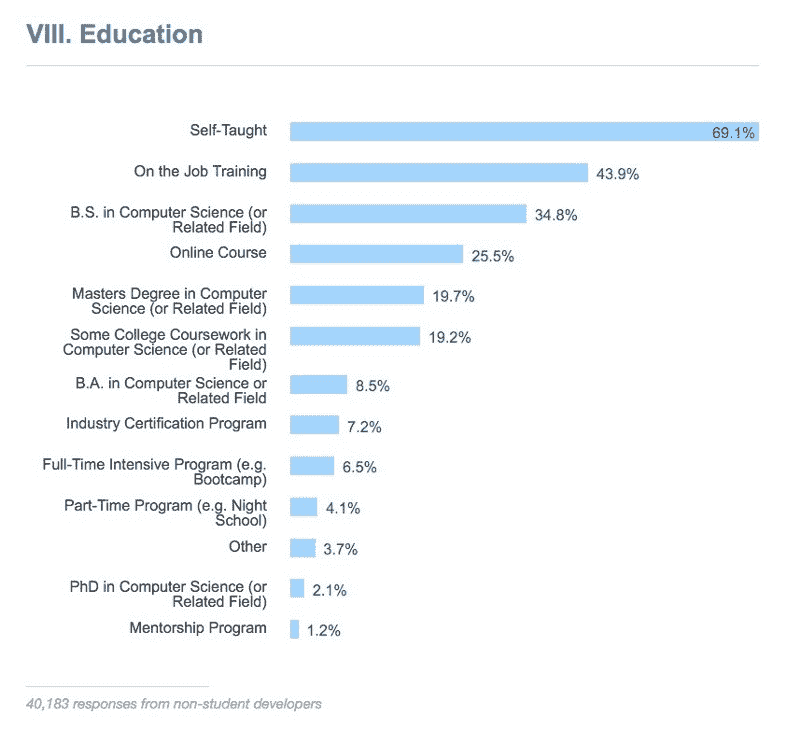

大多数开发人员通过自学、在职培训和学术研究的某种组合来学习。

不到一半的开发人员拥有技术相关的本科或研究生学位。

#### 教育对你薪水的影响没有你想象的那么大。

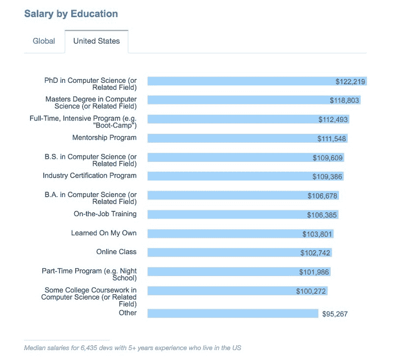

获得计算机科学博士学位需要大约 5 年的时间，但它只能让你在理科学士的基础上多挣 9%的薪水。

辞掉工作，花 15000 美元参加一个编码训练营——尽管他们有选择性并能帮助安排工作——只比你继续工作和自学多挣 8692 美元。

请注意，这些数字是针对居住在美国的拥有 5 年以上经验的开发人员的。

当 Stack Overflow 发布他们的数据集时，我们将进一步挖掘这些数字，他们计划下周这样做。

那么这些开发人员从事什么类型的工作呢？

#### 一半的开发人员是 web 开发人员。

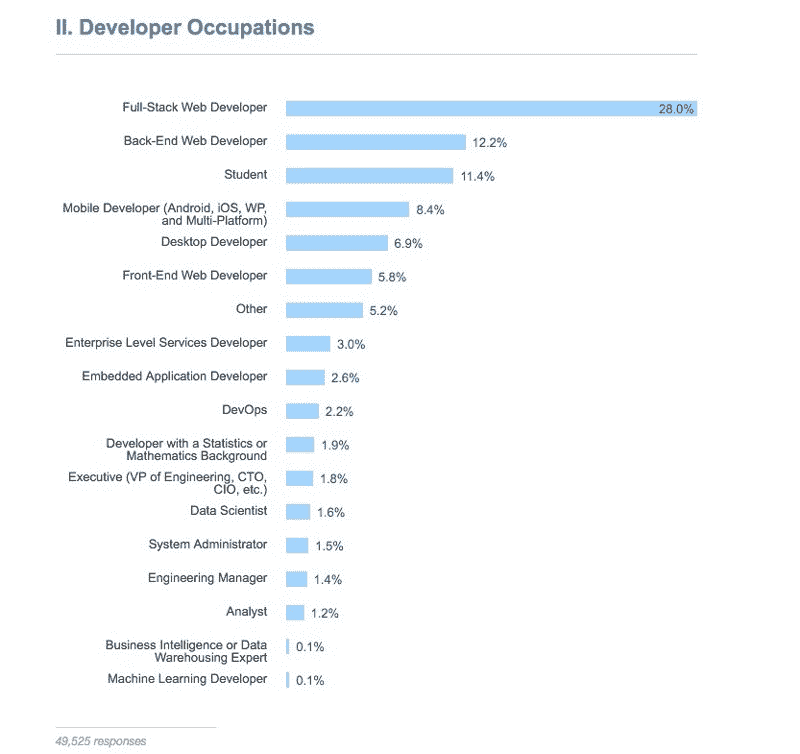

网络仍然是完成大部分工作的平台。移动和桌面的原生开发平台加起来占了不到 15%的工作岗位。

部分原因可能是因为网络本质上是每个人的后端。大多数本机应用程序都与 web APIs 挂钩。甚至 Instagram 的网络后端也比你手机上运行的移动应用程序要复杂得多。

考虑到 web 开发的流行，开发人员在工作中使用了哪些技术？

#### JavaScript 和 SQL 仍然是最受欢迎的技术(自 2013 年这项调查开始以来一直如此)。

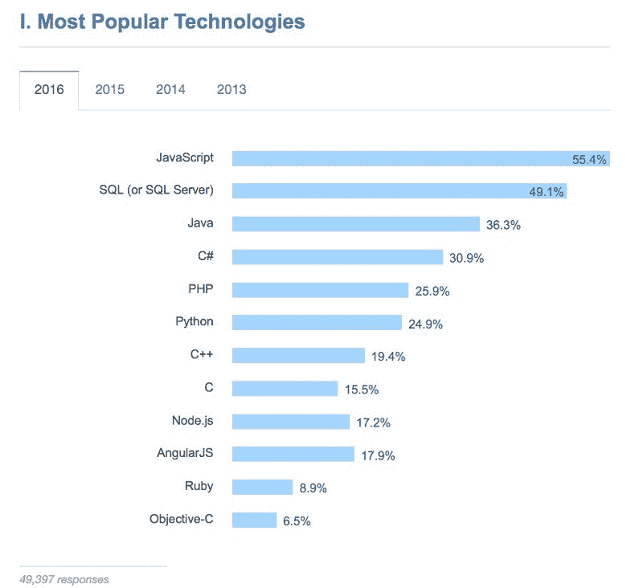

JavaScript 仍然是使用最广泛的工具，并且受到专门开发前端的开发人员的欢迎:

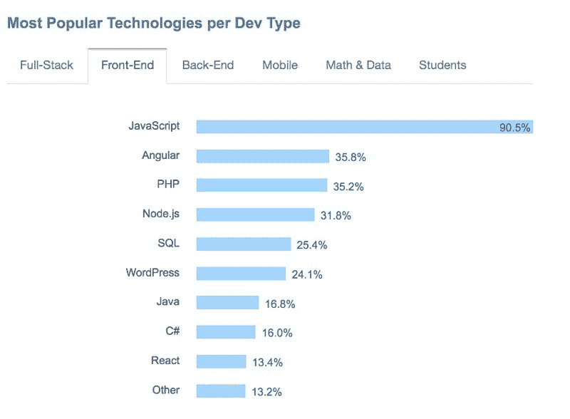

事实上，JavaScript 现在也是最受后端开发人员欢迎的语言。

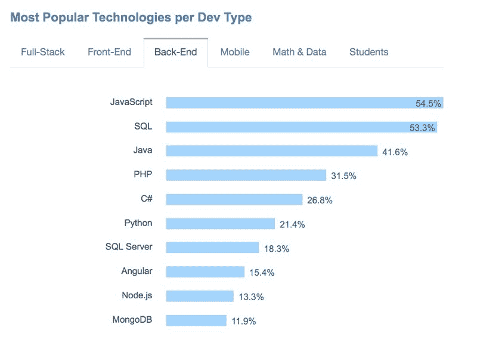

SQL 的受欢迎程度有所下降，部分原因是像 MongoDB 这样的 NoSQL 数据库的兴起(它使用 JavaScript 而不是 SQL 作为查询语言)。

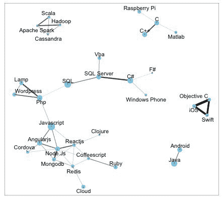

Data Scientist [David Robinson](https://twitter.com/drob) made this visualization based on Stack Overflow’s data to show the relationships between technologies.

#### Mac OS X 现在是最受开发者欢迎的操作系统。

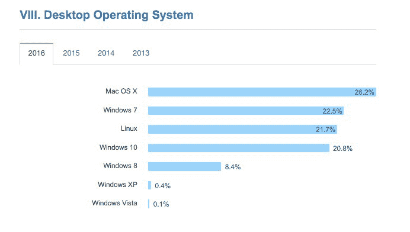

Windows 7 是去年最受欢迎的，如果你把 Windows 的所有版本加起来，它仍然被一半的开发者使用。

有趣的是，我在旧金山黑客马拉松上看到的几乎所有开发者现在都使用 MAC。

许多开发人员欢迎的一个趋势是笑话职称的消失。

#### 大多数开发人员简单地称自己为“开发人员”

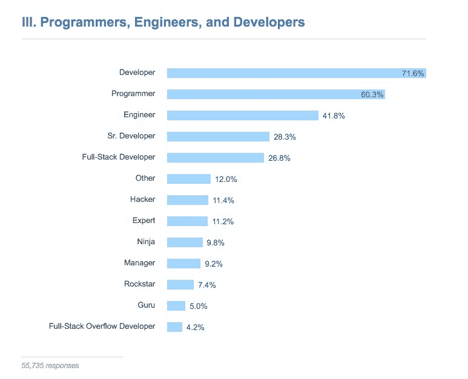

我已经写了关于“开发人员”有许多同义词，以及开发人员如何倾向于把“软件工程师”放在他们的简历上，因为它听起来更重要。

如今，越来越少的人倾向于称自己为“摇滚明星”、“忍者”或“大师”。“黑客”仍然有点流行，尽管这个术语对非程序员来说有负面的含义，他们容易把“黑客”和黑帽“破解者”混淆。

但是称自己为“忍者”有点幼稚，对吧？当然，这些孩子在这个领域的代表性不足…

#### 一个开发者的平均年龄是 29.6 岁。年龄中位数是 27 岁。

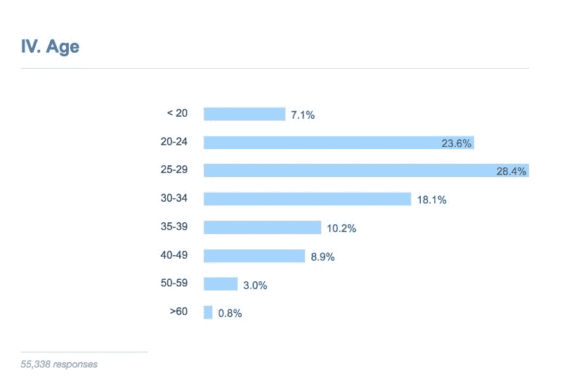

实际上，超过一半的开发人员年龄在 30 岁以下。我已经[写了一点](https://www.quora.com/Which-professions-are-less-prone-to-age-discrimination-than-software-engineering/answer/Quincy-Larson)为什么我认为这是。我认为这不仅仅是年龄歧视的问题，尽管这可能是一个因素。其他需要考虑的事项:

*   开发人员通常会进入管理层。
*   开发商赚的钱多，所以可能可以更早退休。
*   软件开发人员可能还没到老年就筋疲力尽了。
*   在发展中国家，大约 80%的人生活在那里，软件开发直到最近才成为一个可行的职业。
*   世界人口偏年轻。人类平均年龄只有 30 岁。

值得指出的是，去年的堆栈溢出调查发现平均年龄只有 28.9 岁，因此软件开发作为一种职业可能有点老化。

#### 一般的开发人员只有 5 年或更少的编程经验

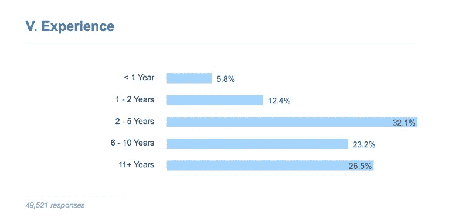

我们是一个领域的新手。我怀疑有任何其他职业只有四分之一的从业者有超过十年的经验(除了专业的攀岩者)。

所以，下次你想假装惊讶说“哦，你没听说过 _____”时，请记住这一点

#### 找工作最常见的方式是通过朋友

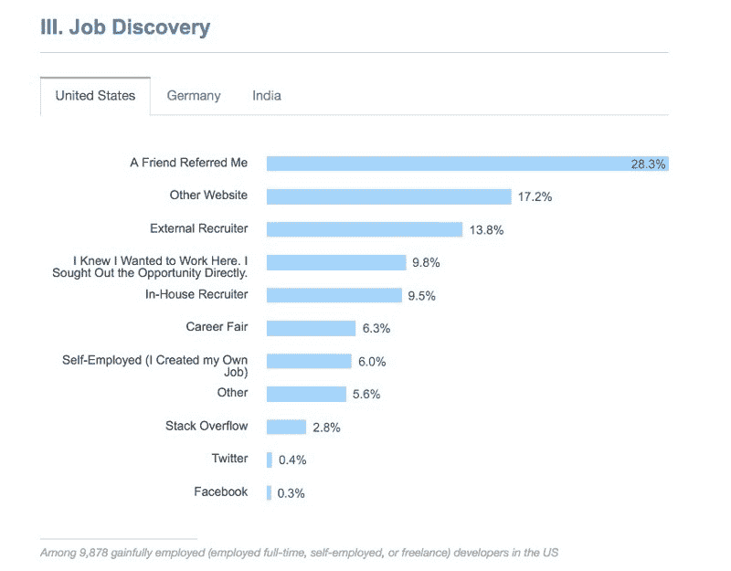

印度是唯一一个个人推荐不是最常见的求职方式的国家(仅次于内部招聘)。

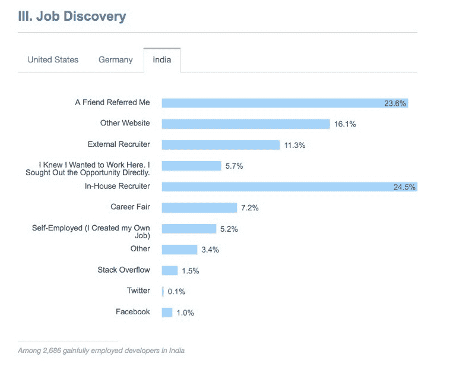

#### 工资仍然是就业决策中最优先考虑的因素

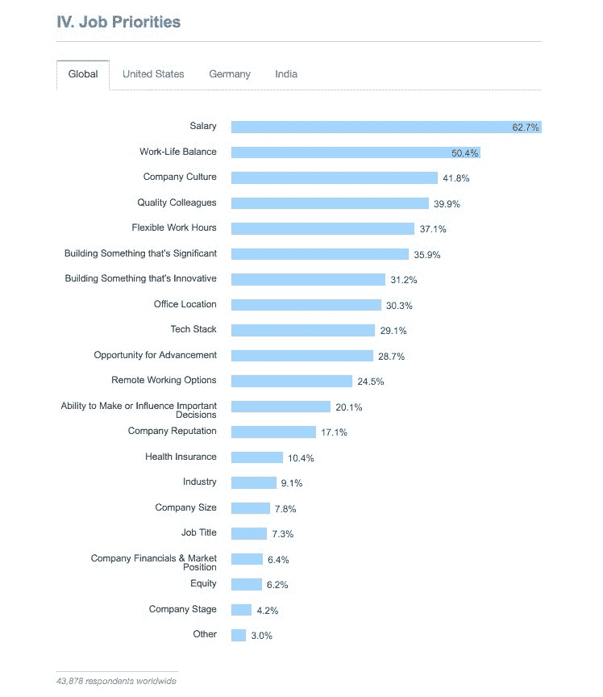

德国开发人员优先考虑工作与生活的平衡，略高于工资。在印度，工资是最重要的因素。

这给我们带来了对软件开发以外的人来说可能是最令人惊讶的结果。

#### 不到四分之一的软件开发工作是在软件产品行业。

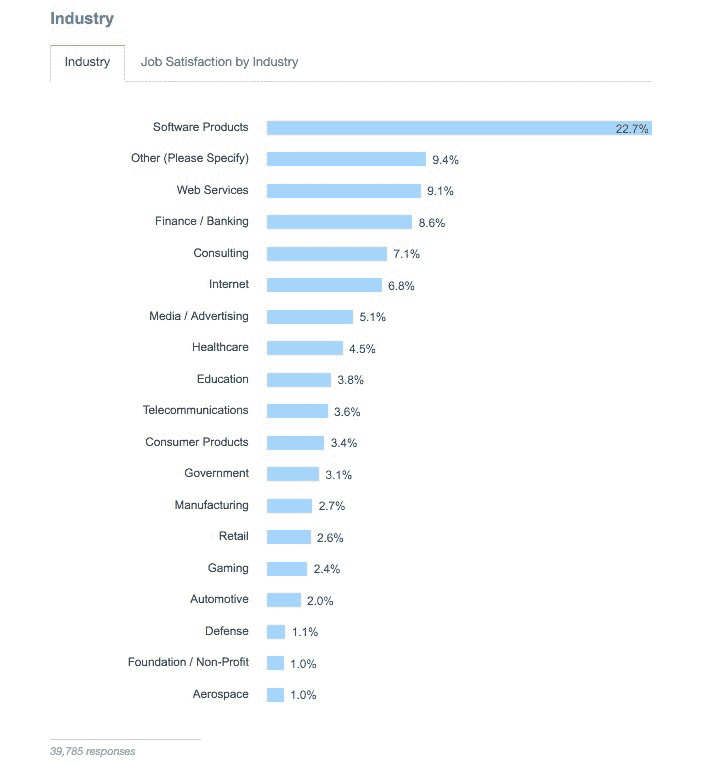

开发人员代表了广泛的领域。几乎每个大公司都有开发人员。它很快成为美国最常见的职位之一。

Despite the stereotypes, this is not a typical developer workplace.

不要仅仅停留在阅读我的分析——去看看[完整的调查](http://stackoverflow.com/research/developer-survey-2016),在评论中分享你的见解。

我只写编程和技术。如果你在推特上关注我，我不会浪费你的时间。？