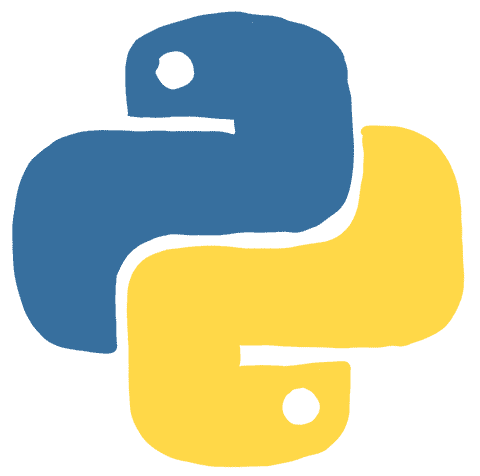

# 如何编写 20 个初级 Python 项目

> 原文：<https://www.freecodecamp.org/news/20-beginner-python-projects/>

你想提高你的 Python 技能吗？试着编码这 20 个 Python 项目！

我们刚刚在 freeCodeCamp.org YouTube 频道上发布了一个视频课程，将教你如何创建 20 个有趣的 Python 项目。

孙铁麟·托克创建了这门课程。在他自己的频道和 freeCodeCamp.org 频道，孙铁麟创作了一系列非常受欢迎的教程。

这些初学者项目非常适合想要练习 Python 技能的初学者。以下是您将在本课程中构建的项目:

*   电子邮件发送者
*   单词替换程序
*   基本计算器
*   电子邮件切片器
*   二分搜索法算法
*   问答节目
*   QR 码生成器
*   利息支付计算器
*   随机密码生成器
*   骰子滚动模拟器
*   站点连接检查器
*   货币转换器
*   闰年检查器
*   单词词典
*   石头，布，剪刀
*   Python 人脸检测
*   Python 自动化
*   卷筒纸刮刀
*   Image Resizer
*   绘图机

观看以下全部课程或在 freeCodeCamp.org YouTube 频道观看[(3 小时观看)。](https://youtu.be/pdy3nh1tn6I)

[https://www.youtube.com/embed/pdy3nh1tn6I?feature=oembed](https://www.youtube.com/embed/pdy3nh1tn6I?feature=oembed)