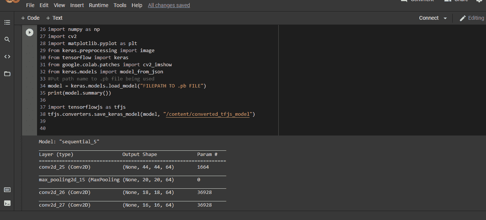
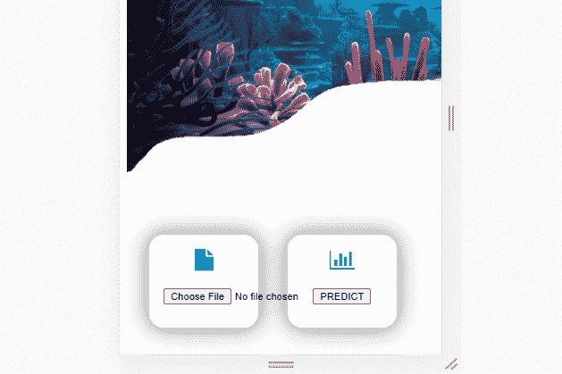
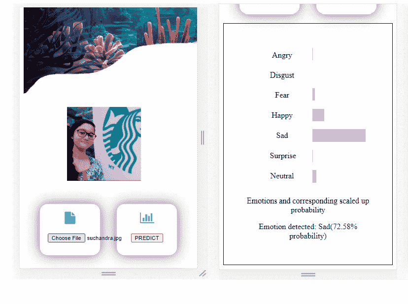

# 如何将 Keras SavedModel 转换为基于浏览器的 Web 应用程序

> 原文：<https://www.freecodecamp.org/news/convert-keras-savedmodel-into-browser-based-webapp/>

如果您是使用 Keras SavedModels 的 Python 开发人员，那么本文适合您。

也许你不确定如何在基于浏览器的 web 应用程序中使用 SavedModels 来利用机器学习的力量。但是不要担心，我们将涵盖您开始所需的所有基本步骤。

除此之外，我们还将回顾一些重要的概念，这些概念将帮助您更容易地从 Python 过渡到 JavaScript。

在我们深入研究这个过程之前，让我们先解决一些此时可能会突然出现在您脑海中的问题。

## What is a Keras SavedModel?

Keras 模型由网络架构、模型权重和损失函数优化器组成。

在磁盘上保存模型的默认格式是 SavedModel 格式。这种格式允许我们以最少的麻烦保存带有自定义对象的模型。

SavedModel 将优化器、损耗和网络架构存储在 saved_model.pb 文件中，而权重存储在 variables 目录中。

有关 SavedModel 格式的更多详细信息，请查看这里的官方文档。

## 如果我没有 GPU，如何训练一个 Keras SavedModel？

大多数无法访问 GPU 设施的机器学习爱好者都是从谷歌实验室的模型开发开始的。

自从我第一次对机器学习领域感兴趣以来，我一直是谷歌 Colab 及其功能的狂热崇拜者。它提供了一个 Jupyter 笔记本电脑环境，可以免费访问 GPU，最长培训时间为 12 小时。

如果你对谷歌合作实验室有任何疑问，请前往他们的 FAQ 部分，链接[这里](https://research.google.com/colaboratory/faq.html#:~:text=How%20long%20can%20notebooks%20run,or%20based%20on%20your%20usage.)。

## 我为什么要将 SavedModel 转换成 web 应用程序？

基于网络的产品无处不在，而且通常都很容易使用。你可能正在通过手机、台式机或笔记本电脑上的浏览器阅读这篇文章。

归根结底，机器学习模型是为了在现实世界中使用，而不是保存在玻璃盒子里。那么，除了通过基于网络的媒介，还有什么更好的方式把你的模型带给用户呢？

最重要的是，基于浏览器的应用程序不需要任何安装开销，并且可以从多个设备上统一访问。

## 好吧，那我们开始吧

我使用 Python 和 Keras API 构建了一个简单的情绪检测 CNN 模型，可以预测 7 种情绪(快乐、悲伤、中性、愤怒、惊讶、恐惧和厌恶)。

在没有经验的情况下，尝试将它转换成适合 web 的格式被证明有点困难。我接下来将描述的整个过程，要归功于 [Tensorflow.js](https://www.tensorflow.org/js/tutorials/setup) 、 [MDN Web docs](https://developer.mozilla.org/en-US/docs/Web/API/File/Using_files_from_web_applications) 和 [Firebase 托管文档](https://firebase.google.com/docs/hosting)的精彩文档。

使用这些资源，我能够将流程缩小到以下步骤:

*   将 Keras SavedModel 转换为 Tensorflow.js 图层格式
*   通过 JavaScript 加载模型并承诺
*   访问用户上传的图像
*   预处理上传的图像
*   浏览器中的模型推断和通过用户界面显示输出

让我们更详细地看一下这些步骤。


Photo from Unsplash

## 如何将 Keras SavedModel 转换为 Tensorflow.js 图层格式

要将 Keras SavedModel 转换为 Tensorflow.js layers 格式，我们需要使用 tensorflowjs_converter 脚本。我们也可以使用 Python API，如他们的官方文档[这里](https://www.tensorflow.org/js/tutorials/conversion/import_keras)所述。

对于前者，我遇到了一个令人沮丧的错误，因为出于某种原因，tensorflowjs_converter 似乎无法在 Google Colab 上工作。

我将模型保存在驱动器上，文件路径的“我的驱动器”部分，特别是空间，似乎引起了问题。我发现在这期 GitHub # 3618[这里](https://github.com/tensorflow/tfjs/issues/3618)有提到。

使用 Python API 可以无缝地工作，这给了我一个用于模型架构的 model.json 文件和用于权重的二进制文件。现在我已经准备好在网络上使用它了！



Code to convert SavedModel Format to Layers Format

但是等等！为什么我们需要转换？为什么不直接用 Tensorflow.js 本身来训练我们的模型呢？

如果您已经花了很多时间在大型数据集上训练 Keras 模型，并且不想使用 JavaScript 重写和重新训练它，那么您需要进行这种转换。

## 如何通过 JavaScript 和 Promises 加载模型

[Tensorflow.js](https://www.tensorflow.org/js/tutorials) 是一个基于 JavaScript 的库，用于机器学习模型开发。您可以在浏览器中使用它，也可以通过流行的 JavaScript runtime Node.js 使用它。

您可以通过两种不同的方式来设置它:要么使用脚本标记来包含它，要么通过 Node.js 来使用它。

因为我训练的 CNN 模型相当简单，所以我选择了脚本标记方法。

```
<script src="https://cdn.jsdelivr.net/npm/@tensorflow/tfjs@2.0.0/dist/tf.min.js"></script>
```

现在我们已经包含了 Tensorflow.js 库，下一步是加载模型。我们可以通过以下方式加载模型:

*   浏览器的本地存储
*   浏览器的索引数据库存储
*   从 HTTP 或 HTTPS 端点
*   使用 Node.js 从本机文件系统

从 HTTPS 端点加载模型对我来说似乎是最可行的方式。因此，我将模型文件托管在 Firebase Hosting 上，并使用以下代码加载模型:

```
const model = await tf.loadLayersModel('model.json'); 
```

Tensorflow 使用`fetch`方法通过基于承诺的方法加载资源。Fetch 返回一个承诺，该承诺解析为包含所请求资源的响应。

JavaScript 中的承诺是一个值的代理，这个值你在当前时刻不知道，但在以后的某个时间点可能会知道。

例如，当请求基于 URL 的资源时，我们不能立即知道我们是否真的会得到这些资源——我们必须等待一段时间，直到服务器响应(或者没有响应)。

但是任何形式的等待都不利于响应和持续的用户交互，而这对于网页来说是至关重要的。所以 JavaScript 允许你通过承诺使用异步调用。这些允许您请求资源并继续执行后续语句，而不管服务器的响应如何。

为了允许更干净、更容易的错误处理，引入了 async/await。Await 阻塞控制流，直到 Promise 返回并且带有 await 语句的函数被声明为异步。

## 如何访问用户上传的图像

让我们创建一个简单的文件上传功能，它使用一个 HTML 输入标签和另一个按钮，单击该按钮将开始预测计算。

```
<div class="container" id="tray">
		<div id="uploadFile" class="custombutton">
			<i class="fa fa-file" style="font-size:25px;color: #1ab5e3"></i><br/><br/>
			<input type="file" name="fileupload" accept="image/*" onchange="display(event)">
		</div>
		<div class="custombutton">
			<i class="fa fa-bar-chart" style="font-size:25px;color: #1ab5e3"></i><br/><br/>
			<input type="button" name="predict" onclick="predict_emotion()" value="PREDICT">
		</div>
	</div>
```

“文件上传”和“预测”按钮如下所示:



接下来，我们访问上传的图像文件，并使用 MDN Web 文档中描述的对象 URL 显示它。

```
let input_image = document.getElementById("input_image")
input_image.src = URL.createObjectURL(event.target.files[0]);
document.getElementById("input_image_container").style.display = "block";

<div id="input_image_container"></div>
```

上传一张图片后，看起来是这样的:


## 如何对上传的图像进行预处理

这是特定于模型域的，对于不同的应用程序需要不同的步骤。

对于我的模型，我不需要做太多，只需要一些简单的标准化和调整大小，我可以使用 Tensorflow.js 函数轻松完成。

请务必查看他们的官方 API 参考资料，以全面了解所提供的功能及其用例。

```
//Preprocessing steps 
		/*
		(1)Resize to 48*48
		(2)Convert to grayscale using simple mean
		(3)Convert to float
		(4)Reshape to (1,48,48,1)
		(5)Normalize by dividing by 255.0
		*/
let step1 = tf.browser.fromPixels(input)
.resizeNearestNeighbor([48,48])
.mean(2)
.toFloat()
.expandDims(0)
.expandDims(-1)
.div(255.0)
```

## 在浏览器中进行模型推断，并通过用户界面显示输出

predict 函数返回预测值——在我们的例子中，是一个包含 7 种情绪的 7 个概率值的张量。

我们对每种情绪使用一个 div 来放大在浏览器中显示的概率，并使用 div 的宽度来指定放大的概率值。

```
pred = model.predict(step1)
pred.data()
    .then((data) => {console.log(data)
		   		output = document.getElementById("output_chart")
		    	output.innerHTML = ""
		    	max_val = -1
		    	max_val_index = -1
				for(let i=0;i<data.length;i++)
				{
					style_text = "width: "+data[i]*150+"px; height: 25px; position:relative; margin-top: 3vh; background-color: violet; "
					output.innerHTML+="<div style = '" +style_text+ "'></div>"
					if(data[i] > max_val)
					{
						max_val = data[i]
						max_val_index = i
					}
				}
				EMOTION_DETECTED = emotions[max_val_index]
				document.getElementsByClassName("output_screen")[0].style.display="flex";
document.getElementById("output_text").innerHTML=""
document.getElementById("output_text").innerHTML = "<p>Emotions and corresponding scaled up probability</p><p>Emotion detected: " + EMOTION_DETECTED + "(" + (max_val*100).toFixed(2) + "% probability)</p>"
```

太好了，我们已经准备好了所有的构建模块！现在让我们把它们放在一起。我们将整合以下部分:

*   用作简单用户界面的 HTML 标记
*   用于访问 Tensorflow.js 的脚本标记
*   脚本标签为我们的字体真棒图标
*   用于模型加载、推理和输出的 JavaScript 代码

下面是最终的 JavaScript 代码:

```
//Display image uploaded by user
function display(event)
	{
		let input_image = document.getElementById("input_image")
		input_image.src = URL.createObjectURL(event.target.files[0]);
		document.getElementById("input_image_container").style.display = "block";
	}

//Predict emotion and display output
async function predict_emotion()
	{
		let input = document.getElementById("input_image");
		//Preprocessing steps 
		/*
		(1)Resize to 48*48
		(2)Convert to grayscale using simple mean
		(3)Convert to float
		(4)Reshape to (1,48,48,1)
		(5)Normalize by dividing by 255.0
		*/
		let step1 = tf.browser.fromPixels(input).resizeNearestNeighbor([48,48]).mean(2).toFloat().expandDims(0).expandDims(-1).div(255.0)
		const model = await tf.loadLayersModel('model.json');
		pred = model.predict(step1)
		pred.print()
		console.log("End of predict function")
		//This array is encoded with index i = corresponding emotion. In dataset, 0 = Angry, 1 = Disgust, 2 = Fear, 3 = Happy, 4 = Sad, 5 = Surprise and 6 = Neutral
		emotions = ["Angry", "Disgust", "Fear", "Happy", "Sad", "Surprise", "Neutral"]
		//At which index in tensor we get the largest value ?
		pred.data()
		    .then((data) => {console.log(data)
		    	output = document.getElementById("output_chart")
		    	output.innerHTML = ""
		    	max_val = -1
		    	max_val_index = -1
				for(let i=0;i<data.length;i++)
				{
					style_text = "width: "+data[i]*150+"px; height: 25px; position:relative; margin-top: 3vh; background-color: violet; "
					output.innerHTML+="<div style = '" +style_text+ "'></div>"
					if(data[i] > max_val)
					{
						max_val = data[i]
						max_val_index = i
					}
				}
				EMOTION_DETECTED = emotions[max_val_index]
				document.getElementsByClassName("output_screen")[0].style.display="flex";
				document.getElementById("output_text").innerHTML=""
				document.getElementById("output_text").innerHTML = "<p>Emotions and corresponding scaled up probability</p><p>Emotion detected: " + EMOTION_DETECTED + "(" + (max_val*100).toFixed(2) + "% probability)</p>"
		})	

	}
```

以下是最终的 HTML 和脚本标签:

```
<!DOCTYPE html>
<html>
<head>
	<title></title>
	<meta name="viewport" content="width=device-width, initial-scale=1">
	<link rel="stylesheet" href="https://cdnjs.cloudflare.com/ajax/libs/font-awesome/4.7.0/css/font-awesome.min.css">
	<link rel="stylesheet" type="text/css" href="styles/page_styling.css">

</head>
<script src="https://cdn.jsdelivr.net/npm/@tensorflow/tfjs@2.0.0/dist/tf.min.js"></script>
<body>
	<div id="input_image_container"></div>
	<div class="container" id="tray">
		<div id="uploadFile" class="custombutton">
			<i class="fa fa-file" style="font-size:25px;color: #1ab5e3"></i><br/><br/>
			<input type="file" name="fileupload" accept="image/*" onchange="display(event)">
		</div>
		<div class="custombutton">
			<i class="fa fa-bar-chart" style="font-size:25px;color: #1ab5e3"></i><br/><br/>
			<input type="button" name="predict" onclick="predict_emotion()" value="PREDICT">
		</div>
	</div>
	<div class="container output_screen">
		<div id="emotion_tags">
			<ul>
				<li>Angry</li>
				<li>Disgust</li>
				<li>Fear</li>
				<li>Happy</li>
				<li>Sad</li>
				<li>Surprise</li>
				<li>Neutral</li>
			</ul>
		</div>
		<div id="output_chart"></div>
		<div id="output_text"></div>
	</div>
<script src="scripts/script.js"></script>
</body>
</html> 
```

下面是一个输出示例，其中预测的三种情绪是悲伤、快乐和中性:



Predictions and UI

## 包扎

在本文中，我们介绍了将 Keras SavedModel 转换为 web 友好格式所需的基本步骤。我们学习了如何使用 Tensorflow.js 在浏览器中加载、预处理和推断，并通过用户界面显示输出。

我希望你喜欢阅读这篇文章，并发现它是有帮助的。祝您有美好的一天，并祝您在编码之旅中好运！


Photo from Unsplash