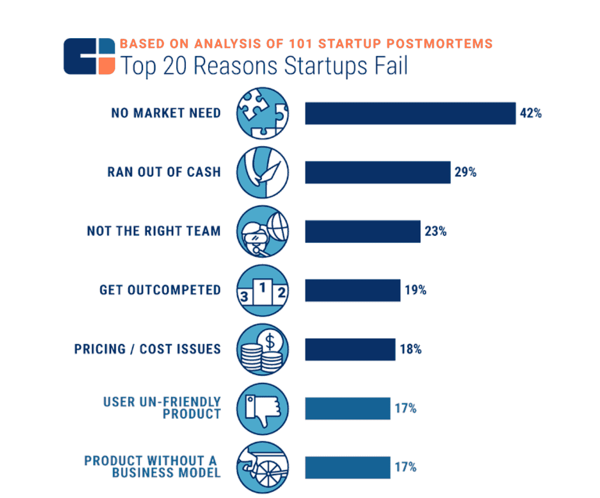
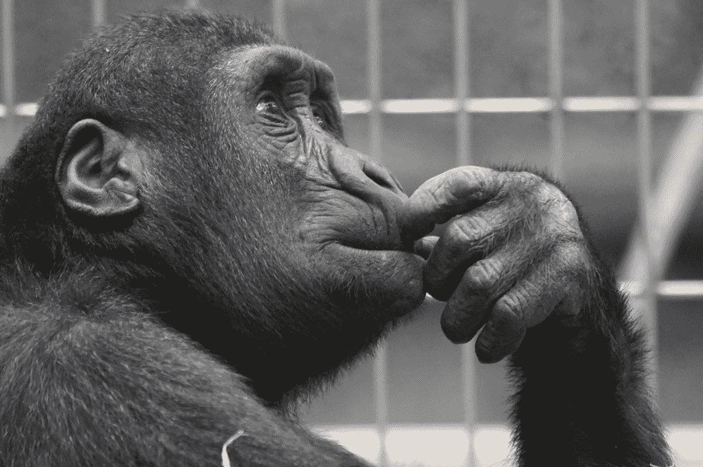

# 如何成为一名成功的企业家——开发者创业战略和设计指南

> 原文：<https://www.freecodecamp.org/news/be-a-successful-entrepreneur-developers-guide-to-startup-strategy-and-design/>

根据 freeCodeCamp 的 [2018 New Coder 调查](https://www.freecodecamp.org/news/the-2018-new-coder-survey-31-000-people-told-us-how-theyre-learning-to-code-and-getting-dev-jobs-e10feb9ed419/)，40.3%的参与者希望建立自己的企业，要么作为自由职业者，要么作为企业家。

如果你是那 40.3%，那么这篇文章就是给你的。如果你属于剩下的 59.7%，你可能仍然会从中受益。试试看。

这不是“战略和设计的傻瓜指南”或“战略和设计 101”的文章。这篇文章是专门为开发人员写的。不仅仅是软件开发人员，还有无代码开发人员。(向鼓励我写这篇文章的 ODNC1 伙伴们大声欢呼。)

## 目录和如何使用本指南

这是一篇长文。其实这不是一篇文章——**这是一个指南。**所以，不如先看序言，给指南一个快速浏览。然后开始应用这些方法，而不是阅读整篇文章并试图消化它。

只有应用本指南，你才能将其内化。

### [入门](#getting-started-1)

1.  **[什么是战略？](#what-is-strategy)**
2.  [商业战略的主要组成部分](#the-main-components-of-a-business-strategy)
3.  [战略、科学思维和软件开发](#strategy-the-scientific-mindset-and-software-development)

### [开发人员战略和设计的粗略指南](#a-rough-guide-to-strategy-and-design-for-developers-1)

1.  [如何定义你的目标](#how-to-define-your-purpose)
2.  [如何制定战略假设](#how-to-develop-strategic-hypotheses)
3.  [如何检验战略假设](#how-to-test-strategic-hypotheses)
4.  **[如何设计你的产品](#how-to-design-your-product)**
5.  **[结论](#conclusion)**

### 指南的结构

本指南旨在让您清楚地了解应该采取的措施。所以，在每一部分，你都会得到一些背景知识，然后是行动项目。

在采取行动之前，你必须完整地阅读上下文，这样你才能在更大的画面中看到行动所扮演的角色。

# 入门指南

我知道战略和设计听起来可能，嗯，*蓬松*。我知道这一点，因为我去过那里。

我是一名工程师。我喜欢物理和数学。我喜欢把挑战分解成各个部分，然后用逻辑一个接一个地克服它们。我喜欢和理性思考的超现实主义者一起工作。我喜欢将流程视为接受特定输入并输出特定输出的函数。我喜欢这一切，甚至更多。

然而，我也是一个战略家和设计师。我知道不是所有的事情都有自然的原因。

有时候他们纯粹是基于[的选择](https://fs.blog/2013/03/playing-to-win-how-strategy-really-works/#:~:text=In%20short%2C%20strategy%20is%20choice,value%20relative%20to%20the%20competition.)。我知道人们是不理智的，尽管仍然[可以预见](https://www.wikiwand.com/en/Predictably_Irrational)。我知道人们对社会和情感利益的重视程度不亚于功能利益，如果不是更多的话。

因此，我知道将战略、设计和工程思维结合在一起会极大地增加我们实现目标的机会。由于我在 ATÖ LYE 担任风险投资总监，我日复一日地见证了这一切。

但是如果你不相信我，我希望你相信数据。这可能是你见过的最悲伤的统计数据之一。):

Top 20 Reasons Startups Fail - CB Insights

CB Insights 的调查结果令人不寒而栗。42%的创业公司失败仅仅是因为他们不被需要。

想象一下:你辞掉工作，也许冒着名誉受损的风险。你从朋友、家人和投资者那里筹集资金。你开始以非常低的预算生活。你不知疲倦地工作，一天 12 个小时，如果不是更多的话…一年后，你意识到没有必要去做你一直在努力和忙碌的事情。这不让人心寒吗？

策略和设计可以帮助你最小化失败的可能性。怎么会？良好的战略和设计让我们专注于根据客户需求和/或愿望以及竞争优势建立持久的业务。此外，它们本质上意味着测试假设和不断迭代。

它们是帮助我们摆脱复杂性的伟大工具……但是让我们把赞美策略和设计放在一边，开始实践吧。我们将从商定一个定义开始，因为战略的含义是高度可变的。

## 什么是战略？

战略是这样一个概念，当每个人听到它的时候都明白，但是没有两个人明白同样的事情。

非常笼统地说，战略是实现预定目标的高层次计划。然而，在商业语境中它有更具体的定义。我是这样描述的:

> 战略是一组假设，描述了一组集成的关键选择、关键行动和实现业务目标的进度测量框架。我们制定战略是因为我们相信实现目标会帮助我们实现我们的目的。

## 商业战略的主要组成部分

以下是创业之初最相关的主要因素。

如果我们要考虑一家老牌公司，而不是一家初创公司，我们必须考虑竞争优势、核心能力、管理系统，以及——取决于业务类型——一些更具体的要素。

要记住的关键是，无论有多少组件，它们都必须与下面列出的主要组件集成。

### 做生意的目的

是什么驱使你做生意？你想创造什么影响和价值？你想让得到什么回报？如何衡量(直接或间接)？

我首先列出这一点，因为理想情况下，这是你做出所有决定的基础。当你有疑问，或者事情太难弄清楚，或者互斥选项同样有吸引力时，你会回到基础上来寻求指导。

### 市场定义

谁是客户、用户、竞争对手、监管者和其他参与你想要创造的价值交换的主要参与者？

市场定义和价值主张极其复杂。这就是为什么我一个接一个地列出它们。如果没有一个清晰的、甚至是有辨别力的*(有意识地选择不在某些市场竞争，从而选择不为某些客户服务)*市场定义，我们就无法定义有意义的价值主张。

假设你正在开发一个分析产品。如果你专注于移动应用，那么你就是在“歧视”网络应用，你的价值主张将由这一选择决定。

### 价值主张

你的价值主张是你必须向你的客户提供什么(如果你想更生态系统地思考，向你在给予-索取关系中的所有参与者提供)，以换取你向他们索取的价值。

例如，客户付钱给你，用户可能向你提供数据，合作伙伴可能帮助你接触客户，政府应该确保一个公平的市场，等等。

价值主张不同于产品、功能或服务。区分价值主张的一个简单方法是回答这个问题，*“我们的客户**将如何从使用我们的产品**中获益？”*(同样，你可以将这个问题扩展到你所在市场的所有关键参与者，问*“这个关键参与者将如何从我创造的价值等式中受益？”*)

正如这个问题所暗示的，你的客户追求的不是产品本身。这是你的客户希望从使用你的产品中得到的好处。

### 有意义的区分

为什么有人会选择你的产品，而不是所有的替代产品或方式来获得他们所寻求的利益？是什么让你更适合他们？

你如何创造这种契合？你在这方面与竞争对手有何不同？这种差异你能坚持多久？

你能做些什么来远离竞争？你如何让竞争与你的客户无关？

正如 JTBD 理论所解释的，工作(人们试图用产品完成的事情)不会改变。产品不断变化，但工作或多或少保持不变。

以通勤为例。我们的通勤方式一直在不断演变，这使得自动驾驶电动汽车进入了我们的生活。然而，从一点到另一点的工作从一开始就伴随着我们。

随着这一演变的每一步，越来越多的细微差别被处理。然而，工作的核心仍然是一样的。

因此，区别不在于发明新的工作，而在于找到新的有意义的方法来帮助完成这些工作。

价格只是区分的一种方式。特性、优势、整体体验、您选择解决的细微差别——有数不清的区分方式。

然而，有意义和持久的分化是很难的。这很难，因为复制比以往任何时候都容易。难是因为开发软件(除非是超级高级的东西)越来越容易了。好的设计比以往任何时候都更容易获得。

因此，我们需要的不仅仅是设计和技术来维持有意义的差异化。更多信息请参见设计部分。

## 战略、科学思维和软件开发

战略是从演绎推理和归纳推理的混合中发展假设，然后根据目标衡量进展。

它要求我们将事物(市场、价值主张、差异化等等)分解成各个部分(客户、购买者、用户、合作伙伴、监管者、产品、服务、体验、品牌)，单独理解它们，然后将它们融合在一起，创建一个连贯的整体(一个企业)。

它同时具有极强的分析性和整体性。我发现战略的这些方面与科学思维非常相似。

这种相似性也让我想起了软件架构师的角色。他们面临着类似的挑战。不确定性和复杂性的程度虽然在性质上有很大不同，但却是相似的。

他们都有一定程度的信息可以用来做决定，但从来没有完整的图片。他们都需要提出假设，并在完全采用特定方法之前进行测试。

至关重要的是，他们都意识到实现目标没有唯一的方法，这意味着他们正在做出选择。因此，他们希望构建在他们的战略/架构之上的所有其他东西与他们的关键选择保持一致。

这种相似性让我质疑为什么这么多工程师和开发人员远离战略。可能是因为我们谈论战略的方式和在公司中的定位，但也包括在教育中。那很可悲，需要改变。

# 开发者策略和设计的粗略指南

定义很重要。他们帮助我们发展自己的语言和交流。既然我们已经有了自己的语言，让我们开始执行吧。

下面的指南设计得很粗糙。之所以粗糙，是因为我不想过多强调指南本身。

这很难，因为你是一个开发人员，正在努力做一些事情。不是公司环境中的战略家或设计经理。

它很粗糙，因为它旨在达到最佳状态，帮助你用 20%的努力获得 80%的结果。

它很粗糙，因为这是我第一次尝试为开发者定制它，我想在完全投入之前测试这个假设。所以 meta 不是吗？:)

## 如何定义你的目标

### 从内部开始

你希望为自己实现什么？副业？一个学习项目？你一生的事业？

描述你生活中的一天，假设一切顺利，你成功了。平常的一天是什么样子的？

### 继续与他人合作

再次，想象一切都很顺利，你已经成功了。你的成功给你的客户、用户和合作伙伴的生活带来了什么影响？对他们来说，事情发生了怎样的变化？

**动作**:总结和色调分离。试着把每件事都归结为一段话，描述你和你客户的未来状态。重写再重写。

注意你使用的每一个单词，确保你能舒服地阅读这段文字。然后把它打印出来，放在你的工作环境中。

## 如何发展战略假设

### 从客户开始

想为尽可能多的人服务是很棒的。然而，很难从第一天起就创造出一个服务于大市场大多数人的产品。

有很多原因会阻止你的目标客户改变他们完成工作的方式:[转换成本](https://www.investopedia.com/terms/s/switchingcosts.asp)、[人类对改变的阻力](https://www.wikiwand.com/en/Formula_for_change#:~:text=The%20formula%20for%20change%20provides,Kathie%20Dannemiller%20in%20the%201980s.)，甚至[惯性](https://www.wikiwand.com/en/Inertia)都可以被认为是一个原因。

那么，如果改变如此困难，我们该怎么办？我们从一群最乐于改变的超级小众人群开始。因此，这自然只是潜在市场的一小部分。[这是命中注定的。](https://www.wikiwand.com/en/Technology_adoption_life_cycle)  
从[蓝海战略的角度思考](https://www.blueoceanstrategy.com/what-are-red-blue-oceans/)对于识别最乐于改变的人非常有用。问问你自己:

*   谁对当前的解决方案最不满意？为什么？
*   谁需要一个解决方案，但没有找到足够好的选项？为什么？
*   谁被当前的市场领导者所忽视？为什么？
*   这些人有哪些共同的属性？
*   我认识符合这个描述的人吗？
*   哪里可以找到更多像他们一样的人？

那就去和他们谈谈。[这篇文章](https://review.firstround.com/build-products-that-solve-real-problems-with-this-lightweight-jtbd-framework)提供了你需要知道的关于工作方法的所有信息。

**行动:**如果你想要简单一点的客户访谈，[用这篇关于“推拉”的文章](https://jtbd.info/may-the-forces-diagram-be-with-you-always-applying-jtbd-everywhere-b1b325b50df3)来阐明谁是你的客户，他们需要什么。

### 确定你的价值主张

我们重视实际利益。我们期望产品首先提供实际利益。毫无疑问。

然而，尤其是在软件领域，实际利益不足以让我们与众不同。它们很容易复制。[“这就是科技行业的运作方式”](https://techcrunch.com/2017/05/16/to-clone-or-not-to-clone/)。那么，我们能做些什么呢？

很幸运，人是社会性和情感性的存在。因此，我们可以在组合中添加社交和情感方面的好处，提供更多价值，并使其更难被复制。

社交和情感利益是那些让人说“是啊，很相似但不一样……”。

想一个你真正喜欢的产品。不仅仅是它的工作原理，还有使用该产品的感觉。然后将它与完成相同实际工作(理论上称之为功能性工作)的替代方案进行比较。看看你对此有何感想。

那么，我们怎么知道要提供什么社交和情感价值呢？首先，它来自你的采访。你需要关注功能之外的东西。

第二，来自于你的选择。是的，你的选择。会有很多提供社交和情感利益的选择。你需要选择那些符合你目标的。

**行动:**使用贝恩的[价值要素](https://media.bain.com/elements-of-value/)来确定你的期权。他们也有 B2B 版本。

### 明确你的立场

现在，你将通过定义你的立场使事情变得清晰。你可以通过定义极性来实现。

极性有助于区分事物，因为这是我们区分事物的基本方式。想想对比在我们的视觉能力中的作用。同样，我们需要对我们做的和不做的事情有一个清晰的对比。这将有助于我们明确我们的范围，也有助于明确我们针对超级利基人群的价值主张。

**行动:** [用多一事不如少一事的手法来定义自己的立场。](https://medium.com/signal-v-noise/position-position-position-34b510a28ddc)

## 如何检验战略假设

与你所期望的相反，测试更多的是一门艺术而不是科学。是的，这是科学方法的核心，但是设计测试需要想象力而不是分析。只有在你进行测试之后，分析才会出现。

让我们来看一下**测试过程的高级概述:**

1.  决定测试什么，什么结果算成功。换句话说，什么数字和/或反馈会表明你的假设是有效的。
2.  设计一个测试，你可以信任它的结果，并且可以尽可能便宜快速地执行。这就是你需要更多想象力和发散力(不加评判地扩大选项)而不是分析的地方。
3.  进行几次演习，以减少由于简单错误而导致的失败。从演习中学习并迭代。
4.  运行测试并密切监视结果，从中学习。
5.  分析结果，并根据你的经验决定下一步行动。

测试是非常战术性的，并且依赖于上下文。这就是为什么对我来说测试更像是一门艺术而不是科学。

这就是为什么，与其遵循一个严格的过程，我相信你最好从下面的文章中得到启发，找到你自己的测试方法。就像艺术家会做的那样。

**动作:**

*   了解[最危险假设测试](https://hackernoon.com/the-mvp-is-dead-long-live-the-rat-233d5d16ab02) (RAT)的概念。
*   [确定你最危险的假设](https://uxdesign.cc/riskiest-assumption-canvas-73ec0e2e0abc)。(p.s .我不同意这篇文章中 MVP 的概念。我强烈建议你忽略它。我在这里写了关于[我是如何看待 MVP 的](https://uxplanet.org/why-doing-things-that-dont-scale-is-the-ultimate-way-for-being-lean-a81708d96c51)。假设你正处于努力的早期阶段，你最有风险的假设很可能是关于你的客户的问题、需求和希望，以及你的产品如何帮助他们。
*   [从列表中选择最适合测试你最具风险的假设的 MVP 类型](https://thenextweb.com/dd/2014/11/12/15-ways-test-minimum-viable-product/)。构建 MVP 粗略版本。先做预演，然后开始测试。

## 如何设计你的产品

既然您已经开发了战略假设并对其进行了测试，那么是时候构建一些东西了，对吗？不对。没那么快。

我在开发者主导的创业公司(软件、低代码、无代码)中看到的最大盲点之一就是设计。用大写字母 d 设计。

我说的“大写 D 的设计”是什么意思？通常，软件行业的设计工作被简化为事物的外观和感觉。有时，人们会超越这一点，在组合中加入简单元素。让事情变得既简单又美观。

但这并不是设计产品的全部。还有更多。多得多。

多了多少？嗯，以至于我写了下面这篇文章来描述我个人的产品设计和管理原则。我不认为你需要读它或者创造你自己的原则，因为我假设你的目标是自己创业。而不是成为产品设计师或经理。

然而，如果你对我所说的“大写 D 设计”的含义感到好奇，我强烈推荐你阅读那篇文章的设计和品牌战略部分。

[First Principles for Product Design and ManagementProduct design is an extremely complex domain. Similar to the photo above, there are many, many things to consider and they are in no obvious order. What should we do under such uncertainty? The very…Akar SumsetUX Collective](https://uxdesign.cc/first-principles-for-product-design-3aa0a3a1cfea)

Written in 2017

让我们把哲学讨论放在一边，来点实际的吧。下面是我推荐的产品设计流程概述。我在上面的文章中总结了这个过程背后的哲学:

> 除非我们必须发明新的东西，否则我们最好使用模式、启发法和原则，同时不要忘记根据手头的问题调整它们。这样，我们会给人们(包括用户和企业主)他们想要的东西:[熟悉的做不同的](http://www.nirandfar.com/2015/06/california-role-rule.html)。

### 考虑客户的背景

从考虑**客户使用你的产品时的直接背景**开始。

发生什么事了？之前发生了什么？之后会怎么样？他们想做什么？他们在那种情况下感觉如何？总之:[不要把重点放在“为什么”上。重点是“当](https://medium.com/signal-v-noise/designer-bs-5ebadc32f628)”。

### 思考相关产品

考虑**他们用来完成与你的产品相关的事情的其他产品**，以及竞争对手的产品。

那些产品是怎么工作的？他们是如何谈论自己的？他们的设计和品牌有什么共同的模式吗？

如果你的产品与相关产品配合得很好，并且你的客户熟悉它，那么他们就更有可能采用你的产品。

### 列出你产品的特点，选择最重要的

重要的是列出你的产品将具备的特性，然后为自己挑选几颗北极星。

你会[像艺术家一样](https://www.wikiwand.com/en/Steal_Like_an_Artist)从这些北极星那里偷东西。

假设你的产品有问答功能。Quora 会是一个很好的北极星，因为它们都是关于 Q & A 的，并且已经成功存在了很多年。

你也可以选择北极星作为你的品牌、外观和感觉。关键是将它们视为坚实的起点，而不是模仿的对象。

### 深入挖掘你的北极星。

如果你为某个特定的功能选择了一颗北极星，那么就使用它几次。试着打破它。记下你会如何做不同的事情以及为什么。为你所有的北极星这样做。

**从用户流开始设计，**不要用线框或任何视觉技术。你可能犯的最大错误之一就是开始设计用户界面(比如屏幕)。正如我喜欢说的，“记住，我们不是在设计东西。我们正在设计行为。”所以，我们必须从动作开始，而不是界面。

### 将你的产品分解成不同的功能

你需要为每个功能创建用户流，但是你如何将你的产品分解成不同的功能呢？

幸运的是，Ryan Singer 演示了他如何使用 UI 的简写，以及如何将事物分解成各个部分。看完整个视频。

### 使用 Ryan Singer 对 UI 的简写来设计用户流。

这会节省你几个小时甚至几天的时间。你可能在做用户流的时候就有了界面的想法。在某个地方草草写下它们，做个笔记，但是在你完成用户流之前不要关注它们。

### 测试您的用户流

一旦你有了一个粗略的第一个版本，和一些潜在用户一起测试你的用户流。

简单来说，先给他们快速走一遍。然后要求他们通过大声思考来评论它。****

你可以问他们一些问题来开始对话:“你喜欢这个的什么？你会改变什么？为什么？你会如何改变它？这个流量缺什么？”以及类似的其他问题。

### 相应地提高你的用户流量。

为了设计界面(事物看起来会是什么样子),回到你的北极星。但在此之前，你需要通过选择颜色和字体来建立一个整体的外观和感觉。

首先，从[这个列表](https://www.quicksprout.com/best-font-for-website/)中选择一个字体对。试着让你的顾客熟悉它，但也试着选择一双能给你的用户在使用你的产品时的感觉的鞋。

接下来，选择一个调色板。试着选择一个调色板，让你的用户在使用你的产品时有你想要的感觉——但也要试着让它不同于你的竞争对手。

**动作**:使用[这条](https://99designs.co.uk/blog/tips/branding-colors/)来选择你的主色调。然后[利用这个网站](https://coolors.co/)根据你的主色调创建一个调色板。

### 详细设计你的界面

现在，你已经准备好**详细设计界面**。这就是像艺术家一样偷窃将再次发挥作用的地方。既然你已经选择了颜色和字体，你可以把注意力集中在布局上。回到你的北极星，在他们现有的设计基础上设计你的界面。除非有明确的理由，否则不要改变事物。查看像 [Mobbin](https://mobbin.design/) 这样的工具来获得更多的灵感。

请记住——设计不会随着界面而结束。设计中一个极其重要但又非常容易被忽视的因素是文案。这很大程度上取决于语言。

如果足够清晰，它对可用性有很大的贡献。如果你能引起共鸣，它会让你的设计更有特色。它允许你更快、更容易、更便宜地测试东西。这非常重要。我强烈建议在这上面投入大量时间。

**动作:**先把微抄本的[基础知识读完，先。然后继续](https://blog.prototypr.io/microcopy-101-how-to-write-for-successful-products-2b18ca63c429)[根据这些规则](https://blog.prototypr.io/14-rules-of-ux-writing-6097cc3064ca)写你的文案。

## 回到策略

在我们称之为创业的无休止的迭代螺旋中，在设计过程的这一步，我建议你后退一步，回到你的战略。

具体来说，回到你的目的和定位，看看你正在建立的东西是否真的适合他们。当然，你不必也不应该等到这一步。然而，确保你对每件事都有批判性的观点，看看你是否还在追求你想要达到的目标。

有变化就好。如果经过这么多的测试和学习后没有任何变化，那就没用了。

然而，如果你的目标和定位的本质正在改变，那么这是一个强烈的信号，表明你需要彻底地重新思考事情。否则，你可能会发现自己在任何给定的时间不断地、无意识地“转向”任何看起来有趣的方向。

这会让你偏离你需要为之奋斗的长远目标。如果你没有这样的愿景(不需要突破性或改变世界)，那么在短期内很难坚持面对挑战。

# 结论

像任何其他指南一样，本指南也是不完整的。试图提供一个完整的指南本身几乎就是一种矛盾。

本指南的目的，非常类似于架构或模型，是提供足够的指导，以便它以尽可能简单的方式抓住现实的本质。

这取决于你，企业家，找出这个指南的不足和不确定性。巧合的是，这是企业家需要具备的终极技能:**在极度不确定的情况下解决问题。**

所以，我希望这个指南能帮助你消除一些你正在处理的不确定性，加速你实现目标的旅程。

让我知道你的想法和我可以如何改进这个指南。这是我正在研究的更大的东西的早期原型。所以 meta，我知道。