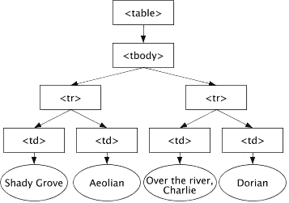

# DOM 向初学者解释了文档对象模型是如何工作的

> 原文：<https://www.freecodecamp.org/news/dom-explained-everything-you-need-to-know-about-the-document-object-model/>

当我刚开始做 web 开发人员时，人们经常在行业中使用“DOM”这个术语。每个 JavaScript 教程都提到了，但我不知道这是什么意思。

一晃两年过去了，现在我知道了它的全部内容，我将用简单明了的英语解释什么是**文档对象模型**。

## 这只狗是什么

想象一下:你开着电视。你不喜欢正在播放的节目，你想改变它。你还想增加它的体积。

要做到这一点，必须有一种方法让你与你的电视互动。你用什么来做到这一点？

**一个遥控器**。

遥控器充当**桥梁**，让你与电视机互动。

你通过遥控器激活电视**和动态**。同样，JavaScript 通过 **DOM** 使 HTML 页面变得活跃和动态。****

****就像电视不能自己做很多事情一样，JavaScript 除了让你 to‌‌执行一些计算或处理基本的字符串之外，不能做更多的事情。****

****因此，为了使 HTML 文档更具交互性和动态性，script‌‌需要能够访问文档的内容，还需要知道用户何时与之交互。‌‌****

****它通过使用称为文档对象模型(DOM)的接口中的属性、方法和事件与浏览器进行通信来实现这一点。****

****例如，假设您希望一个按钮在被点击时改变颜色，或者一个图像在鼠标悬停在其上时滑动。首先，您需要从 JavaScript 中引用这些元素。****

****DOM 是加载到浏览器中的网页的树状表示。****

****它使用 a‌‌系列的对象来表示网页。主对象是文档对象，文档对象又包含其他对象，其他对象也包含自己的对象，依此类推。****

### ****文档对象****

****这是 DOM 中最顶层的对象。它有**属性**和**方法**，您可以使用这些属性和方法通过一种称为点符号的规则来获取关于文档的信息。****

****

Document Tree. Source https://w3.org**** 

****在文档后面，放置一个点，后跟一个属性或方法。****

****让我们看一个简单的演示，展示脚本如何通过 DOM 访问 HTML 文档的内容:****

```
**`<h1>Login to your account</h1>‌‌
<form name=”LoginFrm” action=”login.php” method=”post”>‌‌Username 
    <input type=”text” name=”txtUsername” size=”15”/> <br/>‌‌Password 
    <input type=”password” name=”numPassword” size=”15”/> <br/>‌‌
    <input type=”submit” value=”Log In” />‌‌
</form>‌‌
<p> New user? <a href=”register.php”> Register here</a> 
<a href=”lostPassword.php”> Retrieve password </a> 
</p>`**
```

```
**`var username = document.LoginFrm.txtUsername.value //Gets the username input`** 
```

****好吧。那是 HTML a 登录表单。您可以使用 DOM API 提供的一组属性和方法在 JavaScript 中访问所有这些元素。但是那些方法是什么呢？****

****除了代码片段中包含的属性和方法之外，让我们看看其他一些常见的属性和方法:****

### ****querySelectorAll()方法****

****使用这个方法可以从 DOM 中访问一个或多个与一个或多个 CSS 选择器匹配的元素:****

```
**`<div> first div </div>
<p> first paragraph </p>
<div> second div </p>
<p> second paragraph </p>
<div> another div </div>`**
```

```
**`var paragraphs = document.querySelectorAll( 'p' );
paragraphs.forEach(paragraph => paragraph.display = 'none')`**
```

### ****createElement()方法****

****使用这个方法创建一个指定的元素，并将其插入到 DOM 中:****

```
**`<div>first div</div>
<p> first paragraph</p> 
<div>second div</div>
<p>second paragraph</p> 
<div>another div</div>`**
```

```
**`var thirdParagraph = document.createElement('p');`**
```

### ****getElementById()方法****

****您可以使用此方法通过元素的唯一 id 属性从文档中获取元素:****

```
**`<div id='first'> first div </div> 
<p> first paragraph</p>
<div>second div</div>
<p> second paragraph</p>
<div>another div</div>`** 
```

```
**`var firstDiv = getElementById("first")`**
```

### ****getElementsByTagname()方法****

****您可以使用此方法通过 HTML 标记名称来访问一个或多个元素:****

```
**`<div> first div </div> 
<p> first paragraph</p> 
<div> second div</div> 
<p>second paragraph</p> 
<div>another div</div>`**
```

```
**`divs = document.getElementByTagname("div");`**
```

### ****元素的作用是****

****您可以使用此元素通过 HTML 标记名称来访问一个或多个元素。****

****它将一个元素作为最后一个子元素添加到调用此方法的 HTML 元素中。****

****要插入的子元素可以是新创建的元素，也可以是现有的元素。如果它已经存在，它将从先前的位置移动到最后一个子节点的位置。****

```
**`<div
     <h2>Mangoes</h1>
</div>`**
```

```
**`var p = document.createElement( 'p' );
var h2 = document.querySelector( 'h2' );
var div = document.querySelector( 'div' );
h1.textContent = 'Mangoes are great...'
div.appendChild('p');`**
```

### ****innerHTML 属性****

****使用此属性可以访问元素的文本内容。****

### ****addEventListener()属性****

****此属性将事件侦听器附加到您的元素。****

****它需要一个回调函数，该函数将在事件被触发时运行。****

```
**`<button>Click to submit</button>‌‌`**
```

```
**`var btn = document.querySelector( 'button' );‌‌
btn.addEventListener( 'click' ,foo);‌‌
function foo() { alert( 'submitted!' ); 
  				btn.innerHTML = '';
          }`**
```

### ****replaceChild()属性****

****此属性用另一个新的或现有的子元素替换一个子元素。如果它已经存在，它将从先前的位置移动到最后一个子节点的位置。****

```
**`<div>‌‌
    <h1>Mangoes‌</h1>‌
</div>`**
```

```
**`var h2 = document.createElement( 'h2' );‌‌
var h1 = document.querySelector( 'h1' );‌‌
var div = document.querySelector( 'div' );‌‌
h2.textContent = 'Apple';‌‌
div.insertBefore(h1, h2);`**
```

### ****setAttribute()方法****

****您可以使用此方法来设置或更改元素的属性值。****

****假设我们有一个包含值“favourite”的属性“id”‌‌:但是我们想把这个值改成“最差”,下面是用代码实现的方法:****

```
**`<div>‌‌
    <h1 id='favourite'>Mangoes‌‌</h1>
</div>`**
```

```
**`var h1 = document.querySelector( 'h1' );
h1.setAttribute(div, 'worst');`**
```

### ****节点法****

****HTML 页面中的每个元素都被称为一个节点。****

****通过使用 node 对象的下列属性，可以访问任何元素:****

*   ****`node.childNodes`–访问所选 parent‌‌的子节点****
*   ****`node.firstChild`–访问所选 parent‌‌的第一个孩子****
*   ****`node.lastChild`–访问所选父节点的最后一个子节点。‌‌****
*   ****`node.parentNode`–访问所选子节点的父节点。‌‌****
*   ****`node.nextSibling`–访问所选元素的下一个连续元素(同级)。‌‌****
*   ****`node.previousSibling`–访问所选元素的上一个元素(同级)****

```
**`<ul id-“list”>‌‌
    <li><a href= ”about.html”‌‌class = ”list_one”> About‌‌</a></li>‌‌
    <li><a href= ”policy.html”> Policy‌‌</a></ li>‌‌
    <li><a href= ”map.html”> Map‌‌</a></ li>‌‌
    <li><a href= ”Refund.html”> Refund‌‌</a></li>‌‌
</ul>`**
```

```
**`var list = document.getElementsById( “site-list” )‌‌
var firstItem = list‌‌.childNodes[0].childNodes[0];`**
```

## ****摘要****

****DOM 是组成网页的所有元素的自顶向下的表示。它是脚本与 HTML 交互的接口。****

****有许多属性和方法可以用来获取关于 DOM 的信息并对其进行操作。****

****本文到此为止。我希望你学到了一些有价值的东西。****

****如果你喜欢，你可以在这里给我买些咖啡。****

****谢谢你，再见。****