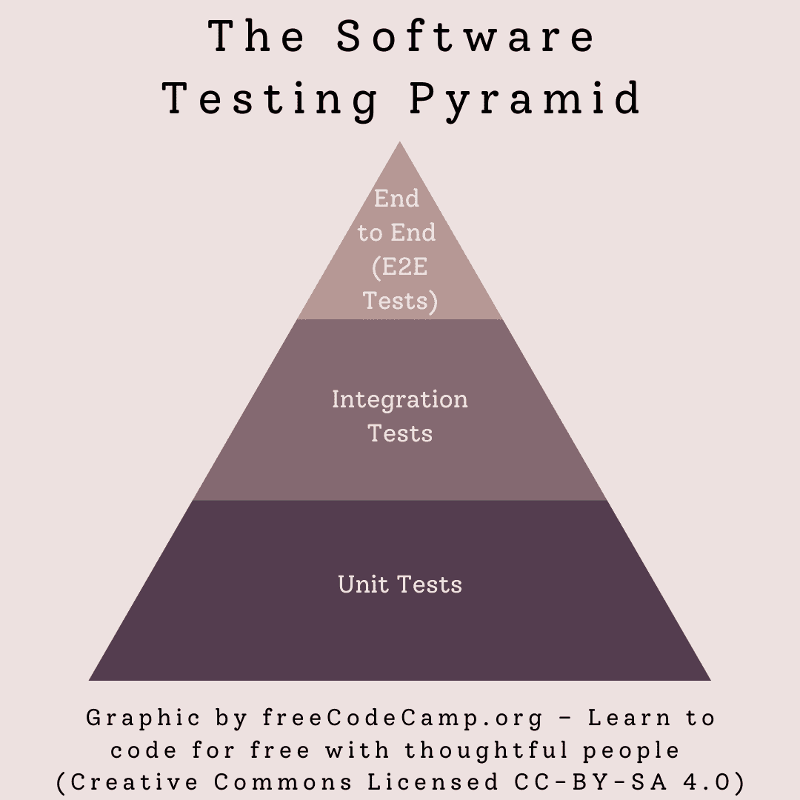
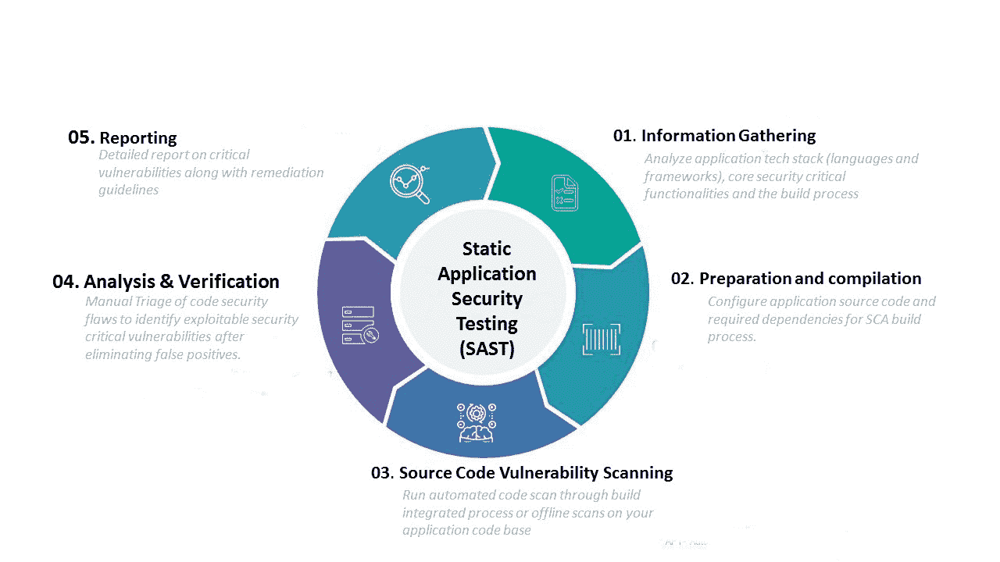
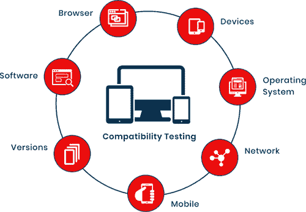

# 什么是软件测试？开发人员在项目中最常用的 10 种测试

> 原文：<https://www.freecodecamp.org/news/types-of-software-testing/>

软件开发和测试齐头并进。在敏捷软件开发的时代，随着小迭代的快速发布，您应该越来越频繁地进行测试。

为了执行有效的测试，您需要了解不同类型的测试以及何时应该使用它们。

在本文中，我将讨论一些可以帮助您确保产品和应用程序的可操作性、完整性和安全性的测试。

## 软件测试金字塔



The Software Testing Pyramid. Enjoy this free graphic and share it on your blog or Twitter.

软件测试金字塔涵盖了软件开发生命周期 (SDLC)的所有阶段[。它从基础的单元测试延伸到集成测试，并以顶点的功能测试结束。](https://www.freecodecamp.org/news/get-a-basic-understanding-of-the-life-cycles-of-software-development/)

这些类型的测试之间没有固定的分布。相反，您应该确定哪些测试最适合您的个人需求。为了对您需要的测试类型做出决定，您应该平衡它们的成本，它们需要多长时间，以及它们需要多少资源。

敏捷软件开发人员[也使用软件测试象限](https://www.kaizenko.com/what-is-the-agile-testing-quadrant/)，根据测试是面向业务还是面向技术，以及他们是评论产品还是支持团队来对测试进行分类。

例如，单元测试是支持团队的面向技术的测试，而可用性测试是批评产品的面向业务的测试。

现在让我们回顾一些重要的测试类型。

## 单元测试定义

单元测试[包括测试单独的代码组件](https://www.freecodecamp.org/news/unit-tests-explained/)而不是整个代码。它验证所有组件逻辑的操作，以在 SDLC 的早期识别错误，这允许您在进一步开发之前纠正错误。

单元测试被称为“白盒”测试，因为测试是在完全了解应用程序的结构和环境的情况下进行的。

单元测试的一个例子是创建模拟对象来测试代码段，比如还没有生成的带有变量的函数。

```
const mocha = require('mocha')
const chai = require('chai')  // It is an assertion library
describe('Test to check add function', function(){
  it('should add two numbers', function(){
    (add(2,3)).should.equal(5)  //Checking that 2+3 should equal 5 using the given add function
  });
});
```

Unit Test example from [Unit Tests Explained](https://www.freecodecamp.org/news/unit-tests-explained/)

## 集成测试定义

单元测试的上一步是集成测试，它将单个组件组合起来，并作为一组进行测试。集成测试识别各个组件如何相互作用的问题，以查看代码是否满足其所有的功能规范。

集成测试与单元测试的不同之处在于，它关注的是与整个团队相关的独立工作的模块和组件。另一方面，单元测试侧重于在测试之前隔离模块或组件。

集成测试的目的是暴露集成模块或组件之间软件中的任何问题或漏洞。

举一个更简单的例子，如果您要对您正在构建的电子邮件服务进行集成测试，您需要测试各个组件，比如撰写邮件、保存草稿、发送、移动到收件箱、注销等等。

您将首先对单个功能进行单元测试，然后对每个相关的功能进行集成测试。

## 端到端测试定义

金字塔的顶端是端到端(E2E)测试。顾名思义，端到端测试[复制了应用](https://www.freecodecamp.org/news/end-to-end-testing-tutorial/)的完整操作，以便测试应用的所有连接和依赖关系。这包括网络连接、数据库访问和外部依赖性。

您在模拟实际用户环境的环境中进行 E2E 测试。

您可以使用几个度量标准来确定 E2E 测试的成功，包括测试的状态(通过可视化的方式来跟踪，比如图表)，以及状态和报告(必须显示执行状态以及发现的任何漏洞或缺陷)。

## 软件测试的类型

在测试金字塔的各个层次中，有各种各样的特定过程，用于测试各种应用程序的功能和特性，以及应用程序的完整性和安全性。

### 应用安全测试定义

应用程序最重要的测试类型之一是应用程序安全性测试。安全测试有助于您识别可能被黑客利用的应用程序漏洞，并在您发布产品或应用程序之前纠正它们。

有一系列应用程序安全测试可供您使用，不同的测试适用于软件开发生命周期的不同部分。

您可以在测试金字塔的不同层次找到不同类型的应用程序安全性测试。每种测试都有自己的优点和缺点。您应该一起使用不同类型的测试，以确保它们的整体完整性。

### 静态应用安全测试(SAST)定义

您应该在 SDLC 的早期使用静态应用程序安全测试(SAST)。这是一个单元测试的例子。

SAST 反映了开发人员的知识，包括应用程序的一般设计和实现，因此它是白盒测试，或从里到外的测试。

SAST 分析代码本身，而不是最终的应用程序，你可以运行它，而不需要实际执行代码。



[Image source](https://www.seciq.in/static-application-security-testing/)

据[云防御](https://www.clouddefense.ai/sast-static-application-security-testing)的安全分析师称，

> “SAST 检查您的代码是否违反安全规则，并比较源分支和目标分支之间发现的漏洞...如果您的项目依赖项受到新披露的漏洞的影响，您将会收到通知。”

一旦您意识到了漏洞，您就可以在最终的应用程序构建之前解决它们。

您应该在软件项目的开发阶段应用 SAST。对你来说，一个好的方法是设计和编写你的应用程序，将 SAST 扫描包含到你的开发工作流程中。

### 动态应用安全测试(DAST)定义

另一方面是动态应用程序安全测试(DAST)，它测试完全编译的应用程序。您在没有任何底层结构或代码知识的情况下设计和运行这些测试。

因为 DAST 从黑客的角度出发，所以它被称为黑盒测试，或外部测试。

DAST 的运作方式是攻击运行的代码，并试图利用潜在的漏洞。DAST 可能会采用跨站点脚本和 SQL 注入等常见的攻击技术。

DAST 在 SDLC 的后期使用，是集成安全性测试的一个例子。虽然很慢(一个完整应用程序的完整 DAST 测试平均需要五到七天)，但它会向您揭示您的应用程序中最有可能被黑客利用的漏洞。

### 交互式应用安全测试定义

交互式应用安全测试(IAST)是一种较新的测试方法，它结合了 SAST 和 DAST 的有效性，同时克服了与这些更成熟的测试相关的问题。

IAST 使用插入的监控代理对应用程序的错误和漏洞进行持续的实时扫描。尽管 IAST 在运行的应用中运行，但它被认为是一个早期的 SDLC 测试过程。

不管你想测试什么类型的软件，IAST 最好用在 QA(质量保证)环境中，或者一个被设计成在没有你的客户或顾客实际访问它的情况下尽可能地复制产品的环境中。

### 兼容性测试定义

兼容性测试评估您的应用程序在各种设备和环境(包括移动设备和不同的操作系统)上的运行方式和安全性。

兼容性测试还可以评估软件的当前版本是否与其他软件版本兼容。版本测试可以向后进行，也可以向前进行。



[Image Source](https://www.testrigtechnologies.com/service/compatibility-testing/)

兼容性测试的示例包括:

*   浏览器测试(检查以确保您的网站或移动网站完全兼容不同的浏览器)
*   移动测试(确保你的应用与 iOS 和 Android 兼容)
*   或者软件测试(如果您将要创建多个需要相互交互的软件应用程序，您将需要进行兼容性测试以确保它们确实能够交互)。

## 超越软件测试金字塔

测试金字塔的修改版本可以包括端到端测试旁边或之上的级别。这一级包括针对应用程序用户的测试。

### 性能测试定义

您需要知道应用程序将如何在各种不同的条件下工作，这就是性能测试的目的。性能测试可以模拟各种负载和压力，以评估应用程序的健壮性。性能测试的类型基于应用条件。

性能测试的一个例子是负载测试，它[决定了崩溃时应用于系统的最大负载](https://www.freecodecamp.org/news/practical-guide-to-load-testing/)。

另一方面，另一个例子，如可伸缩性测试，向系统施加逐渐增加的负载，以评估适应增加的系统压力的方法。

而峰值测试评估对系统施加突然的大负载变化的影响。

在将软件系统投入市场之前，您应该对其进行性能测试。根据稳定性、可伸缩性和速度对其进行测试，以便您可以在上线之前确定要修复的内容。

### 可用性测试定义

测试应用程序接口的实际使用是一项重要的任务。了解应用程序是否按设计运行是一回事。了解设计本身是否能被用户接受是另一回事。这就是可用性测试的用武之地。

通过可用性测试，开发人员可以评估用户对特定应用程序特性和功能的反应。这包括一些您可能事先知道从用户的角度来看不太理想，但是对于强安全性和正确操作[是必要的功能(比如强密码要求)。](https://privacycanada.net/programming-security-for-beginners/)

可用性测试不仅仅是修饰性的问题，也不是修复任何书面文本中的语法错误(尽管这两个问题本身都很重要)。相反，最终用户使用完整的应用程序有多容易。

## 结论

测试不仅仅是你开发完一个应用程序后 QA 部门应该做的事情。这也是[软件开发过程](https://www.freecodecamp.org/news/software-quality-assurance-guide/)的重要部分。

了解您可以使用哪些测试以及它们是如何工作的，将有助于您确保您的应用程序功能良好、安全，并且为最终用户所接受。