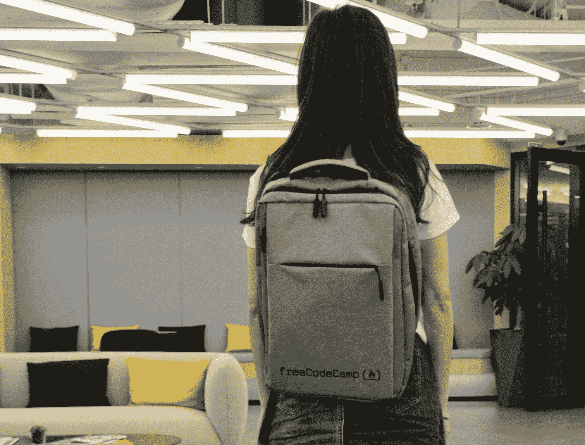
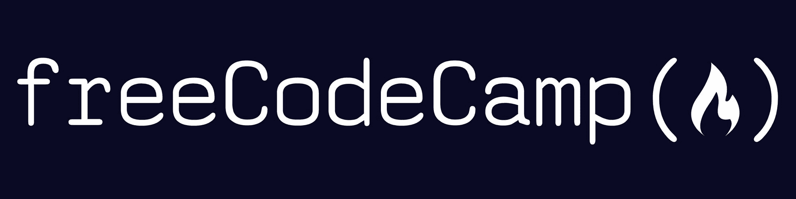
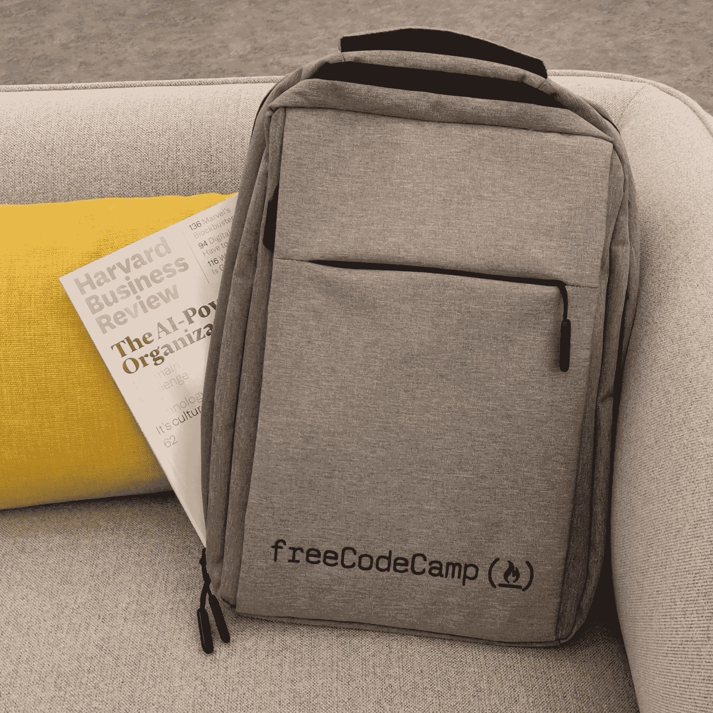
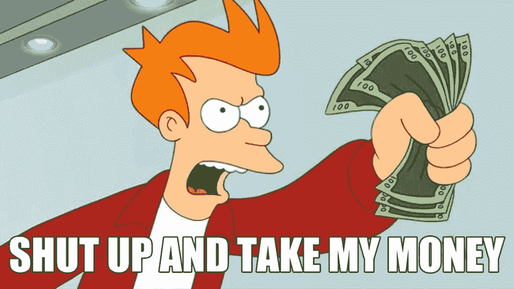

# 装载完毕。系好安全带。freeCodeCamp 背包又回来了。【限量 2020 版】

> 原文：<https://www.freecodecamp.org/news/2019-freecodecamp-backpack/>

【2020 年 8 月更新:感谢您的关注。我们现在背包卖完了。一旦这些再次可用，我们将发布公告。

背包对于开发者来说就像贝壳对于海龟一样，是他们身体的重要部分。

背包将书籍、笔记本电脑和偷来的零食的重量分散到你的整个上半身。他们解放你的双手去拥抱和击掌。

无论你是在课间散步还是排队参加黑客马拉松，一个好的背包都会让你的生活轻松很多。

这就是为什么我很兴奋地宣布我们新的限量版 2020 freeCodeCamp 背包。

请注意，这里的照片图像来自我们的 2019 年版，带有我们的旧徽标。相反，我们的 2020 年版采用了新设计的 freeCodeCamp“篝火功能调用”标志，采用厚重的靛蓝刺绣。

这款新背包拥有光滑的拉丝钢外观棉质外壳。

它为你的背部提供了大量符合人体工程学的衬垫，并为你的手提供了易拉拉链线。

它有隔层可以存放你所有的物品。你可以把你的一生都放在这上面。

它甚至有一个 USB 端口，可以在你的包里给你的设备充电，还有一个可拆卸的钥匙链。

下面是我对其主要功能的 90 秒亲身体验演示:

[https://www.youtube.com/embed/1tBaMjupAqQ?feature=oembed](https://www.youtube.com/embed/1tBaMjupAqQ?feature=oembed)

我们评估了数十家供应商，以找到最完美的背包——一款能够经得起黑客马拉松和地铁通勤考验的高端背包。

仅需 40 美元+20 美元的全球运费*即可获得一个限量版 2020 freeCodeCamp 背包。

(*不适用于国际空间站或其他轨道飞行器。)

如果你真的想支持我们的非营利组织——比如*超级粉丝*支持我们——如果你额外一次性捐赠 200 美元，我们会送你一个限量版 **2020 顶级支持者**背包。

(我们是一个 501(c)(3)非营利组织，因此您的捐赠在您的国家可能完全免税。如果你不确定，问问你的会计师。)

这是同一个背包，但上面绣有“2020 顶级支持者”字样，以表彰您对我们非营利组织的支持。

这对你来说可能是一大笔钱。所以我会给你一点时间来听这首很棒的爱探险的朵拉背包歌曲，当你考虑的时候。

[https://www.youtube.com/embed/9KqXFhRxybE?feature=oembed](https://www.youtube.com/embed/9KqXFhRxybE?feature=oembed)

所以我知道你在想什么:“好了，够了。我在哪里可以获得我的 freeCodeCamp 背包？”

再说一次，我们现在已经卖完了这些背包。

如果你要把世界扛在肩上，就要有风度地去做。

和平。爱情。背包。