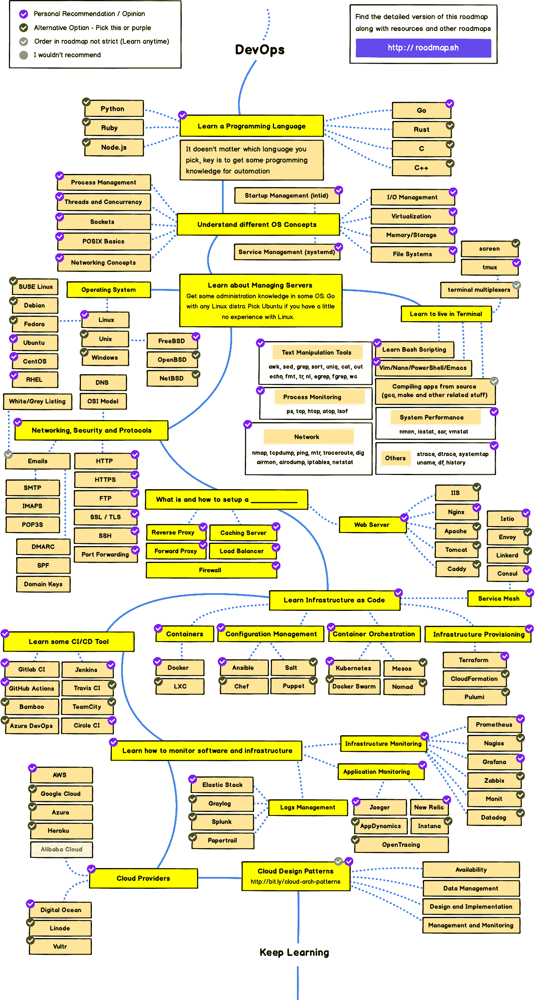

# 2020 年 Web 开发者路线图——成为前端、后端或 DevOps 开发者的可视化指南

> 原文：<https://www.freecodecamp.org/news/2019-web-developer-roadmap/>

有很多方法可以让你学会成为一名开发人员所需的技能。

有些线性课程可以教你所有的东西，比如 freeCodeCamp 的全栈开发课程。

此外，还有大量的技能列表——有时还有资源列表——你可以用来在学习过程中“选择你自己的冒险”。

最好的技能列表之一是 [Kamran Ahmed 的](https://twitter.com/kamranahmedse)开发者路线图，他会定期更新。

这不是普通的资源列表。Kamran 煞费苦心地规划出了他认为对进入不同发展领域至关重要的所有技能。

我以前写过他的路线图。为了庆祝我们进入 2020 年，我将在这里分享他的整个路线图——全部三个。

没错，他列出了以下途径所需的工具和资源:

*   前端 web 开发
*   后端 web 开发
*   DevOps(也称为“站点可靠性”——这是旧系统管理员角色的一种演变)

## 所有开发人员都需要的技能，不管他们的专业是什么

除了这些途径，Kamran 还建议每个想成为开发人员的人学习以下技能:

### Git -版本控制

Git 是一个强大的版本控制系统，截至 2020 年，它几乎被普遍使用。如果你不知道它——是的，它与 GitHub 和 GitLab 有关，你也可以学习如何使用这些工具。

### 基本的终端使用 Bash 命令行、SSH 和其他技能

这可能是 Mac 上的终端、Windows DOS 提示符或 Bash/ZSH。注意，不管你用的是哪种操作系统，你都应该学习 Linux。即使您不将它用于您的笔记本电脑/台式机环境，您也几乎肯定会将其用于服务器。

### 数据结构和算法

freeCodeCamp 课程深入地涵盖了这些内容。你可能想通过在 freeCodeCamp、CodeWars、Project Euler 或其他钻井网站上解决大量算法问题来学习这些。我个人建议用 JavaScript 或 Python 来做这件事，但是如果你准备迎接挑战并且有很多时间，用 C 来做也无妨。

### 理解网络如何工作:HTTPS 和 API

还有很多其他的概念可以学习。我建议先学习一门好的入门级计算机科学课程。这里是免费代码营的 YouTube 频道上的所有哈佛 CS50 课程讲座。

## 设计图案，YAGNI，吻，立体

我认为初学者不需要对这些有很深的理解，但这不会有什么坏处。

设计模式基本上是经过时间考验的方法，用来实现不同类型的软件系统和编码结构。你可以随着你的进步逐渐学习这些。

至于字母汤，下面是它们代表的意思:

*   **YAGNI -亚不会需要它-** 你认为你需要写的大部分代码和你需要实现的特性实际上是不必要的
*   接吻——保持简单，傻瓜！- 项目越简单，维护就越容易。
*   **固体——这是“**单 responsibility,‌‌open–closed、利斯科夫替代、界面分离、依赖倒置”的助记法。是啊-不是初学者的东西，但看看这个，如果你好奇。

## 前端 Web 开发路线图

Kamran 的第一个路线图专注于前端 web 开发。

这是他的完整前端路线图:

### 我对前端路线图的想法

这是一份基本技能的清单。

作为一名前端开发人员，你肯定会使用 HTML、CSS 和 JavaScript——大量的 JavaScript。

我认为这里唯一不必要的事情是:

*   CSS 预处理程序。这些曾经是必要的，但是 CSS 本身增加了许多特性，使得这些预处理程序非常有用。freeCodeCamp 目前教授 Sass ，但我们也在逐步淘汰它。
*   CSS 架构:我不认为这些是必要的，除非设计 CSS 系统是你日常工作的一大部分。
*   有点吹毛求疵:TypeScript 是一种减少 bug 和自信地编码的有前途的方法。我们将这一点添加到 freeCodeCamp 核心课程的[7.0 版本中。我认为这应该在路线图上更加突出，但它确实在那里。](https://www.freecodecamp.org/forum/t/help-us-build-version-7-0-of-the-freecodecamp-curriculum/263546)
*   在我看来，Web Assembly 是一个不错的选择。开发人员开始用它做令人兴奋的事情，但这项技术真正普及还需要一段时间。

## 后端 Web 开发路线图

Kamran 的第二个路线图专注于后端 web 开发。如果您将此与他的前端图结合起来，您将有机会成为一名全栈开发人员。

以下是他的整个后端路线图:

### 我对后端路线图的想法

我同意这里的一切。

### 是的，你应该学习 SQL 和关系数据库

我非常同意他的建议，学习关系数据库。

是的——像 MongoDB 和 Neo4j 这样的数据库可以为您做很多事情，并且比关系数据库更适合某些类型的应用程序。

但是你还是应该学习 SQL，了解关系数据库是如何工作的。

我推荐 PostgreSQL(我们在 freeCodeCamp 的几个项目中使用它)，但是其他关系数据库也非常相似。

这里是 freeCodeCamp 的关于 SQL 的[4 小时免费课程，它将教你基础知识。](https://www.youtube.com/watch?v=HXV3zeQKqGY)

如果你想更深入，这里有我们的[关于关系数据库设计的 8 小时免费课程](https://www.youtube.com/watch?v=ztHopE5Wnpc)。

### 如何选择合适的后端开发编程语言

我还想补充一点关于选择语言的注意事项。

尽管有许多语言——你可以用任何语言做任何事情——我强烈建议你把 Node.js (JavaScript)或 Python 作为你的第一语言。

下面详细指导[应该先学哪种编程语言](https://www.freecodecamp.org/news/how-to-choose-which-programming-language-you-should-learn-in-2019-60abef241012/)。

## DevOps 路线图

最后，Kamran 介绍了如何成为一名 DevOps 或站点可靠性工程师。这涉及到使用大量云服务和监管基础设施。

这是他的整个 DevOps 路线图:

### 我对 DevOps 路线图的想法

Linux，Linux，Linux。

此外，我建议先做开发人员，然后逐渐专攻 DevOps。

这里有一个 30 分钟的关于 DevOps 领域的简短介绍，应该能让你更好地了解你是否对 DevOps 感兴趣。

仅此而已。你怎么想呢?Kamran 是否遗漏了任何重要的技能或技术？留下你的评论，让我们一起来解决这个问题。

此外，如果你有任何对你学习这些技能非常有用的资源，请在下面评论分享。

编码快乐！

昆西