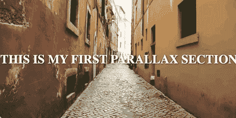
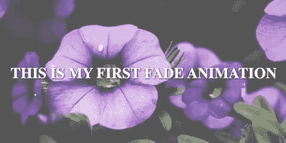
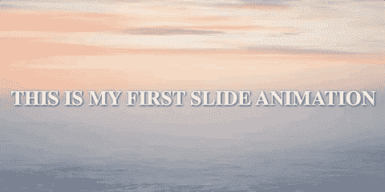

# 如何在 Angular 中构建漂亮的页面过渡

> 原文：<https://www.freecodecamp.org/news/beautiful-page-transitions-in-angular/>

当今世界，仅仅有一个网站是不够的。该网站需要有一个干净的用户界面，它需要直观。最重要的是，它需要某种交互元素。

交互性让用户更长时间地粘在你的网站上。因此，它增加了用户成为客户的机会。此外，更长的互动时间会导致更低的跳出率和更高的搜索引擎排名。

当用户在你的网站上滚动时，最常见和最基本的交互形式之一就发生了。但是如果用户不停地滚动你的长静态页面，岂不是很无聊？

在本教程中，我们将看看三个基本的动画，你可以实现滚动。视差、淡入淡出和滑动动画是开发人员用来使滚动更有趣的最流行的动画。让我们看看如何为我们的站点构建它们。

在我们继续下一步之前，以下是最终结果:



Parallax ([View Demo](https://animations-demo-ffcb4.web.app/parallax))



Fade ([View Demo](https://animations-demo-ffcb4.web.app/fade))



Slide ([View Demo](https://animations-demo-ffcb4.web.app/slide))

# 项目设置

## 先决条件

我们将使用 Angular 11 来创建我们的项目。我们将使用 VS 代码作为我们的 IDE。

为了制作动画，我们将使用精彩的[绿袜子动画平台(gsap)](https://greensock.com/gsap/) 。这是最好的 JavaScript 动画库之一。

## 创建项目

通过输入下面的命令创建一个角度项目。 **当*询问你*时，确保启用路由。**

```
ng new animations --style css
code animations 
```

这将创建一个名为 **动画** 的新项目，样式格式为 CSS。接下来，它将在 VS 代码中打开项目。

现在让我们安装 gsap。在 VS 代码终端中，输入以下命令:

```
npm install --save gsap @types/gsap 
```

这将通过`@types/gsap`安装 gsap 库和打字文件。

最后，让我们创建三个组件。输入以下命令:

```
ng g c parallax
ng g c fade
ng g c slide 
```

## 如何设置路线

让我们创建三条独立的路线:`/parallax`、`/fade`和`/scroll`。打开`app-routing.module.ts` ，添加如下路线: